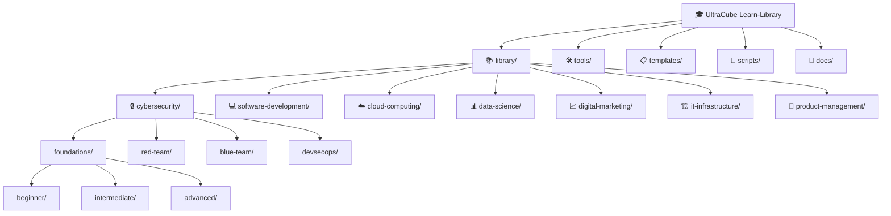

# 🎓 UltraCube Learn-Library

> **An Open-Source Community Education Initiative by UltraCube Technology**


[](https://opensource.org/licenses/MIT)
[](https://github.com/Ultra-Cube/Learn-Library/graphs/contributors)
[](https://github.com/Ultra-Cube/Learn-Library/stargazers)
[](https://github.com/Ultra-Cube/Learn-Library/network/members)
[](https://www.ucubetech.com)

---

## 🌟 Welcome to the Future of Open Learning

**Learn-Library** is UltraCube's commitment to community-driven technology education. As a technology company dedicated to innovation and knowledge sharing, we've created this comprehensive, free, and open-source educational resource to empower developers, engineers, and technology enthusiasts worldwide.

### 🎯 **Our Mission**

> *"Democratizing technology education through open-source collaboration and community partnerships, enabling every developer to reach their full potential."*

**— UltraCube Technology Team**

### 🏢 **About UltraCube Technology**

UltraCube is a forward-thinking technology company specializing in cutting-edge software solutions and open-source innovation. Our commitment to community growth drives us to share knowledge freely, fostering a global ecosystem of skilled developers and technology professionals.

- **Website**: [ucubetech.com](https://www.ucubetech.com)
- **Organization**: [github.com/Ultra-Cube](https://github.com/Ultra-Cube)
- **Community**: Building the future of technology education together

## Why this library

We want reliable, well-structured learning paths that are easy to expand and contribute to. UltraCube believes in the power of community-driven education and open-source collaboration.

### 🎯 **What Makes This Library Special**

Each lesson in our library includes:

- **Clear Explanation**: Professional, well-researched content with learning objectives
- **Curated Sources**: Reputable, up-to-date references and documentation  
- **Practical Exercises**: Hands-on activities and real-world applications
- **Interactive Puzzles**: Engaging challenges to reinforce learning
- **Tool References**: Complete installation guides and tool documentation
- **Lightweight Metadata**: Structured indexing for easy navigation and validation

### 👥 **Our Contributors**

This library is maintained by the **UltraCube Technology Team** and enriched by our global community of developers, educators, and technology professionals.

## 🏗️ Repository Structure

Our repository is organized for maximum accessibility and ease of navigation:



### 📁 **Directory Overview**

- **`library/`** – Core learning content organized by domain/track/level/module/lesson
- **`tools/`** – Tool installation guides, references, and setup documentation  
- **`templates/`** – Templates for creating new lessons and modules
- **`scripts/`** – Automation utilities (metadata validator, content generators)
- **`docs/`** – Documentation, progress tracking, and video resources
- **`TEAM.md`** – UltraCube team information and community contributors
- **`CONTRIBUTING.md`** – Guidelines for contributing to the library

### 🗂️ **Example Learning Path Structure**

```text
library/
  cybersecurity/
    foundations/
      beginner/
        module-01-introduction/
          lesson-01-what-is-cybersecurity.md
          lesson-02-threat-landscape.md
          solutions/
            lesson-01-solutions.md
            lesson-02-solutions.md
        module-02-basic-security/
          lesson-01-passwords-and-authentication.md
          labs/
            password-strength-analyzer/
          assessments/
            security-basics-quiz.md
```

## 📋 Lesson Structure & Metadata

Every lesson in the UltraCube Learn-Library follows a consistent, professional format designed for clarity and effectiveness.

### 🏷️ **Lesson Metadata (YAML Frontmatter)**

Each lesson begins with structured metadata for easy indexing and navigation:

```yaml
---
id: CYB-FND-BEG-001
title: "What is Cybersecurity?"
domain: "Cybersecurity"
track: "Foundations"
level: "Beginner"
module: "Introduction to Security"
duration: "30 minutes"
author: "UltraCube Security Team"
version: "1.0"
last_updated: "2025-08-13"
prerequisites: []
learning_objectives:
  - "Understand the fundamentals of cybersecurity"
  - "Identify common security threats"
  - "Recognize the importance of security practices"
tools_required:
  - "Web Browser"
  - "Text Editor"
difficulty: "⭐☆☆☆☆"
tags: ["security", "fundamentals", "introduction"]
---
```

### 📖 **Professional Lesson Format**

Each lesson follows this structure:

```markdown
# Lesson Title

> **UltraCube Learn-Library** | Domain • Track • Level  
> **Author**: UltraCube [Team Name]  
> **Duration**: [time] | **Difficulty**: ⭐⭐⭐☆☆

## 🎯 Learning Objectives
- Clear, measurable learning goals
- Practical outcomes and skills

## 📚 Content & Explanation
- Professional, well-researched content
- Visual aids and diagrams where applicable
- Real-world examples and use cases

## 🛠️ Required Tools
- Tool installation guides
- Setup instructions
- Reference links

## 💻 Hands-On Exercise
- Step-by-step practical activities
- Code examples and templates

## 🧩 Challenge Puzzle
- Engaging problem to solve
- Critical thinking exercise

## 📖 Additional Resources
- Curated external references
- Further reading suggestions
- Community discussions

## ✅ Progress Check
- Self-assessment questions
- Knowledge validation

---

*Lesson created by **UltraCube Technology** • [ucubetech.com](https://www.ucubetech.com)*
```

### 📋 **Required Metadata Fields**

All lessons must include these essential metadata fields:

```yaml
# Required fields for all lessons
id:           # Unique identifier (e.g., CYB-FND-BEG-001)
title:        # Lesson title
domain:       # Learning domain
track:        # Learning track within domain
level:        # Difficulty level (Beginner/Intermediate/Advanced)
module:       # Module name
duration:     # Estimated completion time
author:       # UltraCube team or contributor
prerequisites: # List of prerequisite lessons or skills
tags:         # Relevant tags for searchability
sources:      # Curated reference sources
```

## 🛠️ Tools & Installation Guides

Each specialization includes comprehensive tool reference documentation:

### 📚 **Domain-Specific Tool References**

- **[Cybersecurity Tools](./tools/cybersecurity-tools.md)** - Security testing, analysis, and defense tools
- **[Development Tools](./tools/development-tools.md)** - Programming languages, IDEs, and frameworks  
- **[Cloud Platform Tools](./tools/cloud-tools.md)** - AWS, Azure, GCP command-line and management tools
- **[Data Science Tools](./tools/data-science-tools.md)** - Analytics, ML libraries, and visualization tools
- **[DevOps Tools](./tools/devops-tools.md)** - CI/CD, containerization, and infrastructure tools

### ⚙️ **Quick Setup Guides**

Each tool reference includes:

- **Installation Instructions** for multiple operating systems
- **Configuration Examples** with best practices
- **Common Use Cases** and practical applications
- **Troubleshooting Tips** for common issues
- **Version Management** and update procedures

## 🎯 Learning Domains Overview

### 🔒 **Cybersecurity**
Comprehensive security education from ethical hacking to enterprise defense

**Learning Tracks:**
- **Foundations** - Security fundamentals and basic concepts
- **Red Team** - Ethical hacking and penetration testing
- **Blue Team** - Defense, monitoring, and incident response  
- **DevSecOps** - Security integration in development lifecycle
- **GRC** - Governance, risk management, and compliance

**Featured Tools:** Kali Linux, Metasploit, Wireshark, Nmap, Burp Suite

### 💻 **Software Development**
Modern development practices across multiple technologies

**Learning Tracks:**
- **Foundations** - Programming fundamentals and best practices
- **Web Development** - Frontend and backend web technologies
- **Mobile Development** - iOS, Android, and cross-platform development
- **Backend Development** - Server-side architecture and APIs

**Featured Tools:** VS Code, Git, Docker, Node.js, React, Python, Java

### ☁️ **Cloud Computing**
Cloud platform mastery and modern infrastructure

**Learning Tracks:**
- **Foundations** - Cloud concepts and service models
- **AWS** - Amazon Web Services specialization
- **Azure** - Microsoft Azure platform expertise
- **DevOps** - Cloud-native development and operations

**Featured Tools:** AWS CLI, Azure CLI, Terraform, Kubernetes, Docker

### 📊 **Data Science**
Data analysis, machine learning, and AI applications

**Learning Tracks:**
- **Foundations** - Statistics, data analysis fundamentals
- **Analytics** - Business intelligence and data visualization
- **Machine Learning** - ML algorithms and model development
- **Data Engineering** - Data pipelines and infrastructure

**Featured Tools:** Python, R, Jupyter, Pandas, TensorFlow, Power BI

### 📈 **Digital Marketing**
Technology-driven marketing strategies and tools

**Learning Tracks:**
- **Foundations** - Digital marketing fundamentals
- **Analytics** - Marketing data analysis and optimization
- **Automation** - Marketing technology and automation tools

**Featured Tools:** Google Analytics, SEO tools, Social media platforms

### 🏗️ **IT Infrastructure**
Systems administration and network management

**Learning Tracks:**
- **Foundations** - Networking and systems basics
- **System Administration** - Server and network management
- **Security** - Infrastructure security and monitoring

**Featured Tools:** Linux, Windows Server, VMware, Cisco tools

### 🎯 **Product Management**
Strategic product development and management

**Learning Tracks:**
- **Foundations** - Product strategy and lifecycle
- **Analytics** - Product metrics and data-driven decisions
- **Leadership** - Team management and stakeholder communication

**Featured Tools:** Jira, Confluence, Analytics platforms, Design tools

## 🤝 Community & Contribution

### 💡 **How to Contribute**

We welcome contributions from the global technology community! Here's how you can help:

1. **📖 Content Creation** - Write new lessons, improve existing content
2. **🔧 Tool Documentation** - Add installation guides and tool references
3. **🐛 Bug Reports** - Report issues or suggest improvements
4. **💬 Community Support** - Help other learners in discussions
5. **🌐 Translation** - Help make content accessible globally

### 📋 **Contribution Guidelines**

Please read our [**CONTRIBUTING.md**](./CONTRIBUTING.md) for detailed guidelines on:

- Content standards and formatting requirements
- UltraCube attribution and branding guidelines
- Code review process and quality standards
- Community code of conduct

### 🏆 **Community Recognition**

We celebrate our contributors! Top contributors get:

- **Recognition** in our community hall of fame
- **UltraCube Swag** and exclusive merchandise  
- **Early Access** to new tools and resources
- **Collaboration Opportunities** with our development team

## 📊 **Project Statistics**


### 📈 **Current Metrics**

- **70,000+** words of professional content
- **7** comprehensive learning domains
- **100+** hands-on exercises and projects
- **50+** tool installation and reference guides
- **Active** community of learners and contributors

## 📞 **Connect with UltraCube**

### 🌐 **Find Us Online**

- **🌍 Website**: [ucubetech.com](https://www.ucubetech.com)
- **📧 Email**: education@ucubetech.com
- **💼 LinkedIn**: [UltraCube Technology](https://linkedin.com/company/ultracube-tech)
- **🐦 Twitter**: [@UltraCubeTech](https://twitter.com/UltraCubeTech)
- **📺 YouTube**: [UltraCube Channel](https://youtube.com/@UltraCubeTech)

### 🆘 **Support & Questions**

- **📖 Documentation**: Check our [docs](./docs/) directory
- **💬 Discussions**: Use GitHub Discussions for questions
- **🐛 Issues**: Report bugs via GitHub Issues
- **📧 Direct Contact**: education@ucubetech.com

## 📜 **License**

This project is licensed under the **MIT License** - see the [LICENSE](./LICENSE) file for details.

### 🤝 **Open Source Commitment**

UltraCube is committed to open-source education. This library will always remain:

- **Free** and open to everyone
- **Community-driven** with collaborative development
- **Professionally maintained** by our dedicated team
- **Continuously updated** with latest industry practices

---

<div align="center">

### 🎓 **Start Your Learning Journey Today!**

**Explore • Learn • Build • Share**

*Made with ❤️ by the **UltraCube Technology Team***


</div>

## Validate lessons

Run a quick validation to ensure metadata is present and consistent:

```zsh
python3 scripts/validate_lessons.py
```

No external packages are required.

## Contribute

See `CONTRIBUTING.md` for guidelines and quality bars. Use `templates/lesson-template.md` to start quickly.

## License

Content is released under CC BY 4.0. See `LICENSE`.

## Quick index — tutorials and challenges

Browse by domain, track, level, and module. Each lesson links directly; challenges link to the module’s challenge set.

- Cybersecurity
  - Foundations (Beginner)
    - Module 00 — Setup & Tools
      - [Lesson 01 — Install Linux and Kali Linux](library/cybersecurity/foundations/beginner/module-00-setup-and-tools/lesson-01-install-linux-and-kali.md)
      - [Lesson 02 — VS Code and GitHub Workflow](library/cybersecurity/foundations/beginner/module-00-setup-and-tools/lesson-02-vscode-and-github-workflow.md)
      - [Challenges](library/cybersecurity/foundations/beginner/module-00-setup-and-tools/challenges/README.md)
    - Module 01 — Introduction
      - [Lesson 01 — What is Cybersecurity?](library/cybersecurity/foundations/beginner/module-01-introduction/lesson-01-what-is-cybersecurity.md)
    - Module 02 — Digital Hygiene
      - [Lesson 01 — Passwords and MFA](library/cybersecurity/foundations/beginner/module-02-digital-hygiene/lesson-01-passwords-and-mfa.md)
      - [Lesson 02 — Software Updates and Backups](library/cybersecurity/foundations/beginner/module-02-digital-hygiene/lesson-02-updates-and-backups.md)
      - [Challenges](library/cybersecurity/foundations/beginner/module-02-digital-hygiene/challenges/README.md)
    - Module 03 — Safe Browsing
      - [Lesson 01 — Phishing Awareness](library/cybersecurity/foundations/beginner/module-03-safe-browsing/lesson-01-phishing-awareness.md)
      - [Lesson 02 — Privacy and Browser Safety](library/cybersecurity/foundations/beginner/module-03-safe-browsing/lesson-02-privacy-and-browser-safety.md)
      - [Challenges](library/cybersecurity/foundations/beginner/module-03-safe-browsing/challenges/README.md)
    - Module 04 — Home Network Security
      - [Lesson 01 — Secure Wi‑Fi and Router Settings](library/cybersecurity/foundations/beginner/module-04-home-network-security/lesson-01-secure-wifi-and-router.md)
      - [Lesson 02 — Basic Network Monitoring at Home](library/cybersecurity/foundations/beginner/module-04-home-network-security/lesson-02-basic-network-monitoring.md)
      - [Challenges](library/cybersecurity/foundations/beginner/module-04-home-network-security/challenges/README.md)
    - Module 05 — Mobile Security
      - [Lesson 01 — Securing Your Phone](library/cybersecurity/foundations/beginner/module-05-mobile-security/lesson-01-securing-your-phone.md)
      - [Lesson 02 — App Hygiene and Permissions](library/cybersecurity/foundations/beginner/module-05-mobile-security/lesson-02-app-hygiene-and-permissions.md)
      - [Challenges](library/cybersecurity/foundations/beginner/module-05-mobile-security/challenges/README.md)
    - Module 06 — Social Engineering Defense
      - [Lesson 01 — Social Engineering Tactics and Red Flags](library/cybersecurity/foundations/beginner/module-06-social-engineering-defense/lesson-01-social-engineering-tactics.md)
      - [Lesson 02 — Verification and Reporting Procedures](library/cybersecurity/foundations/beginner/module-06-social-engineering-defense/lesson-02-verification-and-reporting.md)
      - [Challenges](library/cybersecurity/foundations/beginner/module-06-social-engineering-defense/challenges/README.md)
  - Blue Team (Intermediate)
    - Module 01 — Incident Detection
      - [Lesson 01 — Windows Event Log Triage Basics](library/cybersecurity/blue-team/intermediate/module-01-incident-detection/lesson-01-windows-event-log-triage.md)
      - [Lesson 02 — Intro to Network Threat Hunting](library/cybersecurity/blue-team/intermediate/module-01-incident-detection/lesson-02-intro-network-threat-hunting.md)
      - [Challenges](library/cybersecurity/blue-team/intermediate/module-01-incident-detection/challenges/README.md)
    - Module 02 — Endpoint Triage with Sysmon
      - [Lesson 01 — Sysmon Essentials and Event Mapping](library/cybersecurity/blue-team/intermediate/module-02-endpoint-triage-sysmon/lesson-01-sysmon-essentials.md)
      - [Lesson 02 — Practical Endpoint Triage with Sysmon](library/cybersecurity/blue-team/intermediate/module-02-endpoint-triage-sysmon/lesson-02-practical-triage-with-sysmon.md)
      - [Challenges](library/cybersecurity/blue-team/intermediate/module-02-endpoint-triage-sysmon/challenges/README.md)
    - Module 03 — SIEM Query Basics
      - [Lesson 01 — SIEM Query Fundamentals](library/cybersecurity/blue-team/intermediate/module-03-siem-query-basics/lessons/lesson-01-siem-query-fundamentals.md)
      - [Lesson 02 — From Exploration to Detection](library/cybersecurity/blue-team/intermediate/module-03-siem-query-basics/lessons/lesson-02-from-exploration-to-detection.md)
      - [Challenges](library/cybersecurity/blue-team/intermediate/module-03-siem-query-basics/challenges/README.md)
    - Module 04 — Alert Tuning & False Positive Reduction
      - [Lesson 01 — Alert Tuning Fundamentals](library/cybersecurity/blue-team/intermediate/module-04-alert-tuning-fp-reduction/lessons/lesson-01-alert-tuning-fundamentals.md)
      - [Lesson 02 — Feedback Loops and Rule Lifecycle](library/cybersecurity/blue-team/intermediate/module-04-alert-tuning-fp-reduction/lessons/lesson-02-feedback-loops-and-lifecycle.md)
      - [Challenges](library/cybersecurity/blue-team/intermediate/module-04-alert-tuning-fp-reduction/challenges/README.md)
    - Module 05 — Incident Response Playbooks
      - [Lesson 01 — Playbook Structure and Essentials](library/cybersecurity/blue-team/intermediate/module-05-incident-response-playbooks/lessons/lesson-01-playbook-structure-and-essentials.md)
      - [Lesson 02 — Hands-on: Ransomware and Phishing Response](library/cybersecurity/blue-team/intermediate/module-05-incident-response-playbooks/lessons/lesson-02-hands-on-ransomware-phishing.md)
      - [Challenges](library/cybersecurity/blue-team/intermediate/module-05-incident-response-playbooks/challenges/README.md)
  - Red Team (Beginner)
    - Module 01 — Introduction to Red Teaming
      - [Lesson 01 — Red Team Basics](library/cybersecurity/red-team/beginner/module-01-intro-to-red-teaming/lesson-01-red-team-basics.md)
    - Module 02 — Reconnaissance Fundamentals
      - [Lesson 01 — Passive Reconnaissance](library/cybersecurity/red-team/beginner/module-02-reconnaissance-fundamentals/lesson-01-passive-reconnaissance.md)
  - DevSecOps (Beginner)
    - Module 01 — Secure Coding Introduction
      - [Lesson 01 — Secure Coding Principles](library/cybersecurity/devsecops/beginner/module-01-secure-coding-intro/lesson-01-secure-coding-principles.md)
    - Module 02 — CI/CD Security Basics
      - [Lesson 01 — Pipeline Security Integration](library/cybersecurity/devsecops/beginner/module-02-cicd-security-basics/lesson-01-pipeline-security-integration.md)
  - GRC (Beginner)
    - Module 01 — Security Frameworks
      - [Lesson 01 — Security Framework Overview](library/cybersecurity/grc/beginner/module-01-security-frameworks/lesson-01-framework-overview.md)
    - Module 03 — Risk Fundamentals
      - [Lesson 01 — Risk Identification and Assessment](library/cybersecurity/grc/beginner/module-03-risk-fundamentals/lesson-01-risk-identification-assessment.md)
