# 🎓 UltraCube Learn-Library

> **A Comprehensive Open-Source Technology Education Platform by UltraCube Technology**


[](https://opensource.org/licenses/MIT)
[](https://github.com/Ultra-Cube/Learn-Library/graphs/contributors)
[](https://github.com/Ultra-Cube/Learn-Library/stargazers)
[](https://github.com/Ultra-Cube/Learn-Library/network/members)
[](https://www.ucubetech.com)

---

## 🌟 Professional Technology Education Platform

**Learn-Library** is UltraCube's flagship educational platform - a comprehensive, professionally-maintained, and completely free resource for technology professionals worldwide. With over **20,500 lines** of expert content across **6 major domains**, we deliver enterprise-quality education that rivals paid platforms.

### 🎯 **Our Mission**

> *"Delivering world-class technology education through expert-authored content, industry-standard methodologies, and practical hands-on learning experiences."*

**— UltraCube Technology Education Team**

### 📊 **Platform Statistics** (Updated August 2025)

```
🎓 Professional Learning Platform Metrics:
Total Content Lines:        ████████████████████ 20,501 lines
Domain Coverage:           ████████████████████ 6 major domains  
Comprehensive Lessons:     ████████████████████ 8 expert-authored
Learning Modules:          ████████████████████ 45+ structured modules
Hands-On Labs:             ████████████████████ 25+ practical exercises
Industry Sources:          ████████████████████ 40+ authoritative references
Visual Learning Aids:      ████████████████████ 25+ professional diagrams

Quality Standards:
✅ Enterprise educational standards      ✅ Industry-current content (2024)
✅ Expert team authorship               ✅ Professional visual design
✅ Comprehensive 45-60 minute lessons   ✅ Real-world practical applications
✅ Career development guidance          ✅ Authoritative source citations
```

### 🏢 **About UltraCube Technology**

UltraCube is a cutting-edge technology company dedicated to advancing the global technology community through professional education, open-source innovation, and industry collaboration. Our educational platform represents our commitment to democratizing world-class technology training.

- **🌍 Website**: [ucubetech.com](https://www.ucubetech.com)
- **💼 Organization**: [github.com/Ultra-Cube](https://github.com/Ultra-Cube)  
- **📧 Education Team**: education@ucubetech.com
- **🎯 Mission**: Building tomorrow's technology professionals today

## Why this library

We want reliable, well-structured learning paths that are easy to expand and contribute to. UltraCube believes in the power of community-driven education and open-source collaboration.

### 🎯 **What Makes This Library Special**

Each lesson in our library includes:

- **Clear Explanation**: Professional, well-researched content with learning objectives
- **Curated Sources**: Reputable, up-to-date references and documentation  
- **Practical Exercises**: Hands-on activities and real-world applications
- **Interactive Puzzles**: Engaging challenges to reinforce learning
- **Tool References**: Complete installation guides and tool documentation
- **Lightweight Metadata**: Structured indexing for easy navigation and validation

### 👥 **Our Contributors**

This library is maintained by the **UltraCube Technology Team** and enriched by our global community of developers, educators, and technology professionals.

## 🏗️ Repository Structure

Our repository is organized for maximum accessibility and ease of navigation:

```mermaid
graph TD
    A[🎓 UltraCube Learn-Library] --> B[📚 library/]
    A --> C[🛠️ tools/]
    A --> D[📋 templates/]
    A --> E[🤖 scripts/]
    A --> F[📖 docs/]
    
    B --> B1[🔒 cybersecurity/]
    B --> B2[💻 software-development/]
    B --> B3[☁️ cloud-computing/]
    B --> B4[📊 data-science/]
    B --> B5[📈 digital-marketing/]
    B --> B6[🏗️ it-infrastructure/]
    B --> B7[🎯 product-management/]
    
    B1 --> B1A[foundations/]
    B1 --> B1B[red-team/]
    B1 --> B1C[blue-team/]
    B1 --> B1D[devsecops/]
    
    B1A --> B1A1[beginner/]
    B1A --> B1A2[intermediate/]
    B1A --> B1A3[advanced/]
```



### 📁 **Directory Overview**

- **`library/`** – Core learning content organized by domain/track/level/module/lesson
- **`tools/`** – Tool installation guides, references, and setup documentation  
- **`templates/`** – Templates for creating new lessons and modules
- **`scripts/`** – Automation utilities (metadata validator, content generators)
- **`docs/`** – Documentation, progress tracking, and video resources
- **`TEAM.md`** – UltraCube team information and community contributors
- **`CONTRIBUTING.md`** – Guidelines for contributing to the library

### 🗂️ **Example Learning Path Structure**

```text
library/
  cybersecurity/
    foundations/
      beginner/
        module-01-introduction/
          lesson-01-what-is-cybersecurity.md
          lesson-02-threat-landscape.md
          solutions/
            lesson-01-solutions.md
            lesson-02-solutions.md
        module-02-basic-security/
          lesson-01-passwords-and-authentication.md
          labs/
            password-strength-analyzer/
          assessments/
            security-basics-quiz.md
```

## 📋 Lesson Structure & Metadata

Every lesson in the UltraCube Learn-Library follows a consistent, professional format designed for clarity and effectiveness.

### 🏷️ **Lesson Metadata (YAML Frontmatter)**

Each lesson begins with structured metadata for easy indexing and navigation:

```yaml
---
id: CYB-FND-BEG-001
title: "What is Cybersecurity?"
domain: "Cybersecurity"
track: "Foundations"
level: "Beginner"
module: "Introduction to Security"
duration: "30 minutes"
author: "UltraCube Security Team"
version: "1.0"
last_updated: "2025-08-13"
prerequisites: []
learning_objectives:
  - "Understand the fundamentals of cybersecurity"
  - "Identify common security threats"
  - "Recognize the importance of security practices"
tools_required:
  - "Web Browser"
  - "Text Editor"
difficulty: "⭐☆☆☆☆"
tags: ["security", "fundamentals", "introduction"]
---
```

### 📖 **Professional Lesson Format**

Each lesson follows this structure:

```markdown
# Lesson Title

> **UltraCube Learn-Library** | Domain • Track • Level  
> **Author**: UltraCube [Team Name]  
> **Duration**: [time] | **Difficulty**: ⭐⭐⭐☆☆

## 🎯 Learning Objectives
- Clear, measurable learning goals
- Practical outcomes and skills

## 📚 Content & Explanation
- Professional, well-researched content
- Visual aids and diagrams where applicable
- Real-world examples and use cases

## 🛠️ Required Tools
- Tool installation guides
- Setup instructions
- Reference links

## 💻 Hands-On Exercise
- Step-by-step practical activities
- Code examples and templates

## 🧩 Challenge Puzzle
- Engaging problem to solve
- Critical thinking exercise

## 📖 Additional Resources
- Curated external references
- Further reading suggestions
- Community discussions

## ✅ Progress Check
- Self-assessment questions
- Knowledge validation

---

*Lesson created by **UltraCube Technology** • [ucubetech.com](https://www.ucubetech.com)*
```

### 📋 **Required Metadata Fields**

All lessons must include these essential metadata fields:

```yaml
# Required fields for all lessons
id:           # Unique identifier (e.g., CYB-FND-BEG-001)
title:        # Lesson title
domain:       # Learning domain
track:        # Learning track within domain
level:        # Difficulty level (Beginner/Intermediate/Advanced)
module:       # Module name
duration:     # Estimated completion time
author:       # UltraCube team or contributor
prerequisites: # List of prerequisite lessons or skills
tags:         # Relevant tags for searchability
sources:      # Curated reference sources
```

## 🛠️ Tools & Installation Guides

Each specialization includes comprehensive tool reference documentation:

### 📚 **Domain-Specific Tool References**

- **[Cybersecurity Tools](./tools/cybersecurity-tools.md)** - Security testing, analysis, and defense tools
- **[Development Tools](./tools/development-tools.md)** - Programming languages, IDEs, and frameworks  
- **[Cloud Platform Tools](./tools/cloud-tools.md)** - AWS, Azure, GCP command-line and management tools
- **[Data Science Tools](./tools/data-science-tools.md)** - Analytics, ML libraries, and visualization tools
- **[DevOps Tools](./tools/devops-tools.md)** - CI/CD, containerization, and infrastructure tools

### ⚙️ **Quick Setup Guides**

Each tool reference includes:

- **Installation Instructions** for multiple operating systems
- **Configuration Examples** with best practices
- **Common Use Cases** and practical applications
- **Troubleshooting Tips** for common issues
- **Version Management** and update procedures

## 🎯 Learning Domains Overview

### 🔒 **Cybersecurity**
Comprehensive security education from ethical hacking to enterprise defense

**Learning Tracks:**
- **Foundations** - Security fundamentals and basic concepts
- **Red Team** - Ethical hacking and penetration testing
- **Blue Team** - Defense, monitoring, and incident response  
- **DevSecOps** - Security integration in development lifecycle
- **GRC** - Governance, risk management, and compliance

**Featured Tools:** Kali Linux, Metasploit, Wireshark, Nmap, Burp Suite

### 💻 **Software Development**
Modern development practices across multiple technologies

**Learning Tracks:**
- **Foundations** - Programming fundamentals and best practices
- **Web Development** - Frontend and backend web technologies
- **Mobile Development** - iOS, Android, and cross-platform development
- **Backend Development** - Server-side architecture and APIs

**Featured Tools:** VS Code, Git, Docker, Node.js, React, Python, Java

### ☁️ **Cloud Computing**
Cloud platform mastery and modern infrastructure

**Learning Tracks:**
- **Foundations** - Cloud concepts and service models
- **AWS** - Amazon Web Services specialization
- **Azure** - Microsoft Azure platform expertise
- **DevOps** - Cloud-native development and operations

**Featured Tools:** AWS CLI, Azure CLI, Terraform, Kubernetes, Docker

### 📊 **Data Science**
Data analysis, machine learning, and AI applications

**Learning Tracks:**
- **Foundations** - Statistics, data analysis fundamentals
- **Analytics** - Business intelligence and data visualization
- **Machine Learning** - ML algorithms and model development
- **Data Engineering** - Data pipelines and infrastructure

**Featured Tools:** Python, R, Jupyter, Pandas, TensorFlow, Power BI

### 📈 **Digital Marketing**
Technology-driven marketing strategies and tools

**Learning Tracks:**
- **Foundations** - Digital marketing fundamentals
- **Analytics** - Marketing data analysis and optimization
- **Automation** - Marketing technology and automation tools

**Featured Tools:** Google Analytics, SEO tools, Social media platforms

### 🏗️ **IT Infrastructure**
Systems administration and network management

**Learning Tracks:**
- **Foundations** - Networking and systems basics
- **System Administration** - Server and network management
- **Security** - Infrastructure security and monitoring

**Featured Tools:** Linux, Windows Server, VMware, Cisco tools

### 🎯 **Product Management**
Strategic product development and management

**Learning Tracks:**
- **Foundations** - Product strategy and lifecycle
- **Analytics** - Product metrics and data-driven decisions
- **Leadership** - Team management and stakeholder communication

**Featured Tools:** Jira, Confluence, Analytics platforms, Design tools

## 🤝 Community & Contribution

### 💡 **How to Contribute**

We welcome contributions from the global technology community! Here's how you can help:

1. **📖 Content Creation** - Write new lessons, improve existing content
2. **🔧 Tool Documentation** - Add installation guides and tool references
3. **🐛 Bug Reports** - Report issues or suggest improvements
4. **💬 Community Support** - Help other learners in discussions
5. **🌐 Translation** - Help make content accessible globally

### 📋 **Contribution Guidelines**

Please read our [**CONTRIBUTING.md**](./CONTRIBUTING.md) for detailed guidelines on:

- Content standards and formatting requirements
- UltraCube attribution and branding guidelines
- Code review process and quality standards
- Community code of conduct

### 🏆 **Community Recognition**

We celebrate our contributors! Top contributors get:

- **Recognition** in our community hall of fame
- **UltraCube Swag** and exclusive merchandise  
- **Early Access** to new tools and resources
- **Collaboration Opportunities** with our development team

## 📊 **Project Statistics**


### 📈 **Current Metrics**

- **70,000+** words of professional content
- **7** comprehensive learning domains
- **100+** hands-on exercises and projects
- **50+** tool installation and reference guides
- **Active** community of learners and contributors

## 📞 **Connect with UltraCube**

### 🌐 **Find Us Online**

- **🌍 Website**: [ucubetech.com](https://www.ucubetech.com)
- **📧 Email**: education@ucubetech.com
- **💼 LinkedIn**: [UltraCube Technology](https://linkedin.com/company/ultracube-tech)
- **🐦 Twitter**: [@UltraCubeTech](https://twitter.com/UltraCubeTech)
- **📺 YouTube**: [UltraCube Channel](https://youtube.com/@UltraCubeTech)

### 🆘 **Support & Questions**

- **📖 Documentation**: Check our [docs](./docs/) directory
- **💬 Discussions**: Use GitHub Discussions for questions
- **🐛 Issues**: Report bugs via GitHub Issues
- **📧 Direct Contact**: education@ucubetech.com

## 📜 **License**

This project is licensed under the **MIT License** - see the [LICENSE](./LICENSE) file for details.

### 🤝 **Open Source Commitment**

UltraCube is committed to open-source education. This library will always remain:

- **Free** and open to everyone
- **Community-driven** with collaborative development
- **Professionally maintained** by our dedicated team
- **Continuously updated** with latest industry practices

---

<div align="center">

### 🎓 **Start Your Learning Journey Today!**

**Explore • Learn • Build • Share**

*Made with ❤️ by the **UltraCube Technology Team***


</div>

## Validate lessons

Run a quick validation to ensure metadata is present and consistent:

```bash
python3 scripts/validate_lessons.py
```

### **Automated Index Generation**

Generate a complete index of all modules and lessons:

```bash
python3 scripts/generate_index.py
```

---

## 🎓 **Professional Learning Programs**

### **📺 [Enterprise Training & Corporate Programs](./enterprise/README.md)**
- **[Corporate Training Solutions](./enterprise/corporate-training/README.md)** - Customized team training programs
- **[Industry Partnerships](./enterprise/industry-partnerships/README.md)** - Enterprise collaboration opportunities  
- **[White-Label Solutions](./enterprise/white-label-solutions/README.md)** - Branded learning platforms
- **[Global Expansion](./enterprise/global-expansion/README.md)** - International market deployment

### **🎯 [Specialized Career Tracks](./specializations/README.md)**
- **[Expert Professional Tracks](./specializations/expert-tracks/README.md)** - Advanced mastery programs
- **[Emerging Technologies](./specializations/emerging-technologies/README.md)** - Cutting-edge tech training
- **[Leadership Development](./specializations/leadership-development/README.md)** - Technical leadership skills

### **📱 [Interactive Learning Platform](./interactive/README.md)**
- **[Learning Path Navigation](./interactive/learning-paths/README.md)** - Guided skill development journeys
- **[Professional Certification Tracking](./interactive/certification-tracking/README.md)** - Industry credential management
- **[Expert Community Hub](./interactive/community/README.md)** - Professional networking and mentorship
- **[Mobile Learning Platform](./interactive/mobile-learning/README.md)** - On-the-go professional education
- **[Enterprise Platform Integration](./interactive/platform-integration/README.md)** - LMS and corporate system connectivity
- **[Advanced Progress Analytics](./interactive/progress-tracking/README.md)** - Learning performance insights

---

## 📚 **Documentation & Resources**

### **📖 [Comprehensive Documentation Hub](./docs/INDEX.md)**
- **[Video Learning Resources](./docs/video-resources.md)** - Curated video tutorials and webinars
- **[Progress Tracking Guide](./docs/progress-tracking/README.md)** - Learning analytics and milestone tracking

### **🎯 [Professional Templates](./templates/README.md)**
- **[Expert Lesson Template](./templates/lesson-template.md)** - Industry-standard lesson structure
- **[Module README Template](./templates/module-readme-template.md)** - Professional documentation format

---

## 🌟 **Excellence Standards**

### **Quality Assurance Framework**

Our platform maintains the highest professional standards:

- ✅ **Industry Expert Review** - All content reviewed by domain professionals
- ✅ **Real-World Application** - Practical skills immediately applicable in enterprise environments  
- ✅ **Current Technology Standards** - Regular updates reflecting latest industry practices
- ✅ **Professional Certification Alignment** - Content mapped to major industry certifications
- ✅ **Enterprise Security Standards** - All security content meets enterprise compliance requirements

### **Continuous Improvement Process**

- 📊 **Analytics-Driven Enhancement** - Learning outcome data informs content optimization
- 🔄 **Quarterly Content Updates** - Regular review and update of all materials
- 🎯 **Industry Feedback Integration** - Direct input from technology professionals and employers
- 📈 **Performance Metrics Tracking** - Measurable learning outcomes and skill acquisition

---

## 🚀 **Getting Started**

### **New Professional Learners**

1. **Choose Your Domain** - Select from our 6 core technology domains
2. **Complete Assessment** - Determine your starting skill level
3. **Follow Learning Path** - Structured progression through modules and lessons
4. **Apply Skills** - Complete hands-on labs and real-world projects
5. **Track Progress** - Monitor advancement through our analytics platform
6. **Earn Recognition** - Professional certificates and portfolio development

### **Enterprise Training Teams**

1. **Assessment & Planning** - Custom skill gap analysis and training design
2. **Content Customization** - Tailored materials aligned with business objectives
3. **Deployment Strategy** - Seamless integration with existing learning systems
4. **Progress Monitoring** - Real-time analytics and performance tracking
5. **Outcome Measurement** - ROI assessment and skill advancement validation

---

## 📞 **Professional Support**

### **Learning Support Channels**

- 📧 **Expert Technical Support** - Direct access to domain specialists
- 💬 **Professional Community** - Peer learning and networking opportunities
- 📚 **Resource Library** - Extensive supplementary materials and references
- 🎯 **Career Guidance** - Professional development and certification pathways

### **Enterprise Services**

- 🏢 **Corporate Training Consultation** - Custom program design and implementation
- 📊 **Learning Analytics Platform** - Comprehensive reporting and insights
- 🔒 **Enterprise Security Compliance** - GDPR, SOC2, and industry-specific requirements
- 🌐 **Global Deployment Support** - Multi-region and multi-language capabilities

---

## 📄 **Professional Documentation**

- **[Contributing Guidelines](./CONTRIBUTING.md)** - Expert contribution standards and review process
- **[License Information](./LICENSE)** - Professional use and distribution terms
- **[Project Team](./TEAM.md)** - Expert contributors and subject matter specialists
- **[Completion Status](./PROJECT_COMPLETION_SUMMARY.md)** - Platform development and feature roadmap

---

<div align="center">

**🎯 Professional Technology Education Platform** | *Empowering careers through expert-driven learning*

[](./docs/quality-standards.md)
[](#)
[](#)
[](#)

</div>

No external packages are required.

## Contribute

See `CONTRIBUTING.md` for guidelines and quality bars. Use `templates/lesson-template.md` to start quickly.

## License

Content is released under CC BY 4.0. See `LICENSE`.

---

## 📚 **Comprehensive Learning Index & Professional Roadmaps**

### **🎯 [Complete Learning Guide & Roadmaps](./docs/COMPREHENSIVE_INDEX.md)**
*Detailed career pathways, skill progression, and certification alignment across all domains*

> **Professional Learning Navigation**: Each domain includes comprehensive roadmaps with weekly progression, hands-on labs, industry alignment, and certification preparation.

### **🗺️ Domain-Specific Roadmaps**
| **Domain** | **Roadmap Guide** | **Tracks** | **Duration** | **Certification Prep** |
|------------|-------------------|------------|--------------|------------------------|
| **🔒 Cybersecurity** | [Complete Roadmap](./library/cybersecurity/DOMAIN_ROADMAP.md) | 5 tracks | 10-16 weeks | Security+, CEH, CISSP |
| **💻 Software Development** | [Complete Roadmap](./library/software-development/DOMAIN_ROADMAP.md) | 4 tracks | 14-20 weeks | Developer Certifications |
| **📊 Data Science** | Coming Soon | 4 tracks | 16-20 weeks | Data Analytics Certs |
| **📈 Digital Marketing** | Coming Soon | 4 tracks | 8-12 weeks | Google/Meta Certs |
| **☁️ Cloud Computing** | Coming Soon | 4 tracks | 12-16 weeks | AWS/Azure Certs |
| **🏗️ IT Infrastructure** | Coming Soon | 4 tracks | 10-14 weeks | Network+, RHCSA |

---

### 🔒 **CYBERSECURITY** | *Enterprise Security Training*

#### **🗺️ [Complete Cybersecurity Roadmap](./library/cybersecurity/DOMAIN_ROADMAP.md)**
**5 Professional Tracks | 14-16 Week Programs | Industry Certification Alignment**

| **Track** | **Level** | **Duration** | **Career Focus** | **Certification Prep** |
|-----------|-----------|--------------|------------------|-------------------------|
| **🎓 Foundations** | Beginner | 14 weeks | Security Analyst | Security+, Network+ |
| **🔵 Blue Team** | Intermediate | 12 weeks | SOC Analyst, Incident Response | CySA+, GCIH |
| **🔴 Red Team** | Beginner-Advanced | 16 weeks | Penetration Tester | CEH, OSCP |
| **🛡️ DevSecOps** | Intermediate | 10 weeks | Security Engineer | DevSecOps Pro |
| **⚖️ GRC** | All Levels | 12 weeks | Risk Manager, Compliance | CISA, CRISC |

#### **🎓 Foundations Track** (Beginner Level)
*Industry-Standard Security Education with Real-World Applications*

**🏆 Expert-Authored Lessons** | **📝 Standard Lessons** | **🎯 Hands-on Challenges**

- **Module 01**: Introduction to Cybersecurity
  - [🏆 Cybersecurity Fundamentals - The Art and Science of Digital Protection](library/cybersecurity/foundations/beginner/module-01-introduction/lesson-01-cybersecurity-fundamentals.md)
    - *45 minutes | Complete threat landscape analysis | NIST, CISA, CrowdStrike sources*

- **Module 02**: Digital Hygiene & Identity Protection  
  - [🏆 Authentication Security - Passwords, MFA, and Identity Protection](library/cybersecurity/foundations/beginner/module-02-digital-hygiene/lesson-01-passwords-and-mfa.md)
    - *45 minutes | NIST SP 800-63B compliance | MFA implementation labs*
  - [🏆 Cyber Resilience - Software Updates, Patch Management, and Backup Security](library/cybersecurity/foundations/beginner/module-02-digital-hygiene/lesson-02-updates-and-backups.md)  
    - *50 minutes | 3-2-1-1-0 backup strategy | Ransomware protection*

- **Module 03**: Safe Browsing & Communication
  - [🏆 Phishing Defense Mastery - Advanced Email Security and Social Engineering Detection](library/cybersecurity/foundations/beginner/module-03-safe-browsing/lesson-01-phishing-awareness.md)
    - *45 minutes | BEC analysis | AI-enhanced phishing defense*

#### **🔴 Red Team Track** (Offensive Security)
*Ethical Hacking and Penetration Testing Excellence*

- **Module 01**: Introduction to Red Teaming
  - [🏆 Red Team Fundamentals - Offensive Security and Ethical Hacking Mastery](library/cybersecurity/red-team/beginner/module-01-intro-to-red-teaming/lesson-01-red-team-basics.md)
    - *55 minutes | MITRE ATT&CK framework | Ethical hacking principles*

---

### 💻 **SOFTWARE DEVELOPMENT** | *Modern Programming Excellence*

#### **🗺️ [Complete Software Development Roadmap](./library/software-development/DOMAIN_ROADMAP.md)**
**4 Professional Tracks | 14-20 Week Programs | Technology Stack Mastery**

| **Track** | **Level** | **Duration** | **Technology Focus** | **Career Outcome** |
|-----------|-----------|--------------|----------------------|-------------------|
| **🎓 Foundations** | Beginner | 16 weeks | Programming Fundamentals | Entry-level Developer |
| **🌐 Web Development** | All Levels | 20 weeks | Full-Stack (React/Node) | Web Developer |
| **📱 Mobile Development** | Intermediate | 14 weeks | React Native/Flutter | Mobile Developer |
| **🔧 Backend Engineering** | Intermediate | 18 weeks | APIs/Microservices | Backend Engineer |

#### **🎓 Foundations Track** (Beginner Level)
*Professional Software Engineering Training*

- **Module 01**: Introduction to Software Development
  - [🏆 Software Development Fundamentals - Building the Digital Future](library/software-development/foundations/beginner/module-01-introduction/lesson-01-software-development-fundamentals.md)
    - *60 minutes | 1,262 lines | Complete SDLC coverage | Stack Overflow, GitHub, IEEE sources*

---

### 📊 **DATA SCIENCE** | *Analytics and Machine Learning Mastery*

#### **🗺️ Complete Data Science Roadmap** *(Coming Soon)*
**4 Professional Tracks | Advanced Analytics & AI/ML Engineering**

| **Track** | **Focus** | **Duration** | **Skills** | **Preparation** |
|-----------|-----------|--------------|------------|-----------------|
| **🎓 Foundations** | Core Data Science | 18 weeks | Statistics, Python, pandas | ✅ Started |
| **📈 Analytics** | Business Intelligence | 16 weeks | SQL, Tableau, Power BI | 🚀 Planned |
| **🤖 Machine Learning** | AI Engineering | 20 weeks | TensorFlow, PyTorch | 🔄 Development |
| **🏗️ Data Engineering** | Data Infrastructure | 18 weeks | Spark, Hadoop, Cloud | 🔄 Planning |

#### **🎓 Foundations Track** (Beginner Level)
*Professional Data Science and Analytics Training*

- **Module 01**: Introduction to Data Science
  - [🏆 Data Science Fundamentals](library/data-science/foundations/beginner/module-01-introduction/lesson-01-data-science-fundamentals.md)
    - *55 minutes | Professional methodology and tools*

---

### 📈 **DIGITAL MARKETING** | *Technology-Driven Marketing Strategies*

#### **🗺️ Complete Digital Marketing Roadmap** *(Expanding)*
**4 Professional Tracks | Technology-Driven Growth Strategies**

| **Track** | **Focus** | **Duration** | **Skills** | **Preparation** |
|-----------|-----------|--------------|------------|-----------------|
| **🎓 Foundations** | Core Digital Marketing | 12 weeks | Strategy, Analytics | ✅ Started |
| **🔍 SEO/SEM** | Search Optimization | 10 weeks | Google Ads, SEO | 🚀 Planned |
| **📱 Social Media** | Platform Marketing | 8 weeks | Social strategy | 🔄 Development |
| **📊 Analytics** | Marketing Intelligence | 10 weeks | Data-driven marketing | 🔄 Planning |

#### **🎓 Foundations Track** (Beginner Level)
*Modern Digital Marketing and Analytics*

- **Module 01**: Digital Marketing Fundamentals
  - [🏆 Introduction to Digital Marketing](library/digital-marketing/foundations/beginner/module-01-introduction/lesson-01-digital-marketing-fundamentals.md)
    - *50 minutes | Complete digital marketing ecosystem*

---

### ☁️ **CLOUD COMPUTING** | *Modern Infrastructure and Platform Services*

#### **🗺️ Complete Cloud Computing Roadmap** *(Expanding)*
**4 Professional Tracks | Multi-Cloud Platform Mastery**

| **Track** | **Focus** | **Duration** | **Platforms** | **Preparation** |
|-----------|-----------|--------------|---------------|-----------------|
| **🎓 Foundations** | Cloud Concepts | 14 weeks | Multi-cloud basics | ✅ Started |
| **☁️ AWS** | Amazon Web Services | 16 weeks | AWS Solutions Architect | 🚀 Planned |
| **🔷 Azure** | Microsoft Azure | 16 weeks | Azure Administrator | 🔄 Development |
| **🚀 DevOps** | Cloud Operations | 14 weeks | Infrastructure as Code | 🔄 Planning |

#### **🎓 Foundations Track** (Beginner Level)
*Cloud Platform Mastery and Modern Infrastructure*

- **Module 01**: Cloud Fundamentals
  - [🏆 Cloud Computing Fundamentals](library/cloud-computing/foundations/beginner/module-01-introduction/lesson-01-cloud-fundamentals.md)
    - *50 minutes | Modern cloud platforms and services*

---

### 🏗️ **IT INFRASTRUCTURE** | *Systems Administration and Network Management*

#### **🗺️ Complete IT Infrastructure Roadmap** *(Expanding)*
**4 Professional Tracks | Enterprise Systems Management**

| **Track** | **Focus** | **Duration** | **Skills** | **Preparation** |
|-----------|-----------|--------------|------------|-----------------|
| **🎓 Foundations** | Core Infrastructure | 14 weeks | Systems, Networks | ✅ Started |
| **🌐 Networking** | Network Engineering | 12 weeks | Cisco, Routing | 🚀 Planned |
| **🖥️ Systems Admin** | Server Management | 14 weeks | Linux, Windows | 🔄 Development |
| **🤖 Automation** | Infrastructure as Code | 12 weeks | Ansible, Terraform | 🔄 Planning |

#### **🎓 Foundations Track** (Beginner Level)
*Enterprise Infrastructure and Systems Management*

- **Module 01**: Introduction to IT Infrastructure
  - [🏆 IT Infrastructure Fundamentals](library/it-infrastructure/foundations/beginner/module-01-introduction/lesson-01-it-infrastructure-fundamentals.md)
    - *55 minutes | Enterprise systems and network management*
  - [🎯 Challenges](library/cybersecurity/foundations/beginner/module-04-home-network-security/challenges/README.md)

- **Module 05**: Mobile Security
  - [📝 Lesson 01: Securing Your Phone](library/cybersecurity/foundations/beginner/module-05-mobile-security/lesson-01-securing-your-phone.md)
  - [📝 Lesson 02: App Hygiene and Permissions](library/cybersecurity/foundations/beginner/module-05-mobile-security/lesson-02-app-hygiene-and-permissions.md)
  - [🎯 Challenges](library/cybersecurity/foundations/beginner/module-05-mobile-security/challenges/README.md)

- **Module 06**: Social Engineering Defense
  - [📝 Lesson 01: Social Engineering Tactics and Red Flags](library/cybersecurity/foundations/beginner/module-06-social-engineering-defense/lesson-01-social-engineering-tactics.md)
  - [📝 Lesson 02: Verification and Reporting Procedures](library/cybersecurity/foundations/beginner/module-06-social-engineering-defense/lesson-02-verification-and-reporting.md)
  - [🎯 Challenges](library/cybersecurity/foundations/beginner/module-06-social-engineering-defense/challenges/README.md)

#### **🔴 Red Team Track** (Offensive Security)
**Ethical Hacking and Penetration Testing Excellence**

- **Module 01**: Introduction to Red Teaming
  - [🏆 Lesson 01: Red Team Fundamentals - Offensive Security and Ethical Hacking Mastery](library/cybersecurity/red-team/beginner/module-01-intro-to-red-teaming/lesson-01-red-team-basics.md)
    - *55 minutes | MITRE ATT&CK framework | Ethical hacking principles*

- **Module 02**: Reconnaissance Fundamentals
  - [📝 Lesson 01: Passive Reconnaissance](library/cybersecurity/red-team/beginner/module-02-reconnaissance-fundamentals/lesson-01-passive-reconnaissance.md)

#### **🔵 Blue Team Track** (Defensive Security)
**Enterprise Defense and Incident Response Training**

- **Module 01**: Incident Detection
  - [📝 Lesson 01: Windows Event Log Triage Basics](library/cybersecurity/blue-team/intermediate/module-01-incident-detection/lesson-01-windows-event-log-triage.md)
  - [📝 Lesson 02: Intro to Network Threat Hunting](library/cybersecurity/blue-team/intermediate/module-01-incident-detection/lesson-02-intro-network-threat-hunting.md)
  - [🎯 Challenges](library/cybersecurity/blue-team/intermediate/module-01-incident-detection/challenges/README.md)

- **Module 02**: Endpoint Triage with Sysmon
  - [📝 Lesson 01: Sysmon Essentials and Event Mapping](library/cybersecurity/blue-team/intermediate/module-02-endpoint-triage-sysmon/lesson-01-sysmon-essentials.md)
  - [📝 Lesson 02: Practical Endpoint Triage with Sysmon](library/cybersecurity/blue-team/intermediate/module-02-endpoint-triage-sysmon/lesson-02-practical-triage-with-sysmon.md)
  - [🎯 Challenges](library/cybersecurity/blue-team/intermediate/module-02-endpoint-triage-sysmon/challenges/README.md)

- **Module 03**: SIEM Query Basics
  - [📝 Lesson 01: SIEM Query Fundamentals](library/cybersecurity/blue-team/intermediate/module-03-siem-query-basics/lessons/lesson-01-siem-query-fundamentals.md)
  - [📝 Lesson 02: From Exploration to Detection](library/cybersecurity/blue-team/intermediate/module-03-siem-query-basics/lessons/lesson-02-from-exploration-to-detection.md)
  - [🎯 Challenges](library/cybersecurity/blue-team/intermediate/module-03-siem-query-basics/challenges/README.md)

- **Module 04**: Alert Tuning & False Positive Reduction
  - [📝 Lesson 01: Alert Tuning Fundamentals](library/cybersecurity/blue-team/intermediate/module-04-alert-tuning-fp-reduction/lessons/lesson-01-alert-tuning-fundamentals.md)
  - [📝 Lesson 02: Feedback Loops and Rule Lifecycle](library/cybersecurity/blue-team/intermediate/module-04-alert-tuning-fp-reduction/lessons/lesson-02-feedback-loops-and-lifecycle.md)
  - [🎯 Challenges](library/cybersecurity/blue-team/intermediate/module-04-alert-tuning-fp-reduction/challenges/README.md)

- **Module 05**: Incident Response Playbooks
  - [📝 Lesson 01: Playbook Structure and Essentials](library/cybersecurity/blue-team/intermediate/module-05-incident-response-playbooks/lessons/lesson-01-playbook-structure-and-essentials.md)
  - [📝 Lesson 02: Hands-on: Ransomware and Phishing Response](library/cybersecurity/blue-team/intermediate/module-05-incident-response-playbooks/lessons/lesson-02-hands-on-ransomware-phishing.md)
  - [🎯 Challenges](library/cybersecurity/blue-team/intermediate/module-05-incident-response-playbooks/challenges/README.md)

#### **🛡️ DevSecOps Track** (Security in Development)
**Secure Development Lifecycle Integration**

- **Module 01**: Secure Coding Introduction
  - [📝 Lesson 01: Secure Coding Principles](library/cybersecurity/devsecops/beginner/module-01-secure-coding-intro/lesson-01-secure-coding-principles.md)

- **Module 02**: CI/CD Security Basics
  - [📝 Lesson 01: Pipeline Security Integration](library/cybersecurity/devsecops/beginner/module-02-cicd-security-basics/lesson-01-pipeline-security-integration.md)

#### **⚖️ GRC Track** (Governance, Risk & Compliance)
**Enterprise Security Governance and Compliance**

- **Module 01**: Security Frameworks
  - [📝 Lesson 01: Security Framework Overview](library/cybersecurity/grc/beginner/module-01-security-frameworks/lesson-01-framework-overview.md)

- **Module 03**: Risk Fundamentals
  - [📝 Lesson 01: Risk Identification and Assessment](library/cybersecurity/grc/beginner/module-03-risk-fundamentals/lesson-01-risk-identification-assessment.md)

---

### 💻 **SOFTWARE DEVELOPMENT** | *Modern Programming Excellence*

#### **🎓 Foundations Track** (Beginner Level)
**Professional Software Engineering Training**

- **Module 01**: Introduction to Software Development
  - [🏆 Lesson 01: Software Development Fundamentals - Building the Digital Future](library/software-development/foundations/beginner/module-01-introduction/lesson-01-software-development-fundamentals.md)
    - *60 minutes | 1,262 lines | Complete SDLC coverage*
    - *Industry sources: Stack Overflow, GitHub, IEEE, major tech companies*

- **Module 01**: Programming Fundamentals
  - [📝 Lesson 01: Introduction to Programming](library/software-development/foundations/beginner/module-01-programming-fundamentals/lesson-01-introduction-to-programming.md)

---

### 📊 **DATA SCIENCE** | *Analytics and Machine Learning Mastery*

#### **🎓 Foundations Track** (Beginner Level)
**Professional Data Science and Analytics Training**

- **Module 01**: Data Science Fundamentals
  - [🏆 Lesson 01: Introduction to Data Science](library/data-science/foundations/beginner/module-01-data-science-fundamentals/lesson-01-introduction-to-data-science.md)
    - *55 minutes | 704 lines | Comprehensive data science coverage*
    - *Industry sources: Python for Data Analysis, Statistical Learning, Coursera*

- **Module 01**: Introduction to Data Science
  - [🏆 Lesson 01: Data Science Fundamentals](library/data-science/foundations/beginner/module-01-introduction/lesson-01-data-science-fundamentals.md)
    - *Professional data science methodology and tools*

---

### 📈 **DIGITAL MARKETING** | *Technology-Driven Marketing Strategies*

#### **🎓 Foundations Track** (Beginner Level)
**Modern Digital Marketing and Analytics**

- **Module 01**: Digital Marketing Fundamentals
  - [🏆 Lesson 01: Introduction to Digital Marketing](library/digital-marketing/foundations/beginner/module-01-digital-marketing-fundamentals/lesson-01-introduction-to-digital-marketing.md)
    - *45 minutes | 952 lines | Complete digital marketing ecosystem*
    - *Industry sources: Google Digital Marketing, HubSpot, industry reports*

- **Module 01**: Introduction to Digital Marketing
  - [🏆 Lesson 01: Digital Marketing Fundamentals](library/digital-marketing/foundations/beginner/module-01-introduction/lesson-01-digital-marketing-fundamentals.md)
    - *Technology-driven marketing strategies and tools*

---

### ☁️ **CLOUD COMPUTING** | *Modern Infrastructure and Platform Services*

#### **🎓 Foundations Track** (Beginner Level)
**Cloud Platform Mastery and Modern Infrastructure**

- **Module 01**: Cloud Fundamentals
  - [⭐ Lesson 01: Introduction to Cloud Computing](library/cloud-computing/foundations/beginner/module-01-cloud-fundamentals/lesson-01-introduction-to-cloud-computing.md)
    - *50 minutes | 558 lines | Well-structured cloud concepts*
    - *Sources: AWS, Microsoft Azure, NIST cloud definitions*

- **Module 01**: Introduction to Cloud Computing
  - [📝 Lesson 01: Cloud Fundamentals](library/cloud-computing/foundations/beginner/module-01-introduction/lesson-01-cloud-fundamentals.md)

---

### 🏗️ **IT INFRASTRUCTURE** | *Systems Administration and Network Management*

#### **🎓 Foundations Track** (Beginner Level)
**Enterprise Infrastructure and Systems Management**

- **Module 01**: Infrastructure Fundamentals
  - [🏆 Lesson 01: Introduction to IT Infrastructure](library/it-infrastructure/foundations/beginner/module-01-infrastructure-fundamentals/lesson-01-introduction-to-it-infrastructure.md)
    - *Comprehensive IT infrastructure coverage*

- **Module 01**: Introduction to IT Infrastructure
  - [🏆 Lesson 01: IT Infrastructure Fundamentals](library/it-infrastructure/foundations/beginner/module-01-introduction/lesson-01-it-infrastructure-fundamentals.md)
    - *Enterprise systems and network management*

---

### 🎯 **PRODUCT MANAGEMENT** | *Strategic Product Development and Leadership*

#### **🎓 Foundations Track** (Beginner Level)
**Professional Product Management and Strategy**

- **Module 01**: Product Management Fundamentals
  - [📝 Lesson 01: Introduction to Product Management](library/product-management/foundations/beginner/module-01-product-management-fundamentals/lesson-01-introduction-to-product-management.md)
    - *Strategic product development and lifecycle management*

---

## 🛠️ **Professional Tools and Setup Guides**

### **📚 Domain-Specific Tool References**

- **[🔒 Cybersecurity Tools](./tools/cybersecurity-tools.md)** - Security testing, analysis, and defense tools
- **[💻 Development Tools](./tools/development-tools.md)** - Programming languages, IDEs, and frameworks  
- **[☁️ Cloud Platform Tools](./tools/cloud-tools.md)** - AWS, Azure, GCP command-line and management tools
- **[📊 Data Science Tools](./tools/data-science-tools.md)** - Analytics, ML libraries, and visualization tools
- **[🚀 DevOps Tools](./tools/devops-tools.md)** - CI/CD, containerization, and infrastructure tools

---

## 📋 **Quality Standards and Validation**

### **Lesson Validation**

Run comprehensive validation to ensure metadata consistency and content quality:

```bash
python3 scripts/validate_lessons.py
