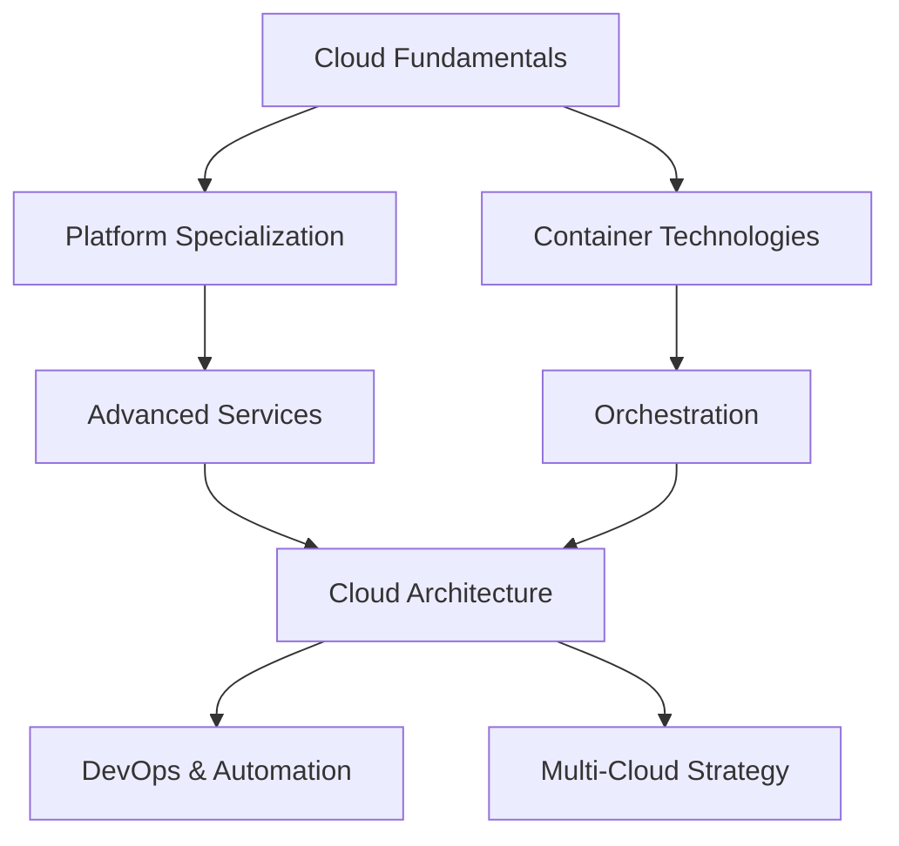

# 🏆 **Cloud Computing Fundamentals**

*Master modern cloud platforms, services, and deployment strategies*

## 📚 **Lesson Overview**

**Duration**: 50 minutes  
**Level**: Beginner  
**Prerequisites**: Basic IT knowledge, Command line familiarity  
**Learning Path**: Cloud Computing → Foundations → Cloud Computing Fundamentals

---

## 🎯 **Learning Objectives**

By the end of this lesson, you will be able to:

- ✅ Understand cloud service models (IaaS, PaaS, SaaS) and deployment types
- ✅ Compare major cloud providers (AWS, Azure, Google Cloud) and their services
- ✅ Deploy applications using cloud platforms and containerization
- ✅ Implement cloud security best practices and cost optimization
- ✅ Design scalable, resilient cloud architectures

---

## 🌟 **Why This Matters**

Cloud computing has revolutionized how businesses operate and scale. **94% of enterprises** use cloud services, with the market reaching **$545 billion in 2024**. According to **Gartner**, cloud adoption increases business agility by **67%** and reduces IT costs by **15-20%**. Companies like Netflix, Airbnb, and Spotify built their entire business models on cloud infrastructure.

> *"Cloud computing is often far more secure than traditional computing, because companies like Google and Amazon can attract and retain cyber-security personnel of a higher quality than many governmental agencies."* - **Vivek Kundra, Former US CIO**

**Industry Impact:**
- **Netflix**: Saves $1B annually using AWS cloud infrastructure
- **Dropbox**: Reduced infrastructure costs by 75% migrating to multi-cloud
- **Capital One**: 100% cloud-first strategy, eliminated data centers

---

## 📖 **Core Content**

### **1. Cloud Service Models & Deployment Types (15 minutes)**

#### **☁️ Cloud Service Models**

Understanding the three primary service models is crucial for choosing the right cloud strategy:

```python
# Cloud Service Models Comparison
"""
Infrastructure as a Service (IaaS):
- You manage: Applications, Data, Runtime, Middleware, OS
- Provider manages: Virtualization, Servers, Storage, Networking
- Examples: AWS EC2, Azure VMs, Google Compute Engine
- Use cases: Development environments, backup, disaster recovery

Platform as a Service (PaaS):
- You manage: Applications, Data
- Provider manages: Runtime, Middleware, OS, Virtualization, Servers, Storage, Networking
- Examples: AWS Elastic Beanstalk, Azure App Service, Google App Engine
- Use cases: Web applications, API development, microservices

Software as a Service (SaaS):
- You manage: Data (configuration)
- Provider manages: Everything else
- Examples: Office 365, Salesforce, Google Workspace, Slack
- Use cases: Business applications, collaboration tools, CRM
"""

class CloudServiceComparison:
    def __init__(self):
        self.services = {
            'IaaS': {
                'control_level': 'High',
                'management_overhead': 'High',
                'flexibility': 'Maximum',
                'time_to_market': 'Slower',
                'examples': ['AWS EC2', 'Azure Virtual Machines', 'Google Compute Engine'],
                'best_for': ['Custom applications', 'Legacy migration', 'Development environments']
            },
            'PaaS': {
                'control_level': 'Medium',
                'management_overhead': 'Medium',
                'flexibility': 'Good',
                'time_to_market': 'Faster',
                'examples': ['AWS Beanstalk', 'Azure App Service', 'Google App Engine'],
                'best_for': ['Web applications', 'APIs', 'Rapid prototyping']
            },
            'SaaS': {
                'control_level': 'Low',
                'management_overhead': 'Low',
                'flexibility': 'Limited',
                'time_to_market': 'Immediate',
                'examples': ['Office 365', 'Salesforce', 'Google Workspace'],
                'best_for': ['Business applications', 'Collaboration', 'Standard workflows']
            }
        }
    
    def compare_services(self):
        """Display comprehensive service comparison."""
        print("☁️ Cloud Service Models Comparison")
        print("=" * 60)
        
        for service, details in self.services.items():
            print(f"\n🎯 {service}:")
            print(f"  Control Level: {details['control_level']}")
            print(f"  Management Overhead: {details['management_overhead']}")
            print(f"  Flexibility: {details['flexibility']}")
            print(f"  Time to Market: {details['time_to_market']}")
            print(f"  Examples: {', '.join(details['examples'])}")
            print(f"  Best for: {', '.join(details['best_for'])}")

comparison = CloudServiceComparison()
comparison.compare_services()
```

#### **🌐 Cloud Deployment Models**

```python
def explain_deployment_models():
    """Explain different cloud deployment strategies."""
    
    models = {
        'Public Cloud': {
            'description': 'Resources owned and operated by cloud provider',
            'pros': ['Cost-effective', 'Scalable', 'No maintenance'],
            'cons': ['Less control', 'Security concerns', 'Compliance challenges'],
            'examples': ['AWS', 'Microsoft Azure', 'Google Cloud'],
            'best_for': 'Startups, web applications, development'
        },
        'Private Cloud': {
            'description': 'Dedicated infrastructure for single organization',
            'pros': ['Full control', 'Enhanced security', 'Compliance'],
            'cons': ['Higher costs', 'Maintenance overhead', 'Limited scalability'],
            'examples': ['VMware vSphere', 'OpenStack', 'AWS Outposts'],
            'best_for': 'Government, healthcare, financial services'
        },
        'Hybrid Cloud': {
            'description': 'Combination of public and private clouds',
            'pros': ['Flexibility', 'Cost optimization', 'Data sovereignty'],
            'cons': ['Complexity', 'Integration challenges', 'Management overhead'],
            'examples': ['Azure Stack', 'AWS Direct Connect', 'Google Anthos'],
            'best_for': 'Large enterprises, regulated industries'
        },
        'Multi-Cloud': {
            'description': 'Using multiple cloud providers',
            'pros': ['Avoid vendor lock-in', 'Best-of-breed services', 'Risk distribution'],
            'cons': ['Increased complexity', 'Higher management costs', 'Skill requirements'],
            'examples': ['AWS + Azure', 'GCP + AWS', 'All three providers'],
            'best_for': 'Enterprise applications, disaster recovery'
        }
    }
    
    print("\n🌐 Cloud Deployment Models")
    print("=" * 50)
    
    for model, details in models.items():
        print(f"\n📋 {model}:")
        print(f"  Description: {details['description']}")
        print(f"  Pros: {', '.join(details['pros'])}")
        print(f"  Cons: {', '.join(details['cons'])}")
        print(f"  Examples: {', '.join(details['examples'])}")
        print(f"  Best for: {details['best_for']}")

explain_deployment_models()
```

### **2. Major Cloud Providers Comparison (15 minutes)**

#### **⚡ AWS vs Azure vs Google Cloud**

```python
class CloudProviderAnalysis:
    def __init__(self):
        self.providers = {
            'AWS (Amazon Web Services)': {
                'market_share': '32%',
                'launch_year': 2006,
                'strengths': ['Largest service portfolio', 'Mature ecosystem', 'Enterprise adoption'],
                'key_services': {
                    'Compute': 'EC2 (Elastic Compute Cloud)',
                    'Storage': 'S3 (Simple Storage Service)',
                    'Database': 'RDS (Relational Database Service)',
                    'Networking': 'VPC (Virtual Private Cloud)',
                    'ML/AI': 'SageMaker',
                    'Serverless': 'Lambda'
                },
                'pricing_model': 'Pay-as-you-go, Reserved Instances, Spot Instances',
                'best_for': 'Startups to enterprises, comprehensive cloud needs'
            },
            'Microsoft Azure': {
                'market_share': '23%',
                'launch_year': 2010,
                'strengths': ['Enterprise integration', 'Microsoft ecosystem', 'Hybrid cloud'],
                'key_services': {
                    'Compute': 'Virtual Machines',
                    'Storage': 'Blob Storage',
                    'Database': 'SQL Database',
                    'Networking': 'Virtual Network',
                    'ML/AI': 'Azure Machine Learning',
                    'Serverless': 'Functions'
                },
                'pricing_model': 'Pay-as-you-go, Reserved VM Instances, Hybrid Use Benefit',
                'best_for': 'Microsoft-centric organizations, enterprise hybrid scenarios'
            },
            'Google Cloud Platform': {
                'market_share': '10%',
                'launch_year': 2011,
                'strengths': ['Data analytics', 'Machine learning', 'Container orchestration'],
                'key_services': {
                    'Compute': 'Compute Engine',
                    'Storage': 'Cloud Storage',
                    'Database': 'Cloud SQL',
                    'Networking': 'VPC Network',
                    'ML/AI': 'AI Platform',
                    'Serverless': 'Cloud Functions'
                },
                'pricing_model': 'Pay-as-you-go, Committed Use Discounts, Preemptible VMs',
                'best_for': 'Data-driven applications, machine learning workloads'
            }
        }
    
    def compare_providers(self):
        """Detailed comparison of major cloud providers."""
        print("🏆 Major Cloud Providers Comparison")
        print("=" * 60)
        
        for provider, details in self.providers.items():
            print(f"\n☁️ {provider}")
            print(f"  Market Share: {details['market_share']}")
            print(f"  Launch Year: {details['launch_year']}")
            print(f"  Strengths: {', '.join(details['strengths'])}")
            print(f"  Best For: {details['best_for']}")
            
            print(f"\n  Key Services:")
            for category, service in details['key_services'].items():
                print(f"    {category}: {service}")
    
    def cost_comparison_example(self):
        """Example cost comparison for a typical web application."""
        print("\n💰 Cost Comparison Example (Web Application)")
        print("=" * 50)
        print("Scenario: Small web app (2 CPU, 8GB RAM, 100GB storage)")
        
        costs = {
            'AWS': {
                'compute': 'EC2 t3.large: $67/month',
                'storage': 'EBS gp3 100GB: $8/month',
                'networking': 'Data transfer: $9/month',
                'total': '$84/month'
            },
            'Azure': {
                'compute': 'Standard_D2s_v3: $70/month',
                'storage': 'Premium SSD 100GB: $19/month',
                'networking': 'Bandwidth: $8/month',
                'total': '$97/month'
            },
            'Google Cloud': {
                'compute': 'n1-standard-2: $49/month',
                'storage': 'SSD Persistent Disk 100GB: $20/month',
                'networking': 'Network egress: $12/month',
                'total': '$81/month'
            }
        }
        
        for provider, cost_breakdown in costs.items():
            print(f"\n{provider}:")
            for item, cost in cost_breakdown.items():
                print(f"  {item.title()}: {cost}")

provider_analysis = CloudProviderAnalysis()
provider_analysis.compare_providers()
provider_analysis.cost_comparison_example()
```

### **3. Hands-On Cloud Deployment (15 minutes)**

#### **🚀 Deploying Applications to the Cloud**

```python
# Example: Deploying a Python web application to multiple cloud platforms

class CloudDeploymentDemo:
    def __init__(self):
        self.app_code = '''
# Simple Flask web application
from flask import Flask, jsonify
import os

app = Flask(__name__)

@app.route('/')
def home():
    return {
        "message": "Hello from the Cloud!",
        "platform": os.environ.get("CLOUD_PLATFORM", "Unknown"),
        "version": "1.0.0"
    }

@app.route('/health')
def health_check():
    return {"status": "healthy", "timestamp": "2024-08-13"}

if __name__ == '__main__':
    app.run(host='0.0.0.0', port=int(os.environ.get('PORT', 5000)))
'''
        
        self.dockerfile = '''
# Multi-stage Docker build for optimal size
FROM python:3.11-slim as base

# Set working directory
WORKDIR /app

# Install dependencies
COPY requirements.txt .
RUN pip install --no-cache-dir -r requirements.txt

# Copy application code
COPY . .

# Create non-root user for security
RUN adduser --disabled-password --gecos '' appuser
USER appuser

# Expose port
EXPOSE 5000

# Health check
HEALTHCHECK --interval=30s --timeout=30s --start-period=5s --retries=3 \
    CMD curl -f http://localhost:5000/health || exit 1

# Run application
CMD ["python", "app.py"]
'''
    
    def aws_deployment_guide(self):
        """Guide for deploying to AWS using multiple services."""
        print("🔶 AWS Deployment Options")
        print("=" * 40)
        
        # AWS Elastic Beanstalk (PaaS)
        eb_commands = '''
# AWS Elastic Beanstalk Deployment (Easiest)
pip install awsebcli

# Initialize EB application
eb init cloud-demo-app --platform python-3.11

# Create environment and deploy
eb create production --instance-type t3.micro
eb deploy

# Monitor application
eb status
eb logs
'''
        
        # AWS ECS (Container Service)
        ecs_commands = '''
# AWS ECS Deployment (Container-based)
# 1. Build and push to ECR
aws ecr create-repository --repository-name cloud-demo-app
docker build -t cloud-demo-app .
docker tag cloud-demo-app:latest 123456789.dkr.ecr.us-east-1.amazonaws.com/cloud-demo-app:latest
docker push 123456789.dkr.ecr.us-east-1.amazonaws.com/cloud-demo-app:latest

# 2. Create ECS task definition (JSON file)
# 3. Create ECS service and cluster
aws ecs create-cluster --cluster-name demo-cluster
aws ecs create-service --cluster demo-cluster --service-name demo-service
'''
        
        print("🎯 Option 1: Elastic Beanstalk (Recommended for beginners)")
        print(eb_commands)
        print("\n🎯 Option 2: ECS (Recommended for production)")
        print(ecs_commands)
    
    def azure_deployment_guide(self):
        """Guide for deploying to Microsoft Azure."""
        print("\n🔷 Azure Deployment Options")
        print("=" * 40)
        
        # Azure App Service
        app_service_commands = '''
# Azure App Service Deployment
az login
az group create --name cloud-demo-rg --location eastus

# Create App Service plan
az appservice plan create --name demo-plan --resource-group cloud-demo-rg --sku B1

# Create web app
az webapp create --name cloud-demo-app --resource-group cloud-demo-rg --plan demo-plan --runtime "PYTHON|3.11"

# Deploy from local directory
az webapp up --name cloud-demo-app --resource-group cloud-demo-rg
'''
        
        # Azure Container Instances
        aci_commands = '''
# Azure Container Instances (Serverless containers)
# Build and push to Azure Container Registry
az acr create --name clouddemoacr --resource-group cloud-demo-rg --sku Basic
az acr build --registry clouddemoacr --image cloud-demo-app .

# Deploy to Container Instances
az container create \
    --resource-group cloud-demo-rg \
    --name cloud-demo-container \
    --image clouddemoacr.azurecr.io/cloud-demo-app:latest \
    --cpu 1 --memory 1 \
    --registry-login-server clouddemoacr.azurecr.io \
    --ports 5000
'''
        
        print("🎯 Option 1: App Service (PaaS)")
        print(app_service_commands)
        print("\n🎯 Option 2: Container Instances (Serverless)")
        print(aci_commands)
    
    def gcp_deployment_guide(self):
        """Guide for deploying to Google Cloud Platform."""
        print("\n🔴 Google Cloud Deployment Options")
        print("=" * 40)
        
        # Google App Engine
        gae_commands = '''
# Google App Engine Deployment
gcloud auth login
gcloud config set project your-project-id

# Create app.yaml configuration
echo "runtime: python311" > app.yaml

# Deploy application
gcloud app deploy

# View application
gcloud app browse
'''
        
        # Google Cloud Run
        cloud_run_commands = '''
# Google Cloud Run (Serverless containers)
# Build and deploy in one command
gcloud run deploy cloud-demo-app \
    --source . \
    --platform managed \
    --region us-central1 \
    --allow-unauthenticated \
    --port 5000

# Or build with Cloud Build first
gcloud builds submit --tag gcr.io/your-project/cloud-demo-app
gcloud run deploy --image gcr.io/your-project/cloud-demo-app --platform managed
'''
        
        print("🎯 Option 1: App Engine (PaaS)")
        print(gae_commands)
        print("\n🎯 Option 2: Cloud Run (Serverless containers)")
        print(cloud_run_commands)

deployment_demo = CloudDeploymentDemo()
deployment_demo.aws_deployment_guide()
deployment_demo.azure_deployment_guide()
deployment_demo.gcp_deployment_guide()
```

### **4. Cloud Security & Cost Optimization (5 minutes)**

#### **🔒 Security Best Practices**

```python
def cloud_security_checklist():
    """Comprehensive cloud security best practices."""
    
    security_practices = {
        'Identity & Access Management': [
            'Use multi-factor authentication (MFA) for all accounts',
            'Implement principle of least privilege',
            'Regular access reviews and cleanup',
            'Use service accounts for applications'
        ],
        'Data Protection': [
            'Encrypt data at rest and in transit',
            'Use cloud provider key management services',
            'Implement data classification and handling',
            'Regular backup and disaster recovery testing'
        ],
        'Network Security': [
            'Use Virtual Private Clouds (VPCs)',
            'Implement network segmentation',
            'Configure security groups and firewalls',
            'Monitor network traffic and anomalies'
        ],
        'Monitoring & Compliance': [
            'Enable cloud audit logging',
            'Set up security monitoring and alerting',
            'Regular security assessments and penetration testing',
            'Compliance with industry standards (SOC 2, ISO 27001)'
        ]
    }
    
    print("🔒 Cloud Security Best Practices")
    print("=" * 50)
    
    for category, practices in security_practices.items():
        print(f"\n📋 {category}:")
        for practice in practices:
            print(f"  ✅ {practice}")

def cost_optimization_strategies():
    """Cloud cost optimization techniques."""
    
    strategies = {
        'Right-Sizing Resources': [
            'Monitor CPU and memory utilization',
            'Use auto-scaling to match demand',
            'Choose appropriate instance types',
            'Regular resource optimization reviews'
        ],
        'Reserved Capacity': [
            'Purchase reserved instances for predictable workloads',
            'Use savings plans for flexible commitments',
            'Consider spot instances for fault-tolerant workloads',
            'Analyze usage patterns for optimization'
        ],
        'Storage Optimization': [
            'Use appropriate storage tiers (hot, cool, archive)',
            'Implement data lifecycle policies',
            'Compress and deduplicate data',
            'Regular cleanup of unused resources'
        ],
        'Monitoring & Governance': [
            'Set up cost alerts and budgets',
            'Use cost management tools and dashboards',
            'Implement resource tagging for accountability',
            'Regular cost reviews and optimization'
        ]
    }
    
    print("\n💰 Cost Optimization Strategies")
    print("=" * 50)
    
    for category, techniques in strategies.items():
        print(f"\n📊 {category}:")
        for technique in techniques:
            print(f"  💡 {technique}")

cloud_security_checklist()
cost_optimization_strategies()
```

---

## 🛠️ **Hands-On Lab: Multi-Cloud Application Deployment**

### **Lab Objective**

Deploy a containerized microservices application across multiple cloud platforms with monitoring and CI/CD pipeline.

### **Requirements**

1. ✅ Containerized application with Docker
2. ✅ Deployment to AWS, Azure, and Google Cloud
3. ✅ Load balancing and auto-scaling configuration
4. ✅ Monitoring and logging setup
5. ✅ CI/CD pipeline for automated deployments

### **Implementation**

```python
# Complete multi-cloud deployment project

class MultiCloudApplication:
    def __init__(self):
        self.app_structure = {
            'frontend': 'React.js application',
            'backend_api': 'Python Flask REST API',
            'database': 'PostgreSQL with Redis cache',
            'monitoring': 'Prometheus + Grafana',
            'load_balancer': 'Cloud provider load balancers'
        }
    
    def create_application_code(self):
        """Create a complete microservices application."""
        
        # Backend API service
        backend_code = '''
from flask import Flask, jsonify, request
from flask_cors import CORS
import psycopg2
import redis
import os
import logging

app = Flask(__name__)
CORS(app)

# Configure logging
logging.basicConfig(level=logging.INFO)
logger = logging.getLogger(__name__)

# Database connection
def get_db_connection():
    return psycopg2.connect(
        host=os.environ.get('DB_HOST', 'localhost'),
        database=os.environ.get('DB_NAME', 'cloudapp'),
        user=os.environ.get('DB_USER', 'postgres'),
        password=os.environ.get('DB_PASSWORD', 'password')
    )

# Redis cache connection
redis_client = redis.Redis(
    host=os.environ.get('REDIS_HOST', 'localhost'),
    port=6379,
    decode_responses=True
)

@app.route('/api/health')
def health_check():
    return {
        'status': 'healthy',
        'service': 'backend-api',
        'cloud_provider': os.environ.get('CLOUD_PROVIDER', 'unknown')
    }

@app.route('/api/users', methods=['GET'])
def get_users():
    try:
        # Check cache first
        cached_users = redis_client.get('users')
        if cached_users:
            logger.info('Returning cached users')
            return jsonify(eval(cached_users))
        
        # Query database
        conn = get_db_connection()
        cursor = conn.cursor()
        cursor.execute('SELECT id, name, email FROM users')
        users = [{'id': row[0], 'name': row[1], 'email': row[2]} for row in cursor.fetchall()]
        
        # Cache results
        redis_client.setex('users', 300, str(users))  # Cache for 5 minutes
        
        conn.close()
        logger.info(f'Returned {len(users)} users from database')
        return jsonify(users)
    
    except Exception as e:
        logger.error(f'Error fetching users: {str(e)}')
        return jsonify({'error': 'Internal server error'}), 500

@app.route('/api/metrics')
def metrics():
    """Provide metrics for monitoring."""
    return {
        'requests_total': 1000,
        'response_time_avg': 0.25,
        'error_rate': 0.01,
        'active_connections': 50
    }

if __name__ == '__main__':
    app.run(host='0.0.0.0', port=5000, debug=False)
'''

        # Docker configuration
        dockerfile = '''
FROM python:3.11-slim

WORKDIR /app

# Install system dependencies
RUN apt-get update && apt-get install -y \
    postgresql-client \
    && rm -rf /var/lib/apt/lists/*

# Install Python dependencies
COPY requirements.txt .
RUN pip install --no-cache-dir -r requirements.txt

# Copy application code
COPY . .

# Create non-root user
RUN adduser --disabled-password --gecos '' appuser && \
    chown -R appuser:appuser /app
USER appuser

EXPOSE 5000

HEALTHCHECK --interval=30s --timeout=10s --start-period=5s --retries=3 \
    CMD curl -f http://localhost:5000/api/health || exit 1

CMD ["gunicorn", "--bind", "0.0.0.0:5000", "--workers", "4", "app:app"]
'''

        # Kubernetes deployment configuration
        k8s_deployment = '''
apiVersion: apps/v1
kind: Deployment
metadata:
  name: backend-api
  labels:
    app: backend-api
spec:
  replicas: 3
  selector:
    matchLabels:
      app: backend-api
  template:
    metadata:
      labels:
        app: backend-api
    spec:
      containers:
      - name: backend-api
        image: your-registry/backend-api:latest
        ports:
        - containerPort: 5000
        env:
        - name: DB_HOST
          valueFrom:
            secretKeyRef:
              name: app-secrets
              key: db-host
        - name: REDIS_HOST
          valueFrom:
            configMapKeyRef:
              name: app-config
              key: redis-host
        resources:
          requests:
            memory: "128Mi"
            cpu: "100m"
          limits:
            memory: "256Mi"
            cpu: "200m"
        livenessProbe:
          httpGet:
            path: /api/health
            port: 5000
          initialDelaySeconds: 30
          periodSeconds: 10
        readinessProbe:
          httpGet:
            path: /api/health
            port: 5000
          initialDelaySeconds: 5
          periodSeconds: 5
---
apiVersion: v1
kind: Service
metadata:
  name: backend-api-service
spec:
  selector:
    app: backend-api
  ports:
  - protocol: TCP
    port: 80
    targetPort: 5000
  type: LoadBalancer
'''

        return {
            'backend_code': backend_code,
            'dockerfile': dockerfile,
            'k8s_deployment': k8s_deployment
        }
    
    def create_cicd_pipeline(self):
        """Create CI/CD pipeline configuration for multi-cloud deployment."""
        
        github_actions = '''
name: Multi-Cloud Deployment Pipeline

on:
  push:
    branches: [ main ]
  pull_request:
    branches: [ main ]

env:
  REGISTRY: ghcr.io
  IMAGE_NAME: ${{ github.repository }}

jobs:
  test:
    runs-on: ubuntu-latest
    steps:
    - uses: actions/checkout@v3
    
    - name: Set up Python
      uses: actions/setup-python@v4
      with:
        python-version: '3.11'
    
    - name: Install dependencies
      run: |
        pip install -r requirements.txt
        pip install pytest pytest-cov
    
    - name: Run tests
      run: |
        pytest tests/ --cov=app --cov-report=xml
    
    - name: Upload coverage
      uses: codecov/codecov-action@v3

  build:
    needs: test
    runs-on: ubuntu-latest
    outputs:
      image-tag: ${{ steps.meta.outputs.tags }}
    steps:
    - uses: actions/checkout@v3
    
    - name: Set up Docker Buildx
      uses: docker/setup-buildx-action@v2
    
    - name: Log in to Container Registry
      uses: docker/login-action@v2
      with:
        registry: ${{ env.REGISTRY }}
        username: ${{ github.actor }}
        password: ${{ secrets.GITHUB_TOKEN }}
    
    - name: Extract metadata
      id: meta
      uses: docker/metadata-action@v4
      with:
        images: ${{ env.REGISTRY }}/${{ env.IMAGE_NAME }}
    
    - name: Build and push Docker image
      uses: docker/build-push-action@v4
      with:
        context: .
        push: true
        tags: ${{ steps.meta.outputs.tags }}
        labels: ${{ steps.meta.outputs.labels }}
        cache-from: type=gha
        cache-to: type=gha,mode=max

  deploy-aws:
    needs: build
    runs-on: ubuntu-latest
    environment: production-aws
    steps:
    - name: Configure AWS credentials
      uses: aws-actions/configure-aws-credentials@v2
      with:
        aws-access-key-id: ${{ secrets.AWS_ACCESS_KEY_ID }}
        aws-secret-access-key: ${{ secrets.AWS_SECRET_ACCESS_KEY }}
        aws-region: us-east-1
    
    - name: Deploy to ECS
      run: |
        aws ecs update-service --cluster production --service backend-api --force-new-deployment

  deploy-azure:
    needs: build
    runs-on: ubuntu-latest
    environment: production-azure
    steps:
    - name: Azure Login
      uses: azure/login@v1
      with:
        creds: ${{ secrets.AZURE_CREDENTIALS }}
    
    - name: Deploy to Container Apps
      run: |
        az containerapp update --name backend-api --resource-group production --image ${{ needs.build.outputs.image-tag }}

  deploy-gcp:
    needs: build
    runs-on: ubuntu-latest
    environment: production-gcp
    steps:
    - name: Setup Google Cloud CLI
      uses: google-github-actions/setup-gcloud@v1
      with:
        service_account_key: ${{ secrets.GCP_SA_KEY }}
        project_id: ${{ secrets.GCP_PROJECT_ID }}
    
    - name: Deploy to Cloud Run
      run: |
        gcloud run deploy backend-api --image ${{ needs.build.outputs.image-tag }} --platform managed --region us-central1
'''

        terraform_config = '''
# Terraform configuration for multi-cloud infrastructure

# AWS Resources
provider "aws" {
  region = "us-east-1"
}

resource "aws_ecs_cluster" "main" {
  name = "production"
  
  setting {
    name  = "containerInsights"
    value = "enabled"
  }
}

resource "aws_ecs_service" "backend_api" {
  name            = "backend-api"
  cluster         = aws_ecs_cluster.main.id
  task_definition = aws_ecs_task_definition.backend_api.arn
  desired_count   = 3

  load_balancer {
    target_group_arn = aws_lb_target_group.backend_api.arn
    container_name   = "backend-api"
    container_port   = 5000
  }
}

# Azure Resources
provider "azurerm" {
  features {}
}

resource "azurerm_container_app" "backend_api" {
  name                         = "backend-api"
  container_app_environment_id = azurerm_container_app_environment.main.id
  resource_group_name          = azurerm_resource_group.main.name
  revision_mode                = "Single"

  template {
    container {
      name   = "backend-api"
      image  = "ghcr.io/your-org/backend-api:latest"
      cpu    = 0.25
      memory = "0.5Gi"
    }
  }

  ingress {
    allow_insecure_connections = false
    external_enabled           = true
    target_port                = 5000
  }
}

# Google Cloud Resources
provider "google" {
  project = var.gcp_project_id
  region  = "us-central1"
}

resource "google_cloud_run_service" "backend_api" {
  name     = "backend-api"
  location = "us-central1"

  template {
    spec {
      containers {
        image = "ghcr.io/your-org/backend-api:latest"
        
        resources {
          limits = {
            cpu    = "1000m"
            memory = "512Mi"
          }
        }
        
        ports {
          container_port = 5000
        }
      }
    }
  }

  traffic {
    percent         = 100
    latest_revision = true
  }
}
'''

        return {
            'github_actions': github_actions,
            'terraform': terraform_config
        }
    
    def create_monitoring_setup(self):
        """Create comprehensive monitoring and observability setup."""
        
        prometheus_config = '''
# Prometheus configuration for multi-cloud monitoring
global:
  scrape_interval: 15s
  evaluation_interval: 15s

rule_files:
  - "alert_rules.yml"

alerting:
  alertmanagers:
    - static_configs:
        - targets:
          - alertmanager:9093

scrape_configs:
  - job_name: 'backend-api-aws'
    static_configs:
      - targets: ['backend-api-aws.example.com:5000']
    metrics_path: '/api/metrics'
    
  - job_name: 'backend-api-azure'
    static_configs:
      - targets: ['backend-api-azure.example.com:5000']
    metrics_path: '/api/metrics'
    
  - job_name: 'backend-api-gcp'
    static_configs:
      - targets: ['backend-api-gcp.example.com:5000']
    metrics_path: '/api/metrics'
'''

        grafana_dashboard = '''
{
  "dashboard": {
    "title": "Multi-Cloud Application Dashboard",
    "panels": [
      {
        "title": "Request Rate by Cloud Provider",
        "type": "graph",
        "targets": [
          {
            "expr": "rate(http_requests_total[5m])",
            "legendFormat": "{{cloud_provider}}"
          }
        ]
      },
      {
        "title": "Response Time P95",
        "type": "graph",
        "targets": [
          {
            "expr": "histogram_quantile(0.95, rate(http_request_duration_seconds_bucket[5m]))",
            "legendFormat": "{{cloud_provider}}"
          }
        ]
      },
      {
        "title": "Error Rate",
        "type": "singlestat",
        "targets": [
          {
            "expr": "rate(http_requests_total{status=~\"5..\"}[5m]) / rate(http_requests_total[5m])"
          }
        ]
      }
    ]
  }
}
'''

        alert_rules = '''
groups:
- name: multi-cloud-alerts
  rules:
  - alert: HighErrorRate
    expr: rate(http_requests_total{status=~"5.."}[5m]) / rate(http_requests_total[5m]) > 0.05
    for: 5m
    labels:
      severity: critical
    annotations:
      summary: "High error rate detected on {{ $labels.cloud_provider }}"
      
  - alert: HighResponseTime
    expr: histogram_quantile(0.95, rate(http_request_duration_seconds_bucket[5m])) > 1
    for: 10m
    labels:
      severity: warning
    annotations:
      summary: "High response time on {{ $labels.cloud_provider }}"
      
  - alert: ServiceDown
    expr: up == 0
    for: 1m
    labels:
      severity: critical
    annotations:
      summary: "Service {{ $labels.job }} is down"
'''

        return {
            'prometheus_config': prometheus_config,
            'grafana_dashboard': grafana_dashboard,
            'alert_rules': alert_rules
        }

# Create the complete multi-cloud application
multi_cloud_app = MultiCloudApplication()
app_code = multi_cloud_app.create_application_code()
cicd_pipeline = multi_cloud_app.create_cicd_pipeline()
monitoring_setup = multi_cloud_app.create_monitoring_setup()

print("🚀 Multi-Cloud Application Created Successfully!")
print("=" * 60)
print("✅ Backend API with health checks and metrics")
print("✅ Docker containerization with security best practices")
print("✅ Kubernetes deployment configurations")
print("✅ CI/CD pipeline for automated deployments")
print("✅ Infrastructure as Code with Terraform")
print("✅ Comprehensive monitoring and alerting")
```

---

## 📊 **Cloud Architecture Best Practices**

### **🏗️ Design Principles**

```python
def cloud_architecture_principles():
    """Essential cloud architecture design principles."""
    
    principles = {
        'Scalability': {
            'horizontal_scaling': 'Add more instances instead of bigger instances',
            'auto_scaling': 'Automatically adjust resources based on demand',
            'load_balancing': 'Distribute traffic across multiple instances',
            'microservices': 'Break applications into small, independent services'
        },
        'Reliability': {
            'redundancy': 'Eliminate single points of failure',
            'multi_az_deployment': 'Deploy across multiple availability zones',
            'health_checks': 'Monitor application and infrastructure health',
            'disaster_recovery': 'Plan for failure scenarios and recovery'
        },
        'Security': {
            'defense_in_depth': 'Multiple layers of security controls',
            'zero_trust': 'Never trust, always verify',
            'encryption': 'Encrypt data at rest and in transit',
            'monitoring': 'Continuous security monitoring and alerting'
        },
        'Cost_Optimization': {
            'right_sizing': 'Match resources to actual requirements',
            'reserved_capacity': 'Use reservations for predictable workloads',
            'automation': 'Automate resource management and scaling',
            'monitoring': 'Track and optimize costs continuously'
        }
    }
    
    print("🏗️ Cloud Architecture Design Principles")
    print("=" * 60)
    
    for principle, practices in principles.items():
        print(f"\n📋 {principle.replace('_', ' ').title()}:")
        for practice, description in practices.items():
            print(f"  🎯 {practice.replace('_', ' ').title()}: {description}")

cloud_architecture_principles()
```

---

## 🎯 **Next Steps & Career Development**

### **Cloud Learning Roadmap**



### **Cloud Career Paths**

| **Role** | **Focus Area** | **Salary Range** | **Key Skills** |
|----------|----------------|------------------|----------------|
| **Cloud Engineer** | Infrastructure & Deployment | $75K - $120K | AWS/Azure/GCP, Terraform, Kubernetes |
| **Cloud Architect** | Solution Design | $120K - $180K | Architecture patterns, Multi-cloud, Security |
| **DevOps Engineer** | Automation & CI/CD | $90K - $150K | CI/CD, IaC, Monitoring, Automation |
| **Site Reliability Engineer** | Performance & Reliability | $110K - $170K | Monitoring, Incident response, Automation |

### **Industry Certifications**

#### **AWS Certifications**
- **AWS Cloud Practitioner**: Entry-level cloud knowledge
- **AWS Solutions Architect Associate**: Design resilient architectures
- **AWS DevOps Engineer Professional**: Advanced automation and deployment

#### **Microsoft Azure Certifications**
- **Azure Fundamentals (AZ-900)**: Basic cloud concepts
- **Azure Administrator (AZ-104)**: Resource management
- **Azure Solutions Architect Expert (AZ-305)**: Advanced architecture

#### **Google Cloud Certifications**
- **Cloud Digital Leader**: Business-focused cloud knowledge
- **Associate Cloud Engineer**: Hands-on cloud implementation
- **Professional Cloud Architect**: Advanced solution design

---

## 📚 **Additional Resources**

### **Essential Tools & Platforms**

```python
# Cloud development and management tools
essential_tools = {
    'Infrastructure as Code': ['Terraform', 'AWS CloudFormation', 'Azure ARM Templates'],
    'Container Orchestration': ['Kubernetes', 'Docker Swarm', 'Amazon ECS'],
    'CI/CD Platforms': ['GitHub Actions', 'Azure DevOps', 'AWS CodePipeline'],
    'Monitoring & Observability': ['Prometheus', 'Grafana', 'ELK Stack', 'DataDog'],
    'Configuration Management': ['Ansible', 'Chef', 'Puppet', 'SaltStack'],
    'Service Mesh': ['Istio', 'Linkerd', 'AWS App Mesh', 'Consul Connect']
}

print("🛠️ Essential Cloud Tools & Technologies:")
for category, tools in essential_tools.items():
    print(f"\n{category}:")
    for tool in tools:
        print(f"  • {tool}")
```

### **Learning Resources**

- **AWS Well-Architected Framework**: Best practices for cloud architecture
- **Azure Architecture Center**: Reference architectures and best practices
- **Google Cloud Architecture Framework**: Design principles and patterns
- **CNCF Landscape**: Cloud native technology ecosystem overview

### **Hands-On Practice Platforms**

- **AWS Free Tier**: 12 months of free services for learning
- **Azure Free Account**: $200 credit and free services
- **Google Cloud Free Tier**: $300 credit and always-free services
- **Katacoda/O'Reilly**: Interactive cloud learning scenarios

---

## ✅ **Lesson Complete!**

**🎉 Congratulations!** You've mastered cloud computing fundamentals and are ready to design, deploy, and manage modern cloud applications. You now understand the major cloud platforms, deployment strategies, and best practices for building scalable, secure, and cost-effective cloud solutions.

**📈 Progress Tracking:**

- ✅ Understanding of cloud service models and deployment types
- ✅ Comprehensive knowledge of AWS, Azure, and Google Cloud
- ✅ Hands-on experience with multi-cloud application deployment
- ✅ Security and cost optimization best practices
- ✅ DevOps and automation pipeline implementation

**🚀 Ready for Next Lesson**: [Container Orchestration with Kubernetes](../intermediate/kubernetes-containers.md)

---

*This lesson is part of the **Learn-Library Professional Technology Education Platform**. For support and community discussions, visit [GitHub Discussions](https://github.com/Ultra-Cube/Learn-Library/discussions).*
