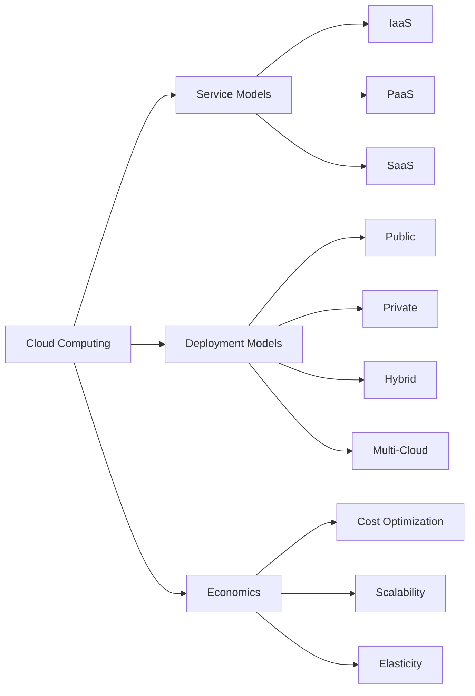

# Module 01: Cloud Computing Fundamentals

Comprehensive foundational coverage of cloud definitions, characteristics, service & deployment models, economics, providers, and real-world adoption.

## Lessons

- Lesson 01 — Cloud Computing Fundamentals: Understanding the Cloud Revolution

## Learning Objectives

- Define cloud computing via NIST essential characteristics
- Distinguish IaaS, PaaS, and SaaS responsibilities
- Compare public, private, hybrid, and multi-cloud deployment models
- Evaluate major provider strengths and ecosystem differentiators
- Apply basic cloud cost optimization and ROI concepts
- Identify core adoption drivers, benefits, and challenges

## Visual Overview

## Summary

This module establishes terminology and analytical frameworks used throughout subsequent cloud service, deployment, security, and optimization modules.

---

Proceed to the lesson to dive deep into the fundamentals.
