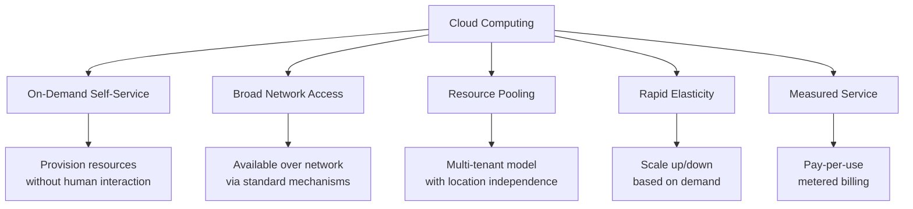
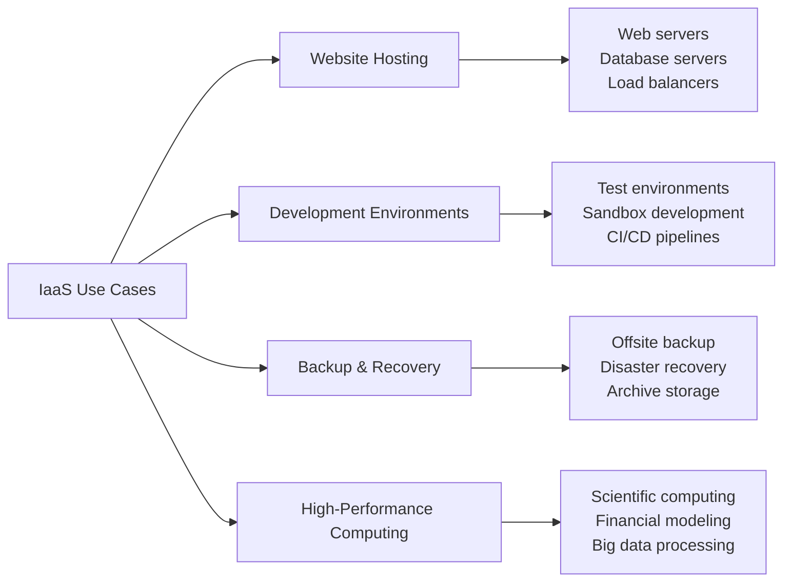
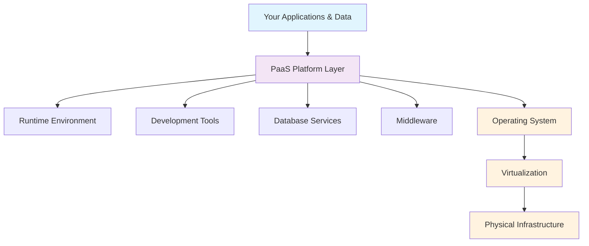
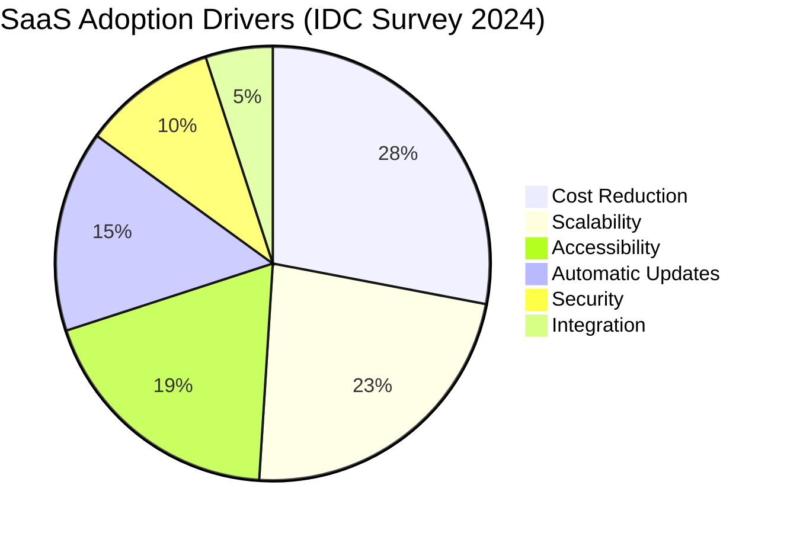
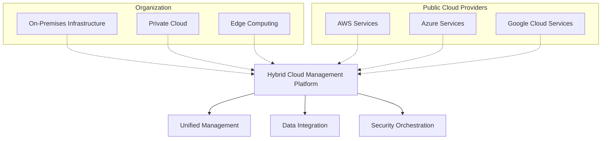
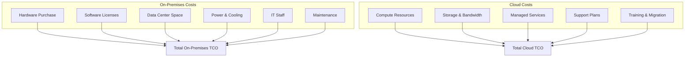
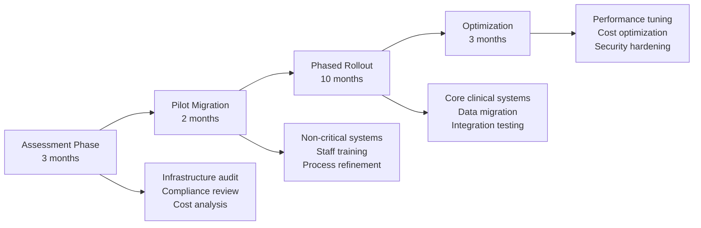
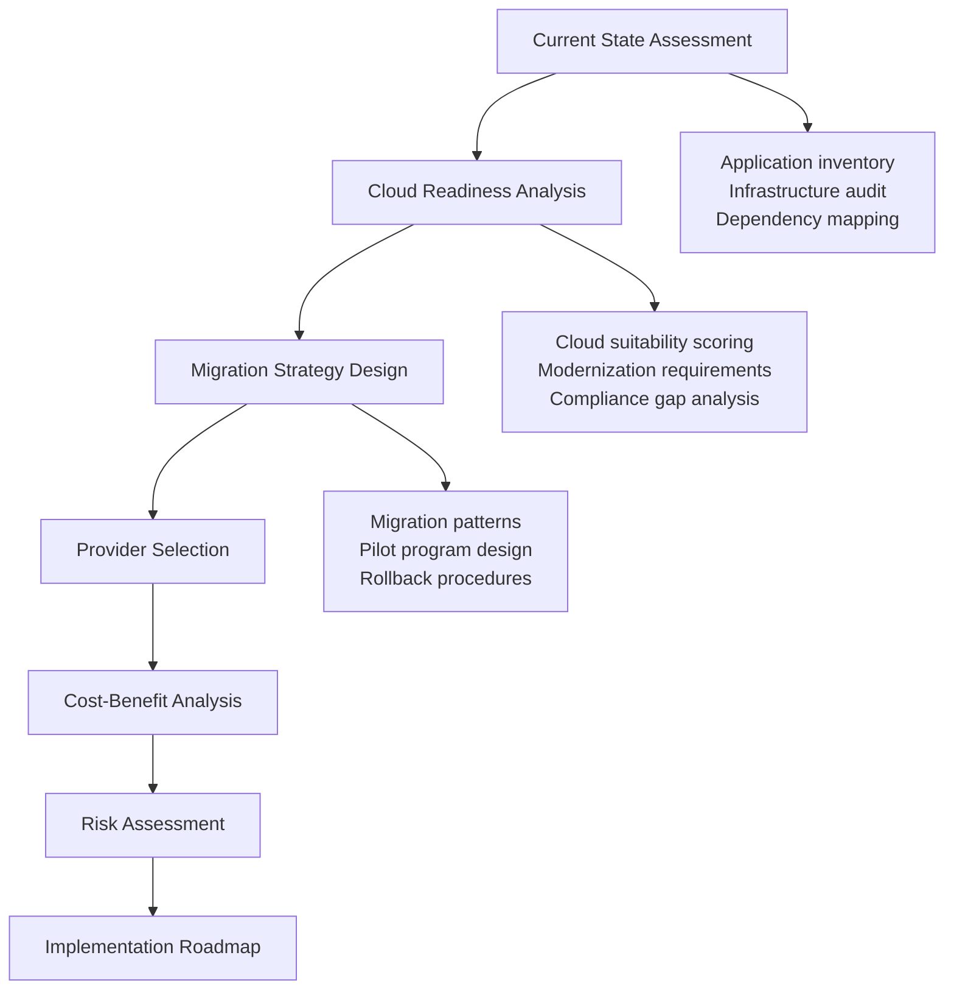

# Cloud Computing Fundamentals: Understanding the Cloud Revolution

> **UltraCube Learn-Library** | Cloud Computing • Foundations • Beginner  
> **Author**: UltraCube Cloud Infrastructure Team  
> **Duration**: 50 minutes | **Difficulty**: ⭐⭐☆☆☆

---

## 🎯 Learning Objectives

By the end of this lesson, you will be able to:

- **Define** cloud computing using the NIST standard definition
- **Distinguish** between IaaS, PaaS, and SaaS service models
- **Compare** public, private, hybrid, and multi-cloud deployment strategies
- **Evaluate** major cloud providers and their unique value propositions
- **Calculate** potential cost savings and ROI of cloud adoption
- **Identify** key benefits and challenges of cloud migration

---

## ☁️ What is Cloud Computing?

### NIST Official Definition

According to the **National Institute of Standards and Technology (NIST SP 800-145)**:

> "Cloud computing is a model for enabling ubiquitous, convenient, on-demand network access to a shared pool of configurable computing resources (e.g., networks, servers, storage, applications, and services) that can be rapidly provisioned and released with minimal management effort or service provider interaction."

### Five Essential Characteristics



### Traditional IT vs. Cloud Computing

| Aspect | Traditional IT | Cloud Computing |
|--------|----------------|-----------------|
| **Capital Investment** | High upfront costs | Pay-as-you-go |
| **Scalability** | Manual, time-consuming | Automatic, instant |
| **Maintenance** | In-house IT team | Provider managed |
| **Geographic Reach** | Limited to physical locations | Global availability |
| **Disaster Recovery** | Complex, expensive | Built-in options |
| **Innovation Speed** | Slow procurement cycles | Rapid experimentation |

---

## 🏗️ Cloud Service Models

### 🖥️ **Infrastructure as a Service (IaaS)**

**Definition**: Provides virtualized computing infrastructure over the internet.

**What You Get**:
- Virtual machines (compute)
- Storage systems
- Networks and load balancers
- Operating system control

**What You Manage**:
- Operating systems
- Applications
- Runtime environments
- Data

#### **IaaS Use Cases**



**Leading IaaS Providers**:
- **Amazon EC2** (Elastic Compute Cloud)
- **Microsoft Azure Virtual Machines**
- **Google Compute Engine**
- **IBM Cloud Virtual Servers**

**Pricing Example (AWS EC2)**:
```
t3.micro (1 vCPU, 1GB RAM):    $0.0104/hour = ~$7.59/month
t3.medium (2 vCPU, 4GB RAM):   $0.0416/hour = ~$30.37/month
t3.large (2 vCPU, 8GB RAM):    $0.0832/hour = ~$60.74/month

*Prices as of August 2024, us-east-1 region
```

### 🛠️ **Platform as a Service (PaaS)**

**Definition**: Provides a platform for developing, running, and managing applications.

**What You Get**:
- Development frameworks
- Database management systems
- Application servers
- Development tools

**What You Manage**:
- Applications
- Data
- User access

#### **PaaS Architecture Stack**



**Leading PaaS Providers**:
- **Heroku** (Salesforce)
- **AWS Elastic Beanstalk**
- **Google App Engine**
- **Microsoft Azure App Service**
- **Red Hat OpenShift**

**PaaS Benefits**:
- Faster time to market
- Reduced development complexity
- Built-in scalability
- Integrated development tools

### 📱 **Software as a Service (SaaS)**

**Definition**: Delivers software applications over the internet on a subscription basis.

**What You Get**:
- Complete, ready-to-use applications
- Automatic updates
- Multi-device access
- Data backup and security

**What You Manage**:
- User data and settings
- Access permissions
- Usage policies

#### **SaaS Market Leaders by Category**

| Category | Leading Solutions | Market Share |
|----------|------------------|--------------|
| **CRM** | Salesforce, HubSpot | Salesforce: 23.8% |
| **Productivity** | Microsoft 365, Google Workspace | Microsoft: 47.9% |
| **Communications** | Slack, Microsoft Teams | Teams: 34.7% |
| **Finance** | QuickBooks Online, NetSuite | QuickBooks: 41.2% |
| **HR** | Workday, BambooHR | Workday: 28.5% |

*Source: Gartner SaaS Market Analysis 2024*

#### **SaaS Adoption Benefits**



---

## 🌐 Cloud Deployment Models

### ☁️ **Public Cloud**

**Definition**: Cloud services offered over the public internet and shared across multiple organizations.

**Characteristics**:
- Multi-tenant environment
- Provider-owned infrastructure
- Internet-accessible
- Pay-per-use pricing

**Advantages**:
- Lower costs
- No maintenance
- High scalability
- Geographic distribution

**Challenges**:
- Security concerns
- Compliance limitations
- Less control

**Market Leaders & Market Share (Gartner 2024)**:
```
AWS:     ████████████████████████████████ 32.4%
Microsoft: ████████████████████████ 22.5%
Google:   ████████████ 11.9%
Alibaba:  ████████ 8.2%
Others:   ████████████████████████████ 25.0%
```

### 🏢 **Private Cloud**

**Definition**: Cloud infrastructure operated exclusively for a single organization.

**Deployment Options**:
- **On-premises**: Organization's own data center
- **Hosted**: Third-party data center
- **Managed**: Service provider managed

**Use Cases**:
- Highly regulated industries (healthcare, finance)
- Sensitive data processing
- Compliance requirements
- Custom security needs

**Cost Comparison** (Forrester Research 2024):
```
Private Cloud TCO vs Public Cloud (3-year period):
Small Workloads (< 100 VMs):   Private Cloud: 140% more expensive
Medium Workloads (100-500 VMs): Private Cloud: 65% more expensive
Large Workloads (> 500 VMs):   Private Cloud: 25% more expensive
```

### 🔗 **Hybrid Cloud**

**Definition**: Combination of public and private clouds, connected by technology that enables data and application portability.

#### **Hybrid Cloud Architecture**



**Benefits**:
- **Flexibility**: Choose optimal environment for each workload
- **Cost Optimization**: Balance cost and performance
- **Compliance**: Keep sensitive data on-premises
- **Scalability**: Burst to public cloud for peak demand

**Challenges**:
- Complexity in management
- Integration difficulties
- Security across environments
- Skill requirements

### 🌍 **Multi-Cloud**

**Definition**: Use of multiple cloud computing services from different providers.

**Multi-Cloud Strategies**:
1. **Best-of-Breed**: Select best services from each provider
2. **Risk Mitigation**: Avoid vendor lock-in
3. **Geographic Distribution**: Leverage global presence
4. **Cost Optimization**: Compare pricing across providers

**Multi-Cloud Adoption Statistics** (Flexera 2024):
- **89%** of organizations use multi-cloud strategy
- **Average number of clouds**: 4.1 per organization
- **Primary drivers**: Avoid vendor lock-in (68%), Best-of-breed (47%)

---

## 🏆 Major Cloud Providers Comparison

### 🔶 **Amazon Web Services (AWS)**

**Founded**: 2006 | **Market Position**: Leader
**Global Reach**: 32 regions, 102 availability zones

**Strengths**:
- Largest service portfolio (200+ services)
- Mature ecosystem and community
- Extensive partner network
- Strong enterprise adoption

**Key Services**:
- **Compute**: EC2, Lambda, ECS, EKS
- **Storage**: S3, EBS, EFS, Glacier
- **Database**: RDS, DynamoDB, Redshift
- **AI/ML**: SageMaker, Rekognition, Comprehend

**Pricing Model**: Pay-as-you-go with volume discounts

### 🔷 **Microsoft Azure**

**Founded**: 2010 | **Market Position**: Strong Second
**Global Reach**: 60+ regions worldwide

**Strengths**:
- Strong enterprise integration (Office 365, Windows)
- Hybrid cloud leadership
- Comprehensive compliance certifications
- Developer-friendly tools

**Key Services**:
- **Compute**: Virtual Machines, Azure Functions, AKS
- **Storage**: Blob Storage, Azure Files, Data Lake
- **Database**: SQL Database, Cosmos DB, Synapse
- **AI/ML**: Cognitive Services, Machine Learning Studio

**Unique Value**: Seamless integration with Microsoft ecosystem

### 🔴 **Google Cloud Platform (GCP)**

**Founded**: 2011 | **Market Position**: Growing Fast
**Global Reach**: 35 regions, 106 zones

**Strengths**:
- AI/ML leadership (TensorFlow, BigQuery ML)
- Data analytics capabilities
- Kubernetes and container expertise
- Competitive pricing

**Key Services**:
- **Compute**: Compute Engine, Cloud Functions, GKE
- **Storage**: Cloud Storage, Persistent Disk
- **Database**: Cloud SQL, Firestore, BigQuery
- **AI/ML**: AI Platform, AutoML, Vision AI

**Differentiator**: Advanced data analytics and machine learning

### 🔶 **Other Notable Providers**

| Provider | Strengths | Primary Markets |
|----------|-----------|-----------------|
| **Alibaba Cloud** | Asia-Pacific leadership, e-commerce integration | China, Southeast Asia |
| **IBM Cloud** | Enterprise services, hybrid cloud, Red Hat | Enterprise, hybrid |
| **Oracle Cloud** | Database optimization, enterprise applications | Database-centric workloads |
| **Salesforce** | CRM leadership, platform ecosystem | Customer relationship management |

---

## 📊 Cloud Economics and Cost Management

### 💰 **Total Cost of Ownership (TCO) Analysis**

#### **On-Premises vs. Cloud Cost Comparison**



#### **Cloud Cost Optimization Strategies**

**1. Right-Sizing Resources**
- Monitor utilization metrics
- Adjust instance sizes based on actual usage
- Use auto-scaling for variable workloads

**2. Reserved Instances**
- AWS Reserved Instances: Up to 75% savings
- Azure Reserved VM Instances: Up to 72% savings
- Google Committed Use Discounts: Up to 57% savings

**3. Spot/Preemptible Instances**
- AWS Spot Instances: Up to 90% savings
- Azure Spot VMs: Up to 90% savings
- Google Preemptible VMs: Up to 80% savings

### 📈 **Cloud ROI Calculation Example**

**Scenario**: Mid-size company migrating email system to Microsoft 365

**Current On-Premises Costs** (Annual):
```
Hardware (servers, storage):        $45,000
Software licenses (Exchange):       $28,000
IT staff allocation (30%):          $36,000
Power and cooling:                  $8,000
Maintenance and support:            $12,000
Total Annual Cost:                  $129,000
```

**Microsoft 365 Cloud Costs** (Annual):
```
Business Premium licenses (200 users): $60,000
Migration consulting:                   $15,000
Training:                              $5,000
Total Annual Cost:                     $80,000 (Year 1)
                                       $60,000 (Years 2+)
```

**ROI Calculation**:
- **Year 1 Savings**: $129,000 - $80,000 = $49,000
- **Annual Savings** (Years 2+): $129,000 - $60,000 = $69,000
- **3-Year Total Savings**: $49,000 + $69,000 + $69,000 = $187,000

---

## 🌟 Real-World Cloud Success Stories

### 🏥 **Case Study 1: Healthcare Provider Cloud Migration**

**Organization**: Regional Healthcare Network (15 hospitals)
**Challenge**: Aging IT infrastructure, compliance requirements, cost pressures

**Cloud Strategy**:
- **Hybrid approach**: Sensitive data on private cloud, non-sensitive on public
- **Provider**: Microsoft Azure (HIPAA compliance)
- **Migration timeline**: 18 months

**Implementation**:


**Results**:
- **Cost Reduction**: 34% decrease in IT infrastructure costs
- **Compliance**: Achieved HIPAA and HITECH compliance
- **Performance**: 99.9% uptime for critical systems
- **Innovation**: Enabled AI-powered diagnostic tools

### 🏭 **Case Study 2: Manufacturing Digital Transformation**

**Organization**: Global Automotive Parts Manufacturer
**Challenge**: Modernize legacy systems, enable IoT, improve supply chain

**Multi-Cloud Strategy**:
- **AWS**: IoT data processing and analytics
- **Azure**: ERP integration and productivity tools
- **Google Cloud**: Machine learning for predictive maintenance

**Outcomes**:
- **Operational Efficiency**: 23% reduction in unplanned downtime
- **Supply Chain**: Real-time visibility across 47 manufacturing facilities
- **Cost Savings**: $2.3M annual savings in IT operations
- **Innovation**: Predictive maintenance reduced equipment failures by 41%

---

## 💻 Hands-On Exercise: Cloud Provider Exploration

### **Exercise 1: Service Comparison Matrix**

**Objective**: Compare equivalent services across major cloud providers.

**Instructions**:
1. Create a comparison matrix for these service categories:
   - Virtual Machines
   - Object Storage
   - Managed Databases
   - Content Delivery Network
   - Machine Learning Platform

**Template**:
| Service Category | AWS | Azure | Google Cloud | Key Differentiators |
|------------------|-----|-------|--------------|-------------------|
| Virtual Machines | EC2 | Virtual Machines | Compute Engine | [Compare features] |
| Object Storage | S3 | Blob Storage | Cloud Storage | [Compare features] |

### **Exercise 2: Cost Calculator Practice**

**Objective**: Estimate cloud costs for a sample workload.

**Scenario**: Web application with the following requirements:
- 2 web servers (4 vCPU, 16GB RAM each)
- 1 database server (8 vCPU, 32GB RAM)
- 500GB storage
- 10TB monthly data transfer
- Load balancer
- Expected: 24/7 operation

**Tasks**:
1. Use AWS Simple Monthly Calculator
2. Use Azure Pricing Calculator
3. Use Google Cloud Pricing Calculator
4. Compare total monthly costs
5. Identify cost optimization opportunities

### **Exercise 3: Architecture Design**

**Objective**: Design a basic cloud architecture for a startup.

**Requirements**:
- E-commerce website (expected 10,000 daily users)
- Product catalog database
- Payment processing integration
- Global user base
- High availability requirements
- Budget-conscious

**Deliverables**:
- Architecture diagram
- Service selection rationale
- Cost estimation
- Scaling strategy

---

## 🧩 Challenge Puzzle: Cloud Migration Strategy

### **Scenario**: Legacy Application Modernization

**Company Profile**:
- Financial services firm
- 500 employees
- Multiple legacy applications
- Strict compliance requirements
- Limited cloud experience

**Current Environment**:
- 3 physical data centers
- 200 virtual machines
- Mixed Windows/Linux environment
- Custom applications and COTS software
- Annual IT budget: $2.8M

**Challenge Requirements**:
1. **Assess** current environment for cloud readiness
2. **Design** migration strategy with minimal business disruption
3. **Recommend** cloud deployment model and provider(s)
4. **Calculate** expected costs and timeline
5. **Address** compliance and security concerns

**Framework for Solution**:


**Evaluation Criteria**:
- Technical feasibility
- Business impact
- Cost optimization
- Risk mitigation
- Compliance adherence

---

## 📖 Additional Resources

### **Official Cloud Provider Documentation**
- [AWS Well-Architected Framework](https://aws.amazon.com/architecture/well-architected/)
- [Microsoft Azure Architecture Center](https://docs.microsoft.com/en-us/azure/architecture/)
- [Google Cloud Architecture Center](https://cloud.google.com/architecture)
- [NIST Cloud Computing Standards](https://www.nist.gov/programs-projects/nist-cloud-computing-program-nccp)

### **Industry Research and Reports**
- [Gartner Magic Quadrant for Cloud Infrastructure](https://www.gartner.com/en/research)
- [Forrester Wave: Public Cloud Platforms](https://www.forrester.com/research/)
- [IDC MarketScape: Cloud Infrastructure](https://www.idc.com/research)
- [Flexera State of the Cloud Report](https://www.flexera.com/about-us/press-center/flexera-releases-2024-state-of-the-cloud-report)

### **Certification Pathways**

#### **AWS Certifications**
- **Foundation**: AWS Cloud Practitioner
- **Associate**: Solutions Architect, Developer, SysOps Administrator
- **Professional**: Solutions Architect, DevOps Engineer

#### **Azure Certifications**
- **Foundation**: Azure Fundamentals (AZ-900)
- **Associate**: Azure Administrator (AZ-104), Azure Developer (AZ-204)
- **Expert**: Azure Solutions Architect (AZ-305)

#### **Google Cloud Certifications**
- **Foundation**: Cloud Digital Leader
- **Associate**: Cloud Engineer
- **Professional**: Cloud Architect, Data Engineer, DevOps Engineer

### **Free Learning Resources**
- [AWS Training and Certification](https://aws.amazon.com/training/)
- [Microsoft Learn for Azure](https://docs.microsoft.com/en-us/learn/azure/)
- [Google Cloud Skills Boost](https://www.cloudskillsboost.google/)
- [Linux Academy (A Cloud Guru)](https://acloudguru.com/)

---

## ✅ Progress Check

### **Knowledge Verification**

1. **NIST Definition**: List and explain the five essential characteristics of cloud computing according to NIST.

2. **Service Model Comparison**: Complete this comparison table:

| Responsibility | IaaS | PaaS | SaaS |
|----------------|------|------|------|
| Applications | Customer | ? | ? |
| Data | Customer | ? | ? |
| Runtime | Customer | ? | ? |
| Operating System | ? | Provider | Provider |

3. **Cost Analysis**: Calculate the 3-year TCO for the following scenario:
   - Current on-premises server costs: $150,000 (hardware) + $50,000/year (operations)
   - Equivalent cloud service: $8,000/month
   - Migration costs: $25,000

4. **Provider Matching**: Match each strength to the correct cloud provider:
   - Largest service portfolio → [AWS / Azure / Google Cloud]
   - Best Microsoft integration → [AWS / Azure / Google Cloud]
   - AI/ML leadership → [AWS / Azure / Google Cloud]

### **Practical Application Checklist**

Complete these real-world applications:
- [ ] Explore one cloud provider's free tier
- [ ] Create a simple cost estimate using online calculators
- [ ] Identify 3 SaaS applications you currently use
- [ ] Design a basic 3-tier web application architecture
- [ ] Research compliance requirements for your industry

---

## 🚀 Next Steps

### **Immediate Actions**
1. **Complete** the hands-on exercises to reinforce learning
2. **Create** a free account with one major cloud provider
3. **Explore** the cloud provider's documentation and training resources

### **Upcoming Lessons**
- **Lesson 02**: Cloud Architecture Patterns and Best Practices
- **Lesson 03**: Cloud Security Fundamentals
- **Lesson 04**: Cloud Cost Optimization Strategies

### **Recommended Learning Path**
After completing foundations, choose your specialization:
- **AWS Track**: Solutions Architect path
- **Azure Track**: Azure Administrator path
- **Google Cloud Track**: Cloud Engineer path
- **Multi-Cloud Track**: Platform-agnostic DevOps

---

<div align="center">

## 🎓 **Excellent Progress!**

You've mastered the fundamentals of cloud computing! You now understand service models, deployment strategies, and the major cloud providers that are transforming how organizations operate.

**Ready for hands-on practice?** Continue with our cloud labs and real-world projects.

</div>

---

**Lesson created by UltraCube Cloud Infrastructure Team** | [ucubetech.com](https://www.ucubetech.com) | **Copyright © 2025 UltraCube Technology**

> **Sources**: This lesson incorporates the latest industry standards from NIST, AWS, Microsoft, Google, and leading research firms including Gartner, Forrester, and IDC to provide current and comprehensive cloud computing knowledge.
