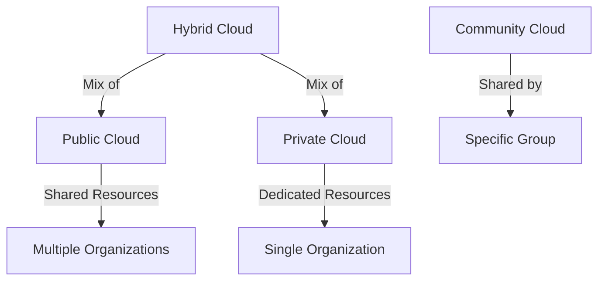

# Lesson 01: Introduction to Cloud Deployment Models

## Overview

Cloud deployment models define how cloud services are made available to users. The main models are Public Cloud, Private Cloud, Hybrid Cloud, and Community Cloud. Each model offers different levels of control, security, and flexibility.

## Learning Objectives

* Define cloud deployment models and their characteristics
* Compare public, private, hybrid, and community clouds
* Identify use cases for each deployment model

## Visual: Cloud Deployment Models

## Detailed Explanation

### Public Cloud

Services are delivered over the public internet and shared across organizations. Cost-effective and scalable, but less control over security.

### Private Cloud

Cloud infrastructure is dedicated to a single organization. Offers greater control and security, but higher cost and management overhead.

### Hybrid Cloud

Combines public and private clouds, allowing data and applications to be shared between them. Offers flexibility and optimized resource use.

### Community Cloud

Shared by several organizations with common concerns (e.g., security, compliance). Managed internally or by a third party.

## References

* [NIST Cloud Computing Deployment Models](https://nvlpubs.nist.gov/nistpubs/Legacy/SP/nistspecialpublication800-145.pdf)
* [IBM: Cloud Deployment Models](https://www.ibm.com/cloud/learn/cloud-deployment-models)
* [Microsoft: Cloud Deployment Models](https://learn.microsoft.com/en-us/azure/architecture/cloud-adoption/overview/cloud-deployment-models)
