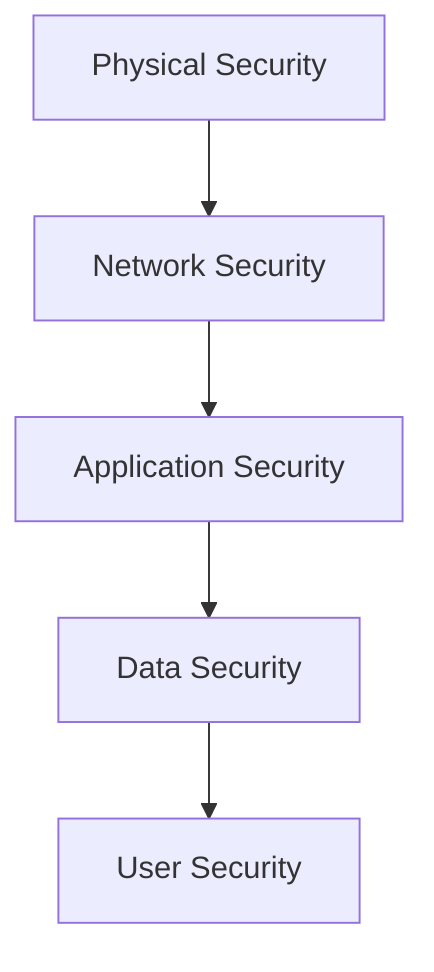

# Lesson 01: Fundamentals of Cloud Security

## Overview

Cloud security is the discipline of protecting cloud-based data, applications, and infrastructure from threats. As organizations move to the cloud, understanding security fundamentals is essential for safe and compliant operations.

## Learning Objectives

* Define cloud security and its importance
* Identify common cloud security risks and threats
* Understand best practices for securing cloud environments

## Visual: Cloud Security Layers

## Detailed Explanation

### What is Cloud Security?

Cloud security involves a set of policies, controls, and technologies that work together to protect cloud systems. It covers everything from physical data center security to user access controls.

### Common Risks and Threats

* Data breaches
* Insecure APIs
* Misconfiguration
* Insider threats
* Account hijacking

### Best Practices

* Use strong authentication and access controls
* Encrypt data at rest and in transit
* Regularly audit and monitor cloud resources
* Apply the principle of least privilege
* Stay updated with security patches

## References

* [NIST Cloud Computing Security](https://csrc.nist.gov/publications/detail/sp/800-144/final)
* [OWASP Cloud Security Top 10](https://owasp.org/www-project-cloud-security/)
* [Microsoft: Cloud Security Best Practices](https://learn.microsoft.com/en-us/security/benchmark/azure/)
