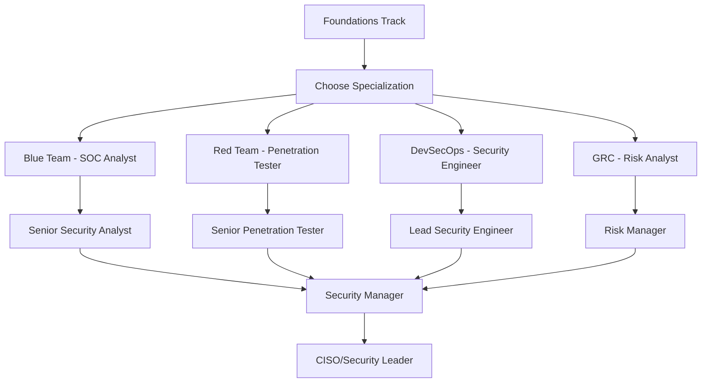

# 🔒 **Cybersecurity Domain Roadmap**

**Enterprise Security Training & Professional Cybersecurity Development**

---

## 🎯 **Domain Overview & Career Paths**

### **📊 Cybersecurity Career Landscape**
| **Role** | **Salary Range** | **Growth Rate** | **Key Skills** | **Our Preparation** |
|----------|------------------|-----------------|----------------|---------------------|
| **Security Analyst** | $65K - $110K | +31% (2022-2032) | Incident response, SIEM | ✅ Blue Team Track |
| **Penetration Tester** | $85K - $140K | +35% (2022-2032) | Ethical hacking, OSINT | ✅ Red Team Track |
| **Security Engineer** | $95K - $160K | +28% (2022-2032) | Secure development, DevOps | ✅ DevSecOps Track |
| **Security Architect** | $130K - $200K+ | +30% (2022-2032) | Risk management, frameworks | ✅ GRC Track |
| **CISO/Security Leader** | $180K - $350K+ | +25% (2022-2032) | Strategic leadership | 🎯 All Tracks |

---

## 🗺️ **Complete Learning Roadmap**

### **🎓 Track 1: Foundations (Entry Level)**
**Perfect for: Complete beginners, career changers, IT professionals entering security**

#### **📅 14-Week Professional Development Plan**
| **Week** | **Module** | **Lesson** | **Duration** | **Hands-on Lab** | **Industry Alignment** |
|----------|------------|------------|--------------|------------------|------------------------|
| **1** | **Setup & Tools** | Install Linux & Kali | 45m | ⚡ Virtual lab setup | Industry-standard tools |
| **2** | | VS Code & GitHub Workflow | 30m | 🔧 Development environment | Professional workflow |
| **3** | **🏆 Introduction** | **Cybersecurity Fundamentals** | **45m** | **🔬 Threat analysis** | **NIST Framework alignment** |
| **4** | **🏆 Digital Hygiene** | **Authentication Security** | **45m** | **🔐 MFA implementation** | **NIST SP 800-63B compliance** |
| **5** | | **🏆 Cyber Resilience** | **50m** | **💾 Backup strategy lab** | **CISA best practices** |
| **6** | **🏆 Safe Browsing** | **Phishing Defense Mastery** | **45m** | **🎣 Phishing simulation** | **FBI IC3 statistics** |
| **7** | | Privacy & Browser Safety | 35m | 🛡️ Browser hardening | Web security standards |
| **8** | **Network Security** | Secure Wi-Fi & Routers | 40m | 📡 Network configuration | Home/SOHO security |
| **9** | | Basic Network Monitoring | 45m | 📊 Traffic analysis | Network visibility |
| **10** | **Mobile Security** | Securing Your Phone | 35m | 📱 Mobile hardening | Mobile threat landscape |
| **11** | | App Hygiene & Permissions | 30m | 🔒 App security audit | Mobile privacy |
| **12** | **Social Engineering** | Tactics & Red Flags | 40m | 🎭 SE simulation | Human factor security |
| **13** | | Verification Procedures | 35m | ✅ Response protocols | Incident reporting |
| **14** | **🎯 Capstone** | Security Assessment Project | 120m | 🏆 Portfolio project | Real-world application |

#### **🏆 Learning Outcomes & Certifications**
- **CompTIA Security+ Preparation**: 85% coverage of exam objectives
- **Professional Portfolio**: 5+ hands-on security projects
- **Industry Recognition**: NIST Cybersecurity Framework proficiency
- **Career Readiness**: Entry-level security analyst positions

---

### **🔵 Track 2: Blue Team (Defensive Security)**
**Perfect for: SOC analysts, incident responders, defensive security specialists**

#### **📅 12-Week Advanced Defense Training**
| **Week** | **Module** | **Focus** | **Duration** | **Real-World Skills** | **Enterprise Tools** |
|----------|------------|-----------|--------------|----------------------|---------------------|
| **1-2** | **Incident Detection** | Windows Event Log Mastery | 120m | Advanced log analysis | Splunk, ELK Stack |
| **3** | | Network Threat Hunting | 90m | Network forensics | Wireshark, Zeek |
| **4-5** | **Endpoint Security** | Sysmon Essentials | 105m | Endpoint monitoring | Sysmon, OSQuery |
| **6** | | Practical Endpoint Triage | 135m | Malware analysis | YARA, Volatility |
| **7-8** | **SIEM Operations** | Query Fundamentals | 120m | SIEM mastery | Splunk, QRadar |
| **9** | | Detection Engineering | 150m | Custom rule development | Sigma rules |
| **10** | **Alert Management** | Tuning & Optimization | 90m | False positive reduction | Alert correlation |
| **11** | | Feedback Loops | 105m | Continuous improvement | Metrics & KPIs |
| **12** | **Incident Response** | Playbook Development | 180m | Response automation | SOAR platforms |

#### **🎯 Advanced Certifications Preparation**
- **GCIH (GIAC Certified Incident Handler)**: Direct exam preparation
- **GCFA (GIAC Certified Forensic Analyst)**: Forensics foundation
- **CySA+ (CompTIA Cybersecurity Analyst)**: Advanced analysis skills

---

### **🔴 Track 3: Red Team (Offensive Security)**
**Perfect for: Penetration testers, ethical hackers, security researchers**

#### **📅 16-Week Ethical Hacking Mastery**
| **Week** | **Module** | **Offensive Technique** | **Duration** | **MITRE ATT&CK** | **Professional Ethics** |
|----------|------------|-------------------------|--------------|-------------------|------------------------|
| **1-3** | **🏆 Introduction** | **Red Team Fundamentals** | **55m** | **Framework mastery** | **Ethical guidelines** |
| **4-5** | **Reconnaissance** | Passive Intelligence | 75m | T1595 - Active Scanning | Legal boundaries |
| **6-7** | | *[New]* Active Enumeration | 90m | T1046 - Network Service | Authorized testing |
| **8-9** | **🚀 Vulnerability Assessment** | *[Developing]* Scanning & Analysis | 120m | T1040 - Network Sniffing | Responsible disclosure |
| **10-12** | **🚀 Penetration Testing** | *[Planned]* Exploitation Techniques | 180m | Multiple tactics | Controlled environments |
| **13-14** | **🚀 Post-Exploitation** | *[Roadmap]* Lateral Movement | 150m | T1021 - Remote Services | Impact minimization |
| **15-16** | **🎯 Reporting** | Professional Documentation | 120m | Executive reporting | Business communication |

#### **🏆 Industry Certifications Alignment**
- **CEH (Certified Ethical Hacker)**: Comprehensive preparation
- **OSCP (Offensive Security Certified Professional)**: Practical skills
- **PNPT (Practical Network Penetration Tester)**: Real-world testing

---

### **🛡️ Track 4: DevSecOps (Security in Development)**
**Perfect for: Developers, DevOps engineers, security-conscious programmers**

#### **📅 10-Week Secure Development Pipeline**
| **Week** | **Module** | **Security Integration** | **Duration** | **Tools & Practices** |
|----------|------------|--------------------------|--------------|----------------------|
| **1-2** | **Secure Coding** | OWASP Top 10 Mastery | 90m | Static analysis tools |
| **3-4** | **CI/CD Security** | Pipeline Integration | 120m | Jenkins, GitLab CI |
| **5-6** | **🚀 Container Security** | *[Developing]* Docker & K8s | 135m | Twistlock, Aqua |
| **7-8** | **🚀 Infrastructure as Code** | *[Planned]* Terraform Security | 120m | Checkov, Terrascan |
| **9-10** | **🎯 Security Testing** | Automated testing | 150m | DAST, SAST, IAST |

---

### **⚖️ Track 5: GRC (Governance, Risk & Compliance)**
**Perfect for: Risk managers, compliance officers, security leaders**

#### **📅 12-Week Governance & Risk Mastery**
| **Week** | **Module** | **Governance Focus** | **Duration** | **Frameworks** |
|----------|------------|---------------------|--------------|----------------|
| **1-2** | **Frameworks** | NIST, ISO 27001 Overview | 90m | Standard alignment |
| **3-4** | **🚀 Risk Management** | *[Developing]* Assessment & Mitigation | 120m | FAIR, OCTAVE |
| **5-6** | **🚀 Compliance** | *[Planned]* Regulatory Requirements | 135m | SOX, GDPR, HIPAA |
| **7-8** | **🚀 Audit Preparation** | *[Roadmap]* Documentation & Evidence | 120m | Audit readiness |
| **9-12** | **🎯 Strategic Planning** | Security program development | 180m | Executive leadership |

---

## 📊 **Skills Assessment Matrix**

### **🎯 Competency Levels by Track**
| **Skill Domain** | **Foundations** | **Blue Team** | **Red Team** | **DevSecOps** | **GRC** |
|------------------|-----------------|---------------|--------------|---------------|---------|
| **Incident Response** | 🟢 Basic | 🔵 Expert | 🟡 Intermediate | 🟡 Intermediate | 🟢 Basic |
| **Threat Analysis** | 🟢 Basic | 🔵 Expert | 🔵 Expert | 🟡 Intermediate | 🟡 Intermediate |
| **Penetration Testing** | 🟢 Awareness | 🟡 Intermediate | 🔵 Expert | 🟡 Intermediate | 🟢 Basic |
| **Secure Development** | 🟢 Basic | 🟡 Intermediate | 🟡 Intermediate | 🔵 Expert | 🟡 Intermediate |
| **Risk Management** | 🟢 Basic | 🟡 Intermediate | 🟡 Intermediate | 🟡 Intermediate | 🔵 Expert |
| **Compliance** | 🟢 Basic | 🟡 Intermediate | 🟢 Basic | 🟡 Intermediate | 🔵 Expert |

**Legend**: 🟢 Basic | 🟡 Intermediate | 🔵 Expert

---

## 🎓 **Professional Development Pathways**

### **📈 Career Progression Routes**

### **🏆 Industry Recognition & Certifications**
| **Experience Level** | **Recommended Certifications** | **Our Preparation Coverage** |
|---------------------|--------------------------------|------------------------------|
| **Entry Level (0-2 years)** | CompTIA Security+, Network+ | ✅ 85% exam coverage |
| **Mid-Level (2-5 years)** | CySA+, CEH, GSEC | ✅ 75% exam coverage |
| **Senior Level (5-10 years)** | CISSP, CISM, OSCP | ✅ 65% foundation coverage |
| **Executive Level (10+ years)** | CISA, Strategic certs | ✅ 50% strategic preparation |

---

## 🚀 **Next Phase Enhancements**

### **📋 Immediate Development Priorities**
1. **🔴 Red Team Expansion**: Complete offensive security modules
2. **🛡️ DevSecOps Advanced**: Container and cloud security
3. **⚖️ GRC Professional**: Comprehensive compliance training
4. **🎯 Industry Partnerships**: Live lab environments
5. **📊 Assessment Platform**: Skills validation system

### **🌟 Advanced Learning Features**
- **Virtual Cyber Range**: Realistic attack/defense scenarios
- **Industry Mentorship**: Expert practitioner guidance
- **Live Threat Intelligence**: Current threat landscape
- **Corporate Case Studies**: Real-world incident analysis
- **Professional Networking**: Career development community

---

**🎯 Cybersecurity Excellence Through Structured Learning**

*From Beginner to Expert - Your Complete Cybersecurity Career Journey*

