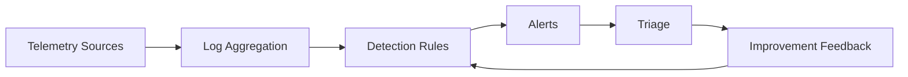

# Blue Team Intermediate — Incident Detection

Core detection engineering and triage fundamentals across host and network telemetry.

## Lessons

- Lesson 01 — Windows Event Log Triage Basics
- Lesson 02 — Intro to Network Threat Hunting

## Learning Objectives

- Identify suspicious authentication and process creation event patterns
- Construct simple network hunting hypotheses and iterate
- Differentiate alert triage vs proactive hunting workflows

## Visual Overview

## Summary

Provides a bridge into advanced detection engineering and SOC automation topics.

---

Proceed to the lessons to develop practical detection skills.
