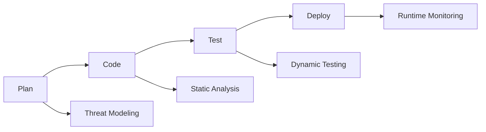

# Module 01: Secure Coding Introduction

Foundational secure coding mindset: recognizing common vulnerability classes and applying preventative practices early.

## Lessons

- Lesson 01 — Principles & Common Vulnerabilities

## Learning Objectives

- Explain why shifting security left reduces remediation cost
- Identify common OWASP Top 10 categories at a high level
- Apply input validation and output encoding basics
- Describe secure dependency management practices

## Visual Overview

## Summary

Establishes baseline concepts expanded in later DevSecOps modules.

---

Proceed to the lesson to apply secure coding principles.
