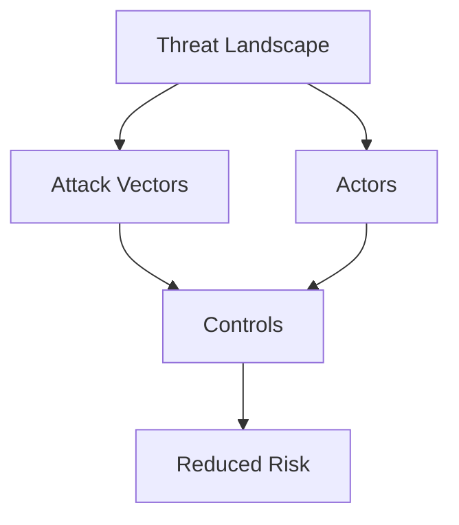

# Cybersecurity Foundations Beginner — Introduction

Core principles, threat landscape orientation, and foundational defense mindset for all subsequent cybersecurity tracks.

## Lessons

- Lesson 01 — Cybersecurity Fundamentals Overview

## Learning Objectives

- Characterize the modern threat landscape (actors, motives, vectors)
- Explain core security principles (CIA triad, least privilege, defense-in-depth)
- Map foundational frameworks (NIST CSF, ISO 27001, MITRE ATT&CK) to controls
- Differentiate preventive, detective, and responsive controls
- Outline baseline hardening practices for users and endpoints

## Visual Overview

## Summary

Launch point for deeper specialization: cloud security, secure coding, red/blue team paths.

---

Proceed to the lesson to begin building defensive intuition.
