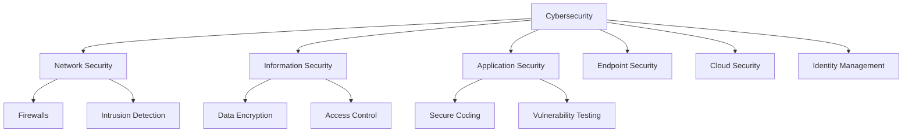
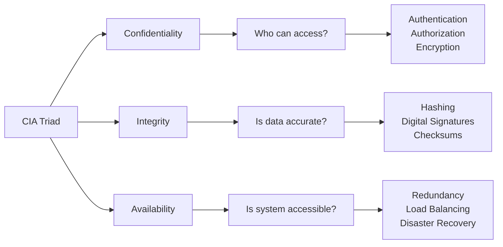
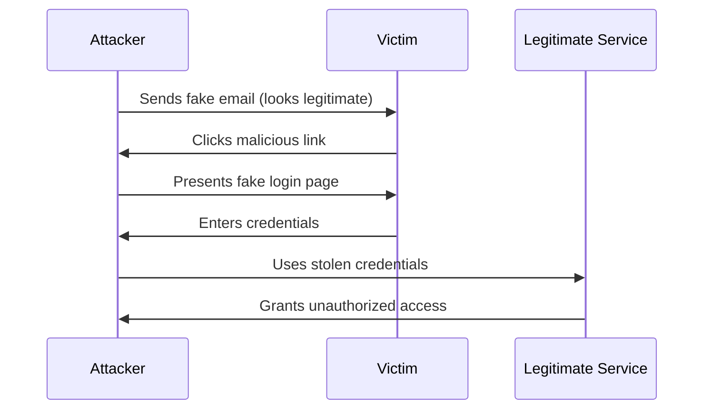
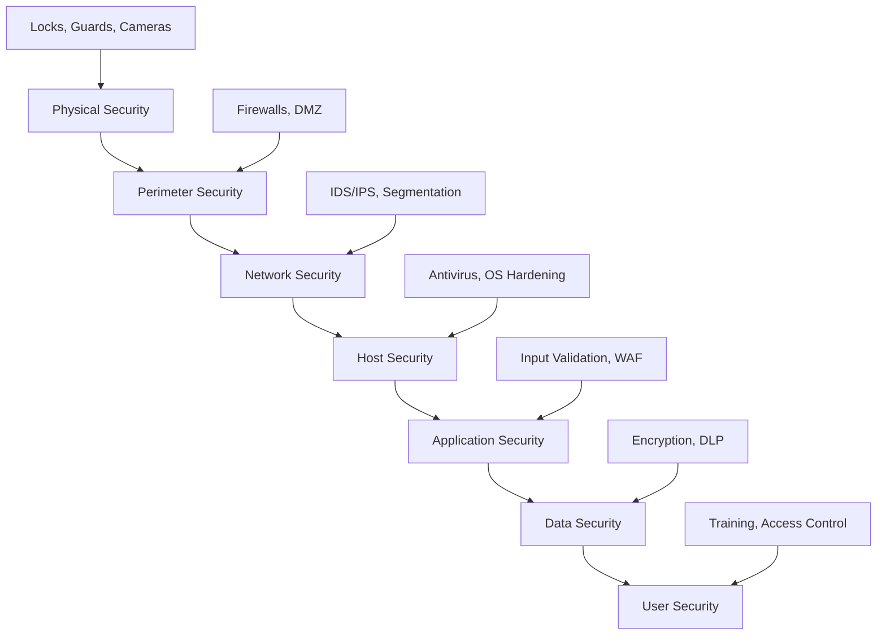
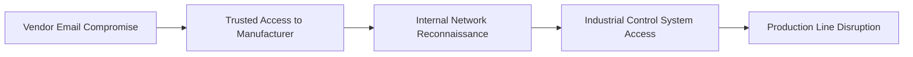
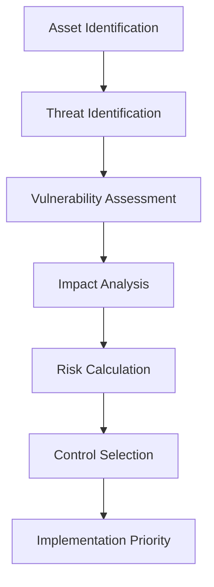

# Cybersecurity Fundamentals: Understanding the Digital Threat Landscape

> **UltraCube Learn-Library** | Cybersecurity • Foundations • Beginner  
> **Author**: UltraCube Cybersecurity Team  
> **Duration**: 45 minutes | **Difficulty**: ⭐☆☆☆☆

---

## 🎯 Learning Objectives

By the end of this lesson, you will be able to:

- **Define** cybersecurity and explain its importance in our digital world
- **Identify** the three pillars of information security (CIA Triad)
- **Recognize** common threat actors and understand their motivations
- **Analyze** current cybersecurity statistics and trends
- **Distinguish** between various types of cyber attacks
- **Apply** basic security principles to everyday digital activities

---

## 📚 What is Cybersecurity?

### Definition and Scope

**Cybersecurity** is the practice of protecting systems, networks, programs, and data from digital attacks, unauthorized access, and damage. It encompasses technologies, processes, and practices designed to safeguard our digital assets.

> **NIST Definition**: "Cybersecurity is the ability to protect or defend the use of cyberspace from cyber attacks."
> 
> *Source: NIST Cybersecurity Framework 2.0 (2024)*



### Why Cybersecurity Matters

#### 🌍 **Global Impact Statistics (2024)**

According to the **IBM Security X-Force Threat Intelligence Index 2024**:

- **💰 Average cost of a data breach**: $4.88 million globally
- **⏱️ Average time to identify a breach**: 204 days
- **📈 Increase in ransomware attacks**: 41% year-over-year
- **🎯 Most targeted industries**: Healthcare, Financial Services, Manufacturing

#### 📊 **Attack Frequency Visualization**

```
Cyber Attacks per Day (Global Average - 2024)
████████████████████████████████████████ 4,800 Ransomware attempts
██████████████████████████████████ 3,200 Phishing emails
████████████████████████ 2,400 Malware infections
████████████████ 1,600 DDoS attacks
██████████ 1,000 Data breach attempts

Source: Cisco Annual Internet Report 2024
```

---

## 🛡️ The CIA Triad: Foundation of Information Security

The **CIA Triad** forms the cornerstone of information security principles:

### 🔒 **Confidentiality**

**Definition**: Ensuring information is accessible only to authorized individuals.

**Real-world Examples**:
- Bank account details protected by login credentials
- Medical records restricted to healthcare providers
- Corporate secrets protected by NDAs and access controls

**Threats**: Data breaches, eavesdropping, social engineering
**Controls**: Encryption, access controls, authentication

### 🔍 **Integrity**

**Definition**: Maintaining accuracy and completeness of data throughout its lifecycle.

**Real-world Examples**:
- Financial transaction records that cannot be altered
- Software updates verified with digital signatures
- Medical prescriptions that remain unchanged from doctor to pharmacy

**Threats**: Malware, unauthorized modifications, system errors
**Controls**: Digital signatures, checksums, version control

### ⚡ **Availability**

**Definition**: Ensuring authorized users have access to information when needed.

**Real-world Examples**:
- Online banking systems operational 24/7
- Emergency services communication systems
- E-commerce websites during peak shopping periods

**Threats**: DDoS attacks, hardware failures, natural disasters
**Controls**: Redundancy, backups, disaster recovery plans

### 📈 **CIA Triad in Action**



---

## 👥 Understanding Threat Actors

### Classification by Motivation

#### 🎯 **Nation-State Actors**

**Characteristics**:
- Government-sponsored or affiliated
- Highly sophisticated and well-funded
- Long-term strategic objectives

**Motivations**: Espionage, political influence, economic advantage
**Examples**: APT groups (Advanced Persistent Threats)
**Notable Cases**: SolarWinds hack, WannaCry ransomware

> **Insight from SANS Institute**: "Nation-state actors are responsible for 23% of all advanced persistent threat campaigns, with an average dwell time of 320 days in victim networks."

#### 💰 **Cybercriminals**

**Characteristics**:
- Financial motivation
- Organized crime syndicates or individual actors
- Profit-driven activities

**Motivations**: Financial gain, cryptocurrency theft, ransomware
**Examples**: Ransomware groups, banking trojans, cryptocurrency miners
**Impact**: $10.5 trillion annual cost globally (Cybersecurity Ventures, 2024)

#### 🎭 **Hacktivists**

**Characteristics**:
- Ideologically motivated
- Social or political causes
- Public awareness campaigns

**Motivations**: Political protest, social justice, awareness raising
**Examples**: Anonymous, WikiLeaks-style operations
**Methods**: Website defacements, DDoS attacks, data leaks

#### 🏢 **Insider Threats**

**Characteristics**:
- Current or former employees
- Legitimate access to systems
- Internal knowledge advantage

**Types**:
- **Malicious Insiders**: Intentional harm for personal gain
- **Negligent Insiders**: Unintentional security violations
- **Compromised Insiders**: External control of legitimate users

> **Verizon DBIR 2024**: "Insider threats account for 34% of all data breaches, with 68% involving a non-malicious human element."

---

## ⚔️ Common Attack Vectors

### 📧 **Social Engineering**

**Definition**: Psychological manipulation to trick people into divulging confidential information.

#### **Phishing Attack Flow**



**Statistics** (IBM Security Report 2024):
- **91%** of cyber attacks start with a phishing email
- **Average click rate** on phishing emails: 12.3%
- **Most impersonated brands**: Microsoft, Google, Apple

### 🦠 **Malware**

**Types and Characteristics**:

| Malware Type | Function | Detection Difficulty | Impact Level |
|--------------|----------|---------------------|--------------|
| **Virus** | Self-replicating code | ⭐⭐☆☆☆ | Medium |
| **Ransomware** | Encrypt files for ransom | ⭐⭐⭐⭐☆ | High |
| **Spyware** | Covert data collection | ⭐⭐⭐⭐⭐ | High |
| **Rootkit** | Deep system compromise | ⭐⭐⭐⭐⭐ | Critical |
| **Trojan** | Disguised malicious software | ⭐⭐⭐☆☆ | Medium-High |

### 🌐 **Network Attacks**

#### **DDoS Attack Visualization**

```
Normal Traffic Flow:
User1 ──┐
User2 ──┼─── [Web Server] ─── Content Delivery
User3 ──┘

DDoS Attack:
Bot1  ──┐
Bot2  ──┤
Bot3  ──┼─── [Web Server] ─── ❌ Service Unavailable
Bot4  ──┤      (Overloaded)
Bot5  ──┘
```

**DDoS Statistics** (Cisco Annual Report 2024):
- **Average attack size**: 26 Gbps
- **Longest attack duration**: 509 hours
- **Most common targets**: Gaming (25%), E-commerce (18%)

---

## 🛡️ Defense Strategies and Frameworks

### 🏰 **Defense in Depth**

The **Defense in Depth** strategy implements multiple layers of security controls:



### 📋 **NIST Cybersecurity Framework 2.0**

The **National Institute of Standards and Technology (NIST)** framework provides five core functions:

#### **Framework Structure**

| Function | Purpose | Key Activities |
|----------|---------|----------------|
| **🎯 Identify** | Asset management | Asset inventory, risk assessment |
| **🛡️ Protect** | Implement safeguards | Access control, training, maintenance |
| **🔍 Detect** | Identify incidents | Monitoring, anomaly detection |
| **⚡ Respond** | Contain and mitigate | Response planning, communication |
| **🔄 Recover** | Restore services | Recovery planning, lessons learned |

### 🏛️ **Zero Trust Architecture**

**Core Principle**: "Never trust, always verify"

**Key Components**:
- **Identity Verification**: Multi-factor authentication
- **Device Security**: Endpoint protection and compliance
- **Network Segmentation**: Micro-segmentation and least privilege
- **Data Protection**: Encryption and classification

> **Gartner Prediction**: "By 2025, 60% of organizations will phase out VPNs in favor of zero trust network access solutions."

---

## 🌟 Real-World Case Studies

### 🏥 **Case Study 1: Healthcare Data Breach (2024)**

**Background**: Major hospital network experienced ransomware attack affecting 2.3 million patient records.

**Attack Vector**: 
1. Phishing email targeting IT administrator
2. Credential compromise via fake Microsoft login page
3. Lateral movement through unpatched systems
4. Ransomware deployment across network

**Impact**:
- **Downtime**: 3 weeks of limited operations
- **Cost**: $47 million in recovery and fines
- **Patients affected**: 2.3 million records compromised

**Lessons Learned**:
- Multi-factor authentication could have prevented initial compromise
- Network segmentation would have limited spread
- Regular backups enabled faster recovery

### 🏭 **Case Study 2: Manufacturing Supply Chain Attack (2024)**

**Background**: Automotive parts manufacturer compromised through third-party vendor.

**Attack Chain**:


**Mitigation Strategies Applied**:
- Enhanced vendor security requirements
- Network segmentation between IT and OT systems
- Continuous monitoring implementation

---

## 💻 Hands-On Exercise: Security Assessment

### **Exercise 1: Password Security Analysis**

**Objective**: Evaluate password strength using industry standards.

**Instructions**:
1. Visit the **Have I Been Pwned** website (haveibeenpwned.com)
2. Check if your email appears in known data breaches
3. Use a password strength checker to evaluate sample passwords

**Sample Passwords to Test**:
- `password123`
- `P@ssw0rd!2024`
- `MyD0g$N@me!sF1uf7y`
- `correct-horse-battery-staple`

**Analysis Framework**:
- **Length**: Minimum 12 characters
- **Complexity**: Mix of uppercase, lowercase, numbers, symbols
- **Uniqueness**: Not found in breach databases
- **Entropy**: Calculated randomness level

### **Exercise 2: Phishing Detection**

**Objective**: Identify red flags in suspicious emails.

**Email Sample Analysis**:
```
From: security@microsooft.com
Subject: URGENT: Account Verification Required
Body: Your account will be suspended in 24 hours.
Click here to verify: http://bit.ly/msft-verify
```

**Red Flags to Identify**:
- [ ] Misspelled domain name
- [ ] Urgency tactics
- [ ] Suspicious shortened URLs
- [ ] Generic greetings
- [ ] Grammar/spelling errors

---

## 🧩 Challenge Puzzle: Threat Modeling

### **Scenario**: Small E-commerce Website Security

**Your Task**: Design a basic security architecture for a small online store.

**Given Information**:
- 1,000 daily visitors
- Customer database with payment info
- Single web server
- Small development team
- Limited budget

**Requirements**:
1. **Identify** the most critical assets
2. **List** top 5 threats to the business
3. **Propose** cost-effective security controls
4. **Prioritize** implementations based on risk

**Threat Modeling Framework**:


**Deliverables**:
- Risk assessment matrix
- Security control recommendations
- Implementation timeline
- Budget considerations

---

## 📖 Additional Resources

### **Official Documentation**
- [NIST Cybersecurity Framework 2.0](https://www.nist.gov/cyberframework)
- [OWASP Security Knowledge Framework](https://owasp.org/www-project-security-knowledge-framework/)
- [SANS Reading Room](https://www.sans.org/reading-room/)

### **Industry Reports**
- [Verizon Data Breach Investigations Report](https://www.verizon.com/business/resources/reports/dbir/)
- [IBM X-Force Threat Intelligence Index](https://www.ibm.com/security/data-breach)
- [Cisco Annual Internet Report](https://www.cisco.com/c/en/us/solutions/executive-perspectives/annual-internet-report/)

### **Training Platforms**
- [Cybrary](https://www.cybrary.it/) - Free cybersecurity training
- [SANS Institute](https://www.sans.org/) - Professional security training
- [Coursera Cybersecurity](https://www.coursera.org/browse/information-technology/security) - University courses

### **Certification Pathways**
- **Entry Level**: CompTIA Security+, (ISC)² Systems Security Certified Practitioner (SSCP)
- **Intermediate**: Certified Ethical Hacker (CEH), CompTIA CySA+
- **Advanced**: Certified Information Systems Security Professional (CISSP), Offensive Security Certified Professional (OSCP)

---

## ✅ Progress Check

### **Knowledge Verification Questions**

1. **Explain the CIA Triad**: Describe each component and provide a real-world example for each.

2. **Threat Actor Analysis**: Match each threat actor type with their primary motivation:
   - Nation-State Actors → [Economic espionage / Political protest / Financial gain]
   - Cybercriminals → [Economic espionage / Political protest / Financial gain]
   - Hacktivists → [Economic espionage / Political protest / Financial gain]

3. **Risk Assessment**: Calculate the risk level using the formula: Risk = Threat × Vulnerability × Impact
   - Scenario: Unpatched web server (Vulnerability: High) facing automated exploit attempts (Threat: Medium) containing customer data (Impact: High)

4. **Control Selection**: For each security goal, choose the most appropriate control:
   - Confidentiality: [Encryption / Backup / Firewall]
   - Integrity: [Antivirus / Digital signature / Load balancer]
   - Availability: [Access control / Redundancy / Audit logging]

### **Practical Application**

Complete this security checklist for your personal devices:
- [ ] Strong, unique passwords for all accounts
- [ ] Multi-factor authentication enabled
- [ ] Operating system and software up to date
- [ ] Antivirus software installed and updated
- [ ] Regular data backups performed
- [ ] Secure Wi-Fi configuration
- [ ] Social media privacy settings reviewed

---

## 🚀 Next Steps

### **Immediate Actions**
1. **Complete** the progress check questions
2. **Implement** personal security improvements identified
3. **Review** additional resources for deeper understanding

### **Upcoming Lessons**
- **Lesson 02**: Network Security Fundamentals
- **Lesson 03**: Cryptography Basics
- **Lesson 04**: Identity and Access Management

### **Advanced Learning Path**
After completing the foundations track, consider:
- **Blue Team Operations** (Defensive Security)
- **Red Team Operations** (Offensive Security)
- **Governance, Risk, and Compliance (GRC)**

---

<div align="center">

## 🎓 **Congratulations!**

You've completed the fundamentals of cybersecurity! You now understand the basic principles, threat landscape, and defense strategies that form the foundation of information security.

**Continue your journey** with hands-on labs and practical exercises in the next module.

</div>

---

**Lesson created by UltraCube Cybersecurity Team** | [ucubetech.com](https://www.ucubetech.com) | **Copyright © 2025 UltraCube Technology**

> **Sources**: This lesson incorporates the latest industry research and standards from NIST, SANS, IBM Security, Cisco, Verizon, and OWASP to provide current and accurate information.
