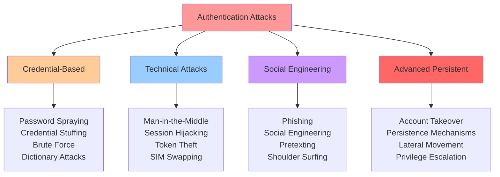
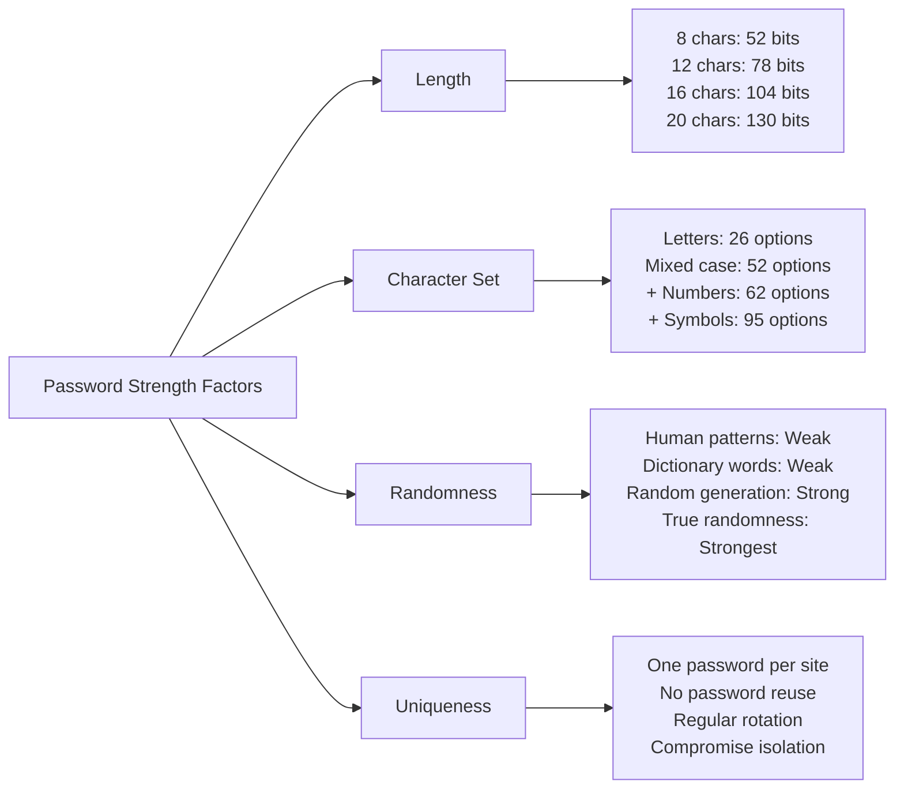
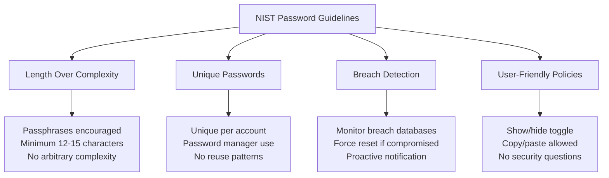
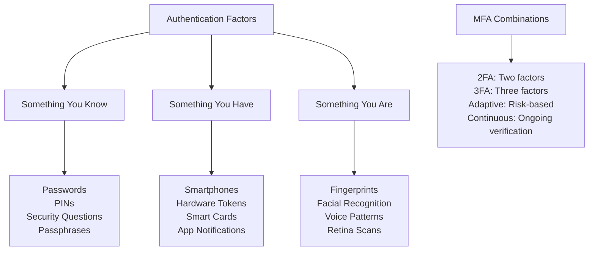
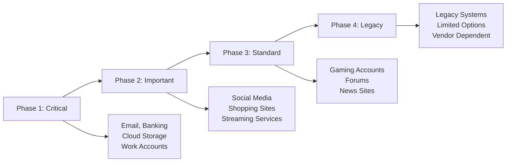
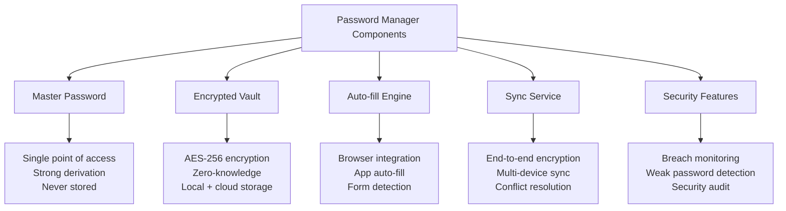
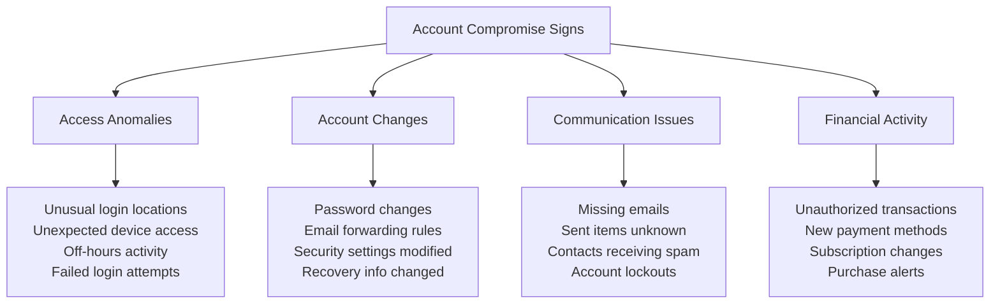
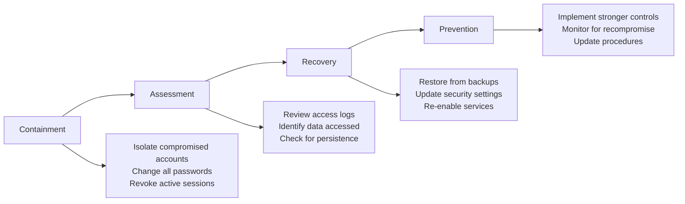
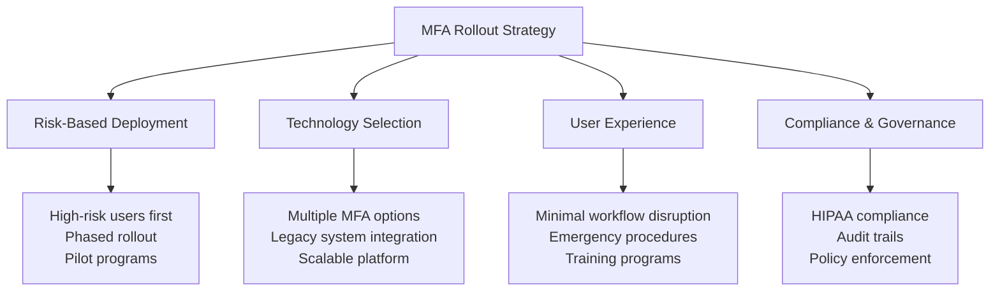
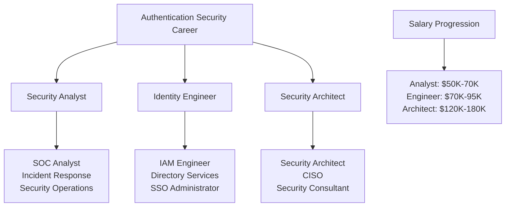

# Authentication Security: Passwords, MFA, and Identity Protection

> **UltraCube Learn-Library** | Cybersecurity • Foundations • Beginner  
> **Author**: UltraCube Cybersecurity Team  
> **Duration**: 45 minutes | **Difficulty**: ⭐⭐☆☆☆

---

## 🎯 Learning Objectives

By the end of this lesson, you will be able to:

- **Master** password security principles and create unbreakable authentication strategies
- **Implement** multi-factor authentication (MFA) across all critical accounts and services
- **Understand** the authentication threat landscape and common attack vectors
- **Apply** identity protection strategies for personal and professional environments
- **Evaluate** password managers, authenticator apps, and security keys effectively
- **Respond** to authentication incidents and account compromise scenarios

---

## 🔐 The Authentication Crisis

### Current Threat Landscape

> **Verizon DBIR (2024)**: "81% of hacking-related breaches involved weak, default, or stolen credentials, making authentication the #1 attack vector for cybercriminals."

#### **Password-Related Breach Statistics** (2024 Data)

```
Global Password Security Crisis:
Weak Passwords Used:        ████████████████████ 83% of users
Password Reuse:             █████████████████ 65% of users  
Default Passwords:          ████████████ 45% of devices
Stolen Credentials:         ███████████████████ 76% of breaches
MFA Not Enabled:           ██████████████████ 72% of accounts

Financial Impact per Breach:
Small Business: $2.98M average
Enterprise: $9.44M average
Healthcare: $11.05M average
```

### Authentication Attack Vectors



---

## 🔑 Password Security Fundamentals

### Password Strength Science

#### **Password Entropy and Complexity** (NIST Guidelines 2024)



#### **Password Cracking Time Analysis**

**Time to Crack Passwords by Method** (2024 Hardware):

| Password Type | Length | Brute Force | Dictionary | GPU Cluster |
|---------------|--------|-------------|------------|-------------|
| **Simple (password123)** | 11 chars | < 1 second | < 1 second | < 1 second |
| **Complex (P@ssw0rd!)** | 9 chars | 2 hours | 3 minutes | < 1 second |
| **Passphrase (correct-horse-battery)** | 20 chars | 6 million years | 2 days | 4 hours |
| **Random (Kx9#mP2$vQ8&)** | 12 chars | 62 years | N/A | 2 weeks |
| **Generated (aV$8nM3#zR9@pL5%)** | 16 chars | 34,000 years | N/A | 15 years |

### Modern Password Standards

#### **NIST SP 800-63B Guidelines** (Updated 2024)

**Requirements**:
- **Minimum 8 characters** for user-chosen passwords
- **Minimum 6 characters** for system-generated passwords
- **No composition rules** (complexity requirements counterproductive)
- **No periodic password changes** unless compromise suspected
- **Screen against common passwords** and breached credentials

**Recommendations**:



---

## 🛡️ Multi-Factor Authentication (MFA)

### MFA Fundamentals

#### **Authentication Factor Types**



#### **MFA Method Comparison** (Security vs. Usability)

| MFA Method | Security Level | User Experience | Phishing Resistance | Cost |
|------------|----------------|-----------------|-------------------|------|
| **FIDO2 Security Keys** | ⭐⭐⭐⭐⭐ | ⭐⭐⭐⭐☆ | ⭐⭐⭐⭐⭐ | $25-50 |
| **Authenticator Apps** | ⭐⭐⭐⭐☆ | ⭐⭐⭐⭐☆ | ⭐⭐⭐☆☆ | Free |
| **Push Notifications** | ⭐⭐⭐☆☆ | ⭐⭐⭐⭐⭐ | ⭐⭐☆☆☆ | Free |
| **SMS/Voice** | ⭐⭐☆☆☆ | ⭐⭐⭐⭐⭐ | ⭐☆☆☆☆ | Low cost |
| **Email Codes** | ⭐⭐☆☆☆ | ⭐⭐⭐☆☆ | ⭐☆☆☆☆ | Free |

### MFA Implementation Strategy

#### **Account Prioritization Framework**

**Critical Accounts** (Require strongest MFA):
1. **Email accounts** (password reset vector)
2. **Financial services** (banking, investment, credit)
3. **Cloud storage** (Google Drive, iCloud, OneDrive)
4. **Work accounts** (corporate email, VPN, systems)
5. **Social media** (reputation and social engineering)

**MFA Deployment Roadmap**:



---

## 📱 Password Managers and Tools

### Password Manager Evaluation

#### **Leading Password Manager Comparison** (2024 Analysis)

| Feature | 1Password | Bitwarden | Dashlane | LastPass | KeePass |
|---------|-----------|-----------|----------|----------|---------|
| **Security Model** | Zero-knowledge | Open source | Zero-knowledge | Zero-knowledge | Local storage |
| **Cross-platform** | ⭐⭐⭐⭐⭐ | ⭐⭐⭐⭐⭐ | ⭐⭐⭐⭐⭐ | ⭐⭐⭐⭐⭐ | ⭐⭐⭐☆☆ |
| **Browser Integration** | ⭐⭐⭐⭐⭐ | ⭐⭐⭐⭐☆ | ⭐⭐⭐⭐☆ | ⭐⭐⭐⭐☆ | ⭐⭐⭐☆☆ |
| **Family Sharing** | ⭐⭐⭐⭐⭐ | ⭐⭐⭐⭐☆ | ⭐⭐⭐⭐☆ | ⭐⭐⭐☆☆ | ⭐⭐☆☆☆ |
| **Business Features** | ⭐⭐⭐⭐⭐ | ⭐⭐⭐⭐☆ | ⭐⭐⭐⭐☆ | ⭐⭐⭐☆☆ | ⭐⭐☆☆☆ |
| **Free Tier** | No | Yes (full features) | Limited | Limited | Yes (open source) |
| **Pricing** | $3-8/month | Free-$3/month | $5-15/month | $3-6/month | Free |

#### **Password Manager Architecture**



### Authenticator Applications

#### **TOTP Authenticator Comparison**

**Popular Authenticator Apps** (Features and Security):

| App | Backup/Sync | Platforms | Security Features | Special Features |
|-----|-------------|-----------|-------------------|------------------|
| **Authy** | Cloud backup | All platforms | Device authorization | Multi-device sync |
| **Google Authenticator** | Cloud backup (2024) | iOS, Android | Basic TOTP | Simple interface |
| **Microsoft Authenticator** | Cloud backup | All platforms | Push notifications | Account recovery |
| **1Password** | Vault integration | All platforms | Full password manager | Unified solution |
| **Aegis** | Local backup | Android only | Open source | Privacy focused |

---

## 🚨 Authentication Incident Response

### Account Compromise Detection

#### **Compromise Indicators**



#### **Incident Response Playbook**

**Immediate Actions** (First 15 minutes):
1. **Change passwords** on compromised and related accounts
2. **Enable MFA** if not already active
3. **Review recent activity** and access logs
4. **Check financial accounts** for unauthorized activity
5. **Notify IT/Security team** (for business accounts)

**Recovery Steps** (First 24 hours):



---

## 💻 Hands-On Authentication Labs

### **Lab 1: Password Manager Setup and Migration**

**Objective**: Set up a password manager and migrate existing passwords

**Duration**: 20 minutes

**Steps**:
1. **Choose and install** a password manager
2. **Create master password** using passphrase method
3. **Import existing passwords** from browser
4. **Generate strong passwords** for top 5 accounts
5. **Set up secure sharing** for family/team passwords

**Deliverables**:
- Password manager configured with strong master password
- At least 10 accounts with unique, strong passwords
- Emergency access configured
- Security audit report showing improvements

### **Lab 2: Multi-Factor Authentication Deployment**

**Objective**: Enable MFA on critical accounts using multiple methods

**Account Priority List**:
1. Primary email account
2. Banking/financial account
3. Cloud storage account
4. Work/school account
5. Social media account

**MFA Methods to Test**:
- TOTP authenticator app
- SMS backup (where necessary)
- Recovery codes storage
- Hardware security key (if available)

**Security Assessment**:

```
Account Security Scorecard:
Before MFA: Score = Password Strength only
After MFA:  Score = Password + MFA + Recovery

Rating Scale:
⭐⭐⭐⭐⭐ Hardware key + strong password
⭐⭐⭐⭐☆ Authenticator app + strong password  
⭐⭐⭐☆☆ SMS MFA + strong password
⭐⭐☆☆☆ Strong password only
⭐☆☆☆☆ Weak password only
```

### **Lab 3: Authentication Security Audit**

**Objective**: Perform comprehensive authentication security assessment

**Personal Security Audit Checklist**:

**Password Assessment**:
- [ ] All passwords unique across accounts
- [ ] No passwords under 12 characters
- [ ] No dictionary words or personal information
- [ ] Password manager protecting all credentials
- [ ] Regular password strength monitoring

**MFA Assessment**:
- [ ] MFA enabled on all critical accounts
- [ ] Multiple MFA methods configured
- [ ] Recovery codes securely stored
- [ ] MFA fatigue attacks mitigated
- [ ] Phishing-resistant methods prioritized

**Account Security**:
- [ ] Security questions replaced or strengthened
- [ ] Account recovery methods secured
- [ ] Login notifications enabled
- [ ] Inactive accounts identified and closed
- [ ] Breach monitoring alerts configured

---

## 🎯 Challenge Scenarios

### **Challenge 1: Password Policy Design**

**Scenario**: You're the security administrator for a 500-person company that needs to update its password policy.

**Current Problems**:
- 45% of users reuse passwords across business and personal accounts
- Average password length is 8.2 characters
- 67% of passwords contain personal information
- Password changes forced every 90 days causing weak patterns
- Help desk receives 50+ password reset requests weekly

**Your Mission**:
Design a modern password policy that balances security and usability.

**Requirements**:
- Address NIST SP 800-63B guidelines
- Reduce help desk tickets by 60%
- Improve overall security posture
- Ensure user compliance and adoption
- Include implementation timeline

**Deliverables**:
- Updated password policy document
- Implementation plan with phases
- User training strategy
- Success metrics and measurement plan

### **Challenge 2: MFA Rollout Strategy**

**Scenario**: Healthcare organization with 2,000 employees needs MFA implementation.

**Constraints**:
- Diverse user base (doctors, nurses, administrative staff)
- 24/7 operations requiring constant access
- HIPAA compliance requirements
- Budget of $50,000 for implementation
- 6-month rollout timeline

**Challenges**:
- Emergency access requirements
- Shared workstation environments
- Mobile device policies vary by role
- Legacy systems with limited MFA support
- User resistance to change

**Solution Framework**:



---

## 📚 Professional Development Resources

### **Industry Certifications**

**Authentication and Identity Security Certifications**:

| Certification | Provider | Focus Area | Duration | Career Impact |
|---------------|----------|------------|----------|---------------|
| **CISSP** | (ISC)² | Broad security including IAM | 6-12 months | +$15,000 salary |
| **CISM** | ISACA | Information security management | 4-8 months | +$12,000 salary |
| **GCIH** | SANS | Incident handling and response | 3-6 months | +$8,000 salary |
| **Security+** | CompTIA | Foundation security concepts | 2-4 months | +$5,000 salary |

### **Advanced Learning Resources**

**Books and Publications**:
- "Secrets and Lies" by Bruce Schneier
- "The Password Book" by Passwords.Exposed
- "Authentication: From Passwords to Public Keys" by Richard Smith
- "Identity and Access Management: Business Performance Through Connected Intelligence" by Ertem Osmanoglu

**Research and Standards**:
- NIST Special Publication 800-63 (Digital Identity Guidelines)
- FIDO Alliance Authentication Standards
- OAuth 2.0 and OpenID Connect specifications
- SAML 2.0 Security Assertions Markup Language

### **Tools and Platforms for Learning**

**Practice Environments**:
- **OWASP WebGoat**: Web application security testing
- **Damn Vulnerable Web Application (DVWA)**: Authentication bypass practice
- **Hack The Box**: Real-world authentication challenges
- **TryHackMe**: Guided learning paths for authentication security

---

## ✅ Skills Assessment and Knowledge Check

### **Practical Skills Evaluation**

**Rate your competency (1-5 scale)**:

**Password Security**:
- [ ] Creating strong, unique passwords ___/5
- [ ] Password manager deployment and management ___/5
- [ ] Understanding password attack vectors ___/5
- [ ] Implementing password policies ___/5

**Multi-Factor Authentication**:
- [ ] MFA technology selection and deployment ___/5
- [ ] TOTP and hardware key configuration ___/5
- [ ] Risk assessment and method selection ___/5
- [ ] MFA incident response ___/5

**Identity Protection**:
- [ ] Account security auditing ___/5
- [ ] Breach detection and response ___/5
- [ ] Security policy development ___/5
- [ ] User training and awareness ___/5

### **Knowledge Verification Quiz**

1. **According to NIST SP 800-63B, which is more important for password security?**
   - a) Complexity requirements (special characters, numbers)
   - b) Password length and uniqueness
   - c) Regular password rotation
   - d) Security questions as backup

2. **Which MFA method provides the strongest phishing resistance?**
   - a) SMS text messages
   - b) Email verification codes
   - c) TOTP authenticator apps
   - d) FIDO2 security keys

3. **What is the primary vulnerability of SMS-based MFA?**
   - a) User inconvenience
   - b) SIM swapping attacks
   - c) Battery drain
   - d) Network costs

### **Scenario-Based Assessment**

**Scenario**: You receive an email stating your bank account will be closed unless you verify your identity by clicking a link and entering your password and SMS code.

**Questions**:
1. What attack vector is this representing?
2. What are the red flags in this scenario?
3. What should be your immediate response?
4. How would proper MFA implementation help prevent this?
5. What additional verification steps should you take?

---

## 🚀 Next Steps in Authentication Security

### **Advanced Topics to Explore**

1. **Zero Trust Architecture** and continuous authentication
2. **Biometric authentication** technologies and privacy concerns
3. **Privileged Access Management** (PAM) for administrative accounts
4. **Single Sign-On (SSO)** and federation technologies
5. **Behavioral authentication** and risk-based access

### **Career Pathway in Identity and Access Management**



### **Upcoming Lessons in Cybersecurity Track**

- **Lesson 03**: Network Security and Firewall Management
- **Lesson 04**: Incident Response and Digital Forensics
- **Lesson 05**: Security Awareness and Social Engineering Defense

---

<div align="center">

## 🔐 **Congratulations on Mastering Authentication Security!**

You've gained comprehensive knowledge of password security, multi-factor authentication, and identity protection strategies. With these skills, you can significantly improve the security posture of personal and professional digital environments.

**Ready for advanced security topics?** Continue with network security and incident response to build comprehensive cybersecurity expertise.

</div>

---

**Lesson created by UltraCube Cybersecurity Team** | [ucubetech.com](https://www.ucubetech.com) | **Copyright © 2025 UltraCube Technology**

> **Sources**: This comprehensive lesson integrates authoritative insights from NIST Authentication Guidelines, CISA Secure Our World Campaign, Verizon DBIR, Google Security Research, Microsoft Security Intelligence, leading password manager companies, and FIDO Alliance standards to provide current and comprehensive authentication security knowledge.
