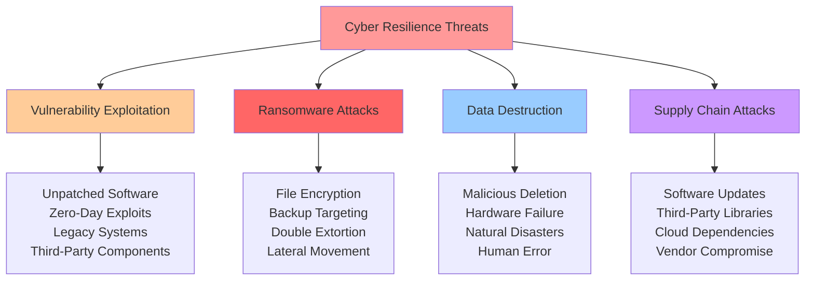
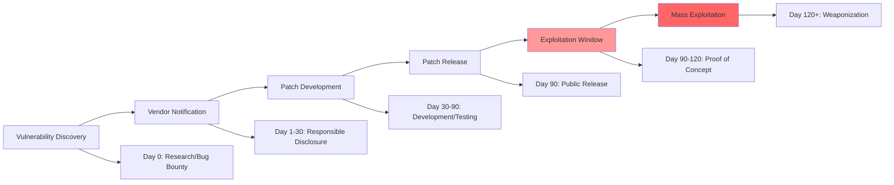
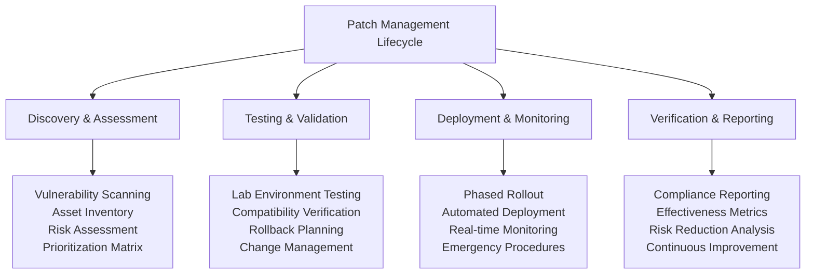
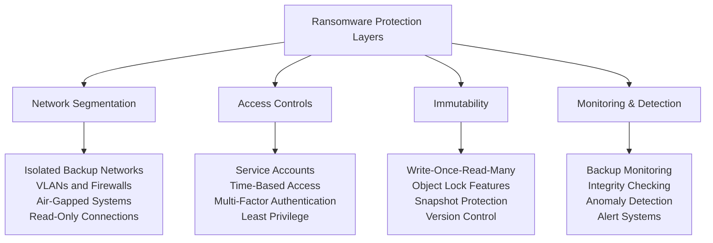
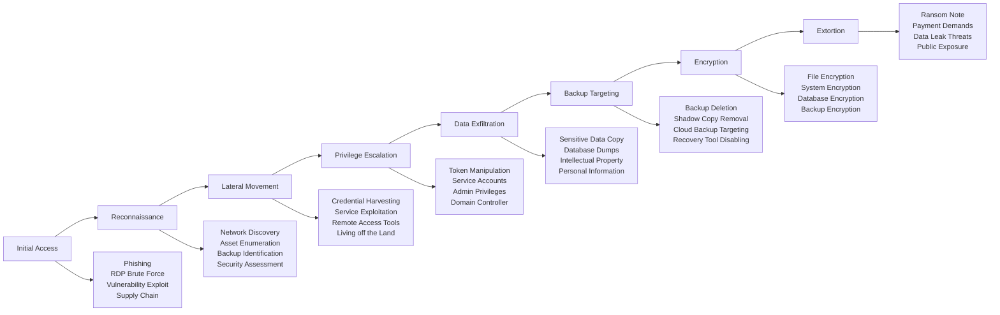
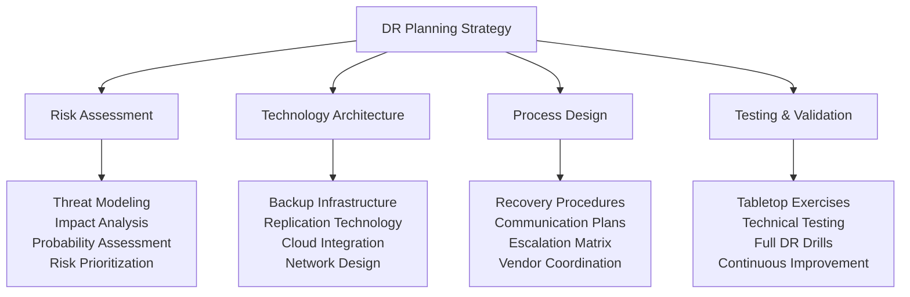
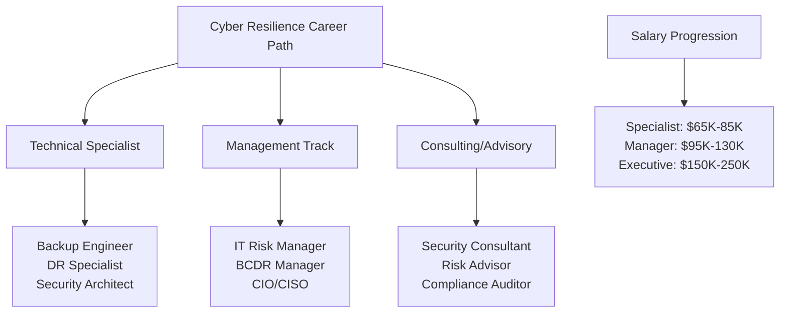

# Cyber Resilience: Software Updates, Patch Management, and Backup Security

> **UltraCube Learn-Library** | Cybersecurity • Foundations • Beginner  
> **Author**: UltraCube Cybersecurity Team  
> **Duration**: 50 minutes | **Difficulty**: ⭐⭐☆☆☆

---

## 🎯 Learning Objectives

By the end of this lesson, you will be able to:

- **Master** automated patch management systems and vulnerability remediation workflows
- **Implement** comprehensive backup architectures using 3-2-1 methodology and modern cloud strategies
- **Understand** ransomware attack vectors and develop bulletproof recovery procedures
- **Deploy** security-focused update policies for personal devices and enterprise environments
- **Execute** disaster recovery scenarios and business continuity planning exercises
- **Evaluate** backup solutions, recovery tools, and resilience technologies

---

## 🚨 The Patch and Backup Crisis

### Current Threat Landscape

> **CrowdStrike Global Threat Report (2024)**: "75% of successful cyberattacks exploit known vulnerabilities for which patches were available but not applied within 30 days of release."

#### **Vulnerability and Backup Statistics** (2024 Data)

```
Global Patch Management Crisis:
Unpatched Critical Vulnerabilities:  ████████████████████ 82% organizations
Average Patch Time:                  ████████████ 45 days (critical vulns)
Zero-Day Exploitation:               ███████ 23% of attacks
Legacy System Vulnerabilities:       ███████████████████ 71% exposed

Backup and Recovery Reality:
No Backup Strategy:                  ██████████████ 54% small businesses
Untested Backups:                    ████████████████ 60% organizations
Ransomware Impact on Backups:       ███████████ 38% corruption rate
Recovery Failure Rate:               ████████ 30% first attempt

Financial Impact:
Successful Ransomware (with backups): $2.73M average
Successful Ransomware (without backups): $9.44M average
Data Loss Event: $4.88M average
System Downtime per Hour: $84,650 average
```

### Attack Vector Analysis



---

## 🔄 Patch Management and Software Updates

### Vulnerability Lifecycle

#### **From Discovery to Exploitation** (2024 Timeline Analysis)



#### **Critical Vulnerability Response Timeline** (Industry Standards)

| Severity Level | Discovery to Patch | Patch to Deployment | Maximum Exposure |
|----------------|-------------------|---------------------|------------------|
| **Critical (CVSS 9.0-10.0)** | 1-7 days | 24-72 hours | 72 hours |
| **High (CVSS 7.0-8.9)** | 7-30 days | 1-7 days | 7 days |
| **Medium (CVSS 4.0-6.9)** | 30-90 days | 7-30 days | 30 days |
| **Low (CVSS 0.1-3.9)** | 90+ days | 30-90 days | 90 days |

### Automated Patch Management Strategy

#### **Enterprise Patch Management Framework**



#### **Personal Device Update Strategy**

**Operating System Updates**:

| Platform | Auto-Update Settings | Recommended Configuration |
|----------|---------------------|---------------------------|
| **Windows 11** | Windows Update > Advanced Options | ✅ Auto-install updates<br/>✅ Restart notifications<br/>✅ Active hours configuration |
| **macOS** | System Preferences > Software Update | ✅ Install system updates<br/>✅ Install security updates<br/>✅ Install app updates from App Store |
| **iOS/iPadOS** | Settings > General > Software Update | ✅ Automatic Updates<br/>✅ Download iOS Updates<br/>✅ Install iOS Updates |
| **Android** | Settings > Software Update | ✅ Auto-download over Wi-Fi<br/>✅ Auto-install security updates<br/>✅ Google Play Protect |

**Application Update Priorities**:

1. **Critical Security Applications** (Daily monitoring)
   - Web browsers (Chrome, Firefox, Safari, Edge)
   - Antivirus/security software
   - VPN clients
   - Password managers

2. **High-Risk Applications** (Weekly monitoring)
   - PDF readers (Adobe Reader, etc.)
   - Media players (VLC, etc.)
   - Office suites (Microsoft Office, LibreOffice)
   - Email clients

3. **Standard Applications** (Monthly monitoring)
   - Productivity apps
   - Entertainment software
   - Development tools
   - Games and utilities

---

## 💾 Comprehensive Backup Architecture

### Modern 3-2-1-1-0 Backup Strategy

#### **Enhanced Backup Methodology** (2024 Best Practices)

```mermaid
graph TD
    A[3-2-1-1-0 Backup Strategy] --> B[3 Copies of Data]
    A --> C[2 Different Media Types]
    A --> D[1 Offsite Copy]
    A --> E[1 Offline/Immutable Copy]
    A --> F[0 Errors in Recovery Tests]
    
    B --> B1[Primary Production Data<br/>Local Backup Copy<br/>Cloud/Remote Backup]
    C --> C1[Local Storage (SSD/HDD)<br/>Cloud Storage (AWS/Azure/GCP)<br/>Tape/Optical Media]
    D --> D1[Cloud Storage<br/>Remote Data Center<br/>Geographic Separation]
    E --> E1[Air-Gapped Storage<br/>Immutable Backups<br/>Write-Once Media]
    F --> F1[Monthly Recovery Tests<br/>Automated Verification<br/>Documented Procedures]
```

#### **Backup Technology Comparison** (2024 Analysis)

| Backup Type | Recovery Speed | Security Level | Cost | Best Use Case |
|-------------|----------------|----------------|------|---------------|
| **Local SSD/NVMe** | ⭐⭐⭐⭐⭐ | ⭐⭐⭐☆☆ | $$$ | Frequent restore needs |
| **External HDD** | ⭐⭐⭐⭐☆ | ⭐⭐⭐⭐☆ | $$ | Personal backup primary |
| **Network Attached Storage** | ⭐⭐⭐⭐☆ | ⭐⭐⭐⭐☆ | $$$ | Small business/home |
| **Cloud Storage** | ⭐⭐⭐☆☆ | ⭐⭐⭐⭐⭐ | $$ | Offsite protection |
| **Immutable Cloud** | ⭐⭐⭐☆☆ | ⭐⭐⭐⭐⭐ | $$$ | Ransomware protection |
| **Tape/Optical** | ⭐⭐☆☆☆ | ⭐⭐⭐⭐⭐ | $ | Long-term archival |

### Ransomware-Resistant Backup Design

#### **Backup Isolation Strategies**



#### **Recovery Point and Recovery Time Objectives**

**Business Impact Analysis**:

| Data Classification | RTO Target | RPO Target | Backup Frequency | Testing Frequency |
|---------------------|------------|------------|------------------|-------------------|
| **Critical Systems** | < 1 hour | < 15 minutes | Continuous/Hourly | Weekly |
| **Important Systems** | < 4 hours | < 1 hour | Every 4 hours | Monthly |
| **Standard Systems** | < 24 hours | < 8 hours | Daily | Quarterly |
| **Archive Data** | < 72 hours | < 24 hours | Weekly | Annually |

---

## 🛡️ Ransomware Protection and Recovery

### Ransomware Attack Chain Analysis

#### **Modern Ransomware Tactics** (2024 Threat Intelligence)



### Backup Security Best Practices

#### **Anti-Ransomware Backup Configuration**

**Network Isolation**:
```bash
# Example backup network isolation (conceptual)
Backup Network: 192.168.100.0/24
Production Network: 192.168.1.0/24
Firewall Rule: DENY ALL from Production to Backup
Exception: Backup Service Account (read-only, scheduled)
```

**Access Control Matrix**:

| Role | Production Access | Backup Read | Backup Write | Recovery Access |
|------|------------------|-------------|--------------|-----------------|
| **Regular User** | ✅ Read/Write | ❌ None | ❌ None | ❌ None |
| **IT Admin** | ✅ Read/Write | ✅ Read | ❌ None | ✅ Supervised |
| **Backup Service** | ✅ Read Only | ✅ Read/Write | ✅ Scheduled | ❌ None |
| **Recovery Team** | ✅ Emergency | ✅ Read/Write | ✅ Emergency | ✅ Full Access |

---

## 💻 Hands-On Resilience Labs

### **Lab 1: Automated Patch Management Setup**

**Objective**: Configure comprehensive automated updating across all devices

**Duration**: 25 minutes

**Personal Device Configuration**:
1. **Primary Computer** (Windows/Mac/Linux)
   - Enable automatic OS updates
   - Configure active hours and restart policies
   - Set up automatic driver updates
   - Enable automatic security updates

2. **Mobile Devices** (iOS/Android)
   - Enable automatic OS updates
   - Configure app auto-updates
   - Set up security patch notifications
   - Review update history and pending updates

3. **Applications and Software**
   - Configure browser auto-updates (Chrome, Firefox, Edge)
   - Set up antivirus auto-updates
   - Enable automatic updates for critical apps
   - Create update monitoring dashboard

**Verification Steps**:
- Document current versions of all critical software
- Set up update notifications and monitoring
- Create manual update checklist for non-auto software
- Test emergency patching procedure

### **Lab 2: 3-2-1-1-0 Backup Implementation**

**Objective**: Implement comprehensive backup strategy with ransomware protection

**Phase 1: Local Backup Setup** (15 minutes)
1. **Primary Local Backup**
   - External drive setup and encryption
   - Automated daily backup configuration
   - File versioning and retention policy
   - Backup verification and integrity checking

2. **Secondary Local Backup**
   - Network-attached storage (NAS) configuration
   - Incremental backup scheduling
   - RAID configuration for redundancy
   - Access control and security settings

**Phase 2: Cloud Backup Configuration** (15 minutes)
1. **Cloud Storage Setup**
   - Choose cloud provider (AWS, Azure, Google, Dropbox)
   - Configure encryption in transit and at rest
   - Set up automated synchronization
   - Implement versioning and retention policies

2. **Immutable Backup Configuration**
   - Enable object lock features
   - Configure write-once-read-many settings
   - Set up air-gapped backup procedures
   - Implement time-based access controls

**Phase 3: Recovery Testing** (10 minutes)
1. **File Recovery Test**
   - Deliberately delete test files
   - Perform restoration from each backup source
   - Measure recovery time and success rate
   - Document any issues or improvements

2. **System Recovery Test**
   - Create system image backup
   - Test bare-metal recovery procedure
   - Verify application and data integrity
   - Update recovery documentation

### **Lab 3: Ransomware Simulation and Response**

**Objective**: Test backup resilience against simulated ransomware attack

**Simulation Environment** (Safe Test Setup):
- Isolated virtual machine or sandbox
- Test data that mimics real file structure
- Simulated ransomware behavior (file encryption)
- Backup systems configured as in Lab 2

**Attack Simulation Steps**:
1. **Pre-Attack State**
   - Document baseline system state
   - Verify all backups are current and accessible
   - Note critical file locations and permissions
   - Test backup access and authentication

2. **Simulated Attack**
   - Run ransomware simulation tool (safe environment)
   - Monitor backup system response
   - Test backup isolation mechanisms
   - Document attack timeline and impact

3. **Recovery Process**
   - Implement incident response procedures
   - Perform system restoration from backups
   - Verify data integrity and completeness
   - Measure recovery time objectives (RTO)

**Recovery Metrics to Capture**:

```
Recovery Performance Dashboard:
Time to Detection:        ___ minutes
Time to Isolation:        ___ minutes  
Time to Recovery Start:   ___ minutes
Time to Full Recovery:    ___ hours
Data Loss Amount:         ___ files/GB
Recovery Success Rate:    ___% 
Backup Integrity:         ___% verified
```

---

## 🎯 Advanced Challenge Scenarios

### **Challenge 1: Enterprise Patch Management Design**

**Scenario**: You're the IT security manager for a 1,500-employee financial services company with strict regulatory requirements.

**Environment Complexity**:
- 1,200 Windows workstations
- 150 macOS devices
- 200 Linux servers
- 50 network devices
- Legacy applications with vendor support constraints
- 24/7 trading operations requiring high availability

**Regulatory Requirements**:
- SOX compliance for financial reporting systems
- PCI DSS for payment processing
- GLBA for customer data protection
- State banking regulations

**Current Challenges**:
- Critical systems cannot be patched during market hours (6 AM - 8 PM EST)
- Legacy trading application requires Windows Server 2016 (vendor limitation)
- Mobile devices used by executives for after-hours trading decisions
- Third-party vendors with different patching schedules

**Your Mission**:
Design a comprehensive patch management strategy that balances security, compliance, and business continuity.

**Deliverables Required**:
1. Patch management policy document
2. Risk-based prioritization matrix
3. Testing and rollback procedures
4. Compliance reporting framework
5. Emergency patching procedures
6. Vendor management strategy

### **Challenge 2: Disaster Recovery Planning**

**Scenario**: Healthcare organization with multiple locations needs comprehensive backup and disaster recovery strategy.

**Organization Profile**:
- 3 hospital locations
- 15 clinic sites
- 500 GB of patient data generated daily
- Electronic Health Records (EHR) system
- Medical imaging storage (5 TB monthly)
- HIPAA compliance requirements

**Critical Constraints**:
- Patient data cannot leave specified geographic regions
- 99.9% uptime requirement for critical systems
- Maximum 4-hour downtime for non-critical systems
- All data must be recoverable within 24 hours
- Regulatory audit trail requirements

**Disaster Scenarios to Plan For**:
- Ransomware attack affecting primary data center
- Natural disaster destroying main hospital
- Insider threat with administrative access
- Cloud service provider outage
- Supply chain attack through software vendor

**Solution Framework**:



---

## 📚 Professional Development and Career Pathways

### **Industry Certifications in Resilience and Recovery**

**Backup and Recovery Specializations**:

| Certification | Provider | Focus Area | Career Impact | Salary Increase |
|---------------|----------|------------|---------------|-----------------|
| **Certified Backup & Recovery Professional** | Storage Networking Industry Association | Data protection | +$8,000 | Junior to Senior |
| **Veeam Certified Engineer** | Veeam | Backup virtualization | +$12,000 | Specialist role |
| **AWS Certified Solutions Architect** | Amazon | Cloud backup/DR | +$15,000 | Cloud architect |
| **Certified Business Continuity Professional** | DRI International | Business continuity | +$18,000 | Management role |

### **Advanced Learning Resources**

**Research and Standards**:
- NIST Cybersecurity Framework (CSF) 2.0
- ISO 22301 Business Continuity Management
- COBIT 2019 for IT Governance
- ITIL 4 for Service Management

**Industry Reports and Analysis**:
- Gartner Magic Quadrant for Enterprise Backup and Recovery
- Forrester Wave: Data Resiliency Solutions
- IDC MarketScape: Worldwide Enterprise Backup Software
- Ponemon Institute Cost of Data Breach Report

### **Hands-On Learning Platforms**

**Virtual Labs and Simulations**:
- **VMware Hands-on Labs**: Virtual infrastructure and backup
- **Microsoft Learn**: Azure backup and disaster recovery
- **AWS Training**: Cloud backup and recovery services
- **Veeam University**: Backup and replication training

---

## ✅ Skills Assessment and Mastery Verification

### **Technical Competency Evaluation**

**Rate your skill level (1-5 scale)**:

**Patch Management**:
- [ ] Vulnerability assessment and prioritization ___/5
- [ ] Automated patch deployment ___/5
- [ ] Testing and rollback procedures ___/5
- [ ] Compliance reporting and metrics ___/5

**Backup and Recovery**:
- [ ] 3-2-1-1-0 backup strategy implementation ___/5
- [ ] Ransomware-resistant backup design ___/5
- [ ] Recovery testing and validation ___/5
- [ ] Business continuity planning ___/5

**Incident Response**:
- [ ] Disaster recovery procedure execution ___/5
- [ ] Crisis communication and coordination ___/5
- [ ] Post-incident analysis and improvement ___/5
- [ ] Regulatory compliance and reporting ___/5

### **Knowledge Verification Quiz**

1. **What is the primary goal of the 3-2-1-1-0 backup strategy?**
   - a) Reduce backup storage costs
   - b) Ensure data availability and recoverability
   - c) Simplify backup management
   - d) Increase backup speed

2. **Which backup method provides the best protection against ransomware?**
   - a) Continuous cloud synchronization
   - b) Daily local backups
   - c) Air-gapped immutable backups
   - d) RAID storage arrays

3. **According to NIST guidelines, critical vulnerabilities should be patched within:**
   - a) 30 days of discovery
   - b) 72 hours of patch availability
   - c) 7 days of public disclosure
   - d) Next scheduled maintenance window

### **Practical Scenario Assessment**

**Scenario**: Your organization discovers that its primary backup system has been compromised during a ransomware attack, but the attackers haven't found the air-gapped backup system yet.

**Assessment Questions**:
1. What are your immediate priority actions in the first 30 minutes?
2. How do you verify the integrity of your air-gapped backups?
3. What communication strategy do you implement with stakeholders?
4. How do you prevent the attack from reaching the air-gapped system?
5. What lessons learned should be incorporated into future backup strategies?

---

## 🚀 Advanced Topics and Future Learning

### **Emerging Technologies in Resilience**

1. **Immutable Infrastructure** and infrastructure as code
2. **Zero Trust Backup Architecture** and continuous verification
3. **AI-Powered Threat Detection** in backup systems
4. **Quantum-Resistant Encryption** for long-term data protection
5. **Blockchain-Based Integrity Verification** for backup validation

### **Career Progression in Cyber Resilience**



### **Next Steps in Cybersecurity Learning**

- **Lesson 04**: Network Security and Perimeter Defense
- **Lesson 05**: Incident Response and Digital Forensics
- **Lesson 06**: Security Awareness and Social Engineering Defense

---

<div align="center">

## 💾 **Congratulations on Mastering Cyber Resilience!**

You've developed comprehensive expertise in patch management, backup strategies, and disaster recovery planning. These foundational skills are critical for protecting against modern cyber threats and ensuring business continuity.

**Ready to defend the network perimeter?** Continue with network security to complete your cybersecurity foundation.

</div>

---

**Lesson created by UltraCube Cybersecurity Team** | [ucubetech.com](https://www.ucubetech.com) | **Copyright © 2025 UltraCube Technology**

> **Sources**: This comprehensive lesson integrates authoritative insights from CISA Secure Our World campaigns, NIST patch management guidelines, leading threat intelligence reports from Verizon, Sophos, CrowdStrike, IBM cost of data breach studies, and industry backup solution providers to deliver current and actionable cyber resilience knowledge.
