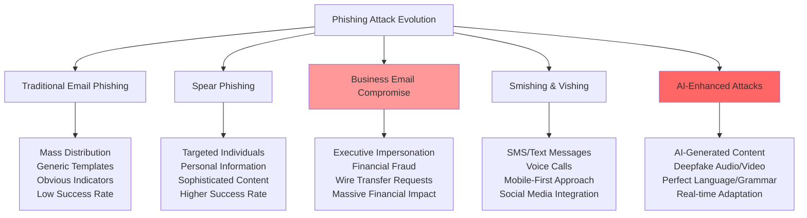
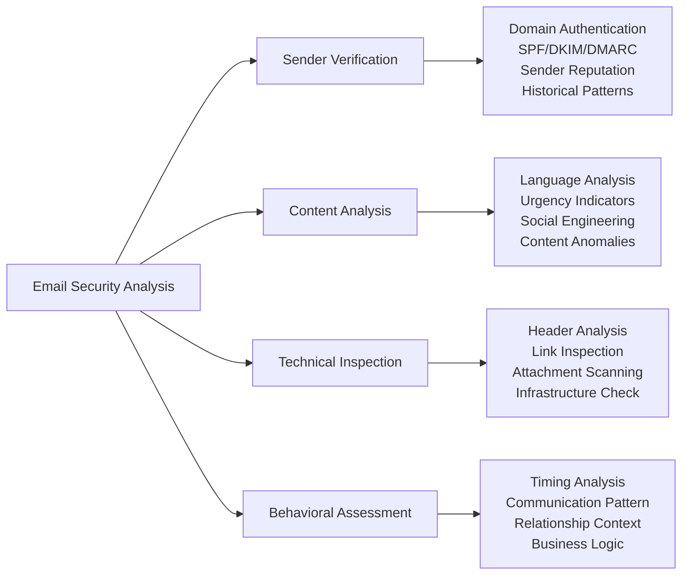
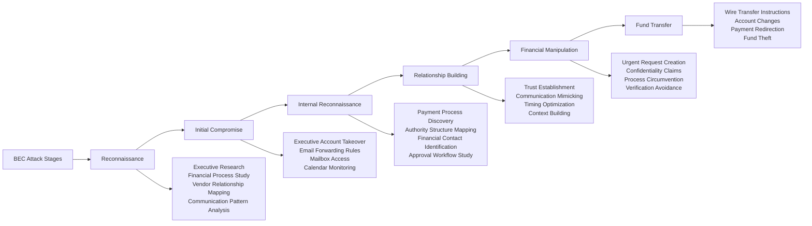
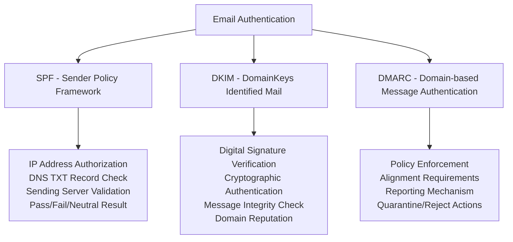
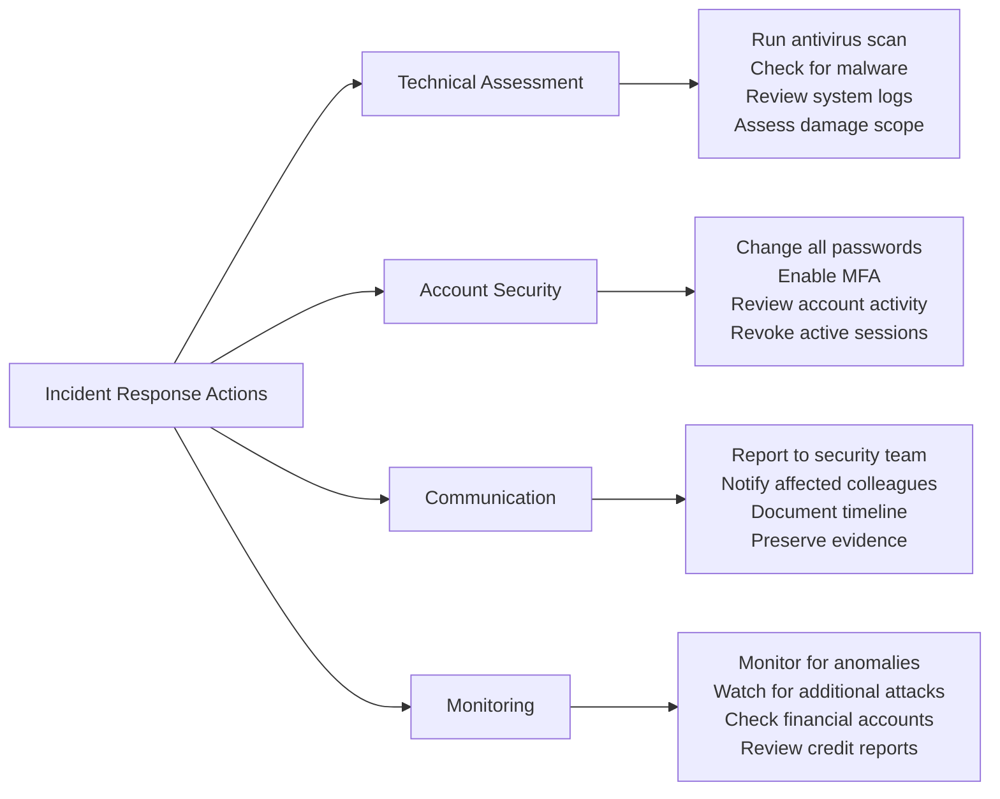
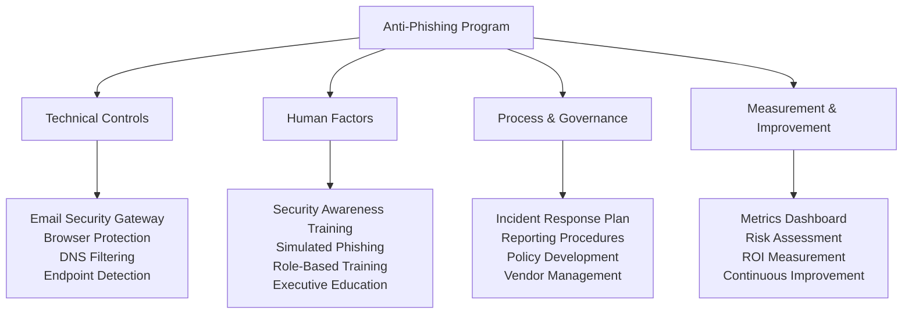
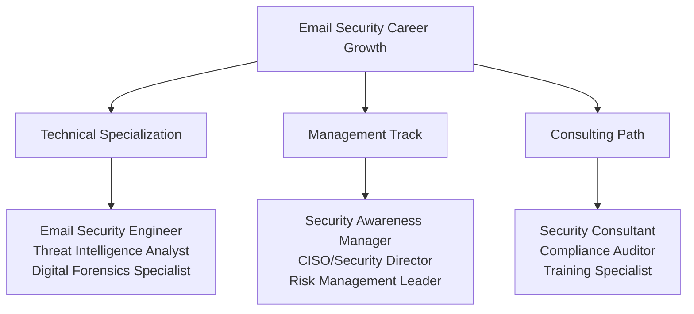

# Phishing Defense Mastery: Advanced Email Security and Social Engineering Detection

> **UltraCube Learn-Library** | Cybersecurity • Foundations • Beginner  
> **Author**: UltraCube Cybersecurity Team  
> **Duration**: 45 minutes | **Difficulty**: ⭐⭐⭐☆☆

---

## 🎯 Learning Objectives

By the end of this lesson, you will be able to:

- **Master** advanced phishing detection techniques across email, web, and mobile platforms
- **Implement** comprehensive email security strategies and safe communication protocols
- **Understand** modern attack vectors including business email compromise (BEC) and supply chain attacks
- **Execute** proper incident response procedures for phishing and social engineering incidents
- **Deploy** organizational anti-phishing training programs and awareness campaigns
- **Evaluate** anti-phishing technologies and security tools for maximum protection

---

## 🎣 The Phishing Epidemic

### Current Threat Landscape

> **FBI Internet Crime Report (2024)**: "Business Email Compromise (BEC) caused $50.8 billion in losses globally, making phishing the #1 attack vector for cybercriminals worldwide."

#### **Phishing Attack Statistics** (2024 Data)

```
Global Phishing Crisis:
Phishing Attempts per Day:        ████████████████████ 3.4 billion
Successful Phishing Rate:         ████████ 32% of targeted users
BEC Financial Losses:             ████████████████████ $50.8B annually
Credential Theft Success:         ████████████ 45% of campaigns
Mobile Phishing Growth:           ███████████████ 58% year-over-year

Organization Impact:
Employee Click Rate:              ████████████ 37% average
Credential Submission Rate:       ███████ 20% of clickers
Malware Download Rate:           ████ 12% of clickers
Average Incident Cost:           $4.91M per successful attack
Recovery Time:                   ████████ 287 days average
```

### Evolution of Phishing Attacks



---

## 📧 Advanced Phishing Detection Techniques

### Email Security Analysis Framework

#### **Multi-Layer Email Verification Process**



#### **Advanced Phishing Indicators** (2024 Threat Intelligence)

**Email Header Red Flags**:

| Indicator | Description | Risk Level | Detection Method |
|-----------|-------------|------------|------------------|
| **SPF Failure** | Sender Policy Framework mismatch | ⭐⭐⭐⭐⭐ | Technical header analysis |
| **DKIM Invalid** | DomainKeys signature verification failure | ⭐⭐⭐⭐⭐ | Cryptographic verification |
| **Domain Spoofing** | Similar but incorrect domain names | ⭐⭐⭐⭐☆ | Visual inspection |
| **Unusual Routing** | Suspicious mail server paths | ⭐⭐⭐☆☆ | Route trace analysis |
| **Recent Domain** | Newly registered domains (< 30 days) | ⭐⭐⭐⭐☆ | WHOIS lookup |

**Content Analysis Techniques**:

**Language and Psychology Indicators**:
- **Urgency manipulation**: "Account will be closed in 24 hours"
- **Authority exploitation**: "IRS audit notification" or "CEO directive"
- **Fear induction**: "Security breach detected"
- **Scarcity pressure**: "Limited time offer expires today"
- **Social proof**: "Verified by millions of users"

### Modern Attack Vector Analysis

#### **Business Email Compromise (BEC) Tactics**

**BEC Attack Chain** (2024 Methodology):



#### **AI-Enhanced Phishing Techniques** (Emerging Threats)

**ChatGPT and AI-Generated Phishing**:
- Perfect grammar and spelling
- Personalized content at scale
- Industry-specific terminology
- Real-time conversation adaptation
- Multi-language fluency

**Deepfake Integration**:
- Voice cloning for vishing attacks
- Video calls with fake executives
- Audio messages from trusted contacts
- Real-time voice manipulation

---

## 🛡️ Email Security Best Practices

### Technical Email Security Configuration

#### **Email Client Security Settings**

**Microsoft Outlook Security Configuration**:

```
Security Settings Checklist:
☑️ Enable protected view for attachments
☑️ Block automatic download of pictures
☑️ Disable macros in email attachments
☑️ Enable advanced threat protection
☑️ Configure junk email filtering (high)
☑️ Enable safe links and safe attachments
☑️ Set up multi-factor authentication
☑️ Enable audit logging and monitoring
```

**Gmail Advanced Security Features**:

```
Gmail Security Enhancement:
☑️ Enable 2-Step Verification
☑️ Configure Advanced Protection Program
☑️ Set up security keys for high-value accounts
☑️ Enable confidential mode for sensitive emails
☑️ Configure external recipient warnings
☑️ Set up offline backup codes
☑️ Enable security checkup notifications
☑️ Configure app-specific passwords
```

### Email Verification Techniques

#### **DMARC, SPF, and DKIM Analysis**

**Email Authentication Framework**:



**Manual Email Header Analysis**:

```bash
# Example email header analysis
Received-SPF: fail (google.com: domain of fake@example.com 
does not designate 192.168.1.1 as permitted sender)

Authentication-Results: 
  spf=fail smtp.mailfrom=fake@example.com;
  dkim=fail (signature did not verify);
  dmarc=fail (p=quarantine sp=none dis=none)

# Red flags in this example:
# 1. SPF failure - unauthorized sending server
# 2. DKIM failure - invalid digital signature  
# 3. DMARC failure - policy violation detected
```

---

## 📱 Mobile and Cross-Platform Phishing Defense

### Mobile-Specific Threats

#### **Smishing (SMS Phishing) Detection**

**Mobile Attack Vectors**:

| Attack Method | Platform | Detection Strategy | Prevention Technique |
|---------------|----------|-------------------|---------------------|
| **SMS Links** | All mobile | URL inspection, domain verification | SMS filtering, link scanning |
| **Fake Apps** | Android/iOS | App store verification, permission review | Official store downloads only |
| **QR Codes** | Cross-platform | QR content preview, destination verification | QR scanning apps with preview |
| **Push Notifications** | Mobile apps | Source verification, timing analysis | Notification management |
| **Social Media** | Cross-platform | Profile verification, relationship validation | Privacy settings, friend verification |

#### **Mobile Security Configuration**

**iOS Security Settings** (iPhone/iPad):

```
iOS Phishing Protection:
Settings > Messages > Filter Unknown Senders: ON
Settings > Safari > Fraudulent Website Warning: ON
Settings > Privacy & Security > Safety Check: Enable
Settings > Mail > Block All Remote Content: ON
App Store > Only download from official App Store
Two-Factor Authentication: Enable for Apple ID
```

**Android Security Settings**:

```
Android Protection Features:
Settings > Google > Security > Google Play Protect: ON
Chrome > Settings > Privacy and Security > Safe Browsing: ON
Messages > Spam protection: ON
Gmail > Settings > General > Warn before sending: ON
Unknown Sources: Keep DISABLED
Device Admin Apps: Review and remove suspicious apps
```

---

## 🚨 Phishing Incident Response

### Immediate Response Procedures

#### **"I Clicked a Phishing Link" Response Plan**

**First 5 Minutes**:
1. **Disconnect from network** (Wi-Fi/Ethernet)
2. **Do NOT enter any credentials** if redirected to login page
3. **Document the incident** (screenshot, URL, sender information)
4. **Notify IT/Security team** immediately
5. **Change passwords** for accounts that might be compromised

**Next 30 Minutes**:



#### **Organizational Incident Response**

**Corporate Phishing Response Workflow**:

**Tier 1 Response** (Help Desk):
- User reporting and initial triage
- Immediate containment actions
- Basic incident documentation
- Escalation to security team

**Tier 2 Response** (Security Team):
- Forensic analysis and investigation
- Impact assessment and scope determination
- Advanced containment and remediation
- Communication coordination

**Tier 3 Response** (Executive/Legal):
- Business impact evaluation
- Regulatory notification requirements
- Public relations and communication
- Legal and compliance considerations

---

## 💻 Hands-On Phishing Defense Labs

### **Lab 1: Email Security Analysis Workshop**

**Objective**: Develop expert-level email analysis skills using real-world examples

**Duration**: 20 minutes

**Phishing Email Analysis Exercise**:

**Sample Email Headers to Analyze**:
```
From: security@paypaI.com (Note: 'I' instead of 'l')
To: user@company.com
Subject: Urgent: Verify Your Account Now
Return-Path: <notifications@suspicious-domain.ru>
DKIM-Signature: v=1; a=rsa-sha256; d=fake-domain.com...
Received-SPF: fail (paypal.com: 192.168.1.100 not permitted)
```

**Analysis Tasks**:
1. **Visual Inspection**: Identify domain spoofing attempts
2. **Technical Verification**: Check SPF, DKIM, DMARC results
3. **Content Analysis**: Evaluate language, urgency, and requests
4. **Link Investigation**: Analyze URLs without clicking
5. **Risk Assessment**: Rate threat level and recommend actions

**Expected Findings Documentation**:

```
Email Security Assessment Report:
Sender Authenticity:     FAIL - Domain spoofing detected
Technical Verification:  FAIL - SPF/DKIM/DMARC failures
Content Analysis:        HIGH RISK - Urgency + credential request
Link Safety:            MALICIOUS - Redirects to fake site
Overall Risk Level:      CRITICAL - Do not interact

Recommended Actions:
1. Delete email immediately
2. Report to security team
3. Block sender domain
4. Alert other users
5. Monitor for similar attacks
```

### **Lab 2: Business Email Compromise Simulation**

**Objective**: Recognize and respond to sophisticated BEC attacks

**Scenario Setup**: You're a finance manager who receives an "urgent" email from the CEO

**Simulated BEC Email**:
```
From: ceo@company.com (verified domain)
To: finance-manager@company.com
Subject: Re: Confidential Acquisition Payment

Hi [Your Name],

Hope you're well. I need your assistance with a time-sensitive 
confidential matter. We're finalizing the acquisition of TechStart 
Inc. and need to transfer $850,000 to their account today to close 
the deal before the weekend.

This needs to stay confidential until we announce next week. 
Please process the wire transfer to:

Bank: First National Trust
Account: 123456789
Routing: 987654321
Beneficiary: TechStart Holdings LLC

Please confirm when complete. I'm in back-to-back meetings but 
you can text me at 555-0199 if urgent.

Thanks for your discretion on this.

Best,
[CEO Name]
```

**Red Flag Analysis Exercise**:

**Identify the BEC Warning Signs**:
1. What social engineering techniques are being used?
2. What verification steps should be taken before any action?
3. How would you safely verify this request?
4. What policies should prevent this type of fraud?

**Proper Response Procedure**:
```
BEC Response Checklist:
☑️ STOP - Do not process payment immediately
☑️ VERIFY - Contact CEO through known phone number
☑️ VALIDATE - Check with legal/compliance team
☑️ DOCUMENT - Save email for security investigation
☑️ REPORT - Notify security team of potential BEC
☑️ EDUCATE - Share with finance team as training
```

### **Lab 3: Anti-Phishing Technology Evaluation**

**Objective**: Assess and implement organizational anti-phishing solutions

**Technology Categories to Evaluate**:

1. **Email Security Gateways**
   - Microsoft Defender for Office 365
   - Proofpoint Email Protection
   - Mimecast Email Security
   - Cisco Email Security

2. **User Awareness Training Platforms**
   - KnowBe4 Security Awareness Training
   - Proofpoint Security Awareness Training
   - SANS Security Awareness
   - Infosec IQ

3. **Browser Protection Tools**
   - Google Safe Browsing
   - Microsoft SmartScreen
   - Cisco Umbrella
   - Zscaler Web Security

**Evaluation Criteria Framework**:

| Feature | Weight | Scoring Criteria |
|---------|--------|------------------|
| **Detection Accuracy** | 30% | False positive/negative rates |
| **User Experience** | 20% | Ease of use and workflow integration |
| **Reporting/Analytics** | 20% | Threat intelligence and metrics |
| **Integration Capability** | 15% | Existing security stack compatibility |
| **Cost Effectiveness** | 15% | TCO analysis and ROI calculation |

---

## 🎯 Advanced Challenge Scenarios

### **Challenge 1: Corporate Anti-Phishing Program Design**

**Scenario**: You're the CISO of a 5,000-employee financial services company that suffered a BEC attack resulting in $2.3 million loss.

**Current State Assessment**:
- 78% of employees failed the last phishing simulation
- No formal security awareness training program
- Basic email filtering with high false positive rate
- No incident response plan for phishing attacks
- Executive resistance to security measures that impact productivity

**Regulatory Requirements**:
- SOX compliance for financial controls
- GLBA requirements for customer data protection
- State banking regulations for security awareness
- Cyber insurance requirements for training documentation

**Your Mission**:
Design a comprehensive anti-phishing program that addresses technical, human, and process elements.

**Program Components to Develop**:



### **Challenge 2: AI-Enhanced Phishing Defense Strategy**

**Scenario**: Your organization faces increasingly sophisticated AI-generated phishing attacks that bypass traditional detection systems.

**Emerging Threat Landscape**:
- ChatGPT-generated emails with perfect grammar
- Deepfake audio in vishing attacks
- Real-time conversation adaptation
- Industry-specific knowledge integration
- Multi-language attack campaigns

**Technology Considerations**:
- Traditional signature-based detection failing
- Need for behavioral analysis and AI defense
- Real-time threat intelligence integration
- User education for AI-generated content
- Privacy concerns with advanced monitoring

**Solution Framework Requirements**:
1. **AI-Powered Detection Systems** that can identify AI-generated content
2. **Behavioral Analysis** that detects unusual communication patterns
3. **Zero Trust Email Security** that verifies every interaction
4. **Advanced User Training** that addresses AI-enhanced social engineering
5. **Incident Response Evolution** for AI-powered attack scenarios

---

## 📚 Professional Development and Career Growth

### **Anti-Phishing Specialization Careers**

**Career Pathways in Email Security**:

| Role | Responsibilities | Required Skills | Salary Range |
|------|-----------------|----------------|--------------|
| **Email Security Analyst** | Monitor, analyze, investigate email threats | Email forensics, threat intelligence | $55K-75K |
| **Security Awareness Manager** | Design and implement training programs | Psychology, communication, metrics | $70K-95K |
| **BEC Investigation Specialist** | Financial fraud investigation and response | Financial systems, legal procedures | $80K-110K |
| **Chief Information Security Officer** | Overall security strategy and governance | Leadership, risk management, compliance | $150K-300K |

### **Industry Certifications**

**Email Security and Anti-Phishing Certifications**:
- **Certified Email Security Professional (CESP)**
- **SANS Security Awareness Professional (SSAP)**
- **Certified Anti-Phishing Professional (CAPP)**
- **Microsoft Security Operations Analyst Associate**

### **Continuous Learning Resources**

**Industry Research and Reports**:
- Verizon Data Breach Investigations Report (Annual)
- Proofpoint State of the Phish Report (Annual)
- FBI Internet Crime Complaint Center (IC3) Reports
- CISA Cybersecurity Advisories and Alerts

**Training Platforms and Communities**:
- **SANS Security Awareness**: Professional training programs
- **KnowBe4 Resources**: Security awareness best practices
- **Anti-Phishing Working Group (APWG)**: Industry collaboration
- **Phishing Initiative**: Threat intelligence sharing

---

## ✅ Skills Assessment and Mastery Validation

### **Comprehensive Skills Evaluation**

**Rate your competency level (1-5 scale)**:

**Detection and Analysis**:
- [ ] Email header analysis and authentication verification ___/5
- [ ] Visual phishing indicator recognition ___/5
- [ ] BEC and advanced social engineering detection ___/5
- [ ] Mobile and cross-platform phishing identification ___/5

**Response and Mitigation**:
- [ ] Incident response procedures and documentation ___/5
- [ ] Technical containment and remediation ___/5
- [ ] Communication and stakeholder notification ___/5
- [ ] Recovery and lessons learned implementation ___/5

**Program Management**:
- [ ] Security awareness training design and delivery ___/5
- [ ] Anti-phishing technology evaluation and deployment ___/5
- [ ] Policy development and governance ___/5
- [ ] Metrics development and program improvement ___/5

### **Practical Assessment Scenarios**

**Scenario 1**: You receive an email from your bank requesting immediate account verification due to suspicious activity. The email includes your name, partial account number, and recent transaction details.

**Assessment Questions**:
1. What are the red flags in this scenario?
2. How would you verify the legitimacy of this communication?
3. What steps should you take to investigate safely?
4. How would you report this incident appropriately?

**Scenario 2**: A colleague forwards you an email claiming to be from IT requesting immediate password updates due to a security breach. The email includes the company logo and appears to come from the correct IT email address.

**Assessment Questions**:
1. What verification steps would you take before responding?
2. How would you differentiate between legitimate IT communications and phishing?
3. What organizational policies should guide your response?
4. How would you help your colleague avoid similar incidents?

---

## 🚀 Next Steps in Email Security Mastery

### **Advanced Topics to Explore**

1. **Zero Trust Email Architecture** and advanced authentication
2. **AI and Machine Learning** in email threat detection
3. **Email Forensics and Investigation** techniques
4. **Supply Chain Email Security** and vendor risk management
5. **International Email Security** and cross-border compliance

### **Career Advancement Opportunities**



### **Next Lessons in Cybersecurity Foundation**

- **Lesson 05**: Network Security and Perimeter Defense
- **Lesson 06**: Incident Response and Digital Forensics
- **Lesson 07**: Security Governance and Compliance

---

<div align="center">

## 🎣 **Congratulations on Mastering Phishing Defense!**

You've developed comprehensive expertise in email security, phishing detection, and social engineering defense. These critical skills form the foundation of modern cybersecurity awareness and incident response.

**Ready to secure network perimeters?** Continue with network security to build comprehensive defense strategies.

</div>

---

**Lesson created by UltraCube Cybersecurity Team** | [ucubetech.com](https://www.ucubetech.com) | **Copyright © 2025 UltraCube Technology**

> **Sources**: This comprehensive lesson integrates authoritative insights from CISA secure browsing guidelines, FBI Internet Crime Reports, Verizon DBIR, leading email security providers (Proofpoint, Microsoft, Google), security awareness training platforms, and anti-phishing research organizations to deliver current and actionable email security knowledge.

## Overview

Learn to spot common phishing tactics and safely handle suspicious messages.

## Learning objectives

- Identify common phishing indicators
- Use safe preview techniques
- Report phishing responsibly

## Key terms

- Phishing — social engineering via emails/messages/websites to steal data
- Spoofing — faking sender identity
- URL inspection — checking link destinations before clicking

## Explanation

- Indicators: urgency, threats, poor spelling, mismatched domains, unexpected attachments.
- Techniques: hover to preview URLs, check domain spelling, verify via known channels.
- Reporting: use in-app report tools or forward to security team.

## Exercises

1. List five phishing red flags in a sample message of your choice.
2. Describe how to safely preview a link on desktop and mobile.

## Challenges & Activities

- Activity (10m): Capture three example phishing emails (redacted) and annotate indicators.
- Challenge (10–15m): Build a decision tree for handling suspicious messages at work.
- Stretch: Compare two anti-phishing training tools and note pros/cons.

## Puzzle

You received a “security alert” email with a link to verify your account. The link looks like `http://example.com.security-check.ru/login`. What’s wrong and what steps should you take?

## Further reading

- CISA on Phishing — [cisa.gov/secure-our-world/recognize-and-report-phishing](https://www.cisa.gov/secure-our-world/recognize-and-report-phishing)
- OWASP: Phishing — [owasp.org/www-community/attacks/Phishing](https://owasp.org/www-community/attacks/Phishing)
