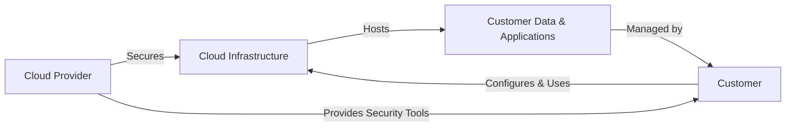

# Lesson 01: Introduction to Cloud Security

## Overview
Cloud security is the set of policies, technologies, and controls deployed to protect data, applications, and infrastructure in cloud environments. As organizations increasingly adopt cloud services, understanding cloud security fundamentals is essential.

## Learning Objectives

- Define cloud security and its importance
- Identify key risks and threats in cloud environments
- Understand shared responsibility in cloud security

## Visual: Cloud Security Shared Responsibility Model

## Detailed Explanation

### What is Cloud Security?
Cloud security encompasses the technologies, policies, and controls that protect cloud-based systems, data, and infrastructure. It addresses both physical and digital security threats.

### Key Risks and Threats
- Data breaches
- Misconfiguration
- Insecure APIs
- Insider threats
- Account hijacking

### Shared Responsibility Model
Cloud security is a shared responsibility between the cloud provider and the customer. Providers secure the infrastructure, while customers are responsible for securing their data, access, and configurations.

## References
- [NIST Cloud Computing Security](https://csrc.nist.gov/publications/detail/sp/800-144/final)
- [OWASP Cloud-Native Application Security Top 10](https://owasp.org/www-project-cloud-native-application-security-top-10/)
- [Microsoft Shared Responsibility Model](https://learn.microsoft.com/en-us/azure/security/fundamentals/shared-responsibility)
