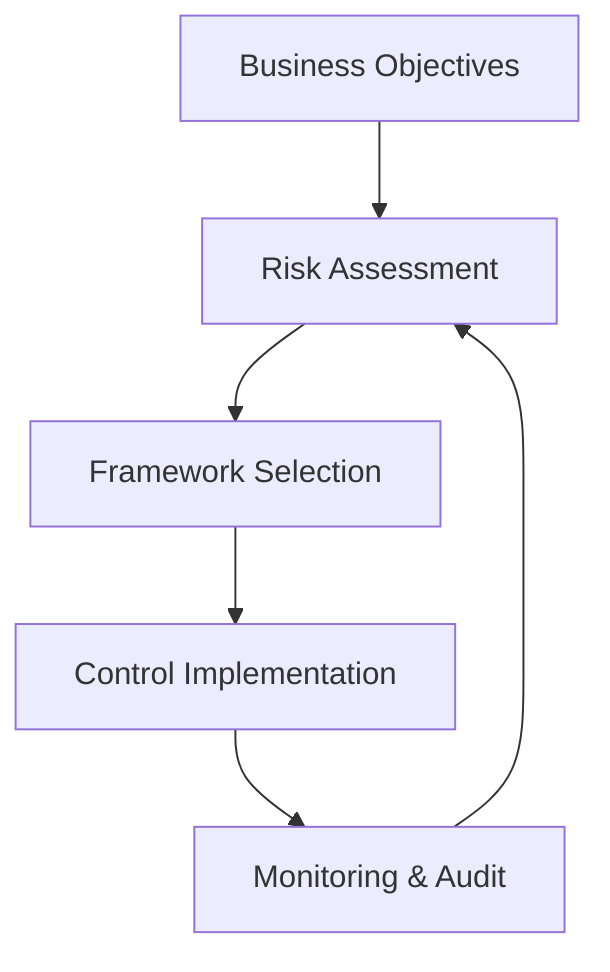

# Module 01: Security Frameworks

Orientation to governance, risk, and compliance (GRC) frameworks and how they drive control selection.

## Lessons

- Lesson 01 — Framework Landscape Overview

## Learning Objectives

- Differentiate governance, risk management, and compliance scopes
- Summarize purposes of NIST CSF, ISO 27001, SOC 2, PCI DSS
- Map high-level controls to business risk reduction goals
- Outline continuous compliance monitoring basics

## Visual Overview

## Summary

Provides structural context for deeper policy, risk, and audit modules.

---

Proceed to the lesson to navigate the framework ecosystem.
