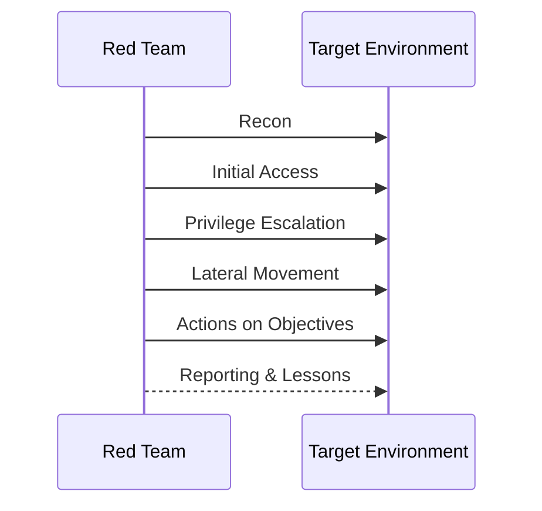

# Module 01: Introduction to Red Teaming

Foundational offensive security concepts, roles, methodologies, and ethics.

## Lessons

- Lesson 01 — Red Team Roles & Methodology

## Learning Objectives

- Differentiate red, blue, purple, and gold team scopes
- Summarize a typical intrusion kill chain / engagement lifecycle
- Explain rules of engagement and ethical boundaries
- Identify common tool categories (recon, exploitation, post-exploitation)

## Visual Overview

## Summary

Establishes ethical and procedural baselines for offensive learning path.

---

Proceed to the lesson to explore methodology in detail.
