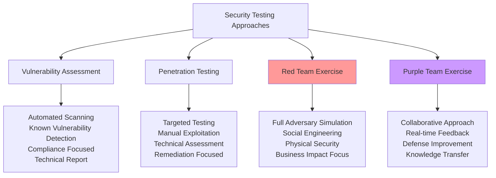
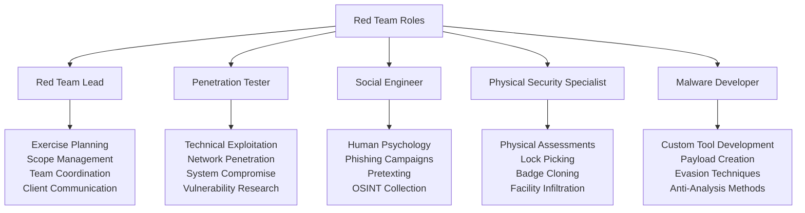
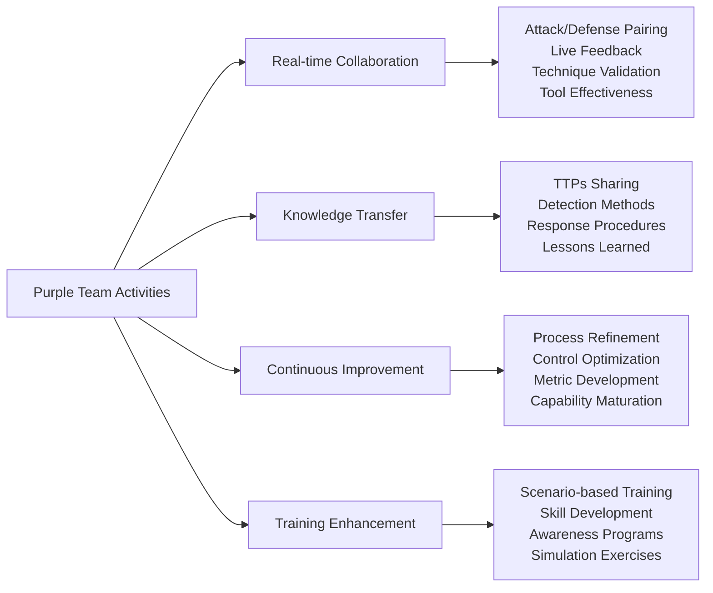
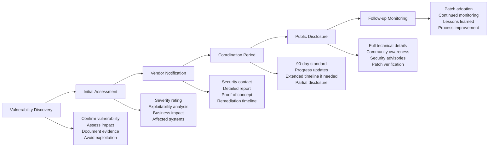
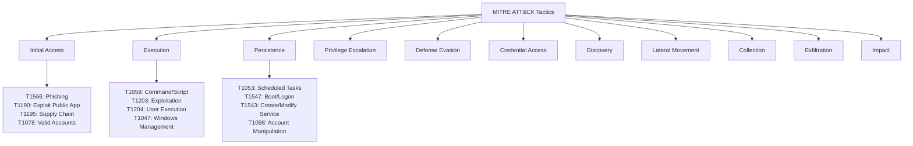
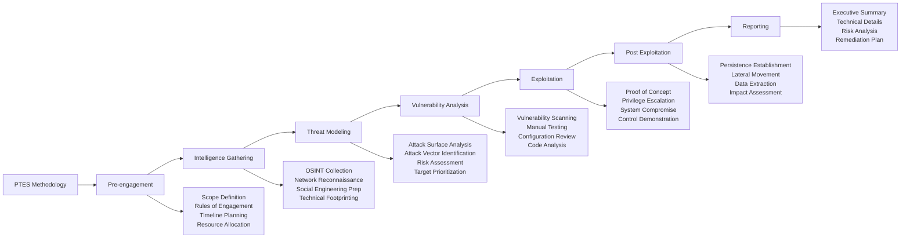
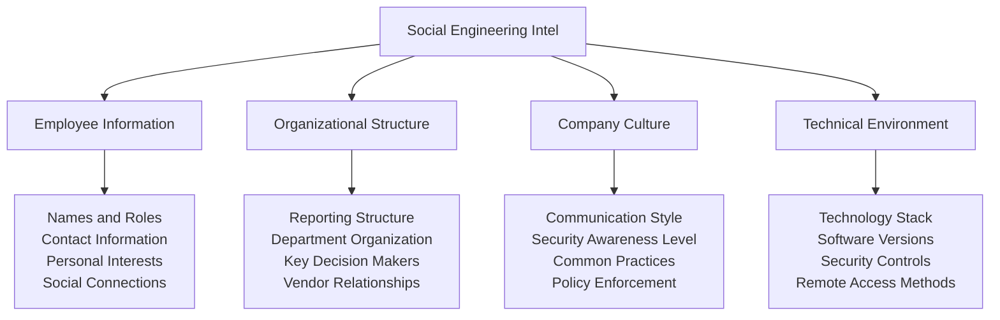
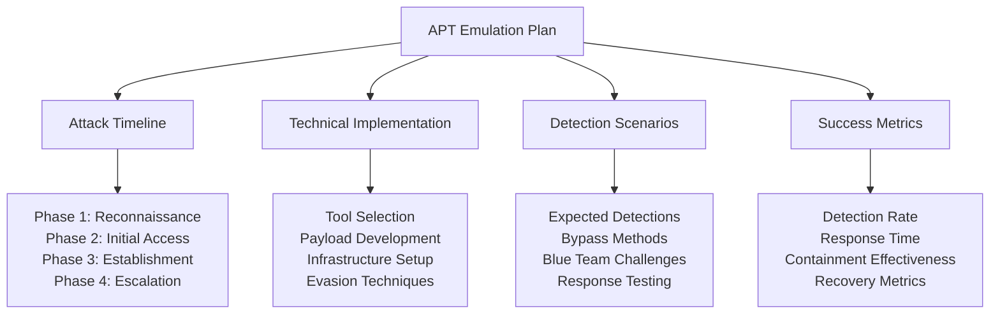
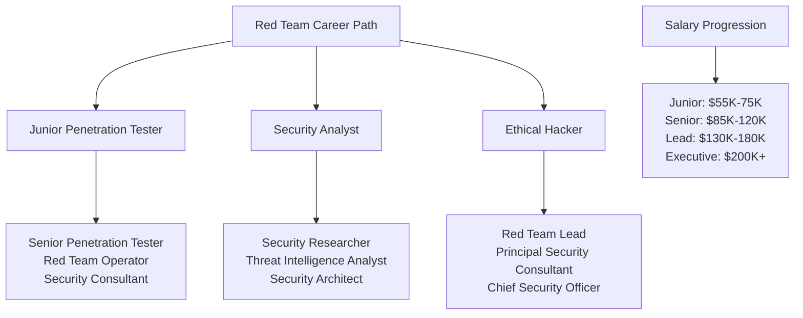

# Red Team Fundamentals: Offensive Security and Ethical Hacking Mastery

> **UltraCube Learn-Library** | Cybersecurity • Red Team • Beginner  
> **Author**: UltraCube Red Team Specialists  
> **Duration**: 55 minutes | **Difficulty**: ⭐⭐⭐☆☆

---

## 🎯 Learning Objectives

By the end of this lesson, you will be able to:

- **Master** red team methodologies, frameworks, and offensive security principles
- **Understand** ethical hacking guidelines, legal compliance, and responsible disclosure
- **Implement** threat emulation and adversary simulation for realistic security testing
- **Execute** reconnaissance operations and intelligence gathering techniques
- **Apply** structured penetration testing methodologies and vulnerability assessment
- **Develop** critical thinking skills for offensive security and defense evasion

---

## 🔴 What is Red Teaming?

### Red Team Definition and Mission

> **Red Teaming**: A goal-based adversarial activity where a group of security professionals simulate real-world attacks against an organization's people, processes, and technology to test and improve defensive capabilities.

#### **Red Team vs. Other Security Testing Methods**



#### **Red Team Objectives and Scope**

**Primary Objectives**:
1. **Test Detection Capabilities** - Can the blue team detect sophisticated attacks?
2. **Evaluate Response Procedures** - How effectively does the organization respond to threats?
3. **Assess Security Controls** - Which security measures are effective against real-world attacks?
4. **Measure Business Impact** - What are the potential consequences of a successful attack?
5. **Improve Defense Posture** - Provide actionable recommendations for security enhancement

**Red Team Scope Areas**:

| Scope Area | Description | Typical Activities |
|------------|-------------|-------------------|
| **Technical Infrastructure** | Networks, systems, applications | Network penetration, system exploitation, privilege escalation |
| **Physical Security** | Buildings, access controls, devices | Lock picking, badge cloning, tailgating, device access |
| **Personnel Security** | Social engineering, awareness | Phishing campaigns, pretexting, OSINT gathering |
| **Process Security** | Policies, procedures, compliance | Policy circumvention, process exploitation, compliance gaps |

---

## 🛡️ Red Team vs. Blue Team: The Cybersecurity Ecosystem

### Team Roles and Responsibilities

#### **Red Team (Offensive Security)**



#### **Blue Team (Defensive Security)**

**Blue Team Responsibilities**:
- **Security Monitoring** and threat detection
- **Incident Response** and forensic analysis
- **Security Control Implementation** and maintenance
- **Threat Intelligence** analysis and correlation
- **Vulnerability Management** and remediation

#### **Purple Team Integration**

**Purple Team Benefits**:



---

## ⚖️ Ethics and Legal Considerations

### Ethical Hacking Principles

#### **Core Ethical Guidelines**

1. **Authorization is Mandatory**
   - Written permission before any testing
   - Clear scope and boundaries defined
   - Regular check-ins and updates
   - Immediate stop when requested

2. **Minimize Harm and Disruption**
   - Avoid production system damage
   - Respect business operations
   - Protect sensitive data discovered
   - Maintain system availability

3. **Professional Responsibility**
   - Maintain confidentiality
   - Report findings responsibly
   - Follow disclosure guidelines
   - Respect intellectual property

#### **Legal Framework and Compliance**

**Key Legal Considerations**:

| Legal Area | Requirements | Compliance Actions |
|------------|--------------|-------------------|
| **Computer Fraud and Abuse Act (CFAA)** | No unauthorized access | Explicit written authorization |
| **Digital Millennium Copyright Act (DMCA)** | Respect copyright | Avoid proprietary system damage |
| **Data Protection Regulations (GDPR, CCPA)** | Protect personal data | Data handling procedures |
| **Industry Regulations (HIPAA, SOX, PCI)** | Sector-specific compliance | Specialized testing protocols |

### Responsible Disclosure

#### **Vulnerability Disclosure Process**



---

## 🎭 Threat Emulation and Adversary Simulation

### MITRE ATT&CK Framework

#### **ATT&CK Tactics and Techniques** (2024 Framework)



#### **Threat Actor Emulation**

**Advanced Persistent Threat (APT) Groups** (2024 Intelligence):

| APT Group | Primary Targets | Notable TTPs | Emulation Focus |
|-----------|-----------------|--------------|-----------------|
| **APT29 (Cozy Bear)** | Government, think tanks | Living off the land, cloud exploitation | PowerShell, WMI, cloud services |
| **APT28 (Fancy Bear)** | Military, government | Spear phishing, credential harvesting | Email attacks, credential theft |
| **Lazarus Group** | Financial, cryptocurrency | Custom malware, SWIFT attacks | Banking trojans, crypto theft |
| **APT40 (Leviathan)** | Maritime, healthcare | Web shells, SQL injection | Web application attacks |

### Red Team Exercise Methodologies

#### **Penetration Testing Execution Standard (PTES)**



---

## 🔍 Reconnaissance and Intelligence Gathering

### Open Source Intelligence (OSINT)

#### **OSINT Collection Framework**

**Primary Information Sources**:

| Source Category | Information Types | Tools and Techniques |
|-----------------|-------------------|---------------------|
| **Public Records** | Business registrations, patents, court records | Corporate databases, government portals |
| **Social Media** | Employee profiles, company updates, locations | LinkedIn, Twitter, Facebook, Instagram |
| **Technical Infrastructure** | Domain names, IP addresses, certificates | DNS enumeration, certificate transparency |
| **Financial Information** | Revenue, investments, partnerships | SEC filings, financial reports |
| **News and Media** | Press releases, interviews, announcements | Google News, industry publications |

#### **Technical Reconnaissance Tools**

**Network Reconnaissance**:

```bash
# Domain enumeration
nmap -sn target.com
dig target.com ANY
whois target.com

# Subdomain discovery
sublist3r -d target.com
amass enum -d target.com

# Service enumeration
nmap -sV -sC target.com
masscan -p1-65535 target.com --rate=1000

# Web application reconnaissance
gobuster dir -u https://target.com -w /wordlists/common.txt
nikto -h target.com
```

### Social Engineering Reconnaissance

#### **Human Intelligence (HUMINT) Gathering**

**Social Engineering Information Sources**:



---

## 💻 Hands-On Red Team Labs

### **Lab 1: OSINT Collection and Target Profiling**

**Objective**: Conduct comprehensive open source intelligence gathering on a target organization

**Duration**: 25 minutes

**Target Selection** (Choose a public organization for ethical practice):
- Large publicly traded company
- Educational institution
- Government agency with public information
- Technology company with significant online presence

**Information Gathering Tasks**:

1. **Corporate Intelligence** (10 minutes)
   - Company structure and subsidiaries
   - Key personnel and executives
   - Physical locations and facilities
   - Business partnerships and vendors
   - Recent news and press releases

2. **Technical Infrastructure Analysis** (10 minutes)
   - Domain and subdomain enumeration
   - IP address ranges and hosting providers
   - Email servers and security policies
   - Web technologies and frameworks
   - Certificate information and SSL configuration

3. **Social Media and Personnel Research** (5 minutes)
   - LinkedIn employee profiles
   - Social media presence
   - Job postings and requirements
   - Company culture and values
   - Security awareness indicators

**Documentation Requirements**:
```
Target Profile Report:
Organization: ________________
Industry: ___________________
Employee Count: ______________
Primary Technologies: ________
Security Posture Indicators: _
Key Personnel: ______________
Potential Attack Vectors: ____
```

### **Lab 2: Network Reconnaissance and Service Enumeration**

**Objective**: Perform technical reconnaissance using ethical scanning techniques

**Target Environment**: Use deliberately vulnerable practice environments
- Metasploitable 2/3
- DVWA (Damn Vulnerable Web Application)
- VulnHub virtual machines
- HackTheBox retired machines

**Reconnaissance Workflow**:

1. **Network Discovery** (10 minutes)
   ```bash
   # Ping sweep to identify live hosts
   nmap -sn 192.168.1.0/24
   
   # TCP SYN scan for open ports
   nmap -sS -T4 -p- target_ip
   
   # UDP scan for common services
   nmap -sU -T4 --top-ports 1000 target_ip
   ```

2. **Service Enumeration** (15 minutes)
   ```bash
   # Service version detection
   nmap -sV -sC -p 22,80,443,445 target_ip
   
   # Banner grabbing
   nc -nv target_ip 80
   
   # Web application enumeration
   gobuster dir -u http://target_ip -w /usr/share/wordlists/dirb/common.txt
   ```

3. **Vulnerability Assessment** (10 minutes)
   ```bash
   # Nmap vulnerability scripts
   nmap --script vuln target_ip
   
   # Web application scanning
   nikto -h http://target_ip
   
   # SSL/TLS assessment
   sslscan target_ip:443
   ```

**Lab Deliverables**:
- Network topology diagram
- Service inventory with versions
- Potential vulnerability list
- Attack surface analysis

### **Lab 3: Social Engineering Simulation Planning**

**Objective**: Design a comprehensive social engineering campaign (simulation only)

**Scenario Setup**: Design a phishing campaign for security awareness training

**Campaign Planning Elements**:

1. **Target Analysis** (15 minutes)
   - Employee demographics and roles
   - Communication patterns and preferences
   - Technology usage and security awareness
   - Seasonal and business cycle considerations

2. **Attack Vector Selection** (15 minutes)
   - Email phishing techniques
   - Pretexting scenarios
   - Physical security testing
   - USB drop simulations

3. **Payload and Infrastructure Design** (15 minutes)
   - Landing page creation
   - Email template development
   - Tracking and metrics setup
   - Safe payload development

**Ethical Guidelines Checklist**:
- [ ] Written authorization obtained
- [ ] Clear scope and boundaries defined
- [ ] No actual harm or disruption planned
- [ ] Educational objectives clearly defined
- [ ] Debriefing and training planned
- [ ] Data protection measures in place

---

## 🎯 Advanced Challenge Scenarios

### **Challenge 1: APT Emulation Exercise**

**Scenario**: You are tasked with emulating APT29 (Cozy Bear) attack techniques to test your organization's detection capabilities.

**Organization Profile**:
- 2,500-employee technology company
- Hybrid cloud infrastructure (AWS + on-premises)
- Microsoft 365 environment
- Advanced security tools (SIEM, EDR, UEBA)
- Security-aware workforce with regular training

**APT29 Techniques to Emulate**:
- Initial access via spear phishing
- Living off the land techniques
- Cloud service exploitation
- Persistence mechanisms
- Data exfiltration methods

**Your Mission**:
Design a comprehensive red team exercise that safely tests the organization's ability to detect and respond to APT29-style attacks.

**Deliverables Required**:



### **Challenge 2: Physical and Social Engineering Assessment**

**Scenario**: Comprehensive security assessment combining physical security, social engineering, and technical testing.

**Target Environment**:
- Corporate headquarters with 500 employees
- Multiple building access points
- Visitor management system
- Badge-based access control
- Open office environment with hot-desking

**Assessment Objectives**:
1. Test physical security controls and procedures
2. Evaluate employee security awareness
3. Assess technical security from inside the perimeter
4. Measure incident response to physical security events

**Multi-Vector Attack Plan**:

**Physical Security Testing**:
- Badge cloning and tailgating attempts
- Lock picking and bypass techniques
- Device insertion and network access
- Security camera and alarm system evaluation

**Social Engineering Campaign**:
- Pretexting phone calls to help desk
- Phishing emails with USB payloads
- Dumpster diving for sensitive information
- Impersonation of vendors and contractors

**Technical Assessment**:
- Internal network penetration
- Wireless network security testing
- Physical device security evaluation
- Data exfiltration simulation

---

## 📚 Professional Development in Red Teaming

### **Industry Certifications for Red Team Professionals**

**Offensive Security Certifications**:

| Certification | Provider | Focus Area | Career Impact | Salary Boost |
|---------------|----------|------------|---------------|--------------|
| **OSCP** | Offensive Security | Penetration testing | Senior pentester | +$15,000 |
| **OSCE** | Offensive Security | Advanced exploitation | Expert level | +$25,000 |
| **OSEP** | Offensive Security | Evasion techniques | Red team specialist | +$20,000 |
| **GPEN** | SANS | Penetration testing | Professional certification | +$12,000 |
| **GREM** | SANS | Reverse engineering | Malware analysis | +$18,000 |
| **CEH** | EC-Council | Ethical hacking | Entry level | +$8,000 |

### **Advanced Learning Resources**

**Essential Red Team Literature**:
- "Red Team Field Manual" by Ben Clark
- "The Hacker Playbook 3" by Peter Kim
- "Red Team Operations" by Joe Vest and James Tubberville
- "Social Engineering: The Art of Human Hacking" by Christopher Hadnagy

**Technical Resources and Platforms**:
- **HackTheBox**: Realistic penetration testing challenges
- **TryHackMe**: Guided red team learning paths
- **VulnHub**: Vulnerable virtual machines for practice
- **PentesterLab**: Web application security testing

### **Red Team Career Progression**



---

## ✅ Skills Assessment and Competency Validation

### **Red Team Competency Matrix**

**Rate your current skill level (1-5 scale)**:

**Technical Skills**:
- [ ] Network reconnaissance and enumeration ___/5
- [ ] Web application security testing ___/5
- [ ] System exploitation and privilege escalation ___/5
- [ ] Malware development and evasion ___/5

**Operational Skills**:
- [ ] Social engineering and OSINT collection ___/5
- [ ] Physical security assessment ___/5
- [ ] Report writing and communication ___/5
- [ ] Project management and team coordination ___/5

**Foundational Knowledge**:
- [ ] Legal and ethical frameworks ___/5
- [ ] Threat landscape and APT techniques ___/5
- [ ] Defense evasion and stealth techniques ___/5
- [ ] Business risk and impact assessment ___/5

### **Practical Skills Verification**

**Scenario-Based Assessment**: Your team has been contracted to perform a red team exercise for a financial services company. The scope includes external network testing, social engineering, and physical security assessment.

**Assessment Questions**:
1. What are the first three steps you would take during the pre-engagement phase?
2. How would you ensure compliance with financial industry regulations during testing?
3. What MITRE ATT&CK techniques would be most relevant for this engagement?
4. How would you design a social engineering campaign that tests but doesn't harm employee trust?
5. What metrics would you use to measure the success of the engagement?

---

## 🚀 Next Steps in Red Team Mastery

### **Advanced Topics to Explore**

1. **Advanced Persistent Threat (APT) Simulation** and nation-state techniques
2. **Cloud Security Testing** and modern infrastructure assessment
3. **Industrial Control Systems (ICS)** and SCADA security testing
4. **Mobile Application Security** and IoT device assessment
5. **Artificial Intelligence and Machine Learning** in offensive security

### **Upcoming Lessons in Red Team Track**

- **Lesson 02**: Reconnaissance and Intelligence Gathering Mastery
- **Lesson 03**: Network Penetration and Lateral Movement
- **Lesson 04**: Web Application Security Testing and Exploitation
- **Lesson 05**: Social Engineering and Physical Security Assessment

---

<div align="center">

## 🔴 **Congratulations on Mastering Red Team Fundamentals!**

You've gained foundational knowledge of offensive security, ethical hacking, and red team methodologies. With these skills, you can begin contributing to organizational security through responsible adversarial testing.

**Ready to dive deeper into offensive security?** Continue with advanced reconnaissance techniques and practical exploitation methods.

</div>

---

**Lesson created by UltraCube Red Team Specialists** | [ucubetech.com](https://www.ucubetech.com) | **Copyright © 2025 UltraCube Technology**

> **Sources**: This comprehensive lesson integrates authoritative insights from leading red team practitioners, MITRE ATT&CK framework, OWASP testing methodologies, penetration testing standards, and industry certifications to provide current and practical offensive security knowledge.
