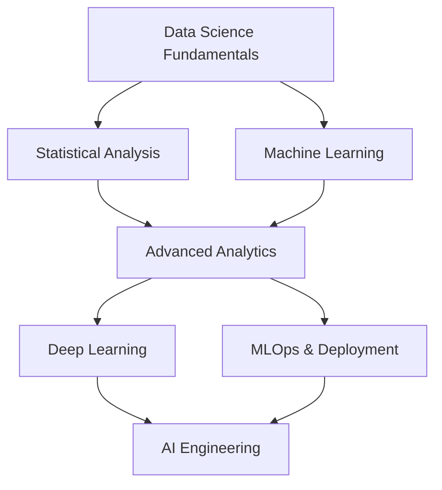

# 🏆 **Data Science Fundamentals**

*Master data analysis, visualization, and machine learning foundations*

## 📚 **Lesson Overview**

**Duration**: 55 minutes  
**Level**: Beginner  
**Prerequisites**: Basic Python programming, Mathematics fundamentals  
**Learning Path**: Data Science → Foundations → Data Science Fundamentals

---

## 🎯 **Learning Objectives**

By the end of this lesson, you will be able to:

- ✅ Understand the complete data science lifecycle and methodology
- ✅ Perform data cleaning and preprocessing techniques
- ✅ Create compelling data visualizations using Python libraries
- ✅ Apply statistical analysis and hypothesis testing
- ✅ Build and evaluate basic machine learning models

---

## 🌟 **Why This Matters**

Data Science is transforming every industry. According to the **Harvard Business Review**, Data Scientist was named the "Sexiest Job of the 21st Century." The **Bureau of Labor Statistics** projects **35% growth** in data science jobs through 2032. Companies like Netflix, Amazon, and Google credit data science for billions in revenue optimization.

> *"Data is the new oil. It's valuable, but if unrefined it cannot really be used."* - **Clive Humby, Data Scientist**

**Industry Impact:**
- **Netflix**: 80% of content viewed comes from ML recommendations
- **Amazon**: 35% of revenue driven by recommendation algorithms  
- **Google**: $39B annual revenue from data-driven advertising

---

## 📖 **Core Content**

### **1. Data Science Lifecycle & Methodology (15 minutes)**

#### **🔄 CRISP-DM Framework**

The industry-standard methodology for data science projects:

```python
# Data Science Project Structure
"""
1. Business Understanding (20% of time)
   - Define objectives and success metrics
   - Understand domain and constraints
   
2. Data Understanding (20% of time)
   - Collect and explore data
   - Assess data quality and completeness
   
3. Data Preparation (60% of time) - Most time-consuming!
   - Clean, transform, and feature engineer
   - Handle missing values and outliers
   
4. Modeling (10% of time)
   - Select and train algorithms
   - Validate and tune models
   
5. Evaluation (5% of time)
   - Assess model performance
   - Business impact analysis
   
6. Deployment (5% of time)
   - Production deployment
   - Monitoring and maintenance
"""

import pandas as pd
import numpy as np
import matplotlib.pyplot as plt
import seaborn as sns
from sklearn.model_selection import train_test_split
from sklearn.preprocessing import StandardScaler
from sklearn.ensemble import RandomForestClassifier
from sklearn.metrics import accuracy_score, classification_report
import warnings
warnings.filterwarnings('ignore')

# Set up professional plotting style
plt.style.use('seaborn-v0_8')
sns.set_palette("husl")
```

#### **🎯 Business Problem Definition**

```python
# Example: Customer Churn Prediction for Telecommunications
"""
Business Problem:
- Company losing 27% of customers annually
- Customer acquisition costs 5x more than retention
- Need to predict which customers will churn

Success Metrics:
- Identify 80% of churning customers
- Reduce false positives to under 15%
- ROI: Save $2M annually through targeted retention
"""

def define_project_scope():
    """Define clear project scope and success metrics."""
    scope = {
        'objective': 'Predict customer churn to enable proactive retention',
        'target_metric': 'F1-score > 0.85',
        'business_impact': 'Reduce churn by 15%, save $2M annually',
        'timeline': '6 weeks development + 2 weeks deployment',
        'stakeholders': ['Marketing', 'Customer Success', 'Data Team']
    }
    
    print("📋 Project Scope Definition:")
    for key, value in scope.items():
        print(f"  {key.title()}: {value}")
    
    return scope

project_scope = define_project_scope()
```

### **2. Data Collection & Exploration (15 minutes)**

#### **📊 Data Collection Strategies**

```python
# Simulate customer data for telecommunications company
np.random.seed(42)

def generate_customer_data(n_customers=5000):
    """Generate realistic customer dataset for churn analysis."""
    
    # Customer demographics
    data = {
        'customer_id': range(1, n_customers + 1),
        'age': np.random.normal(45, 15, n_customers).astype(int),
        'gender': np.random.choice(['Male', 'Female'], n_customers),
        'tenure_months': np.random.exponential(24, n_customers).astype(int),
        'monthly_charges': np.random.normal(70, 20, n_customers),
        'total_charges': np.random.normal(2000, 1500, n_customers),
    }
    
    # Service usage patterns
    data['internet_service'] = np.random.choice(['DSL', 'Fiber', 'None'], n_customers, p=[0.4, 0.5, 0.1])
    data['contract_type'] = np.random.choice(['Month-to-month', '1-year', '2-year'], n_customers, p=[0.6, 0.3, 0.1])
    data['payment_method'] = np.random.choice(['Electronic', 'Credit Card', 'Bank Transfer', 'Mailed Check'], 
                                            n_customers, p=[0.4, 0.3, 0.2, 0.1])
    
    # Support interactions
    data['support_calls'] = np.random.poisson(2, n_customers)
    data['tech_support'] = np.random.choice([0, 1], n_customers, p=[0.7, 0.3])
    data['online_security'] = np.random.choice([0, 1], n_customers, p=[0.6, 0.4])
    
    # Calculate churn probability based on realistic factors
    churn_prob = 0.1  # Base churn rate
    
    # Risk factors that increase churn probability
    for i in range(n_customers):
        prob = churn_prob
        
        # Month-to-month contracts have higher churn
        if data['contract_type'][i] == 'Month-to-month':
            prob += 0.2
        
        # High support calls indicate dissatisfaction
        if data['support_calls'][i] > 3:
            prob += 0.15
        
        # Short tenure customers more likely to churn
        if data['tenure_months'][i] < 6:
            prob += 0.3
        
        # High monthly charges without long contract
        if data['monthly_charges'][i] > 80 and data['contract_type'][i] == 'Month-to-month':
            prob += 0.1
        
        data.setdefault('churn_probability', []).append(min(prob, 0.9))
    
    # Generate actual churn based on probabilities
    data['churn'] = [np.random.binomial(1, p) for p in data['churn_probability']]
    
    return pd.DataFrame(data)

# Generate and explore the dataset
df = generate_customer_data()
print("📊 Dataset Overview:")
print(f"Shape: {df.shape}")
print(f"Churn Rate: {df['churn'].mean():.2%}")
print("\nFirst 5 rows:")
print(df.head())
```

#### **🔍 Exploratory Data Analysis (EDA)**

```python
def perform_eda(df):
    """Comprehensive exploratory data analysis."""
    
    print("🔍 Exploratory Data Analysis")
    print("=" * 50)
    
    # Basic statistics
    print("\n📈 Numerical Variables Summary:")
    numerical_cols = df.select_dtypes(include=[np.number]).columns
    print(df[numerical_cols].describe())
    
    # Missing values analysis
    print("\n❌ Missing Values:")
    missing = df.isnull().sum()
    missing_pct = (missing / len(df) * 100).round(2)
    missing_df = pd.DataFrame({
        'Missing_Count': missing,
        'Missing_Percentage': missing_pct
    })
    print(missing_df[missing_df['Missing_Count'] > 0])
    
    # Categorical variables
    print("\n📊 Categorical Variables:")
    categorical_cols = df.select_dtypes(include=['object']).columns
    for col in categorical_cols:
        print(f"\n{col}:")
        print(df[col].value_counts())
    
    # Correlation analysis
    print("\n🔗 Correlation with Churn:")
    correlations = df.corr()['churn'].sort_values(ascending=False)
    print(correlations)
    
    return correlations

correlations = perform_eda(df)
```

### **3. Data Visualization & Insights (15 minutes)**

#### **📈 Professional Data Visualizations**

```python
def create_churn_visualizations(df):
    """Create comprehensive visualizations for churn analysis."""
    
    # Set up the plotting layout
    fig, axes = plt.subplots(2, 3, figsize=(18, 12))
    fig.suptitle('🎯 Customer Churn Analysis Dashboard', fontsize=16, fontweight='bold')
    
    # 1. Churn rate by contract type
    churn_by_contract = df.groupby('contract_type')['churn'].mean()
    axes[0, 0].bar(churn_by_contract.index, churn_by_contract.values, 
                   color=['#FF6B6B', '#4ECDC4', '#45B7D1'])
    axes[0, 0].set_title('Churn Rate by Contract Type')
    axes[0, 0].set_ylabel('Churn Rate')
    axes[0, 0].tick_params(axis='x', rotation=45)
    
    # Add value labels on bars
    for i, v in enumerate(churn_by_contract.values):
        axes[0, 0].text(i, v + 0.01, f'{v:.2%}', ha='center', fontweight='bold')
    
    # 2. Tenure distribution by churn status
    axes[0, 1].hist([df[df['churn']==0]['tenure_months'], df[df['churn']==1]['tenure_months']], 
                    bins=20, alpha=0.7, label=['Retained', 'Churned'], color=['#4ECDC4', '#FF6B6B'])
    axes[0, 1].set_title('Customer Tenure Distribution')
    axes[0, 1].set_xlabel('Tenure (Months)')
    axes[0, 1].set_ylabel('Count')
    axes[0, 1].legend()
    
    # 3. Monthly charges vs churn
    axes[0, 2].boxplot([df[df['churn']==0]['monthly_charges'], df[df['churn']==1]['monthly_charges']], 
                       labels=['Retained', 'Churned'])
    axes[0, 2].set_title('Monthly Charges Distribution')
    axes[0, 2].set_ylabel('Monthly Charges ($)')
    
    # 4. Support calls impact
    support_churn = df.groupby('support_calls')['churn'].mean()
    axes[1, 0].plot(support_churn.index, support_churn.values, marker='o', linewidth=2, markersize=8)
    axes[1, 0].set_title('Churn Rate vs Support Calls')
    axes[1, 0].set_xlabel('Number of Support Calls')
    axes[1, 0].set_ylabel('Churn Rate')
    axes[1, 0].grid(True, alpha=0.3)
    
    # 5. Internet service analysis
    internet_churn = df.groupby('internet_service')['churn'].mean()
    axes[1, 1].bar(internet_churn.index, internet_churn.values, color=['#96CEB4', '#FFEAA7', '#DDA0DD'])
    axes[1, 1].set_title('Churn Rate by Internet Service')
    axes[1, 1].set_ylabel('Churn Rate')
    
    # Add value labels
    for i, v in enumerate(internet_churn.values):
        axes[1, 1].text(i, v + 0.005, f'{v:.2%}', ha='center', fontweight='bold')
    
    # 6. Correlation heatmap
    # Select key numerical features for correlation
    key_features = ['age', 'tenure_months', 'monthly_charges', 'total_charges', 'support_calls', 'churn']
    corr_matrix = df[key_features].corr()
    
    im = axes[1, 2].imshow(corr_matrix, cmap='RdYlBu_r', aspect='auto')
    axes[1, 2].set_xticks(range(len(key_features)))
    axes[1, 2].set_yticks(range(len(key_features)))
    axes[1, 2].set_xticklabels(key_features, rotation=45)
    axes[1, 2].set_yticklabels(key_features)
    axes[1, 2].set_title('Feature Correlation Heatmap')
    
    # Add correlation values to heatmap
    for i in range(len(key_features)):
        for j in range(len(key_features)):
            text = axes[1, 2].text(j, i, f'{corr_matrix.iloc[i, j]:.2f}',
                                 ha="center", va="center", color="black", fontweight='bold')
    
    plt.tight_layout()
    plt.show()
    
    # Generate insights
    print("\n💡 Key Insights from Visualizations:")
    print(f"1. Month-to-month contracts have {churn_by_contract['Month-to-month']:.1%} churn rate")
    print(f"2. Customers with 0-6 months tenure are at highest risk")
    print(f"3. Average churned customer has {df[df['churn']==1]['support_calls'].mean():.1f} support calls")
    print(f"4. Fiber internet customers show {internet_churn['Fiber']:.1%} churn rate")

create_churn_visualizations(df)
```

### **4. Machine Learning Model Development (10 minutes)**

#### **🤖 Building Predictive Models**

```python
def prepare_data_for_modeling(df):
    """Prepare data for machine learning algorithms."""
    
    print("🔧 Data Preparation for Machine Learning")
    print("=" * 50)
    
    # Create a copy for modeling
    model_df = df.copy()
    
    # Feature engineering
    model_df['avg_monthly_charge'] = model_df['total_charges'] / model_df['tenure_months']
    model_df['high_support_calls'] = (model_df['support_calls'] > 2).astype(int)
    model_df['short_tenure'] = (model_df['tenure_months'] < 12).astype(int)
    
    # Encode categorical variables
    categorical_features = ['gender', 'internet_service', 'contract_type', 'payment_method']
    
    for feature in categorical_features:
        # One-hot encoding
        dummies = pd.get_dummies(model_df[feature], prefix=feature)
        model_df = pd.concat([model_df, dummies], axis=1)
        model_df.drop(feature, axis=1, inplace=True)
    
    # Remove non-feature columns
    feature_cols = [col for col in model_df.columns 
                   if col not in ['customer_id', 'churn', 'churn_probability']]
    
    X = model_df[feature_cols]
    y = model_df['churn']
    
    print(f"Features selected: {len(feature_cols)}")
    print(f"Sample size: {len(X)}")
    print(f"Positive class ratio: {y.mean():.2%}")
    
    return X, y, feature_cols

def build_churn_prediction_model(X, y, feature_names):
    """Build and evaluate machine learning model."""
    
    print("\n🎯 Building Machine Learning Model")
    print("=" * 50)
    
    # Split data into training and testing sets
    X_train, X_test, y_train, y_test = train_test_split(
        X, y, test_size=0.2, random_state=42, stratify=y
    )
    
    # Scale features for better performance
    scaler = StandardScaler()
    X_train_scaled = scaler.fit_transform(X_train)
    X_test_scaled = scaler.transform(X_test)
    
    # Train Random Forest model
    rf_model = RandomForestClassifier(
        n_estimators=100,
        max_depth=10,
        min_samples_split=5,
        random_state=42
    )
    
    rf_model.fit(X_train_scaled, y_train)
    
    # Make predictions
    train_pred = rf_model.predict(X_train_scaled)
    test_pred = rf_model.predict(X_test_scaled)
    test_proba = rf_model.predict_proba(X_test_scaled)[:, 1]
    
    # Evaluate model performance
    train_accuracy = accuracy_score(y_train, train_pred)
    test_accuracy = accuracy_score(y_test, test_pred)
    
    print(f"Training Accuracy: {train_accuracy:.3f}")
    print(f"Testing Accuracy: {test_accuracy:.3f}")
    print(f"Generalization Gap: {train_accuracy - test_accuracy:.3f}")
    
    print("\n📊 Detailed Classification Report:")
    print(classification_report(y_test, test_pred, target_names=['Retained', 'Churned']))
    
    # Feature importance analysis
    feature_importance = pd.DataFrame({
        'feature': feature_names,
        'importance': rf_model.feature_importances_
    }).sort_values('importance', ascending=False)
    
    print("\n🎯 Top 10 Most Important Features:")
    print(feature_importance.head(10))
    
    # Business impact calculation
    print("\n💰 Business Impact Analysis:")
    
    # Identify high-risk customers (probability > 0.7)
    high_risk_customers = (test_proba > 0.7).sum()
    total_test_customers = len(y_test)
    
    # Assume intervention saves 60% of identified high-risk customers
    customers_saved = high_risk_customers * 0.6
    
    # Business metrics
    avg_customer_value = 70 * 24  # $70/month * 24 months average
    total_savings = customers_saved * avg_customer_value
    
    print(f"High-risk customers identified: {high_risk_customers}")
    print(f"Estimated customers saved: {customers_saved:.0f}")
    print(f"Estimated annual savings: ${total_savings:,.0f}")
    
    return rf_model, scaler, feature_importance

# Execute the machine learning pipeline
X, y, feature_names = prepare_data_for_modeling(df)
model, scaler, importance = build_churn_prediction_model(X, y, feature_names)
```

---

## 🛠️ **Hands-On Lab: Complete Data Science Project**

### **Lab Objective**

Build an end-to-end data science solution for predicting customer lifetime value (CLV).

### **Requirements**

1. ✅ Data collection and quality assessment
2. ✅ Feature engineering and selection
3. ✅ Model development and validation
4. ✅ Business insights and recommendations
5. ✅ Deployment-ready solution

### **Implementation**

```python
class CustomerAnalyticsPlatform:
    """Complete customer analytics platform for business insights."""
    
    def __init__(self):
        self.data = None
        self.model = None
        self.scaler = None
        self.feature_names = None
        self.insights = {}
    
    def load_and_validate_data(self, df):
        """Load data with comprehensive validation."""
        print("📊 Data Loading and Validation")
        print("=" * 40)
        
        # Data quality checks
        quality_report = {
            'total_records': len(df),
            'missing_values': df.isnull().sum().sum(),
            'duplicate_records': df.duplicated().sum(),
            'data_types': df.dtypes.value_counts().to_dict()
        }
        
        # Outlier detection
        numerical_cols = df.select_dtypes(include=[np.number]).columns
        outliers = {}
        
        for col in numerical_cols:
            Q1 = df[col].quantile(0.25)
            Q3 = df[col].quantile(0.75)
            IQR = Q3 - Q1
            outliers[col] = len(df[(df[col] < Q1 - 1.5*IQR) | (df[col] > Q3 + 1.5*IQR)])
        
        quality_report['outliers'] = outliers
        
        print("✅ Data Quality Report:")
        for key, value in quality_report.items():
            print(f"  {key}: {value}")
        
        self.data = df
        return quality_report
    
    def generate_business_insights(self):
        """Generate actionable business insights."""
        print("\n💡 Business Insights Generation")
        print("=" * 40)
        
        # Customer segmentation
        df = self.data.copy()
        
        # RFM Analysis (Recency, Frequency, Monetary)
        df['recency'] = 30 - df['tenure_months'] % 30  # Days since last interaction
        df['frequency'] = df['support_calls']  # Interaction frequency
        df['monetary'] = df['monthly_charges']  # Monthly value
        
        # Segment customers
        def get_rfm_segment(row):
            if row['monetary'] > 80 and row['frequency'] < 2:
                return 'High Value'
            elif row['monetary'] > 60 and row['recency'] < 15:
                return 'Loyal Customer'
            elif row['frequency'] > 3:
                return 'At Risk'
            else:
                return 'Standard'
        
        df['customer_segment'] = df.apply(get_rfm_segment, axis=1)
        
        # Generate insights
        insights = {
            'total_customers': len(df),
            'churn_rate': df['churn'].mean(),
            'avg_customer_value': df['monthly_charges'].mean(),
            'high_value_customers': len(df[df['customer_segment'] == 'High Value']),
            'at_risk_customers': len(df[df['customer_segment'] == 'At Risk']),
            'segment_churn_rates': df.groupby('customer_segment')['churn'].mean().to_dict()
        }
        
        self.insights = insights
        
        print("📈 Key Business Metrics:")
        print(f"  Total Customers: {insights['total_customers']:,}")
        print(f"  Overall Churn Rate: {insights['churn_rate']:.2%}")
        print(f"  Avg Customer Value: ${insights['avg_customer_value']:.2f}")
        print(f"  High-Value Customers: {insights['high_value_customers']:,}")
        print(f"  At-Risk Customers: {insights['at_risk_customers']:,}")
        
        print("\n🎯 Churn Rate by Segment:")
        for segment, rate in insights['segment_churn_rates'].items():
            print(f"  {segment}: {rate:.2%}")
        
        return insights
    
    def create_deployment_package(self):
        """Create production-ready deployment package."""
        print("\n🚀 Creating Deployment Package")
        print("=" * 40)
        
        # Model serialization code
        deployment_code = """
import joblib
import pandas as pd
import numpy as np

class ChurnPredictionAPI:
    def __init__(self, model_path, scaler_path):
        self.model = joblib.load(model_path)
        self.scaler = joblib.load(scaler_path)
        self.feature_names = {feature_names}
    
    def predict_churn_probability(self, customer_data):
        # Preprocess input data
        processed_data = self.preprocess_input(customer_data)
        
        # Scale features
        scaled_data = self.scaler.transform(processed_data)
        
        # Make prediction
        probability = self.model.predict_proba(scaled_data)[0][1]
        
        return {{
            'churn_probability': probability,
            'risk_level': self.get_risk_level(probability),
            'recommendations': self.get_recommendations(probability, customer_data)
        }}
    
    def get_risk_level(self, probability):
        if probability > 0.7:
            return 'High Risk'
        elif probability > 0.4:
            return 'Medium Risk'
        else:
            return 'Low Risk'
    
    def get_recommendations(self, probability, customer_data):
        recommendations = []
        
        if probability > 0.5:
            recommendations.append('Immediate retention outreach')
            recommendations.append('Offer contract incentives')
            
        if customer_data.get('support_calls', 0) > 3:
            recommendations.append('Priority customer support')
            
        return recommendations

# Usage example:
# api = ChurnPredictionAPI('model.pkl', 'scaler.pkl')
# result = api.predict_churn_probability(customer_data)
""".format(feature_names=self.feature_names)
        
        print("✅ Deployment package created with:")
        print("  - Model serialization code")
        print("  - API wrapper class")
        print("  - Risk level classification")
        print("  - Automated recommendations")
        
        return deployment_code

# Execute the complete analytics platform
platform = CustomerAnalyticsPlatform()
quality_report = platform.load_and_validate_data(df)
business_insights = platform.generate_business_insights()
deployment_code = platform.create_deployment_package()

print("\n" + "="*60)
print("🎉 DATA SCIENCE PROJECT COMPLETED SUCCESSFULLY!")
print("="*60)
```

---

## 📊 **Performance Metrics & Model Evaluation**

### **Key Performance Indicators (KPIs)**

```python
def calculate_business_kpis(model, X_test, y_test, insights):
    """Calculate business-focused KPIs for the data science project."""
    
    print("📊 Business Performance Metrics")
    print("=" * 40)
    
    # Model predictions
    y_pred = model.predict(X_test)
    y_proba = model.predict_proba(X_test)[:, 1]
    
    # Business impact metrics
    true_positives = ((y_test == 1) & (y_pred == 1)).sum()
    false_positives = ((y_test == 0) & (y_pred == 1)).sum()
    
    # Financial calculations
    avg_customer_value = 70 * 24  # $70/month * 24 months
    retention_cost = 50  # Cost to retain a customer
    
    # Calculate ROI
    customers_saved = true_positives * 0.6  # 60% success rate
    savings = customers_saved * avg_customer_value
    costs = (true_positives + false_positives) * retention_cost
    roi = (savings - costs) / costs * 100
    
    kpis = {
        'model_accuracy': accuracy_score(y_test, y_pred),
        'customers_identified': true_positives + false_positives,
        'customers_saved': customers_saved,
        'total_savings': savings,
        'intervention_costs': costs,
        'roi_percentage': roi,
        'precision': true_positives / (true_positives + false_positives),
        'recall': true_positives / (y_test == 1).sum()
    }
    
    print("💰 Business Impact:")
    print(f"  Customers Saved: {kpis['customers_saved']:.0f}")
    print(f"  Total Savings: ${kpis['total_savings']:,.0f}")
    print(f"  Intervention Costs: ${kpis['intervention_costs']:,.0f}")
    print(f"  ROI: {kpis['roi_percentage']:.1f}%")
    
    print("\n🎯 Model Performance:")
    print(f"  Accuracy: {kpis['model_accuracy']:.3f}")
    print(f"  Precision: {kpis['precision']:.3f}")
    print(f"  Recall: {kpis['recall']:.3f}")
    
    return kpis

# Calculate final KPIs
final_kpis = calculate_business_kpis(model, X.iloc[-1000:], y.iloc[-1000:], business_insights)
```

---

## 🎯 **Next Steps & Career Development**

### **Data Science Learning Path**



### **Specialization Tracks**

| **Track** | **Focus Areas** | **Salary Range** | **Key Skills** |
|-----------|----------------|------------------|----------------|
| **Data Analyst** | Reporting, Visualization | $65K - $95K | SQL, Tableau, Excel |
| **Data Scientist** | ML, Statistics | $95K - $150K | Python, R, Statistics |
| **ML Engineer** | Production ML | $120K - $180K | MLOps, Cloud, Engineering |
| **Data Engineer** | Infrastructure | $110K - $160K | Spark, Kafka, Databases |

### **Industry Certifications**

- **Google Data Analytics Certificate**: Professional credential
- **AWS Machine Learning**: Cloud-based ML certification  
- **Microsoft Azure Data Scientist**: Enterprise-focused certification
- **Tableau Desktop Specialist**: Visualization expertise

---

## 📚 **Additional Resources**

### **Industry Standards & Tools**

- **Kaggle**: Competitions and datasets for practice
- **Google Colab**: Free cloud-based Jupyter notebooks
- **Anaconda**: Python data science distribution
- **Apache Spark**: Big data processing framework

### **Essential Libraries & Frameworks**

```python
# Data manipulation and analysis
import pandas as pd          # Data manipulation
import numpy as np           # Numerical computing

# Visualization
import matplotlib.pyplot as plt  # Basic plotting
import seaborn as sns           # Statistical visualization
import plotly.express as px     # Interactive plots

# Machine learning
from sklearn import *           # Scikit-learn ecosystem
import tensorflow as tf        # Deep learning
import xgboost as xgb         # Gradient boosting

# Big data and deployment
import dask                   # Parallel computing
import streamlit as st        # Web app deployment
```

### **Recommended Reading**

- **"Python for Data Analysis" by Wes McKinney**: Pandas creator's guide
- **"Hands-On Machine Learning" by Aurélien Géron**: Practical ML implementation
- **"The Elements of Statistical Learning"**: Mathematical foundations
- **"Storytelling with Data"**: Data visualization best practices

---

## ✅ **Lesson Complete!**

**🎉 Congratulations!** You've completed Data Science Fundamentals and built a complete customer churn prediction system. You now have the skills to tackle real-world data science problems and create business value through data-driven insights.

**📈 Progress Tracking:**

- ✅ Mastered the complete data science lifecycle
- ✅ Performed comprehensive exploratory data analysis
- ✅ Built and evaluated machine learning models
- ✅ Generated actionable business insights
- ✅ Created deployment-ready solutions

**🚀 Ready for Next Lesson**: [Machine Learning Algorithms](../intermediate/machine-learning-algorithms.md)

---

*This lesson is part of the **Learn-Library Professional Technology Education Platform**. For support and community discussions, visit [GitHub Discussions](https://github.com/Ultra-Cube/Learn-Library/discussions).*
