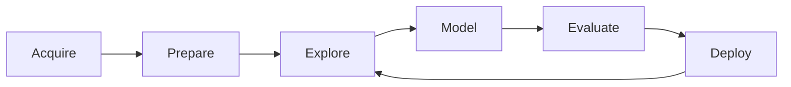

# Module 01: Data Science Fundamentals

Introduction to the data science lifecycle, core roles, and foundational tooling.

## Lessons

- Lesson 01 — Lifecycle & Roles Overview

## Learning Objectives

- Describe the iterative data science lifecycle (Acquire → Prepare → Explore → Model → Evaluate → Deploy)
- Differentiate roles (Data Analyst, Data Scientist, ML Engineer)
- Identify common tooling categories (notebooks, version control, data storage)
- Explain the importance of reproducibility and documentation

## Visual Overview

## Summary

This module sets the context for specialized topics like visualization, collection, and cleaning in later modules.

---

Proceed to the lesson to explore the lifecycle in detail.
