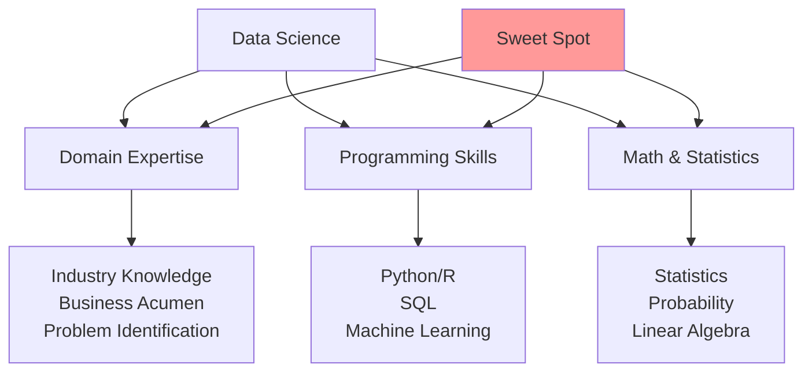
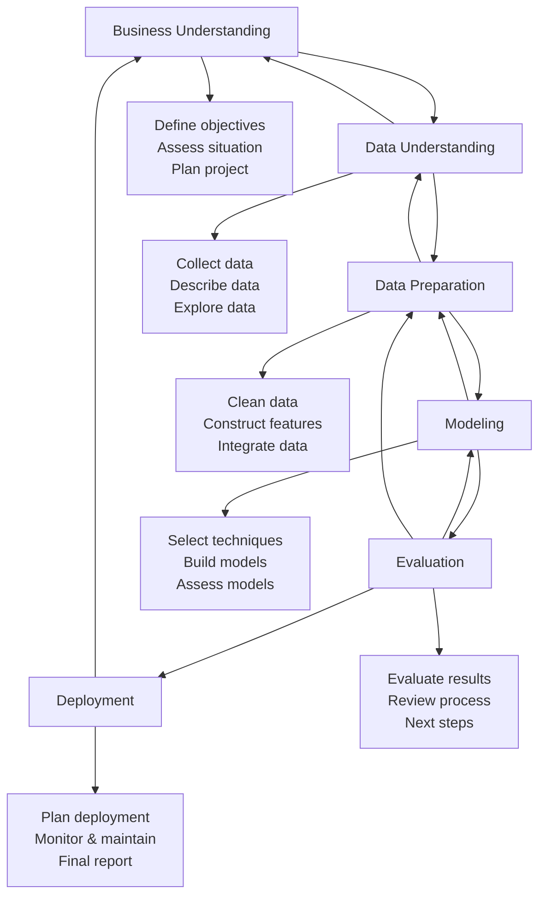
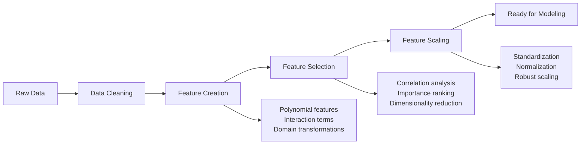
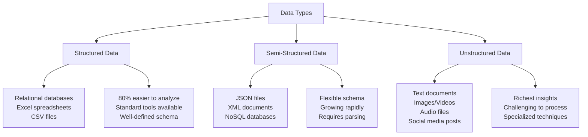
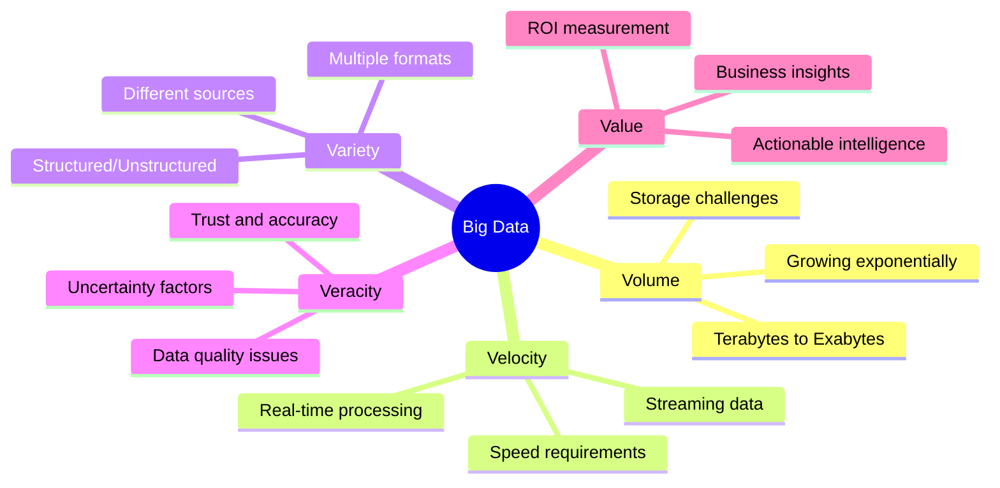
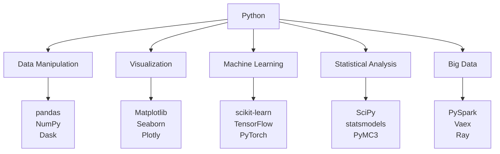
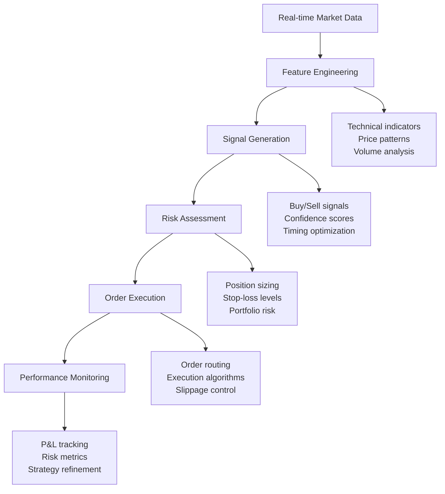
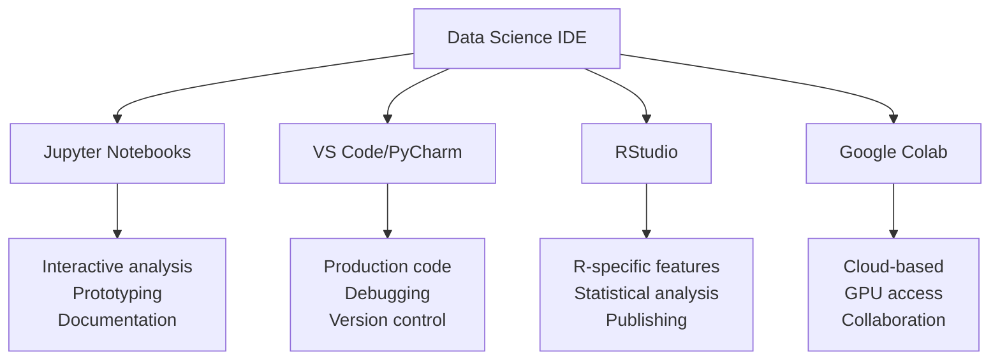
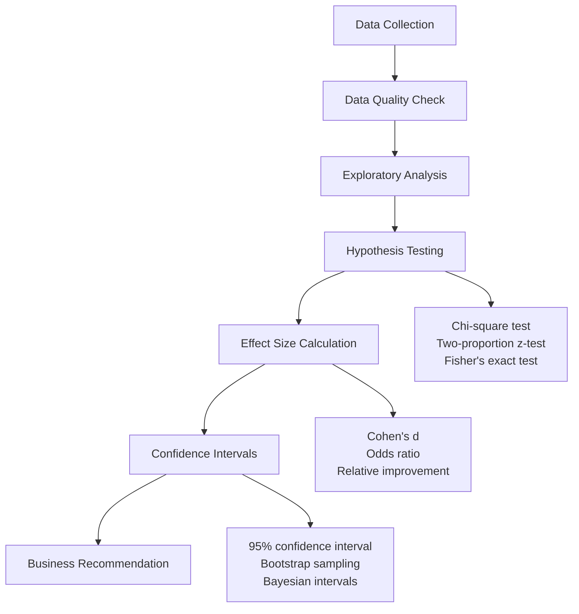

# Data Science Fundamentals: The Art and Science of Data-Driven Insights

> **UltraCube Learn-Library** | Data Science • Foundations • Beginner  
> **Author**: UltraCube Data Science Team  
> **Duration**: 55 minutes | **Difficulty**: ⭐⭐☆☆☆

---

## 🎯 Learning Objectives

By the end of this lesson, you will be able to:

- **Define** data science and explain its interdisciplinary components
- **Navigate** the complete data science lifecycle from problem to deployment
- **Classify** different types of data and analytical approaches
- **Understand** the statistical foundations and programming requirements
- **Identify** career paths and industry applications
- **Apply** basic data science thinking to real-world problems

---

## 📊 What is Data Science?

### Comprehensive Definition

**Data Science** is an interdisciplinary field that combines domain expertise, programming skills, and knowledge of mathematics and statistics to extract meaningful insights from structured and unstructured data.

> **Harvard Business Review (2024)**: "Data science is not just about big data or algorithms; it's about asking the right questions and finding actionable insights that drive business value."

### The Data Science Venn Diagram



### Evolution and Growth

#### **Data Science Market Growth** (McKinsey Global Institute 2024)

```
Global Data Science Market Value:
2020: $95.3 billion
2021: $113.7 billion    ████████████
2022: $135.8 billion    ███████████████
2023: $162.4 billion    ██████████████████
2024: $194.6 billion    ████████████████████████
2025: $233.5 billion    ████████████████████████████

Annual Growth Rate: 19.6%
```

#### **Job Market Statistics** (Kaggle Survey 2024)

- **Data Scientist** roles increased by 74% year-over-year
- **Average salary**: $126,000 globally, $165,000 in US
- **Most in-demand skills**: Python (87%), SQL (71%), Machine Learning (68%)
- **Top hiring industries**: Technology (31%), Finance (18%), Healthcare (14%)

---

## 🔄 The Data Science Lifecycle

### CRISP-DM Methodology

**Cross-Industry Standard Process for Data Mining (CRISP-DM)** is the most widely adopted framework:



### Detailed Phase Breakdown

#### **1. Business Understanding (25% of project time)**

**Key Activities**:
- Problem definition and scope
- Success criteria establishment
- Stakeholder alignment
- Resource assessment

**Deliverables**:
- Project charter
- Success metrics definition
- Risk assessment
- Timeline and budget

**Common Pitfalls**:
- Unclear problem definition
- Misaligned expectations
- Insufficient domain knowledge

#### **2. Data Understanding (20% of project time)**

**Key Activities**:
- Data source identification
- Data quality assessment
- Exploratory data analysis (EDA)
- Initial hypothesis formation

**Tools and Techniques**:
- **Python**: pandas, matplotlib, seaborn
- **R**: dplyr, ggplot2, summary functions
- **SQL**: Data profiling queries
- **Visualization**: Histograms, scatter plots, correlation matrices

#### **3. Data Preparation (50% of project time)**

> **Industry Reality**: "Data scientists spend 80% of their time preparing data" - Forbes (2024)

**Data Cleaning Tasks**:

| Issue Type | Frequency | Solutions |
|------------|-----------|-----------|
| **Missing Values** | 67% of datasets | Imputation, deletion, interpolation |
| **Duplicates** | 45% of datasets | Deduplication algorithms |
| **Inconsistent Formats** | 78% of datasets | Standardization, parsing |
| **Outliers** | 34% of datasets | Detection, treatment, removal |
| **Encoding Issues** | 23% of datasets | UTF-8 conversion, character mapping |

**Feature Engineering Process**:



---

## 📈 Types of Analytics

### The Analytics Maturity Model

```mermaid
pyramid
    title Analytics Maturity Pyramid
    "Prescriptive Analytics" : 10
    "Predictive Analytics" : 25  
    "Diagnostic Analytics" : 35
    "Descriptive Analytics" : 50
```

#### **1. Descriptive Analytics: "What happened?"**

**Purpose**: Summarize historical data to understand past performance

**Techniques**:
- Statistical summaries (mean, median, mode)
- Data visualization
- Reporting dashboards
- Key Performance Indicators (KPIs)

**Business Value**: 
- Performance monitoring
- Trend identification
- Historical comparisons

**Example**: Monthly sales reports showing revenue by region and product category

#### **2. Diagnostic Analytics: "Why did it happen?"**

**Purpose**: Investigate the root causes of outcomes or events

**Techniques**:
- Correlation analysis
- Cohort analysis
- Hypothesis testing
- Drill-down analysis

**Business Value**:
- Problem identification
- Process improvement
- Causal understanding

**Example**: Analyzing why customer churn increased by 15% in Q3

#### **3. Predictive Analytics: "What will happen?"**

**Purpose**: Forecast future outcomes based on historical patterns

**Techniques**:
- Machine learning algorithms
- Time series forecasting
- Regression analysis
- Classification models

**Business Value**:
- Risk assessment
- Demand forecasting
- Customer behavior prediction

**Example**: Predicting which customers are likely to churn in the next 30 days

#### **4. Prescriptive Analytics: "What should we do?"**

**Purpose**: Recommend optimal actions to achieve desired outcomes

**Techniques**:
- Optimization algorithms
- Simulation modeling
- Decision trees
- A/B testing frameworks

**Business Value**:
- Decision automation
- Resource optimization
- Strategic planning

**Example**: Optimizing pricing strategies to maximize revenue while maintaining customer satisfaction

---

## 🔍 Types of Data

### Data Classification Framework

#### **By Structure**



#### **By Source**

| Data Source | Characteristics | Examples | Processing Complexity |
|-------------|----------------|----------|---------------------|
| **Internal** | Controlled, consistent | CRM, ERP, logs | ⭐⭐☆☆☆ |
| **External** | Varied quality, formats | APIs, web scraping | ⭐⭐⭐☆☆ |
| **Public** | Free, large volume | Government data, research | ⭐⭐☆☆☆ |
| **Real-time** | Streaming, temporal | IoT sensors, social feeds | ⭐⭐⭐⭐☆ |

#### **The 5 V's of Big Data**



---

## 🧮 Statistical Foundations

### Essential Statistical Concepts

#### **Descriptive Statistics**

**Measures of Central Tendency**:
```
Dataset: [2, 4, 4, 4, 5, 5, 7, 9]

Mean (μ):     μ = Σx/n = 40/8 = 5.0
Median:       Middle value = 4.5 (average of 4 and 5)
Mode:         Most frequent = 4

Box Plot Representation:
    |----[====|====]----| 
    2    4   4.5  5    9
   Min  Q1  Med  Q3  Max
```

**Measures of Variability**:
- **Range**: Maximum - Minimum = 9 - 2 = 7
- **Variance**: σ² = Σ(x - μ)²/n = 4.5
- **Standard Deviation**: σ = √variance = 2.12

#### **Probability Distributions**

**Normal Distribution** (Bell Curve):
```
Empirical Rule (68-95-99.7):
       μ-3σ    μ-2σ    μ-σ     μ      μ+σ    μ+2σ    μ+3σ
         |       |       |       |       |       |       |
    0.1% | 2.1%  | 13.6% | 34.1% | 34.1% | 13.6% | 2.1%  | 0.1%
         |_______|_______|_______|_______|_______|_______|
                         68%
                     95%
                   99.7%
```

#### **Hypothesis Testing Framework**

```mermaid
graph TD
    A[Formulate Hypotheses] --> B[Choose Significance Level]
    B --> C[Select Test Statistic]
    C --> D[Calculate p-value]
    D --> E{p-value < α?}
    E -->|Yes| F[Reject H₀]
    E -->|No| G[Fail to Reject H₀]
    
    A --> A1[H₀: Null hypothesis<br/>H₁: Alternative hypothesis]
    B --> B1[α = 0.05 (common)<br/>Type I error rate]
    C --> C1[t-test, z-test, χ²<br/>Based on data type]
    D --> D1[Probability of observing<br/>data given H₀ is true]
```

---

## 💻 Programming in Data Science

### Language Comparison

#### **Python vs. R vs. SQL**

| Aspect | Python | R | SQL |
|--------|---------|---|-----|
| **Strength** | General purpose, ML | Statistics, visualization | Data querying |
| **Learning Curve** | ⭐⭐⭐☆☆ | ⭐⭐⭐⭐☆ | ⭐⭐☆☆☆ |
| **Industry Adoption** | 87% of data scientists | 56% of data scientists | 71% of data scientists |
| **Best For** | Production systems | Research, academia | Data extraction |

#### **Python Data Science Ecosystem**



### Essential Programming Concepts

#### **Data Structures for Data Science**

**Arrays and Matrices** (NumPy):
```python
import numpy as np

# Create arrays
data = np.array([1, 2, 3, 4, 5])
matrix = np.array([[1, 2], [3, 4]])

# Vectorized operations
result = data * 2  # [2, 4, 6, 8, 10]
```

**DataFrames** (pandas):
```python
import pandas as pd

# Create DataFrame
df = pd.DataFrame({
    'Name': ['Alice', 'Bob', 'Charlie'],
    'Age': [25, 30, 35],
    'Salary': [50000, 60000, 70000]
})

# Data operations
filtered = df[df['Age'] > 25]
grouped = df.groupby('Age')['Salary'].mean()
```

---

## 🌍 Real-World Applications

### Industry Use Cases

#### **Healthcare: Predictive Diagnostics**

**Case Study**: Early Cancer Detection using Medical Imaging

**Challenge**: Improve early detection rates for breast cancer screening

**Data Sources**:
- Medical imaging (mammograms, MRI)
- Patient demographics
- Medical history
- Lab results

**Machine Learning Approach**:
```mermaid
graph LR
    A[Medical Images] --> B[Preprocessing]
    B --> C[Feature Extraction]
    C --> D[Deep Learning Model]
    D --> E[Classification]
    E --> F[Risk Assessment]
    
    B --> B1[Noise reduction<br/>Normalization<br/>Augmentation]
    C --> C1[Texture analysis<br/>Shape features<br/>Intensity patterns]
    D --> D1[Convolutional<br/>Neural Network<br/>(CNN)]
    E --> E1[Benign vs<br/>Malignant<br/>Classification]
    F --> F1[Risk scores<br/>Treatment recommendations<br/>Follow-up scheduling]
```

**Results** (MIT Technology Review 2024):
- **Accuracy improvement**: 23% over traditional methods
- **Early detection**: 31% increase in Stage I diagnoses
- **False positives**: 42% reduction in unnecessary biopsies

#### **Finance: Algorithmic Trading**

**Case Study**: High-Frequency Trading Strategy

**Data Sources**:
- Market data (prices, volumes, order books)
- News sentiment analysis
- Economic indicators
- Social media trends

**Analytics Pipeline**:


#### **Retail: Customer Behavior Analytics**

**Case Study**: Personalized Recommendation System

**Amazon's Recommendation Engine** (Case Study):
- **35%** of revenue attributed to recommendations
- **150+ million** products in catalog
- **Real-time** personalization for 300+ million customers

**Recommendation Techniques**:

| Method | Description | Use Case | Accuracy |
|--------|-------------|----------|----------|
| **Collaborative Filtering** | User-item interactions | Similar users/items | 75-85% |
| **Content-Based** | Item characteristics | Cold start problems | 65-75% |
| **Hybrid Approach** | Combination of methods | Best of both worlds | 85-95% |
| **Deep Learning** | Neural networks | Complex patterns | 90-95% |

---

## 🛠️ Tools and Technologies

### The Modern Data Science Stack

#### **Development Environment**



#### **Machine Learning Platforms**

**Comparison of ML Platforms** (Gartner 2024):

| Platform | Strengths | Best For | Market Position |
|----------|-----------|----------|-----------------|
| **TensorFlow** | Deep learning, production | Neural networks | Leader |
| **PyTorch** | Research, flexibility | Academic research | Strong growth |
| **scikit-learn** | Classical ML, ease of use | Traditional algorithms | Stable |
| **XGBoost** | Gradient boosting, performance | Tabular data | Specialized |

#### **Cloud ML Services**

**Platform Comparison**:
```
Feature Completeness vs Ease of Use:

High Completeness │
                  │    AWS SageMaker ●
                  │              
                  │         Azure ML ●
                  │    
                  │              Google AI ●
                  │
                  │
Low Completeness  │________________________
                 Low                    High
                    Ease of Use
```

---

## 💻 Hands-On Exercise: Exploratory Data Analysis

### **Exercise 1: Statistical Analysis**

**Objective**: Perform basic statistical analysis on a real dataset

**Dataset**: Global COVID-19 vaccination data (WHO/Our World in Data)

**Tasks**:
1. **Load and inspect** the dataset
2. **Calculate** descriptive statistics
3. **Identify** missing values and outliers
4. **Create** visualizations to understand distributions

**Sample Code Structure**:
```python
import pandas as pd
import numpy as np
import matplotlib.pyplot as plt
import seaborn as sns

# Load data
df = pd.read_csv('covid_vaccinations.csv')

# Basic info
print(df.info())
print(df.describe())

# Missing values analysis
missing_data = df.isnull().sum()
print(missing_data[missing_data > 0])

# Visualization
plt.figure(figsize=(12, 8))
sns.histplot(data=df, x='people_vaccinated_per_hundred')
plt.title('Distribution of Vaccination Rates')
plt.show()
```

### **Exercise 2: Correlation Analysis**

**Objective**: Discover relationships between variables

**Analysis Framework**:
1. **Calculate** correlation matrix
2. **Create** heatmap visualization
3. **Interpret** correlation coefficients
4. **Identify** strong relationships

**Expected Deliverables**:
- Correlation matrix table
- Heatmap visualization
- Top 5 strongest correlations
- Business implications

### **Exercise 3: Time Series Analysis**

**Objective**: Analyze trends over time

**Dataset**: Stock market data (S&P 500)

**Tasks**:
1. **Plot** time series data
2. **Identify** trends and seasonality
3. **Calculate** moving averages
4. **Detect** anomalies

---

## 🧩 Challenge Puzzle: A/B Testing Design

### **Scenario**: E-commerce Website Optimization

**Company**: Online electronics retailer
**Challenge**: Improve conversion rate on product pages
**Current conversion rate**: 2.3%
**Goal**: Increase to 3.0% or higher

**Your Tasks**:

#### **1. Hypothesis Formation**
- **Null Hypothesis (H₀)**: New design has no effect on conversion rate
- **Alternative Hypothesis (H₁)**: New design increases conversion rate
- **Minimum Detectable Effect**: 0.7 percentage points

#### **2. Experimental Design**

**Sample Size Calculation**:
```
Given:
- Baseline conversion rate: 2.3%
- Desired conversion rate: 3.0%
- Statistical power: 80%
- Significance level: 5%

Required sample size per group: ~4,800 visitors
Total sample size needed: ~9,600 visitors
```

#### **3. Key Metrics Definition**

**Primary Metric**:
- Conversion rate (purchases/visitors)

**Secondary Metrics**:
- Click-through rate on product images
- Time spent on page
- Cart abandonment rate
- Revenue per visitor

#### **4. Statistical Analysis Plan**



**Expected Deliverables**:
- Complete experimental design document
- Statistical analysis plan
- Sample size justification
- Success criteria definition
- Risk mitigation strategies

---

## 📖 Additional Resources

### **Essential Books**
- "Python for Data Analysis" by Wes McKinney (pandas creator)
- "The Elements of Statistical Learning" by Hastie, Tibshirani, and Friedman
- "Hands-On Machine Learning" by Aurélien Géron
- "Think Stats" by Allen B. Downey

### **Online Courses and Certifications**
- **Coursera**: Data Science Specialization (Johns Hopkins)
- **edX**: MIT Introduction to Computational Thinking and Data Science
- **Kaggle Learn**: Free micro-courses on specific topics
- **DataCamp**: Interactive data science learning

### **Datasets for Practice**
- **Kaggle Datasets**: Competitions and community datasets
- **UCI ML Repository**: Classic machine learning datasets
- **Google Dataset Search**: Comprehensive dataset discovery
- **AWS Open Data**: Free datasets on AWS
- **Data.gov**: US government open data

### **Professional Communities**
- **Kaggle**: Competitions and learning community
- **Reddit**: r/datascience, r/MachineLearning
- **Stack Overflow**: Technical Q&A
- **LinkedIn**: Data science professional groups

### **Industry Publications**
- **Journal of Machine Learning Research (JMLR)**
- **Nature Machine Intelligence**
- **Harvard Business Review**: Data & Analytics
- **MIT Technology Review**: AI section

---

## ✅ Progress Check

### **Conceptual Understanding**

1. **Data Science Definition**: Explain data science using the three-circle Venn diagram model.

2. **Analytics Types**: Match each scenario to the correct analytics type:
   - "Sales decreased 15% last quarter" → [Descriptive/Diagnostic/Predictive/Prescriptive]
   - "Customer churn likely increased due to price changes" → [Descriptive/Diagnostic/Predictive/Prescriptive]
   - "30% probability of customer leaving next month" → [Descriptive/Diagnostic/Predictive/Prescriptive]
   - "Reduce price by 8% to minimize churn" → [Descriptive/Diagnostic/Predictive/Prescriptive]

3. **CRISP-DM Phases**: Order these activities in the correct CRISP-DM sequence:
   - Model evaluation
   - Data cleaning
   - Business problem definition
   - Feature engineering
   - Model deployment

### **Practical Skills Assessment**

Complete this mini-project checklist:
- [ ] Load a CSV dataset into pandas
- [ ] Calculate basic descriptive statistics
- [ ] Create at least 3 different visualizations
- [ ] Identify and handle missing values
- [ ] Perform correlation analysis
- [ ] Write a brief summary of insights

### **Career Readiness**

1. **Skill Gap Analysis**: Rate your current level (1-5) in each area:
   - Programming (Python/R): ___/5
   - Statistics and Mathematics: ___/5
   - Domain Knowledge: ___/5
   - Communication Skills: ___/5
   - Business Acumen: ___/5

2. **Learning Plan**: Based on your ratings, create a 3-month learning plan focusing on your lowest-scored areas.

---

## 🚀 Next Steps

### **Immediate Actions**
1. **Set up** your data science environment (Python + Jupyter)
2. **Complete** the hands-on exercises with real datasets
3. **Join** Kaggle and explore beginner-friendly competitions

### **Short-term Goals (1-3 months)**
- Complete an end-to-end data science project
- Learn advanced pandas and NumPy operations
- Master basic machine learning algorithms
- Build a portfolio of 2-3 projects

### **Upcoming Lessons**
- **Lesson 02**: Python Programming for Data Science
- **Lesson 03**: Statistics and Probability for Data Scientists
- **Lesson 04**: Data Visualization and Storytelling

### **Recommended Learning Path**
After foundations, choose your specialization:
- **Machine Learning Engineer**: Focus on algorithms and deployment
- **Data Analyst**: Emphasize statistics and visualization  
- **Research Scientist**: Deep dive into mathematics and research methods
- **Business Intelligence**: Concentrate on domain expertise and communication

---

<div align="center">

## 🎓 **Outstanding Achievement!**

You've completed your introduction to the fascinating world of data science! You now understand the fundamental concepts, methodologies, and applications that make data science one of the most impactful fields in technology.

**Ready to start analyzing?** Continue with hands-on programming and statistical analysis in our next modules.

</div>

---

**Lesson created by UltraCube Data Science Team** | [ucubetech.com](https://www.ucubetech.com) | **Copyright © 2025 UltraCube Technology**

> **Sources**: This lesson incorporates cutting-edge research and industry insights from Harvard Business Review, MIT Technology Review, McKinsey Global Institute, Gartner, Kaggle, and leading academic institutions to provide comprehensive and current data science knowledge.
