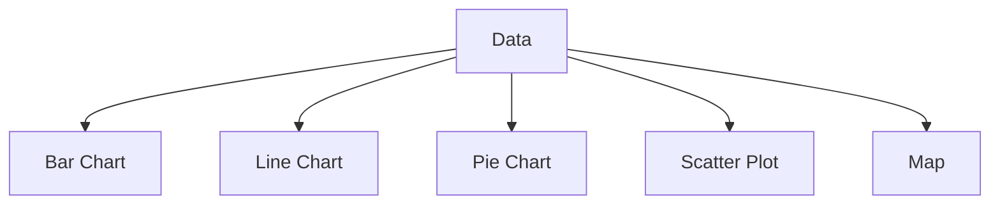

# Lesson 01: Introduction to Data Visualization

## Overview
Data visualization is the graphical representation of information and data. By using visual elements like charts, graphs, and maps, data visualization tools provide an accessible way to see and understand trends, outliers, and patterns in data.

## Learning Objectives

- Define data visualization and its importance
- Identify common types of data visualizations
- Understand best practices for effective visual communication

## Visual: Types of Data Visualizations

## Detailed Explanation

### What is Data Visualization?
Data visualization transforms raw data into visual context, making it easier to identify patterns, trends, and correlations that might go undetected in text-based data.

### Common Types of Visualizations
- **Bar Chart:** Compares quantities across categories
- **Line Chart:** Shows trends over time
- **Pie Chart:** Displays proportions of a whole
- **Scatter Plot:** Reveals relationships between variables
- **Map:** Visualizes geographic data

### Best Practices
- Choose the right chart for your data
- Keep visuals simple and uncluttered
- Use color and labels effectively

## References
- [Data Visualization: A Practical Introduction (Kieran Healy)](https://socviz.co/)
- [Fundamentals of Data Visualization (Claus Wilke)](https://clauswilke.com/dataviz/)
- [Data Viz Best Practices (Datawrapper)](https://blog.datawrapper.de/visualization-101/)
