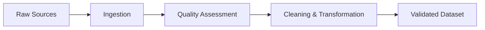

# Lesson 01: Data Collection and Cleaning Fundamentals

## Overview

Data collection and cleaning are foundational steps in the data science lifecycle. High-quality, reliable data enables accurate analysis, modeling, and decision-making.

## Learning Objectives

* Define data collection and cleaning
* Identify common data quality issues
* Apply basic data cleaning strategies

## Visual: Data Preparation Flow

## Detailed Explanation

### Data Collection

Gathering data from various sources (APIs, databases, files, sensors, web scraping). Good collection processes ensure traceability and reproducibility.

### Common Data Quality Issues

* Missing values
* Duplicates
* Inconsistent formats
* Outliers
* Incorrect types

### Data Cleaning Strategies

* Handle missing data (impute, drop, flag)
* Normalize formats (dates, casing, units)
* Remove or consolidate duplicates
* Validate schema and data types
* Document transformations

## References

* [An Introduction to Data Cleaning with R (Tidyverse)](https://r4ds.had.co.nz/)
* [Data Cleaning Techniques (OECD)](https://stats.oecd.org)
* [Pandas User Guide: Working with Missing Data](https://pandas.pydata.org/docs/user_guide/missing_data.html)
