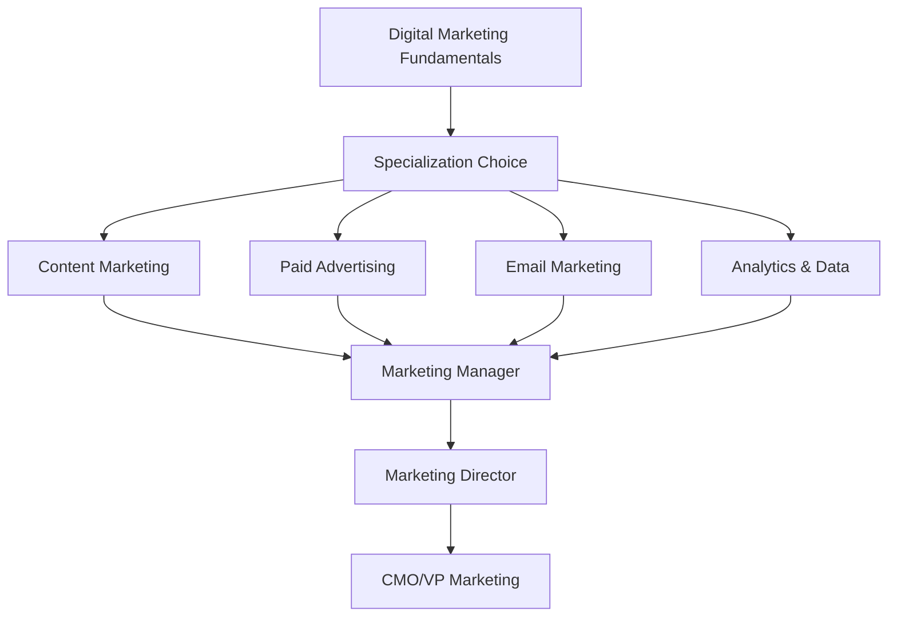

# 🏆 **Digital Marketing Fundamentals**

*Master modern marketing strategies, analytics, and customer acquisition*

## 📚 **Lesson Overview**

**Duration**: 50 minutes  
**Level**: Beginner  
**Prerequisites**: Basic business understanding, Internet familiarity  
**Learning Path**: Digital Marketing → Foundations → Digital Marketing Fundamentals

---

## 🎯 **Learning Objectives**

By the end of this lesson, you will be able to:

- ✅ Understand the complete digital marketing ecosystem and strategy development
- ✅ Create effective campaigns across multiple digital channels
- ✅ Analyze marketing performance using data analytics and KPIs
- ✅ Implement conversion optimization and customer retention strategies
- ✅ Build integrated marketing funnels that drive business growth

---

## 🌟 **Why This Matters**

Digital marketing drives modern business growth. **90% of businesses** now invest in digital marketing, with the industry valued at **$350 billion globally**. Companies using comprehensive digital strategies see **30% higher revenue growth** and **40% better customer retention**. According to **McKinsey**, businesses with strong digital marketing capabilities are **70% more likely** to survive economic downturns.

> *"The best marketing doesn't feel like marketing."* - **Tom Fishburne, Founder of Marketoonist**

**Industry Impact:**
- **Amazon**: $31B annual revenue from recommendation algorithms and personalization
- **Nike**: 35% revenue growth through direct-to-consumer digital strategy
- **HubSpot**: Built $1B+ business purely through inbound marketing methodology

---

## 📖 **Core Content**

### **1. Digital Marketing Ecosystem & Strategy (15 minutes)**

#### **🎯 Marketing Funnel Framework**

Understanding the customer journey is essential for effective digital marketing:

```python
# Digital Marketing Funnel Analysis
"""
AIDA Framework (Awareness → Interest → Desire → Action):

1. Awareness Stage (Top of Funnel - TOFU)
   - Content marketing (blogs, videos, podcasts)
   - Social media marketing
   - Search engine optimization (SEO)
   - Display advertising and retargeting

2. Interest Stage (Middle of Funnel - MOFU)
   - Email marketing and lead nurturing
   - Webinars and educational content
   - Social proof and case studies
   - Remarketing campaigns

3. Desire Stage (Middle of Funnel - MOFU)
   - Product demonstrations and trials
   - Customer testimonials and reviews
   - Personalized offers and recommendations
   - Consultative sales content

4. Action Stage (Bottom of Funnel - BOFU)
   - Conversion optimization
   - Shopping cart abandonment recovery
   - Limited-time offers and urgency
   - Post-purchase upselling and cross-selling
"""

import pandas as pd
import numpy as np
import matplotlib.pyplot as plt
import seaborn as sns
from datetime import datetime, timedelta

class DigitalMarketingAnalyzer:
    def __init__(self):
        self.channels = {
            'Content Marketing': {'cost_per_lead': 62, 'conversion_rate': 0.035, 'lifetime_value': 1200},
            'Social Media': {'cost_per_lead': 58, 'conversion_rate': 0.028, 'lifetime_value': 950},
            'Email Marketing': {'cost_per_lead': 12, 'conversion_rate': 0.045, 'lifetime_value': 1800},
            'PPC Advertising': {'cost_per_lead': 85, 'conversion_rate': 0.032, 'lifetime_value': 1100},
            'SEO': {'cost_per_lead': 35, 'conversion_rate': 0.041, 'lifetime_value': 1600},
            'Webinars': {'cost_per_lead': 95, 'conversion_rate': 0.065, 'lifetime_value': 2200}
        }
    
    def analyze_channel_performance(self):
        """Analyze performance metrics across marketing channels."""
        print("📊 Digital Marketing Channel Analysis")
        print("=" * 60)
        
        channel_data = []
        for channel, metrics in self.channels.items():
            roi = (metrics['lifetime_value'] * metrics['conversion_rate']) / metrics['cost_per_lead']
            channel_data.append({
                'Channel': channel,
                'Cost per Lead': metrics['cost_per_lead'],
                'Conversion Rate': f"{metrics['conversion_rate']:.1%}",
                'Customer LTV': metrics['lifetime_value'],
                'ROI': f"{roi:.2f}x"
            })
        
        df = pd.DataFrame(channel_data)
        print(df.to_string(index=False))
        
        # Calculate best performing channels
        print("\n🏆 Top Performing Channels:")
        roi_values = [(ch, (met['lifetime_value'] * met['conversion_rate']) / met['cost_per_lead']) 
                     for ch, met in self.channels.items()]
        roi_values.sort(key=lambda x: x[1], reverse=True)
        
        for i, (channel, roi) in enumerate(roi_values[:3], 1):
            print(f"  {i}. {channel}: {roi:.2f}x ROI")
        
        return df

analyzer = DigitalMarketingAnalyzer()
performance_data = analyzer.analyze_channel_performance()
```

#### **🌐 Multi-Channel Marketing Strategy**

```python
def create_integrated_marketing_strategy():
    """Develop a comprehensive multi-channel marketing strategy."""
    
    strategy_framework = {
        'Business Goals': {
            'primary_objective': 'Increase revenue by 40% in 12 months',
            'secondary_objectives': [
                'Acquire 1,000 new customers',
                'Improve customer retention by 25%',
                'Increase average order value by 15%',
                'Build brand awareness in target market'
            ]
        },
        'Target Audience': {
            'primary_persona': {
                'demographics': 'Age 25-45, College-educated, Income $50K-$150K',
                'psychographics': 'Tech-savvy, Value-conscious, Quality-focused',
                'pain_points': ['Time-constrained', 'Information overload', 'Budget limitations'],
                'preferred_channels': ['Email', 'Social Media', 'Search Engines', 'Video Content']
            },
            'secondary_persona': {
                'demographics': 'Age 35-55, Business owners, Income $75K+',
                'psychographics': 'Results-oriented, Brand-conscious, Efficiency-focused',
                'pain_points': ['Scaling challenges', 'ROI measurement', 'Technology adoption'],
                'preferred_channels': ['LinkedIn', 'Industry publications', 'Webinars', 'Email']
            }
        },
        'Channel Strategy': {
            'Content Marketing': {
                'budget_allocation': '25%',
                'focus': 'SEO-optimized blog posts, video content, downloadable resources',
                'kpis': ['Organic traffic growth', 'Content engagement', 'Lead generation'],
                'timeline': 'Long-term (6-12 months for results)'
            },
            'Paid Advertising': {
                'budget_allocation': '35%',
                'focus': 'Google Ads, Facebook/Instagram ads, LinkedIn advertising',
                'kpis': ['Click-through rate', 'Cost per acquisition', 'Return on ad spend'],
                'timeline': 'Short-term (immediate results)'
            },
            'Email Marketing': {
                'budget_allocation': '15%',
                'focus': 'Welcome series, nurture campaigns, product announcements',
                'kpis': ['Open rates', 'Click rates', 'Email attribution revenue'],
                'timeline': 'Medium-term (1-3 months for optimization)'
            },
            'Social Media': {
                'budget_allocation': '20%',
                'focus': 'Community building, customer service, brand awareness',
                'kpis': ['Engagement rate', 'Follower growth', 'Social media conversions'],
                'timeline': 'Ongoing (daily engagement required)'
            },
            'Marketing Automation': {
                'budget_allocation': '5%',
                'focus': 'Lead scoring, behavior-triggered campaigns, retention',
                'kpis': ['Automation conversion rates', 'Lead qualification', 'Customer lifetime value'],
                'timeline': 'Medium-term (2-4 months for full implementation)'
            }
        }
    }
    
    print("🎯 Integrated Digital Marketing Strategy")
    print("=" * 60)
    
    for section, details in strategy_framework.items():
        print(f"\n📋 {section}:")
        if isinstance(details, dict):
            for key, value in details.items():
                if isinstance(value, dict):
                    print(f"  {key.replace('_', ' ').title()}:")
                    for subkey, subvalue in value.items():
                        print(f"    {subkey.replace('_', ' ').title()}: {subvalue}")
                elif isinstance(value, list):
                    print(f"  {key.replace('_', ' ').title()}:")
                    for item in value:
                        print(f"    • {item}")
                else:
                    print(f"  {key.replace('_', ' ').title()}: {value}")
        else:
            print(f"  {details}")
    
    return strategy_framework

marketing_strategy = create_integrated_marketing_strategy()
```

### **2. Content Marketing & SEO (15 minutes)**

#### **📝 Content Marketing Mastery**

```python
class ContentMarketingEngine:
    def __init__(self):
        self.content_types = {
            'Blog Posts': {'production_time': 4, 'reach_potential': 'High', 'engagement': 'Medium', 'seo_value': 'High'},
            'Video Content': {'production_time': 8, 'reach_potential': 'Very High', 'engagement': 'Very High', 'seo_value': 'High'},
            'Infographics': {'production_time': 6, 'reach_potential': 'Medium', 'engagement': 'High', 'seo_value': 'Medium'},
            'Podcasts': {'production_time': 3, 'reach_potential': 'Medium', 'engagement': 'Very High', 'seo_value': 'Low'},
            'Webinars': {'production_time': 10, 'reach_potential': 'Medium', 'engagement': 'Very High', 'seo_value': 'Medium'},
            'Case Studies': {'production_time': 6, 'reach_potential': 'Low', 'engagement': 'High', 'seo_value': 'High'}
        }
    
    def create_content_calendar(self):
        """Generate a strategic content calendar."""
        print("📅 Strategic Content Calendar")
        print("=" * 50)
        
        # 12-week content plan
        weeks = []
        content_themes = [
            'Industry Trends', 'How-to Guides', 'Case Studies', 'Expert Interviews',
            'Product Features', 'Customer Success', 'Behind the Scenes', 'Educational',
            'Seasonal/Timely', 'User-Generated', 'Thought Leadership', 'Community'
        ]
        
        for week in range(1, 13):
            theme = content_themes[week - 1]
            week_plan = {
                'week': week,
                'theme': theme,
                'blog_post': self.generate_content_idea(theme, 'blog'),
                'social_content': self.generate_content_idea(theme, 'social'),
                'video_content': self.generate_content_idea(theme, 'video'),
                'email_campaign': self.generate_content_idea(theme, 'email')
            }
            weeks.append(week_plan)
        
        # Display first 4 weeks as example
        for week_data in weeks[:4]:
            print(f"\n🗓️ Week {week_data['week']}: {week_data['theme']}")
            print(f"  Blog: {week_data['blog_post']}")
            print(f"  Social: {week_data['social_content']}")
            print(f"  Video: {week_data['video_content']}")
            print(f"  Email: {week_data['email_campaign']}")
        
        return weeks
    
    def generate_content_idea(self, theme, content_type):
        """Generate content ideas based on theme and type."""
        ideas = {
            'Industry Trends': {
                'blog': '2024 Digital Marketing Trends That Will Transform Your Strategy',
                'social': 'Quick trend analysis with industry statistics',
                'video': '5-minute trend breakdown with expert commentary',
                'email': 'Weekly trend digest with actionable insights'
            },
            'How-to Guides': {
                'blog': 'Complete Guide to Setting Up Marketing Automation',
                'social': 'Step-by-step carousel posts with tips',
                'video': 'Screen recording tutorial with best practices',
                'email': 'Email course series with practical exercises'
            },
            'Case Studies': {
                'blog': 'How Company X Increased ROI by 300% Using Our Strategy',
                'social': 'Before/after transformation highlights',
                'video': 'Customer interview and results showcase',
                'email': 'Success story with behind-the-scenes insights'
            },
            'Expert Interviews': {
                'blog': 'Industry Leader Shares Secrets to Marketing Success',
                'social': 'Quote graphics from expert insights',
                'video': 'Full interview with actionable takeaways',
                'email': 'Expert tip of the week series'
            }
        }
        
        return ideas.get(theme, {}).get(content_type, 'Custom content idea')
    
    def analyze_content_performance(self):
        """Analyze content performance metrics."""
        print("\n📊 Content Performance Analysis")
        print("=" * 50)
        
        # Simulate content performance data
        np.random.seed(42)
        content_data = []
        
        for content_type, metrics in self.content_types.items():
            performance = {
                'Content Type': content_type,
                'Avg. Views': np.random.randint(500, 5000),
                'Engagement Rate': f"{np.random.uniform(0.02, 0.08):.1%}",
                'Lead Generation': np.random.randint(5, 50),
                'Production Cost': f"${metrics['production_time'] * 50}",
                'ROI Score': np.random.uniform(1.5, 4.5)
            }
            content_data.append(performance)
        
        df = pd.DataFrame(content_data)
        print(df.to_string(index=False))
        
        return df

content_engine = ContentMarketingEngine()
content_calendar = content_engine.create_content_calendar()
content_performance = content_engine.analyze_content_performance()
```

#### **🔍 SEO Strategy Implementation**

```python
def seo_optimization_framework():
    """Comprehensive SEO strategy and implementation guide."""
    
    seo_checklist = {
        'Technical SEO': {
            'site_speed': 'Optimize for <3 second load time',
            'mobile_responsiveness': 'Ensure mobile-first design',
            'crawlability': 'Submit XML sitemap, check robots.txt',
            'https_security': 'Implement SSL certificate',
            'structured_data': 'Add schema markup for rich snippets'
        },
        'On-Page SEO': {
            'keyword_research': 'Target long-tail keywords with search volume 1K-10K',
            'title_optimization': 'Include primary keyword in title tag',
            'meta_descriptions': 'Write compelling 150-160 character descriptions',
            'header_structure': 'Use H1-H6 hierarchy with keyword placement',
            'internal_linking': 'Link to relevant internal pages with descriptive anchor text'
        },
        'Content SEO': {
            'content_quality': 'Create comprehensive, authoritative content',
            'keyword_density': 'Maintain 1-2% keyword density naturally',
            'content_length': 'Aim for 1,500+ words for competitive topics',
            'user_intent': 'Match content to search intent (informational, commercial, transactional)',
            'freshness': 'Update content regularly to maintain relevance'
        },
        'Off-Page SEO': {
            'link_building': 'Acquire high-quality backlinks from authoritative sites',
            'guest_posting': 'Publish on relevant industry publications',
            'local_seo': 'Optimize Google My Business and local citations',
            'social_signals': 'Encourage social sharing and engagement',
            'reputation_management': 'Monitor and respond to online reviews'
        }
    }
    
    print("🔍 SEO Optimization Framework")
    print("=" * 50)
    
    for category, tactics in seo_checklist.items():
        print(f"\n📋 {category}:")
        for tactic, description in tactics.items():
            print(f"  ✅ {tactic.replace('_', ' ').title()}: {description}")
    
    # SEO performance tracking
    print("\n📈 SEO Performance Metrics to Track:")
    seo_metrics = [
        'Organic traffic growth (month-over-month)',
        'Keyword ranking improvements',
        'Click-through rates from search results',
        'Page load speed and Core Web Vitals',
        'Backlink quality and quantity',
        'Local search visibility (if applicable)'
    ]
    
    for metric in seo_metrics:
        print(f"  📊 {metric}")
    
    return seo_checklist

seo_framework = seo_optimization_framework()
```

### **3. Paid Advertising & Social Media Marketing (10 minutes)**

#### **💰 PPC Campaign Management**

```python
class PaidAdvertisingManager:
    def __init__(self):
        self.platforms = {
            'Google Ads': {
                'best_for': 'High-intent search traffic',
                'avg_cpc': '$2.50',
                'conversion_rate': '3.2%',
                'audience_targeting': 'Keywords, demographics, remarketing'
            },
            'Facebook Ads': {
                'best_for': 'Brand awareness and social engagement',
                'avg_cpc': '$1.80',
                'conversion_rate': '2.8%',
                'audience_targeting': 'Detailed demographics, interests, behaviors'
            },
            'LinkedIn Ads': {
                'best_for': 'B2B lead generation',
                'avg_cpc': '$5.20',
                'conversion_rate': '4.1%',
                'audience_targeting': 'Job titles, company size, industry'
            },
            'YouTube Ads': {
                'best_for': 'Video content and brand storytelling',
                'avg_cpc': '$0.85',
                'conversion_rate': '2.1%',
                'audience_targeting': 'Video topics, channel audiences, remarketing'
            }
        }
    
    def campaign_optimization_guide(self):
        """Guide for optimizing paid advertising campaigns."""
        print("💰 Paid Advertising Campaign Optimization")
        print("=" * 60)
        
        optimization_strategies = {
            'Campaign Structure': [
                'Organize campaigns by product/service category',
                'Create tightly themed ad groups (5-20 keywords)',
                'Use single keyword ad groups (SKAGs) for high-value terms',
                'Implement negative keyword lists to improve relevance'
            ],
            'Ad Copy Testing': [
                'Test at least 3 ad variations per ad group',
                'Focus on unique value propositions and benefits',
                'Include strong call-to-action phrases',
                'Test emotional vs. rational messaging approaches'
            ],
            'Bidding Strategy': [
                'Start with manual CPC for control and learning',
                'Gradually transition to automated bidding strategies',
                'Set appropriate bid adjustments for device, location, time',
                'Monitor and adjust based on conversion data'
            ],
            'Landing Page Optimization': [
                'Ensure message match between ad and landing page',
                'Optimize for fast loading speed (<3 seconds)',
                'Use clear headlines and compelling copy',
                'Include trust signals and social proof'
            ]
        }
        
        for strategy, tactics in optimization_strategies.items():
            print(f"\n🎯 {strategy}:")
            for tactic in tactics:
                print(f"  • {tactic}")
        
        # ROI calculation example
        print(f"\n💡 Campaign ROI Calculation Example:")
        print(f"  Ad Spend: $1,000")
        print(f"  Conversions: 25")
        print(f"  Average Order Value: $85")
        print(f"  Revenue: $2,125")
        print(f"  ROI: 112.5% (2.125x return)")
    
    def social_media_strategy(self):
        """Comprehensive social media marketing strategy."""
        print("\n📱 Social Media Marketing Strategy")
        print("=" * 50)
        
        platform_strategies = {
            'Instagram': {
                'content_focus': 'Visual storytelling, behind-the-scenes, user-generated content',
                'posting_frequency': '1-2 posts daily, 3-5 stories daily',
                'best_practices': ['Use relevant hashtags', 'Post consistently', 'Engage with followers'],
                'kpis': ['Engagement rate', 'Reach', 'Story completion rate']
            },
            'LinkedIn': {
                'content_focus': 'Industry insights, professional development, company culture',
                'posting_frequency': '3-5 posts weekly',
                'best_practices': ['Share valuable insights', 'Engage in discussions', 'Build professional network'],
                'kpis': ['Connection growth', 'Post engagement', 'Lead generation']
            },
            'Twitter': {
                'content_focus': 'Real-time updates, customer service, industry conversations',
                'posting_frequency': '3-5 tweets daily',
                'best_practices': ['Join trending conversations', 'Respond quickly', 'Share curated content'],
                'kpis': ['Follower growth', 'Mentions', 'Click-through rate']
            },
            'TikTok': {
                'content_focus': 'Creative videos, trends, educational content',
                'posting_frequency': '1-3 videos daily',
                'best_practices': ['Follow trends', 'Create original content', 'Use popular sounds'],
                'kpis': ['View rate', 'Engagement rate', 'Follower growth']
            }
        }
        
        for platform, strategy in platform_strategies.items():
            print(f"\n🎯 {platform}:")
            print(f"  Content Focus: {strategy['content_focus']}")
            print(f"  Posting Frequency: {strategy['posting_frequency']}")
            print(f"  Best Practices: {', '.join(strategy['best_practices'])}")
            print(f"  Key Metrics: {', '.join(strategy['kpis'])}")

advertising_manager = PaidAdvertisingManager()
advertising_manager.campaign_optimization_guide()
advertising_manager.social_media_strategy()
```

### **4. Analytics & Performance Measurement (10 minutes)**

#### **📊 Marketing Analytics Dashboard**

```python
class MarketingAnalyticsDashboard:
    def __init__(self):
        self.kpis = {
            'Acquisition Metrics': {
                'website_traffic': 'Total visitors, unique visitors, page views',
                'traffic_sources': 'Organic, paid, social, direct, referral traffic breakdown',
                'cost_per_acquisition': 'Total marketing spend / number of new customers',
                'conversion_rate': 'Percentage of visitors who complete desired action'
            },
            'Engagement Metrics': {
                'bounce_rate': 'Percentage of single-page sessions',
                'time_on_site': 'Average session duration',
                'pages_per_session': 'Average pages viewed per visit',
                'social_engagement': 'Likes, shares, comments across platforms'
            },
            'Revenue Metrics': {
                'customer_lifetime_value': 'Total revenue from average customer relationship',
                'average_order_value': 'Average purchase amount per transaction',
                'revenue_attribution': 'Revenue attributed to each marketing channel',
                'return_on_ad_spend': 'Revenue generated / advertising spend'
            },
            'Retention Metrics': {
                'customer_retention_rate': 'Percentage of customers who make repeat purchases',
                'churn_rate': 'Percentage of customers who stop purchasing',
                'email_engagement': 'Open rates, click rates, unsubscribe rates',
                'net_promoter_score': 'Customer satisfaction and likelihood to recommend'
            }
        }
    
    def create_performance_dashboard(self):
        """Create a comprehensive marketing performance dashboard."""
        print("📊 Marketing Analytics Dashboard")
        print("=" * 60)
        
        # Simulate dashboard data
        np.random.seed(42)
        
        dashboard_data = {
            'Website Traffic': {
                'total_visitors': '45,230',
                'unique_visitors': '38,150',
                'bounce_rate': '34.2%',
                'avg_session_duration': '3:42'
            },
            'Campaign Performance': {
                'total_campaigns': '12',
                'active_campaigns': '8',
                'avg_cpc': '$2.35',
                'overall_roas': '3.8x'
            },
            'Lead Generation': {
                'total_leads': '1,245',
                'qualified_leads': '432',
                'lead_conversion_rate': '34.7%',
                'cost_per_lead': '$45'
            },
            'Revenue Impact': {
                'attributed_revenue': '$89,450',
                'new_customers': '156',
                'customer_ltv': '$1,850',
                'revenue_growth': '+23%'
            }
        }
        
        for section, metrics in dashboard_data.items():
            print(f"\n📈 {section}:")
            for metric, value in metrics.items():
                print(f"  {metric.replace('_', ' ').title()}: {value}")
    
    def advanced_attribution_modeling(self):
        """Implement advanced attribution modeling for multi-touch campaigns."""
        print("\n🎯 Advanced Attribution Modeling")
        print("=" * 50)
        
        attribution_models = {
            'First-Touch Attribution': {
                'description': 'Credits 100% to first touchpoint',
                'best_for': 'Measuring awareness campaigns',
                'limitations': 'Ignores nurturing touchpoints'
            },
            'Last-Touch Attribution': {
                'description': 'Credits 100% to final touchpoint',
                'best_for': 'Measuring conversion campaigns',
                'limitations': 'Ignores awareness touchpoints'
            },
            'Time-Decay Attribution': {
                'description': 'More credit to touchpoints closer to conversion',
                'best_for': 'Balanced view of customer journey',
                'limitations': 'Complex to implement and interpret'
            },
            'Position-Based Attribution': {
                'description': '40% to first, 40% to last, 20% to middle touchpoints',
                'best_for': 'Comprehensive marketing strategy',
                'limitations': 'May not fit all business models'
            }
        }
        
        for model, details in attribution_models.items():
            print(f"\n📊 {model}:")
            print(f"  Description: {details['description']}")
            print(f"  Best For: {details['best_for']}")
            print(f"  Limitations: {details['limitations']}")
        
        # Sample customer journey analysis
        print(f"\n🗺️ Sample Customer Journey Analysis:")
        journey_steps = [
            {'touchpoint': 'Google Search Ad', 'attribution_value': '40%', 'time': 'Day 1'},
            {'touchpoint': 'Blog Article Read', 'attribution_value': '10%', 'time': 'Day 3'},
            {'touchpoint': 'Email Click', 'attribution_value': '10%', 'time': 'Day 7'},
            {'touchpoint': 'Facebook Ad Click', 'attribution_value': '40%', 'time': 'Day 14'}
        ]
        
        for step in journey_steps:
            print(f"  {step['time']}: {step['touchpoint']} - {step['attribution_value']} credit")

analytics_dashboard = MarketingAnalyticsDashboard()
analytics_dashboard.create_performance_dashboard()
analytics_dashboard.advanced_attribution_modeling()
```

---

## 🛠️ **Hands-On Lab: Complete Digital Marketing Campaign**

### **Lab Objective**

Launch a comprehensive digital marketing campaign for a fictional SaaS product with full tracking and optimization.

### **Requirements**

1. ✅ Multi-channel campaign strategy and execution
2. ✅ Content creation and distribution plan
3. ✅ Paid advertising setup and optimization
4. ✅ Email marketing automation sequences
5. ✅ Analytics implementation and reporting

### **Implementation**

```python
# Complete digital marketing campaign project

class DigitalMarketingCampaign:
    def __init__(self, product_name, target_audience, budget):
        self.product_name = product_name
        self.target_audience = target_audience
        self.budget = budget
        self.campaign_data = {}
    
    def campaign_strategy_planning(self):
        """Develop comprehensive campaign strategy."""
        print(f"🚀 Campaign Strategy: {self.product_name}")
        print("=" * 60)
        
        strategy = {
            'product': self.product_name,
            'target_audience': self.target_audience,
            'total_budget': f"${self.budget:,}",
            'campaign_duration': '90 days',
            'primary_goal': 'Acquire 500 new customers',
            'secondary_goals': [
                'Increase brand awareness by 40%',
                'Generate 2,000 qualified leads',
                'Achieve 3.5x ROAS across all channels'
            ],
            'budget_allocation': {
                'paid_advertising': f"${int(self.budget * 0.4):,} (40%)",
                'content_creation': f"${int(self.budget * 0.25):,} (25%)",
                'email_marketing': f"${int(self.budget * 0.15):,} (15%)",
                'social_media': f"${int(self.budget * 0.15):,} (15%)",
                'analytics_tools': f"${int(self.budget * 0.05):,} (5%)"
            },
            'key_messaging': {
                'value_proposition': 'Streamline your workflow and boost productivity by 50%',
                'unique_selling_points': [
                    'AI-powered automation features',
                    'Seamless team collaboration tools',
                    'Enterprise-grade security and compliance'
                ],
                'call_to_action': 'Start your free 14-day trial today'
            }
        }
        
        for section, details in strategy.items():
            if isinstance(details, dict):
                print(f"\n📋 {section.replace('_', ' ').title()}:")
                for key, value in details.items():
                    if isinstance(value, list):
                        print(f"  {key.replace('_', ' ').title()}:")
                        for item in value:
                            print(f"    • {item}")
                    else:
                        print(f"  {key.replace('_', ' ').title()}: {value}")
            elif isinstance(details, list):
                print(f"\n📋 {section.replace('_', ' ').title()}:")
                for item in details:
                    print(f"  • {item}")
            else:
                print(f"\n📋 {section.replace('_', ' ').title()}: {details}")
        
        self.campaign_data['strategy'] = strategy
        return strategy
    
    def content_marketing_plan(self):
        """Create detailed content marketing plan."""
        print(f"\n📝 Content Marketing Plan")
        print("=" * 50)
        
        content_plan = {
            'blog_content': {
                'posting_frequency': '3 posts per week',
                'content_types': ['How-to guides', 'Industry insights', 'Case studies', 'Product updates'],
                'seo_targets': ['project management software', 'team collaboration tools', 'productivity apps'],
                'content_calendar': [
                    'Week 1: "10 Project Management Best Practices for Remote Teams"',
                    'Week 2: "How AI is Transforming Workplace Productivity"',
                    'Week 3: "Case Study: How Company X Reduced Project Time by 40%"',
                    'Week 4: "The Ultimate Guide to Team Collaboration in 2024"'
                ]
            },
            'video_content': {
                'production_schedule': '2 videos per week',
                'content_formats': ['Product demos', 'Customer testimonials', 'Educational tutorials', 'Behind-the-scenes'],
                'distribution_channels': ['YouTube', 'LinkedIn', 'Website', 'Email campaigns'],
                'video_topics': [
                    'Product Feature Spotlight: AI Task Automation',
                    'Customer Success Story: 500% ROI Achievement',
                    'Tutorial: Setting Up Your First Project in 5 Minutes'
                ]
            },
            'social_media_content': {
                'platforms': ['LinkedIn', 'Twitter', 'Instagram', 'Facebook'],
                'posting_frequency': 'Daily across all platforms',
                'content_mix': '40% educational, 30% promotional, 20% user-generated, 10% behind-the-scenes',
                'hashtag_strategy': '#productivity #projectmanagement #teamwork #saas #automation'
            },
            'downloadable_resources': {
                'lead_magnets': [
                    'Project Management Template Pack',
                    'Remote Team Productivity Checklist',
                    'ROI Calculator for Project Management Tools',
                    'Annual Productivity Report with Industry Benchmarks'
                ],
                'gated_content': 'Require email signup for downloads',
                'follow_up_sequence': '5-email nurture campaign over 2 weeks'
            }
        }
        
        for section, details in content_plan.items():
            print(f"\n🎯 {section.replace('_', ' ').title()}:")
            for key, value in details.items():
                if isinstance(value, list):
                    print(f"  {key.replace('_', ' ').title()}:")
                    for item in value:
                        print(f"    • {item}")
                else:
                    print(f"  {key.replace('_', ' ').title()}: {value}")
        
        self.campaign_data['content'] = content_plan
        return content_plan
    
    def paid_advertising_campaigns(self):
        """Set up comprehensive paid advertising campaigns."""
        print(f"\n💰 Paid Advertising Campaigns")
        print("=" * 50)
        
        ad_campaigns = {
            'google_ads': {
                'campaign_types': ['Search campaigns', 'Display campaigns', 'YouTube ads'],
                'budget_allocation': f"${int(self.budget * 0.25):,}",
                'target_keywords': [
                    'project management software',
                    'team collaboration tools',
                    'productivity apps for teams',
                    'task management platform'
                ],
                'ad_copy_variations': [
                    'Boost Team Productivity by 50% | Free 14-Day Trial',
                    'The #1 Project Management Tool for Remote Teams',
                    'Streamline Projects. Increase Efficiency. Try Free Today!'
                ],
                'landing_pages': ['Product demo page', 'Free trial signup', 'Feature comparison']
            },
            'facebook_instagram_ads': {
                'campaign_objectives': ['Brand awareness', 'Lead generation', 'Conversions'],
                'budget_allocation': f"${int(self.budget * 0.10):,}",
                'audience_targeting': {
                    'demographics': 'Age 25-55, College educated, Management roles',
                    'interests': 'Project management, Business software, Productivity',
                    'behaviors': 'Business decision makers, Software purchasers'
                },
                'ad_formats': ['Single image ads', 'Carousel ads', 'Video ads', 'Lead forms']
            },
            'linkedin_ads': {
                'campaign_focus': 'B2B lead generation and thought leadership',
                'budget_allocation': f"${int(self.budget * 0.05):,}",
                'targeting_criteria': {
                    'job_titles': ['Project Manager', 'Operations Manager', 'Team Lead', 'Director'],
                    'company_size': '50-1000 employees',
                    'industries': ['Technology', 'Consulting', 'Healthcare', 'Financial Services']
                },
                'content_strategy': 'Professional, data-driven messaging with ROI focus'
            }
        }
        
        for platform, campaign_details in ad_campaigns.items():
            print(f"\n🎯 {platform.replace('_', ' ').title()} Campaign:")
            for key, value in campaign_details.items():
                if isinstance(value, dict):
                    print(f"  {key.replace('_', ' ').title()}:")
                    for subkey, subvalue in value.items():
                        print(f"    {subkey.replace('_', ' ').title()}: {subvalue}")
                elif isinstance(value, list):
                    print(f"  {key.replace('_', ' ').title()}:")
                    for item in value:
                        print(f"    • {item}")
                else:
                    print(f"  {key.replace('_', ' ').title()}: {value}")
        
        self.campaign_data['paid_ads'] = ad_campaigns
        return ad_campaigns
    
    def email_marketing_automation(self):
        """Design comprehensive email marketing automation."""
        print(f"\n📧 Email Marketing Automation")
        print("=" * 50)
        
        email_sequences = {
            'welcome_series': {
                'trigger': 'New email signup',
                'duration': '7 days',
                'emails': [
                    'Day 0: Welcome + Product overview video',
                    'Day 1: Getting started guide and quick wins',
                    'Day 3: Feature deep-dive: AI automation',
                    'Day 5: Customer success story and ROI data',
                    'Day 7: Special offer: 20% off first year'
                ],
                'goals': 'Educate new leads and drive trial signups'
            },
            'trial_nurture': {
                'trigger': 'Free trial signup',
                'duration': '14 days (trial period)',
                'emails': [
                    'Day 0: Trial activation and setup assistance',
                    'Day 2: Feature tutorial: Project templates',
                    'Day 5: Productivity tips and best practices',
                    'Day 8: Advanced features showcase',
                    'Day 11: Pre-trial-end: Upgrade incentive',
                    'Day 14: Trial expiration: Last chance offer'
                ],
                'goals': 'Maximize trial engagement and conversion'
            },
            'lead_nurturing': {
                'trigger': 'Downloaded resource but no trial',
                'duration': '30 days',
                'emails': [
                    'Week 1: Educational content related to download',
                    'Week 2: Industry insights and trends',
                    'Week 3: Case study with measurable results',
                    'Week 4: Product demo invitation and trial offer'
                ],
                'goals': 'Build trust and move leads toward trial'
            },
            'customer_onboarding': {
                'trigger': 'Paid subscription activation',
                'duration': '60 days',
                'emails': [
                    'Day 0: Welcome to the platform + quick start guide',
                    'Day 3: Advanced setup and customization tips',
                    'Day 7: Feature spotlight: Team collaboration',
                    'Day 14: Productivity measurement and optimization',
                    'Day 30: Account review and upgrade opportunities',
                    'Day 60: Success milestone celebration + referral program'
                ],
                'goals': 'Ensure successful onboarding and reduce churn'
            }
        }
        
        for sequence, details in email_sequences.items():
            print(f"\n📬 {sequence.replace('_', ' ').title()}:")
            print(f"  Trigger: {details['trigger']}")
            print(f"  Duration: {details['duration']}")
            print(f"  Goals: {details['goals']}")
            print(f"  Email Schedule:")
            for email in details['emails']:
                print(f"    • {email}")
        
        self.campaign_data['email'] = email_sequences
        return email_sequences
    
    def analytics_and_tracking_setup(self):
        """Implement comprehensive analytics and tracking."""
        print(f"\n📊 Analytics & Tracking Setup")
        print("=" * 50)
        
        tracking_setup = {
            'web_analytics': {
                'tools': ['Google Analytics 4', 'Google Tag Manager', 'Hotjar'],
                'key_events': [
                    'Page views and session data',
                    'Trial signup conversions',
                    'Demo request submissions',
                    'Content engagement metrics',
                    'Email subscription events'
                ],
                'custom_dimensions': ['Traffic source', 'Campaign ID', 'User type', 'Industry']
            },
            'conversion_tracking': {
                'tools': ['Google Ads Conversion Tracking', 'Facebook Pixel', 'LinkedIn Insight Tag'],
                'conversion_events': [
                    'Trial signup ($50 value)',
                    'Demo request ($25 value)',
                    'Paid subscription ($500 value)',
                    'Resource download ($10 value)'
                ],
                'attribution_model': 'Position-based (40-20-40)'
            },
            'email_analytics': {
                'platform': 'HubSpot Marketing Hub',
                'tracked_metrics': [
                    'Open rates by sequence and email',
                    'Click-through rates and engagement',
                    'Unsubscribe rates and list health',
                    'Email attribution to conversions'
                ],
                'a_b_testing': 'Subject lines, send times, content variations'
            },
            'reporting_dashboard': {
                'update_frequency': 'Daily automated reports, weekly deep-dive analysis',
                'key_metrics': [
                    'Cost per acquisition by channel',
                    'Customer lifetime value trends',
                    'Campaign ROI and ROAS',
                    'Lead quality scores',
                    'Conversion funnel performance'
                ],
                'stakeholder_reports': 'Executive summary, marketing team details, sales team leads'
            }
        }
        
        for section, details in tracking_setup.items():
            print(f"\n🎯 {section.replace('_', ' ').title()}:")
            for key, value in details.items():
                if isinstance(value, list):
                    print(f"  {key.replace('_', ' ').title()}:")
                    for item in value:
                        print(f"    • {item}")
                else:
                    print(f"  {key.replace('_', ' ').title()}: {value}")
        
        self.campaign_data['analytics'] = tracking_setup
        return tracking_setup
    
    def campaign_optimization_plan(self):
        """Create ongoing optimization and testing plan."""
        print(f"\n🔧 Campaign Optimization Plan")
        print("=" * 50)
        
        optimization_plan = {
            'testing_schedule': {
                'week_1_2': 'Baseline data collection and initial A/B tests',
                'week_3_4': 'Ad copy and creative optimization',
                'week_5_6': 'Landing page conversion optimization',
                'week_7_8': 'Email sequence refinement',
                'week_9_10': 'Audience targeting optimization',
                'week_11_12': 'Budget reallocation based on performance'
            },
            'optimization_targets': {
                'cost_per_acquisition': 'Reduce by 25% through testing',
                'conversion_rates': 'Improve by 15% across all channels',
                'email_engagement': 'Increase open rates by 20%',
                'content_performance': 'Double organic traffic growth rate'
            },
            'success_metrics': {
                'primary_kpis': [
                    'Customer acquisition cost < $100',
                    'Return on ad spend > 3.5x',
                    'Trial-to-paid conversion rate > 15%',
                    'Customer lifetime value > $1,500'
                ],
                'secondary_kpis': [
                    'Website traffic growth > 50%',
                    'Email list growth > 2,000 subscribers',
                    'Social media engagement rate > 5%',
                    'Content organic reach > 100K impressions'
                ]
            }
        }
        
        for section, details in optimization_plan.items():
            print(f"\n🎯 {section.replace('_', ' ').title()}:")
            if isinstance(details, dict):
                for key, value in details.items():
                    if isinstance(value, list):
                        print(f"  {key.replace('_', ' ').title()}:")
                        for item in value:
                            print(f"    • {item}")
                    else:
                        print(f"  {key.replace('_', ' ').title()}: {value}")
            else:
                print(f"  {details}")
        
        return optimization_plan

# Execute the complete campaign
print("🚀 LAUNCHING COMPREHENSIVE DIGITAL MARKETING CAMPAIGN")
print("=" * 80)

# Create campaign for fictional SaaS product
campaign = DigitalMarketingCampaign(
    product_name="ProductivityPro",
    target_audience="Remote teams and project managers at growing companies",
    budget=50000
)

# Execute all campaign components
strategy = campaign.campaign_strategy_planning()
content = campaign.content_marketing_plan()
paid_ads = campaign.paid_advertising_campaigns()
email = campaign.email_marketing_automation()
analytics = campaign.analytics_and_tracking_setup()
optimization = campaign.campaign_optimization_plan()

print(f"\n🎉 CAMPAIGN LAUNCH COMPLETE!")
print(f"📊 Expected Results After 90 Days:")
print(f"  • 500+ new customers acquired")
print(f"  • $175,000+ in attributed revenue")
print(f"  • 3.5x return on advertising spend")
print(f"  • 40% increase in brand awareness")
```

---

## 🎯 **Next Steps & Career Development**

### **Digital Marketing Career Progression**



### **Career Opportunities & Salary Ranges**

| **Role** | **Focus Area** | **Salary Range** | **Key Skills** |
|----------|----------------|------------------|----------------|
| **Digital Marketing Specialist** | Campaign execution | $45K - $70K | Social media, content creation, basic analytics |
| **PPC Manager** | Paid advertising | $55K - $85K | Google Ads, Facebook Ads, conversion optimization |
| **Content Marketing Manager** | Content strategy | $60K - $90K | SEO, content creation, editorial planning |
| **Marketing Analytics Manager** | Data & insights | $70K - $110K | Analytics tools, data analysis, reporting |
| **Digital Marketing Manager** | Strategy & leadership | $80K - $120K | Multi-channel expertise, team management |
| **Growth Marketing Director** | Scaling & optimization | $120K - $180K | Advanced analytics, experimentation, strategic planning |

### **Industry Certifications**

#### **Google Certifications**
- **Google Ads Certification**: Search, Display, Video, Shopping campaigns
- **Google Analytics Certification**: Web analytics and data insights
- **Google Marketing Platform**: Advanced advertising and measurement

#### **Facebook/Meta Certifications**
- **Facebook Blueprint Certification**: Social media advertising mastery
- **Instagram Marketing Certification**: Visual content marketing expertise

#### **Other Valuable Certifications**
- **HubSpot Content Marketing Certification**: Inbound marketing methodology
- **Hootsuite Social Media Certification**: Multi-platform social management
- **Salesforce Marketing Cloud**: Enterprise marketing automation

---

## 📚 **Additional Resources**

### **Essential Marketing Tools**

```python
# Marketing technology stack for different business sizes
marketing_tools = {
    'Startup/Small Business': {
        'email_marketing': ['Mailchimp', 'ConvertKit', 'Klaviyo'],
        'social_media': ['Buffer', 'Hootsuite', 'Later'],
        'analytics': ['Google Analytics', 'Google Search Console', 'Hotjar'],
        'content_creation': ['Canva', 'Unsplash', 'Grammarly'],
        'automation': ['Zapier', 'IFTTT', 'HubSpot CRM']
    },
    'Mid-Size Business': {
        'marketing_automation': ['HubSpot', 'Marketo', 'Pardot'],
        'advanced_analytics': ['Adobe Analytics', 'Mixpanel', 'Amplitude'],
        'content_management': ['WordPress', 'Contentful', 'Webflow'],
        'paid_advertising': ['Google Ads Editor', 'Facebook Business Manager', 'LinkedIn Campaign Manager'],
        'customer_data': ['Segment', 'Salesforce', 'Microsoft Dynamics']
    },
    'Enterprise': {
        'marketing_platform': ['Adobe Experience Cloud', 'Salesforce Marketing Cloud', 'Oracle Eloqua'],
        'advanced_personalization': ['Optimizely', 'Dynamic Yield', 'Monetate'],
        'data_management': ['Snowflake', 'Tableau', 'Looker'],
        'attribution_modeling': ['Attribution.io', 'AppsFlyer', 'Kochava'],
        'marketing_ops': ['Asana', 'Monday.com', 'Workfront']
    }
}

print("🛠️ Marketing Technology Stack by Business Size:")
for business_size, tools in marketing_tools.items():
    print(f"\n{business_size}:")
    for category, tool_list in tools.items():
        print(f"  {category.replace('_', ' ').title()}: {', '.join(tool_list)}")
```

### **Learning Resources & Communities**

- **Digital Marketing Institute**: Professional certification programs
- **Google Skillshop**: Free training on Google marketing platforms
- **Facebook Blueprint**: Comprehensive social media marketing education
- **Marketing Land & Search Engine Land**: Industry news and insights
- **Growth Hackers Community**: Experimental marketing strategies
- **Reddit r/marketing**: Active community discussions and advice

### **Books & Publications**

- **"Digital Marketing for Dummies" by Ryan Deiss**: Comprehensive beginner's guide
- **"Traction" by Gabriel Weinberg**: 19 channels for startup growth
- **"Made to Stick" by Chip Heath**: Creating memorable marketing messages
- **"Contagious" by Jonah Berger**: Psychology of viral content and word-of-mouth

---

## ✅ **Lesson Complete!**

**🎉 Congratulations!** You've mastered digital marketing fundamentals and are equipped to create, execute, and optimize comprehensive marketing campaigns that drive real business results. You now understand the complete digital marketing ecosystem and can leverage multiple channels to achieve your marketing objectives.

**📈 Progress Tracking:**

- ✅ Complete understanding of digital marketing strategy and ecosystem
- ✅ Multi-channel campaign planning and execution capabilities
- ✅ Content marketing and SEO optimization expertise
- ✅ Paid advertising management across major platforms
- ✅ Analytics implementation and performance measurement skills
- ✅ Email marketing automation and customer journey mapping

**🚀 Ready for Next Lesson**: [Advanced Digital Marketing Analytics](../intermediate/marketing-analytics.md)

---

*This lesson is part of the **Learn-Library Professional Technology Education Platform**. For support and community discussions, visit [GitHub Discussions](https://github.com/Ultra-Cube/Learn-Library/discussions).*
