# Digital Marketing Fundamentals: Mastering the Digital Customer Journey

> **UltraCube Learn-Library** | Digital Marketing • Foundations • Beginner  
> **Author**: UltraCube Digital Marketing Team  
> **Duration**: 50 minutes | **Difficulty**: ⭐⭐☆☆☆

---

## 🎯 Learning Objectives

By the end of this lesson, you will be able to:

- **Define** digital marketing and understand its role in modern business
- **Navigate** the digital customer journey from awareness to advocacy
- **Identify** key digital marketing channels and their optimal use cases
- **Measure** marketing performance using analytics and KPIs
- **Create** integrated digital marketing strategies for different business goals
- **Apply** best practices for customer acquisition and retention

---

## 📱 What is Digital Marketing?

### Comprehensive Definition

**Digital Marketing** is the practice of promoting products, services, or brands through digital channels and technologies to reach, engage, and convert target audiences into customers and advocates.

> **HubSpot State of Marketing (2024)**: "Digital marketing has evolved from a supplementary channel to the primary method for customer acquisition, with 87% of businesses reporting digital channels as their most effective marketing investment."

### Digital Marketing Evolution

#### **Market Growth and Impact** (Statista 2024)

```
Global Digital Marketing Spend:
2020: $378.16 billion
2021: $455.30 billion    ████████████
2022: $521.02 billion    ██████████████
2023: $616.80 billion    ████████████████
2024: $740.30 billion    ██████████████████████
2025: $876.10 billion    ██████████████████████████

Annual Growth Rate: 18.3%
```

#### **Digital vs Traditional Marketing** (Nielsen 2024)

| Metric | Digital Marketing | Traditional Marketing |
|--------|------------------|----------------------|
| **Global Ad Spend** | 64.4% ($740B) | 35.6% ($410B) |
| **ROI Measurement** | Real-time analytics | Delayed/limited |
| **Targeting Precision** | Granular audience targeting | Broad demographics |
| **Cost Efficiency** | High (avg. $0.78 CPC) | Lower (avg. $28 CPM) |
| **Interactivity** | Two-way engagement | One-way communication |
| **Flexibility** | Real-time optimization | Fixed campaigns |

### Digital Marketing Ecosystem

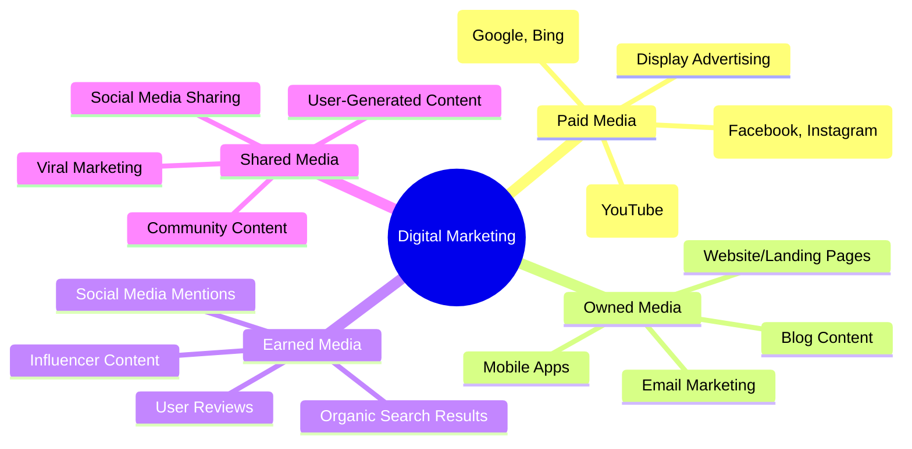

---

## 🛒 The Digital Customer Journey

### Customer Journey Framework

#### **The Modern Marketing Funnel**

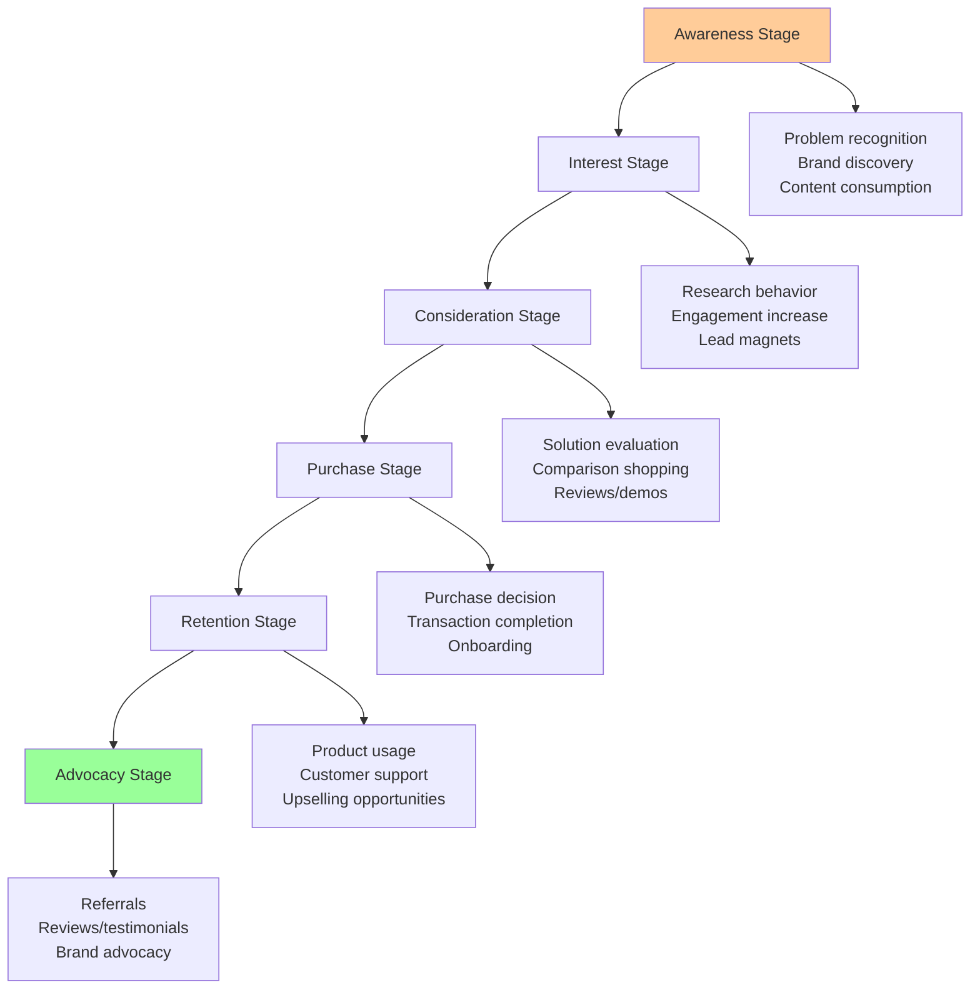

#### **Journey Stage Analytics** (Adobe Digital Marketing Report 2024)

**Conversion Rates by Stage**:

```
Funnel Conversion Performance:
Awareness → Interest:     68% conversion rate
Interest → Consideration: 23% conversion rate
Consideration → Purchase: 12% conversion rate
Purchase → Retention:     47% conversion rate
Retention → Advocacy:     18% conversion rate

Overall Funnel Efficiency: 1.2% (awareness to advocacy)
```

### Digital Touchpoints

#### **Customer Touchpoint Mapping**

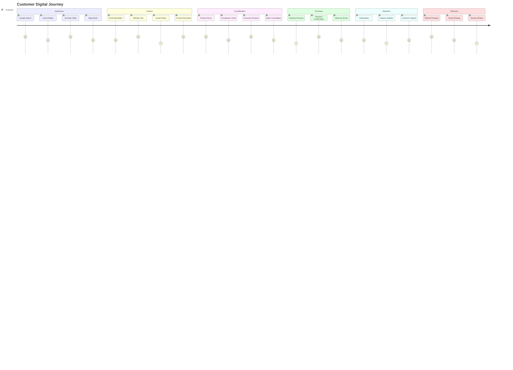

#### **Touchpoint Effectiveness** (Salesforce Customer Experience 2024)

| Touchpoint | Awareness Impact | Conversion Rate | Customer Satisfaction |
|------------|------------------|-----------------|----------------------|
| **Search Engines** | 78% | 3.2% | 4.1/5 |
| **Social Media** | 65% | 1.8% | 3.8/5 |
| **Email Marketing** | 34% | 4.7% | 4.3/5 |
| **Content Marketing** | 71% | 2.9% | 4.2/5 |
| **Video Content** | 82% | 4.1% | 4.5/5 |
| **Influencer Marketing** | 58% | 3.7% | 4.0/5 |

---

## 📊 Key Digital Marketing Channels

### Search Engine Marketing (SEM)

#### **Search Marketing Landscape**

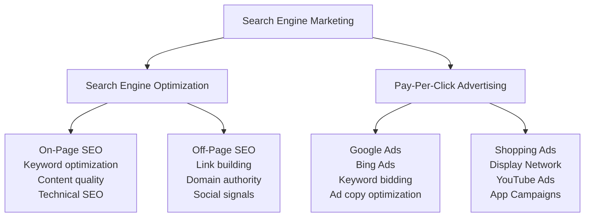

#### **Search Engine Market Share** (Statista 2024)

```
Global Search Engine Usage:
Google      █████████████████████████████████ 91.9%
Bing        █████ 3.0%
Yahoo       ██ 1.2%
Baidu       ██ 1.1%
Yandex      █ 0.9%
DuckDuckGo  █ 0.6%
Other       █ 1.3%
```

#### **SEO vs. PPC Investment Strategy**

| Factor | SEO (Organic) | PPC (Paid) |
|--------|---------------|-------------|
| **Time to Results** | 3-6 months | Immediate |
| **Cost Structure** | Long-term investment | Per-click payment |
| **Click-Through Rate** | 28.5% (position 1) | 3.17% (average) |
| **Sustainability** | Long-lasting | Campaign-dependent |
| **Competition Level** | High | Variable by keyword |
| **Control Level** | Limited | Full control |

### Social Media Marketing

#### **Platform Demographics and Usage** (Facebook Business 2024)

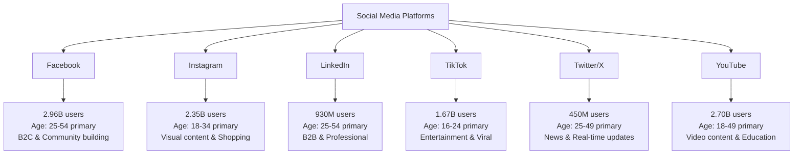

#### **Social Media Marketing ROI** (HubSpot 2024)

**Platform Performance Metrics**:

| Platform | Avg. Engagement Rate | Cost Per Click | Conversion Rate | Best Content Type |
|----------|---------------------|----------------|-----------------|-------------------|
| **Facebook** | 0.18% | $0.44 | 1.85% | Video, carousel ads |
| **Instagram** | 0.67% | $0.40 | 1.08% | Stories, reels |
| **LinkedIn** | 0.35% | $2.74 | 2.74% | Professional content |
| **TikTok** | 5.96% | $0.39 | 1.22% | Short-form video |
| **YouTube** | 1.63% | $0.54 | 2.58% | Educational video |

### Email Marketing

#### **Email Marketing Performance** (MarketingLand 2024)

```
Email Marketing Statistics:
Average Open Rate:      ████████████████████ 21.5%
Average Click Rate:     ██████ 2.6%
Average Conversion:     ███ 1.33%
ROI (Return on Investment): $42 for every $1 spent

Industry Variations:
Government:     ████████████████████████████ 28.77%
Non-profit:     ██████████████████████████ 25.17%
Healthcare:     ████████████████████████ 22.15%
Education:      ██████████████████████ 20.45%
Retail:         ████████████████████ 18.39%
Technology:     ████████████████ 16.97%
```

#### **Email Campaign Types and Performance**

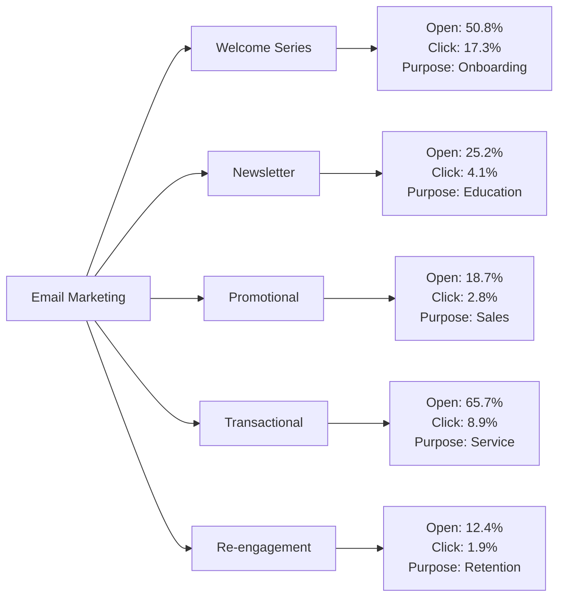

### Content Marketing

#### **Content Marketing Strategy Framework**

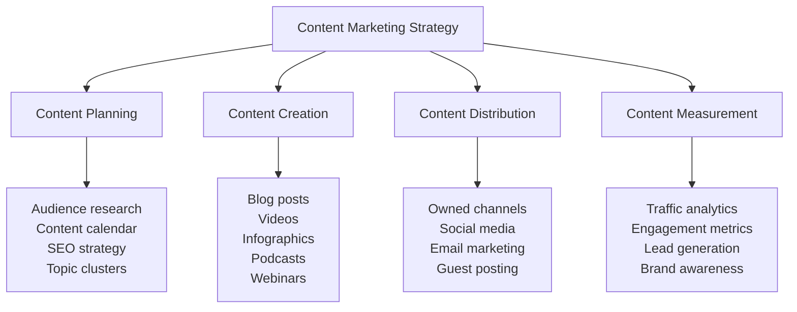

#### **Content Performance by Type** (Adobe 2024)

| Content Type | Engagement Rate | Share Rate | Lead Generation | Production Cost |
|--------------|----------------|------------|-----------------|-----------------|
| **Video Content** | 6.72% | 12.4% | High | ⭐⭐⭐⭐☆ |
| **Infographics** | 4.23% | 8.7% | Medium | ⭐⭐⭐☆☆ |
| **Blog Posts** | 2.31% | 3.2% | High | ⭐⭐☆☆☆ |
| **Podcasts** | 7.89% | 5.1% | Medium | ⭐⭐⭐☆☆ |
| **Webinars** | 8.94% | 4.6% | Very High | ⭐⭐⭐⭐☆ |
| **Case Studies** | 3.67% | 6.8% | Very High | ⭐⭐⭐☆☆ |

---

## 📈 Digital Marketing Analytics

### Key Performance Indicators (KPIs)

#### **Marketing Metrics Hierarchy**

```mermaid
pyramid
    title Marketing Metrics Pyramid
    "Business Impact" : 10
    "Marketing ROI & Revenue" : 20
    "Conversion & Sales Metrics" : 35
    "Engagement & Behavior Metrics" : 50
    "Traffic & Awareness Metrics" : 75
```

#### **Essential KPIs by Business Goal**

**Brand Awareness Metrics**:

- **Reach**: Total unique users exposed to content
- **Impressions**: Total times content was displayed
- **Brand Mention Volume**: Social media and web mentions
- **Share of Voice**: Brand visibility vs. competitors
- **Brand Recall**: Survey-based awareness measurement

**Lead Generation Metrics**:

- **Cost Per Lead (CPL)**: Marketing spend ÷ leads generated
- **Lead Quality Score**: Based on demographics and behavior
- **Conversion Rate**: Visitors ÷ leads generated
- **Lead-to-Customer Ratio**: Leads ÷ paying customers
- **Customer Acquisition Cost (CAC)**: Total cost to acquire customer

**Revenue Metrics**:

- **Return on Ad Spend (ROAS)**: Revenue ÷ advertising cost
- **Customer Lifetime Value (CLV)**: Total revenue per customer
- **Marketing ROI**: (Revenue - Cost) ÷ Cost × 100
- **Revenue Attribution**: Revenue by marketing channel
- **Average Order Value (AOV)**: Total revenue ÷ number of orders

### Analytics Tools and Platforms

#### **Marketing Technology Stack** (Gartner 2024)

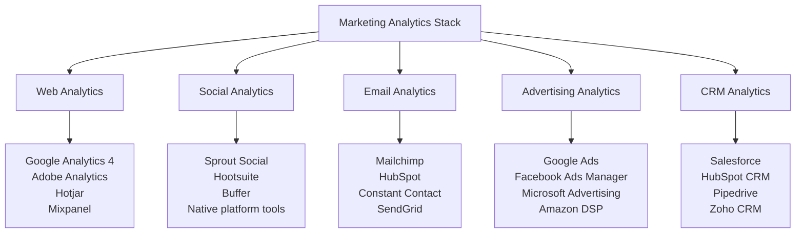

#### **Google Analytics 4 Essential Reports**

**Audience Reports**:

```
User Demographics (Sample Data):
Age Groups:
18-24: ████████ 18.3%
25-34: ██████████████████ 34.7%
35-44: ████████████ 24.1%
45-54: ████████ 15.2%
55-64: ████ 7.7%

Device Categories:
Mobile:  █████████████████ 56.8%
Desktop: ████████████ 35.2%
Tablet:  ████ 8.0%
```

**Conversion Tracking**:

- **Goal Completions**: Specific actions (form fills, purchases)
- **E-commerce Tracking**: Revenue, transactions, products
- **Event Tracking**: Custom interactions and behaviors
- **Attribution Modeling**: Credit assignment across touchpoints

---

## 🎯 Digital Marketing Strategy Development

### Strategy Framework

#### **SOSTAC Planning Model**

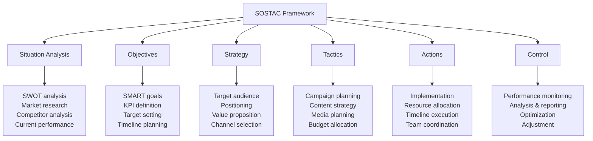

### Audience Targeting and Segmentation

#### **Customer Persona Development**

**Persona Template Structure**:

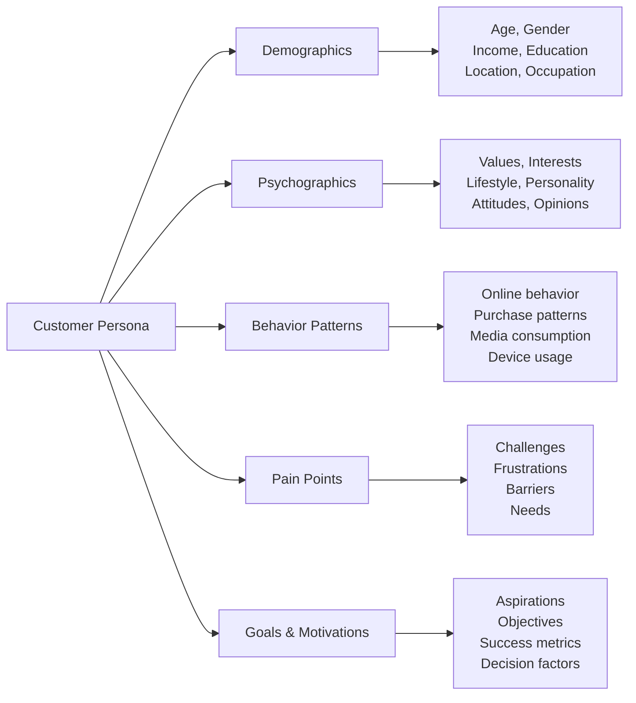

#### **Targeting Methods**

| Targeting Type | Description | Use Cases | Precision Level |
|----------------|-------------|-----------|-----------------|
| **Demographic** | Age, gender, income | Broad audience reach | ⭐⭐⭐☆☆ |
| **Geographic** | Location-based targeting | Local businesses | ⭐⭐⭐⭐☆ |
| **Behavioral** | Past actions and interests | E-commerce retargeting | ⭐⭐⭐⭐⭐ |
| **Psychographic** | Values and lifestyle | Brand alignment | ⭐⭐⭐⭐☆ |
| **Lookalike** | Similar to existing customers | Audience expansion | ⭐⭐⭐⭐⭐ |

### Budget Allocation and Planning

#### **Digital Marketing Budget Distribution** (McKinsey 2024)

```
Typical Budget Allocation:
Search Marketing:    ████████████████████ 35%
Social Media:        ████████████ 20%
Content Marketing:   ████████████ 18%
Email Marketing:     ██████ 10%
Display Advertising: ████████ 12%
Marketing Technology: ███ 5%

Budget by Business Size:
Small Business (<$1M revenue): $1,000-5,000/month
Medium Business ($1M-10M): $5,000-25,000/month
Large Business (>$10M): $25,000-100,000+/month
```

---

## 💼 Industry Applications and Case Studies

### E-commerce Digital Marketing

#### **Case Study: Online Retail Success**

**Company**: Mid-size fashion retailer  
**Challenge**: Increase online sales by 40% in 12 months  
**Budget**: $180,000 annual marketing spend

**Multi-Channel Strategy**:

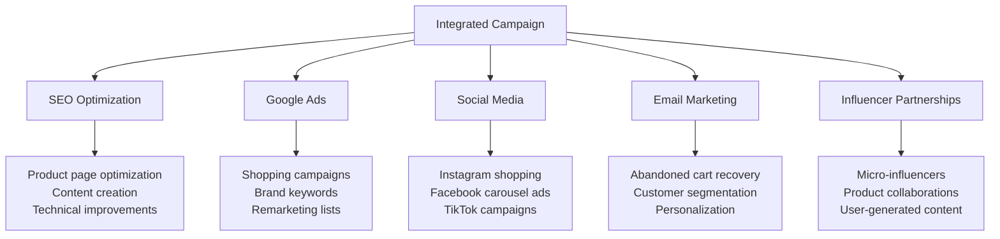

**Results Achieved**:

- **Revenue Growth**: 47% increase (exceeded goal)
- **Traffic Increase**: 73% organic, 156% paid
- **Conversion Rate**: Improved from 2.1% to 3.4%
- **Customer Acquisition Cost**: Reduced by 23%
- **Return on Ad Spend**: 4.2:1 average across channels

### B2B Lead Generation

#### **SaaS Company Lead Generation Strategy**

**Target Audience**: Technology decision-makers at mid-market companies

**Channel Strategy Performance**:

| Channel | Investment | Leads Generated | Cost Per Lead | Conversion Rate |
|---------|------------|-----------------|---------------|-----------------|
| **Content Marketing** | $45,000 | 1,247 | $36 | 12.3% |
| **LinkedIn Ads** | $32,000 | 398 | $80 | 18.7% |
| **Google Ads** | $28,000 | 567 | $49 | 8.9% |
| **Webinars** | $15,000 | 234 | $64 | 24.1% |
| **Email Nurturing** | $8,000 | 189 | $42 | 15.6% |

**Lead Nurturing Workflow**:

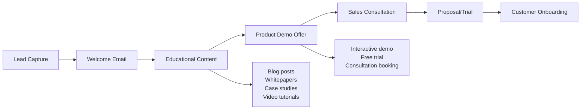

---

## 💻 Hands-On Digital Marketing Exercises

### **Exercise 1: Customer Journey Mapping**

**Objective**: Create a detailed customer journey for a specific business scenario

**Scenario**: Local fitness gym wants to attract new members

**Your Tasks**:

1. **Define Customer Personas**
   - Create 2-3 detailed customer personas
   - Include demographics, goals, and pain points
   - Identify preferred communication channels

2. **Map Journey Stages**
   - Document touchpoints for each stage
   - Identify potential friction points
   - Suggest optimization opportunities

3. **Content Strategy**
   - Develop content ideas for each stage
   - Align content with customer needs
   - Plan content distribution channels

**Deliverable Template**:

```
Customer Persona: [Name]
Demographics: [Age, income, lifestyle]
Goals: [What they want to achieve]
Pain Points: [Current challenges]
Preferred Channels: [Social media, email, etc.]

Journey Stage | Touchpoints | Content Needs | Metrics
-------------|-------------|---------------|----------
Awareness    | [List]      | [List]        | [List]
Interest     | [List]      | [List]        | [List]
Consideration| [List]      | [List]        | [List]
Purchase     | [List]      | [List]        | [List]
Retention    | [List]      | [List]        | [List]
```

### **Exercise 2: Social Media Content Calendar**

**Objective**: Plan a 30-day content calendar for business promotion

**Business Type**: Choose from:
- Local restaurant
- Professional service firm
- E-commerce store
- Software company

**Requirements**:
- 3-4 posts per week across 2 platforms
- Mix of content types (educational, promotional, engaging)
- Include relevant hashtags and posting times
- Align with business goals

**Content Categories**:

| Content Type | Purpose | Frequency | Examples |
|--------------|---------|-----------|----------|
| **Educational** | Build authority | 40% | Tips, tutorials, insights |
| **Promotional** | Drive sales | 20% | Product features, offers |
| **Behind-the-scenes** | Humanize brand | 20% | Team, process, culture |
| **User-generated** | Social proof | 10% | Reviews, customer photos |
| **Entertainment** | Engagement | 10% | Humor, trends, polls |

### **Exercise 3: Email Campaign Development**

**Objective**: Design a complete email marketing campaign

**Campaign Type**: Product launch announcement

**Components to Create**:

1. **Subject Line Testing**
   - Write 3 different subject lines
   - Consider urgency, curiosity, benefit-focused
   - Predict open rates

2. **Email Design**
   - Header with clear value proposition
   - Body content with benefits and features
   - Clear call-to-action (CTA)
   - Mobile-responsive layout

3. **Segmentation Strategy**
   - Identify different audience segments
   - Customize messaging for each group
   - Plan send timing and frequency

4. **Follow-up Sequence**
   - Plan 3-email follow-up series
   - Include different angles and offers
   - Set appropriate timing intervals

---

## 🎲 Challenge Project: Complete Digital Marketing Campaign

### **Project Brief: Local Business Digital Transformation**

**Scenario**: A family-owned restaurant chain (3 locations) wants to increase online orders by 60% in 6 months while building brand awareness.

**Current Situation**:
- Limited online presence
- Basic website with no online ordering
- Occasional Facebook posts
- Word-of-mouth marketing primarily
- $15,000 monthly marketing budget

### **Project Requirements**

#### **Phase 1: Foundation Building (Month 1)**

**Website Optimization**:
- Mobile-responsive design
- Online ordering system integration
- Local SEO optimization
- Google My Business setup

**Analytics Setup**:
- Google Analytics 4 implementation
- Conversion tracking configuration
- Social media insights setup
- Email marketing platform

#### **Phase 2: Content and Presence (Months 1-2)**

**Content Strategy**:

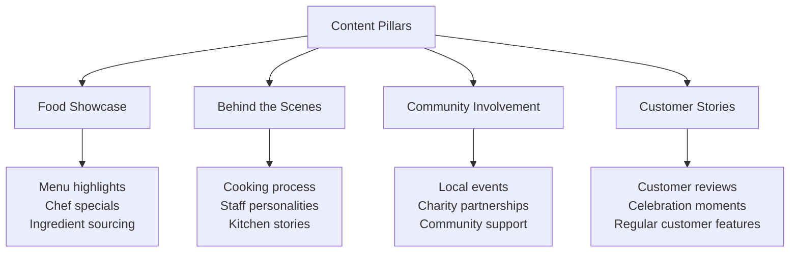

**Social Media Presence**:
- Instagram food photography
- Facebook community building
- TikTok cooking videos
- Google My Business posts

#### **Phase 3: Paid Advertising (Months 2-4)**

**Channel Strategy**:

| Channel | Budget % | Objective | Target Audience |
|---------|----------|-----------|-----------------|
| **Google Ads** | 40% | Online orders | Local searchers |
| **Facebook/Instagram** | 35% | Brand awareness | Local food lovers |
| **Local Directory** | 15% | Visibility | Local residents |
| **Email Marketing** | 10% | Retention | Existing customers |

#### **Phase 4: Optimization and Scaling (Months 4-6)**

**Performance Optimization**:
- A/B test ad creatives
- Refine targeting parameters
- Optimize website conversion
- Expand successful campaigns

**Expected Outcomes**:

```
Key Performance Indicators:
Online Orders:       +60% target
Website Traffic:     +200%
Social Followers:    +400%
Email Subscribers:   +150%
Customer Reviews:    +300%
Local Brand Awareness: +80%

ROI Projections:
Total Investment:    $90,000 (6 months)
Expected Revenue:    $285,000 (incremental)
Return on Investment: 3.17:1
```

---

## 📚 Digital Marketing Resources

### **Essential Learning Resources**

#### **Industry Publications and Blogs**

**Authority Sources**:
- **HubSpot Marketing Blog**: hubspot.com/marketing/blog
- **Content Marketing Institute**: contentmarketinginstitute.com
- **Search Engine Journal**: searchenginejournal.com
- **Social Media Examiner**: socialmediaexaminer.com
- **MarketingLand**: marketingland.com

#### **Certification Programs**

| Provider | Certification | Duration | Cost | Industry Recognition |
|----------|---------------|----------|------|---------------------|
| **Google** | Google Ads, Analytics | 2-6 weeks | Free | ⭐⭐⭐⭐⭐ |
| **Facebook** | Blueprint Certification | 3-8 weeks | Free | ⭐⭐⭐⭐☆ |
| **HubSpot** | Inbound Marketing | 4-6 weeks | Free | ⭐⭐⭐⭐☆ |
| **Hootsuite** | Social Media Marketing | 2-4 weeks | $199 | ⭐⭐⭐☆☆ |
| **Adobe** | Digital Marketing | 6-12 weeks | $150/month | ⭐⭐⭐⭐☆ |

#### **Free Tools for Learning**

**Analytics and Research**:
- Google Analytics 4 (Web analytics)
- Google Search Console (SEO insights)
- Facebook Audience Insights (Social research)
- Ubersuggest (Keyword research)
- Canva (Content creation)

**Email Marketing**:
- Mailchimp (Free tier up to 2,000 contacts)
- ConvertKit (Free tier up to 1,000 subscribers)
- Constant Contact (60-day free trial)

**Social Media Management**:
- Hootsuite (Free tier, 3 social profiles)
- Buffer (Free tier, 3 social accounts)
- Later (Free tier, 1 social set)

### **Industry Trends and Future Outlook**

#### **Emerging Digital Marketing Trends** (2024-2025)

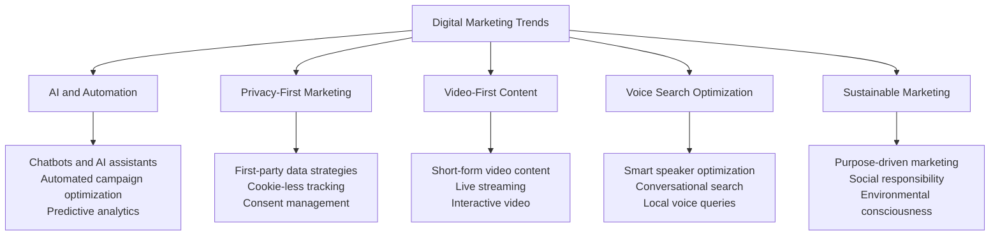

#### **Technology Investment Priorities** (Gartner 2024)

**Marketing Technology Spending**:

```
Budget Allocation for Marketing Technology:
Customer Data Platforms:  ████████████████████ 28%
Marketing Automation:     ██████████████ 22%
Analytics & Reporting:    ████████████ 18%
Content Management:       ██████████ 15%
Social Media Tools:       ████████ 12%
Email Marketing:          ███ 5%
```

---

## ✅ Progress Assessment and Skills Check

### **Knowledge Verification**

#### **Conceptual Understanding**

1. **Digital Marketing Fundamentals**
   - Define digital marketing vs. traditional marketing
   - Explain the digital customer journey stages
   - Identify key performance indicators for different goals

2. **Channel Knowledge**
   - Compare SEO vs. PPC advantages and disadvantages
   - Match social media platforms with appropriate use cases
   - Design an email marketing sequence for lead nurturing

3. **Analytics Proficiency**
   - Interpret Google Analytics 4 reports
   - Calculate return on ad spend (ROAS)
   - Set up conversion tracking for business goals

#### **Practical Skills Assessment**

**Skill Checklist** (Rate 1-5):

- [ ] Customer persona development ___/5
- [ ] Content calendar planning ___/5
- [ ] Social media content creation ___/5
- [ ] Email campaign design ___/5
- [ ] Google Analytics setup ___/5
- [ ] Facebook Ads Manager navigation ___/5
- [ ] SEO keyword research ___/5
- [ ] Campaign performance analysis ___/5

#### **Portfolio Development**

**Recommended Portfolio Projects**:

1. **Campaign Case Study**: Document a complete marketing campaign with results
2. **Content Calendar**: 90-day content plan for a specific business
3. **Analytics Dashboard**: Google Analytics setup with custom reporting
4. **Social Media Audit**: Comprehensive analysis of brand's social presence
5. **Email Campaign Series**: Multi-touch email sequence with automation

### **Career Development Pathway**

#### **Digital Marketing Career Tracks**

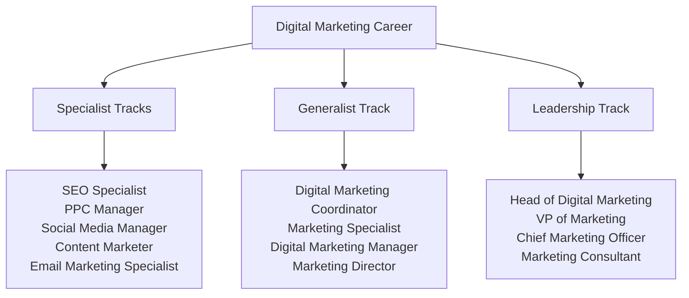

#### **Salary Expectations** (2024 Market Data)

| Position | Entry Level | Mid Level | Senior Level | Location Factor |
|----------|-------------|-----------|--------------|-----------------|
| **Digital Marketing Coordinator** | $35K-45K | $45K-60K | $60K-75K | 1.0x |
| **SEO Specialist** | $40K-55K | $55K-75K | $75K-95K | 1.2x |
| **PPC Manager** | $45K-60K | $60K-85K | $85K-120K | 1.3x |
| **Digital Marketing Manager** | $55K-75K | $75K-100K | $100K-140K | 1.4x |
| **Head of Digital Marketing** | $85K-120K | $120K-160K | $160K-220K | 1.6x |

**Location multipliers**: SF/NYC (1.8x), Austin/Seattle (1.4x), Remote (0.9x)

---

## 🚀 Next Steps and Continuous Learning

### **Immediate Action Items**

1. **Choose Your Specialization**: Based on interests and market demand
2. **Set Up Learning Environment**: Tools, accounts, and practice platforms
3. **Start Building Portfolio**: Document your learning and projects
4. **Join Professional Communities**: Network and stay updated

### **90-Day Learning Sprint**

**Month 1: Foundation**
- Complete Google Analytics and Google Ads certifications
- Set up practice campaigns with limited budget
- Build first customer persona and journey map
- Create content calendar for personal brand

**Month 2: Specialization**
- Deep dive into chosen specialty area
- Complete relevant certification programs
- Launch and optimize first real campaign
- Begin building professional portfolio

**Month 3: Integration and Application**
- Work on comprehensive campaign project
- Network with industry professionals
- Apply for junior-level positions or freelance projects
- Present portfolio and case studies

### **Upcoming Lessons in Digital Marketing Track**

- **Lesson 02**: Search Engine Optimization (SEO) Mastery
- **Lesson 03**: Pay-Per-Click (PPC) Advertising Excellence
- **Lesson 04**: Social Media Marketing Strategy
- **Lesson 05**: Email Marketing Automation
- **Lesson 06**: Content Marketing and Storytelling
- **Lesson 07**: Marketing Analytics and Data-Driven Decisions

---

<div align="center">

## 🎯 **Congratulations on Mastering Digital Marketing Fundamentals!**

You've gained comprehensive knowledge of the digital marketing landscape, customer journey optimization, multi-channel strategies, and performance measurement. With these foundations, you're equipped to drive meaningful business results through data-driven marketing initiatives.

**Ready to specialize?** Choose your focus area and continue building expertise in specific digital marketing channels and advanced strategies.

</div>

---

**Lesson created by UltraCube Digital Marketing Team** | [ucubetech.com](https://www.ucubetech.com) | **Copyright © 2025 UltraCube Technology**

> **Sources**: This lesson integrates authoritative insights from HubSpot, Google Digital Marketing Institute, Facebook Business, Adobe, Salesforce, Nielsen, MarketingLand, Statista, McKinsey, and Gartner to provide current and comprehensive digital marketing knowledge based on latest industry research and best practices.
