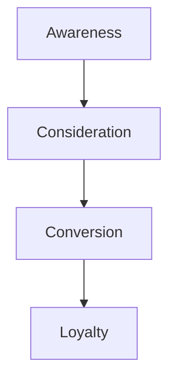

# Lesson 01: Introduction to Content Marketing

## Overview
Content marketing is a strategic approach focused on creating and distributing valuable, relevant, and consistent content to attract and retain a clearly defined audience — and, ultimately, to drive profitable customer action.

## Learning Objectives

- Define content marketing and its purpose
- Identify key types of content used in marketing
- Understand the content marketing funnel

## Visual: Content Marketing Funnel

## Detailed Explanation

### What is Content Marketing?
Content marketing involves producing and sharing materials such as blogs, videos, infographics, and social media posts to engage and educate your audience.

### Types of Content
- Blog posts
- Videos
- Infographics
- E-books
- Social media posts

### Content Marketing Funnel
- **Awareness:** Attract potential customers with valuable content
- **Consideration:** Nurture leads with in-depth information
- **Conversion:** Encourage action (purchase, signup)
- **Loyalty:** Retain customers with ongoing value

## References
- [Content Marketing Institute](https://contentmarketinginstitute.com/what-is-content-marketing/)
- [HubSpot: Content Marketing](https://blog.hubspot.com/marketing/content-marketing)
- [Neil Patel: Content Marketing Made Simple](https://neilpatel.com/what-is-content-marketing/)
