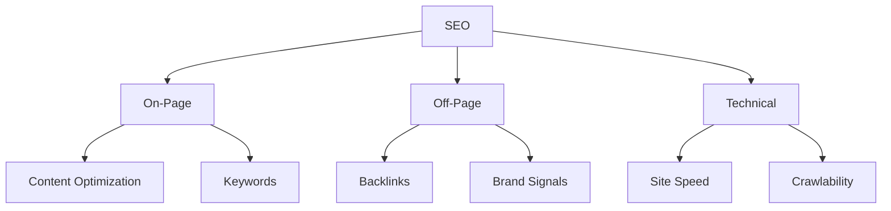

# Lesson 01: Introduction to SEO (Search Engine Optimization)

## Overview

Search Engine Optimization (SEO) is the practice of improving a website's visibility in organic (non-paid) search engine results. Effective SEO increases discoverability, traffic quality, and long-term growth.

## Learning Objectives

* Define SEO and its core purpose
* Identify key on-page, off-page, and technical SEO factors
* Understand how search engines crawl and rank pages

## Visual: SEO Pillars

## Detailed Explanation

### How Search Engines Work

Search engines crawl pages, index content, and rank results based on relevance and quality signals (authority, content depth, user signals).

### On-Page SEO

Focuses on content relevance and HTML optimization (titles, headings, meta descriptions, internal linking, structured data).

### Off-Page SEO

Builds authority through external signals like backlinks, brand mentions, and digital PR.

### Technical SEO

Ensures search engines can access, crawl, render, and index content efficiently (sitemaps, robots.txt, performance, HTTPS, mobile readiness).

## References

* [Google Search Essentials](https://developers.google.com/search/docs/fundamentals/seo-starter-guide)
* [Moz Beginner's Guide to SEO](https://moz.com/beginners-guide-to-seo)
* [Search Engine Journal: Technical SEO Guide](https://www.searchenginejournal.com/category/seo/)
