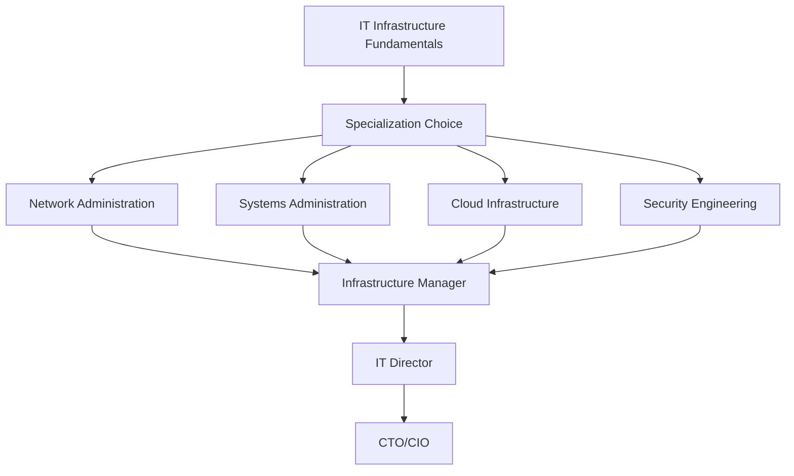

# 🏆 **IT Infrastructure Fundamentals**

## IT Infrastructure Fundamentals

*Master enterprise technology infrastructure, networking, and systems administration*

## 📚 **Lesson Overview**

**Duration**: 55 minutes  
**Level**: Beginner  
**Prerequisites**: Basic computer knowledge, understanding of networks  
**Learning Path**: IT Infrastructure → Foundations → IT Infrastructure Fundamentals

---

## 🎯 **Learning Objectives**

By the end of this lesson, you will be able to:

- ✅ Design and implement enterprise IT infrastructure architectures
- ✅ Configure and manage servers, networks, and storage systems
- ✅ Implement security controls and monitoring solutions
- ✅ Plan capacity, disaster recovery, and business continuity strategies
- ✅ Optimize infrastructure performance and ensure high availability

---

## 🌟 **Why This Matters**

IT infrastructure is the backbone of modern business operations. **95% of organizations** depend on reliable IT infrastructure for daily operations, with infrastructure downtime costing an average of **$5,600 per minute**. According to **Gartner**, global IT infrastructure spending reached **$208 billion in 2023**, with companies investing heavily in modernization and cloud transformation.

> *"Infrastructure is the foundation of every great technology achievement."* - **Werner Vogels, CTO of Amazon**

**Industry Impact:**

- **Netflix**: 99.99% uptime through resilient infrastructure design serving 230M+ global users
- **Amazon Web Services**: $80B+ annual revenue providing infrastructure services to millions of businesses
- **Microsoft Azure**: 60+ global regions delivering enterprise-grade infrastructure worldwide

---

## 📖 **Core Content**

### **1. Enterprise Infrastructure Architecture (15 minutes)**

#### **🏗️ Infrastructure Design Principles**

Understanding scalable, secure, and resilient infrastructure architecture:

```python
# Enterprise Infrastructure Design Framework
"""
Infrastructure Architecture Components:

1. Compute Layer
   - Physical servers and virtualization
   - Container orchestration platforms
   - Serverless computing environments
   - High-performance computing clusters

2. Network Layer
   - LAN/WAN connectivity and routing
   - Load balancers and traffic management
   - VPN and secure remote access
   - Software-defined networking (SDN)

3. Storage Layer
   - Block, file, and object storage systems
   - Backup and disaster recovery solutions
   - Data deduplication and compression
   - Storage area networks (SAN)

4. Security Layer
   - Firewalls and intrusion detection
   - Identity and access management
   - Encryption and key management
   - Security monitoring and incident response
"""

import json
import datetime
from typing import Dict, List, Any

class EnterpriseInfrastructure:
    def __init__(self, organization_name: str, employee_count: int):
        self.organization_name = organization_name
        self.employee_count = employee_count
        self.infrastructure_components = {}
        self.compliance_requirements = []
        self.performance_metrics = {}
    
    def design_infrastructure_architecture(self):
        """Design comprehensive enterprise infrastructure architecture."""
        print(f"🏗️ Infrastructure Architecture: {self.organization_name}")
        print("=" * 70)
        
        # Infrastructure sizing based on organization size
        if self.employee_count < 100:
            scale = "Small Business"
            server_count = "5-15 servers"
            storage_capacity = "10-50 TB"
            network_bandwidth = "100 Mbps - 1 Gbps"
        elif self.employee_count < 1000:
            scale = "Mid-Size Enterprise"
            server_count = "50-200 servers"
            storage_capacity = "100-500 TB"
            network_bandwidth = "1-10 Gbps"
        else:
            scale = "Large Enterprise"
            server_count = "500+ servers"
            storage_capacity = "1+ PB"
            network_bandwidth = "10-100 Gbps"
        
        architecture = {
            'organization_scale': scale,
            'infrastructure_requirements': {
                'compute_resources': {
                    'server_count': server_count,
                    'virtualization_ratio': '8:1 average',
                    'cpu_cores': f"{self.employee_count * 4}-{self.employee_count * 8}",
                    'memory': f"{self.employee_count * 8}-{self.employee_count * 16} GB"
                },
                'network_infrastructure': {
                    'backbone_speed': network_bandwidth,
                    'redundancy': 'N+1 for critical links',
                    'wifi_coverage': '99% facility coverage',
                    'internet_connections': 'Dual ISP with failover'
                },
                'storage_systems': {
                    'primary_storage': storage_capacity,
                    'backup_retention': '3-2-1 backup strategy',
                    'performance_tier': 'NVMe SSD for critical workloads',
                    'archive_tier': 'High-capacity HDD for long-term storage'
                },
                'security_controls': {
                    'network_security': 'Next-gen firewalls with IPS/IDS',
                    'endpoint_protection': 'EDR on all devices',
                    'access_control': 'Zero-trust architecture',
                    'data_protection': 'Encryption at rest and in transit'
                }
            },
            'high_availability_design': {
                'uptime_target': '99.9% (8.77 hours downtime/year)',
                'redundancy_levels': {
                    'power': 'Dual power feeds + UPS + generator',
                    'cooling': 'N+1 HVAC with environmental monitoring',
                    'connectivity': 'Multiple network paths and ISPs',
                    'data': 'RAID arrays + real-time replication'
                },
                'disaster_recovery': {
                    'rto_target': '4 hours (Recovery Time Objective)',
                    'rpo_target': '1 hour (Recovery Point Objective)',
                    'backup_sites': 'Hot site for critical systems',
                    'testing_frequency': 'Quarterly DR testing'
                }
            }
        }
        
        for section, details in architecture.items():
            print(f"\n📋 {section.replace('_', ' ').title()}:")
            if isinstance(details, dict):
                for key, value in details.items():
                    if isinstance(value, dict):
                        print(f"  {key.replace('_', ' ').title()}:")
                        for subkey, subvalue in value.items():
                            print(f"    {subkey.replace('_', ' ').title()}: {subvalue}")
                    else:
                        print(f"  {key.replace('_', ' ').title()}: {value}")
            else:
                print(f"  {details}")
        
        self.infrastructure_components['architecture'] = architecture
        return architecture
    
    def calculate_infrastructure_costs(self):
        """Calculate comprehensive infrastructure costs and ROI."""
        print(f"\n💰 Infrastructure Cost Analysis")
        print("=" * 50)
        
        # Cost calculations based on industry averages
        base_cost_per_employee = 1200  # Annual IT infrastructure cost per employee
        
        cost_breakdown = {
            'hardware_costs': {
                'servers_storage': f"${self.employee_count * 400:,}",
                'network_equipment': f"${self.employee_count * 150:,}",
                'end_user_devices': f"${self.employee_count * 800:,}",
                'security_appliances': f"${self.employee_count * 100:,}"
            },
            'software_licensing': {
                'operating_systems': f"${self.employee_count * 120:,}",
                'productivity_suite': f"${self.employee_count * 144:,}",
                'security_software': f"${self.employee_count * 60:,}",
                'backup_solutions': f"${self.employee_count * 36:,}"
            },
            'operational_expenses': {
                'cloud_services': f"${self.employee_count * 200:,}",
                'internet_connectivity': f"${max(5000, self.employee_count * 15):,}",
                'maintenance_support': f"${self.employee_count * 180:,}",
                'staffing_costs': f"${min(500000, self.employee_count * 250):,}"
            }
        }
        
        total_annual_cost = self.employee_count * base_cost_per_employee
        
        for category, costs in cost_breakdown.items():
            print(f"\n📊 {category.replace('_', ' ').title()}:")
            category_total = 0
            for item, cost in costs.items():
                print(f"  {item.replace('_', ' ').title()}: {cost}")
                # Extract numeric value for total calculation
                numeric_cost = int(cost.replace('$', '').replace(',', ''))
                category_total += numeric_cost
            print(f"  Category Total: ${category_total:,}")
        
        print(f"\n💡 Total Annual Infrastructure Cost: ${total_annual_cost:,}")
        print(f"📈 Cost per Employee: ${base_cost_per_employee:,}")
        
        # ROI calculation
        productivity_gain = self.employee_count * 2000  # $2000 productivity gain per employee
        downtime_prevention = total_annual_cost * 0.15  # 15% cost savings from preventing downtime
        total_roi = productivity_gain + downtime_prevention
        
        print(f"\n🎯 Expected Annual ROI:")
        print(f"  Productivity Improvements: ${productivity_gain:,}")
        print(f"  Downtime Prevention Savings: ${downtime_prevention:,}")
        print(f"  Total ROI: ${total_roi:,} ({(total_roi/total_annual_cost)*100:.1f}% return)")
        
        return cost_breakdown, total_annual_cost

# Example implementation
print("🏗️ ENTERPRISE INFRASTRUCTURE DESIGN")
print("=" * 60)

# Create infrastructure for mid-size company
company_infrastructure = EnterpriseInfrastructure("TechCorp Solutions", 500)
architecture = company_infrastructure.design_infrastructure_architecture()
costs, total_cost = company_infrastructure.calculate_infrastructure_costs()
```

#### **🌐 Network Infrastructure Design**

```python
class NetworkInfrastructureDesigner:
    def __init__(self):
        self.network_segments = {}
        self.security_zones = {}
        self.bandwidth_requirements = {}
    
    def design_enterprise_network(self):
        """Design comprehensive enterprise network architecture."""
        print("🌐 Enterprise Network Architecture")
        print("=" * 50)
        
        network_design = {
            'physical_topology': {
                'core_layer': {
                    'purpose': 'High-speed backbone routing and switching',
                    'equipment': 'Enterprise-class routers and switches',
                    'redundancy': 'Full mesh topology with HSRP/VRRP',
                    'bandwidth': '40-100 Gbps links'
                },
                'distribution_layer': {
                    'purpose': 'Policy enforcement and traffic aggregation',
                    'equipment': 'Layer 3 switches with advanced features',
                    'redundancy': 'Dual-homed to core layer',
                    'bandwidth': '10-40 Gbps uplinks'
                },
                'access_layer': {
                    'purpose': 'End-device connectivity and basic switching',
                    'equipment': 'Managed switches with PoE capabilities',
                    'redundancy': 'Dual uplinks to distribution layer',
                    'bandwidth': '1-10 Gbps per switch'
                }
            },
            'logical_segmentation': {
                'production_vlan': {
                    'vlan_id': '10-99',
                    'purpose': 'Core business applications and services',
                    'security_level': 'High',
                    'access_controls': 'Strict firewall rules and monitoring'
                },
                'user_vlan': {
                    'vlan_id': '100-199',
                    'purpose': 'Employee workstations and devices',
                    'security_level': 'Medium',
                    'access_controls': '802.1X authentication required'
                },
                'guest_vlan': {
                    'vlan_id': '200-299',
                    'purpose': 'Visitor and contractor access',
                    'security_level': 'Low',
                    'access_controls': 'Isolated with internet-only access'
                },
                'dmz_vlan': {
                    'vlan_id': '300-399',
                    'purpose': 'Public-facing services and applications',
                    'security_level': 'High',
                    'access_controls': 'Heavy monitoring and intrusion detection'
                }
            },
            'wan_connectivity': {
                'primary_circuit': {
                    'type': 'Dedicated fiber (MPLS or Metro Ethernet)',
                    'bandwidth': '1-10 Gbps',
                    'sla': '99.9% uptime guarantee',
                    'latency': '<5ms to key locations'
                },
                'backup_circuit': {
                    'type': 'Broadband or LTE backup',
                    'bandwidth': '100 Mbps - 1 Gbps',
                    'purpose': 'Automatic failover for continuity',
                    'cost_ratio': '20% of primary circuit cost'
                },
                'vpn_connectivity': {
                    'remote_access': 'SSL VPN for remote workers',
                    'site_to_site': 'IPSec tunnels between locations',
                    'cloud_connectivity': 'Direct Connect to major cloud providers'
                }
            },
            'wireless_infrastructure': {
                'enterprise_wifi': {
                    'standard': 'Wi-Fi 6 (802.11ax)',
                    'coverage': '99% facility coverage',
                    'capacity': '50-100 concurrent users per AP',
                    'security': 'WPA3-Enterprise with certificate authentication'
                },
                'guest_wifi': {
                    'isolation': 'Separate SSID and VLAN',
                    'bandwidth_limiting': 'QoS policies for fair usage',
                    'access_control': 'Captive portal with terms acceptance',
                    'monitoring': 'Content filtering and usage tracking'
                }
            }
        }
        
        for section, details in network_design.items():
            print(f"\n🔧 {section.replace('_', ' ').title()}:")
            for component, specs in details.items():
                print(f"  {component.replace('_', ' ').title()}:")
                if isinstance(specs, dict):
                    for spec_key, spec_value in specs.items():
                        print(f"    {spec_key.replace('_', ' ').title()}: {spec_value}")
                else:
                    print(f"    {specs}")
        
        return network_design
    
    def network_monitoring_and_management(self):
        """Implement comprehensive network monitoring and management."""
        print(f"\n📊 Network Monitoring & Management")
        print("=" * 50)
        
        monitoring_framework = {
            'performance_monitoring': {
                'bandwidth_utilization': 'Real-time monitoring with 95th percentile reporting',
                'latency_tracking': 'End-to-end response time measurement',
                'packet_loss_detection': 'Proactive alerts for >0.1% packet loss',
                'jitter_monitoring': 'Voice/video quality impact analysis'
            },
            'security_monitoring': {
                'intrusion_detection': 'Network-based IDS/IPS with signature updates',
                'anomaly_detection': 'Machine learning-based traffic analysis',
                'vulnerability_scanning': 'Automated network security assessments',
                'log_correlation': 'SIEM integration for security event analysis'
            },
            'network_management_tools': {
                'snmp_monitoring': 'Enterprise network management platform',
                'configuration_management': 'Automated backup and change tracking',
                'network_discovery': 'Automatic topology mapping and documentation',
                'performance_baseline': 'Historical trending and capacity planning'
            },
            'alerting_and_response': {
                'threshold_alerts': 'Proactive notifications for performance degradation',
                'escalation_procedures': 'Tiered response based on impact severity',
                'automated_remediation': 'Self-healing for common network issues',
                'incident_tracking': 'Full lifecycle management of network problems'
            }
        }
        
        for category, tools in monitoring_framework.items():
            print(f"\n🎯 {category.replace('_', ' ').title()}:")
            for tool, description in tools.items():
                print(f"  {tool.replace('_', ' ').title()}: {description}")
        
        return monitoring_framework

network_designer = NetworkInfrastructureDesigner()
network_architecture = network_designer.design_enterprise_network()
monitoring_setup = network_designer.network_monitoring_and_management()
```

### **2. Server Management & Virtualization (15 minutes)**

#### **💻 Server Infrastructure Management**

```python
class ServerInfrastructureManager:
    def __init__(self):
        self.server_inventory = {}
        self.virtualization_platform = "VMware vSphere"
        self.hypervisor_hosts = []
        
    def server_hardware_specification(self):
        """Define enterprise server hardware specifications."""
        print("💻 Enterprise Server Hardware Specifications")
        print("=" * 60)
        
        server_types = {
            'compute_servers': {
                'purpose': 'Virtual machine hosting and application workloads',
                'specifications': {
                    'cpu': '2x Intel Xeon Gold 6248R (48 cores total)',
                    'memory': '512 GB DDR4 ECC',
                    'storage': '2x 960GB NVMe SSD (OS) + 8x 3.84TB NVMe SSD (VM storage)',
                    'network': '4x 25GbE + 2x 10GbE management',
                    'power': 'Dual power supplies with redundancy'
                },
                'estimated_cost': '$25,000 - $35,000',
                'vm_capacity': '40-60 VMs depending on workload'
            },
            'storage_servers': {
                'purpose': 'Centralized storage for enterprise applications',
                'specifications': {
                    'cpu': '2x Intel Xeon Silver 4214R (24 cores total)',
                    'memory': '256 GB DDR4 ECC',
                    'storage': '24x 16TB Enterprise SAS HDD + 4x 3.84TB NVMe cache',
                    'network': '4x 25GbE + 2x 10GbE management',
                    'raid_controller': 'Hardware RAID with battery backup'
                },
                'estimated_cost': '$40,000 - $60,000',
                'capacity': '300+ TB usable storage'
            },
            'database_servers': {
                'purpose': 'High-performance database and analytics workloads',
                'specifications': {
                    'cpu': '2x Intel Xeon Platinum 8352Y (64 cores total)',
                    'memory': '1 TB DDR4 ECC',
                    'storage': '8x 6.4TB NVMe SSD in RAID 10',
                    'network': '4x 25GbE + 2x 10GbE management',
                    'additional': 'Hardware security module (HSM) support'
                },
                'estimated_cost': '$45,000 - $70,000',
                'performance': '2M+ IOPS and <1ms latency'
            },
            'edge_servers': {
                'purpose': 'Remote office and edge computing applications',
                'specifications': {
                    'cpu': '1x Intel Xeon E-2388G (8 cores)',
                    'memory': '128 GB DDR4 ECC',
                    'storage': '2x 960GB NVMe SSD in RAID 1',
                    'network': '4x 1GbE + 1x 10GbE uplink',
                    'form_factor': '2U rackmount with extended temperature range'
                },
                'estimated_cost': '$8,000 - $12,000',
                'deployment': 'Branch offices and remote locations'
            }
        }
        
        for server_type, details in server_types.items():
            print(f"\n🖥️ {server_type.replace('_', ' ').title()}:")
            print(f"  Purpose: {details['purpose']}")
            print(f"  Specifications:")
            for spec, value in details['specifications'].items():
                print(f"    {spec.replace('_', ' ').title()}: {value}")
            print(f"  Estimated Cost: {details['estimated_cost']}")
            if 'vm_capacity' in details:
                print(f"  VM Capacity: {details['vm_capacity']}")
            if 'capacity' in details:
                print(f"  Storage Capacity: {details['capacity']}")
            if 'performance' in details:
                print(f"  Performance: {details['performance']}")
            if 'deployment' in details:
                print(f"  Deployment: {details['deployment']}")
        
        return server_types
    
    def virtualization_strategy(self):
        """Implement comprehensive virtualization strategy."""
        print(f"\n🔄 Virtualization Strategy & Implementation")
        print("=" * 50)
        
        virtualization_framework = {
            'hypervisor_platform': {
                'primary_choice': 'VMware vSphere Enterprise Plus',
                'alternative': 'Microsoft Hyper-V or Citrix XenServer',
                'key_features': [
                    'vMotion for live VM migration',
                    'High Availability (HA) clustering',
                    'Distributed Resource Scheduler (DRS)',
                    'Storage vMotion for non-disruptive moves'
                ],
                'management_tools': 'vCenter Server for centralized management'
            },
            'resource_allocation': {
                'cpu_overcommitment': '2:1 ratio for general workloads',
                'memory_overcommitment': '1.2:1 ratio with ballooning and compression',
                'storage_tiering': 'Hot data on NVMe, warm on SSD, cold on HDD',
                'network_isolation': 'Dedicated VLANs for management, vMotion, and storage'
            },
            'vm_lifecycle_management': {
                'template_standardization': 'Golden images for consistent deployments',
                'automated_provisioning': 'Self-service portal for IT and developers',
                'patch_management': 'Automated OS and application patching',
                'backup_integration': 'VM-aware backup solutions with instant recovery'
            },
            'performance_optimization': {
                'resource_monitoring': 'Real-time performance metrics and alerting',
                'capacity_planning': 'Predictive analytics for growth planning',
                'workload_balancing': 'Automatic VM placement based on resource usage',
                'storage_optimization': 'Thin provisioning and deduplication'
            }
        }
        
        for category, details in virtualization_framework.items():
            print(f"\n⚙️ {category.replace('_', ' ').title()}:")
            for key, value in details.items():
                if isinstance(value, list):
                    print(f"  {key.replace('_', ' ').title()}:")
                    for item in value:
                        print(f"    • {item}")
                else:
                    print(f"  {key.replace('_', ' ').title()}: {value}")
        
        return virtualization_framework
    
    def container_orchestration_strategy(self):
        """Implement modern container orchestration platform."""
        print(f"\n🐳 Container Orchestration Strategy")
        print("=" * 50)
        
        container_platform = {
            'kubernetes_deployment': {
                'platform_choice': 'Red Hat OpenShift or VMware Tanzu',
                'cluster_architecture': {
                    'master_nodes': '3 nodes for HA control plane',
                    'worker_nodes': '6-12 nodes for application workloads',
                    'etcd_cluster': 'Dedicated 3-node etcd cluster for data store',
                    'load_balancer': 'External load balancer for API server access'
                },
                'networking': {
                    'cni_plugin': 'Calico or Flannel for pod networking',
                    'ingress_controller': 'NGINX or HAProxy for external access',
                    'service_mesh': 'Istio for microservices communication',
                    'network_policies': 'Kubernetes NetworkPolicies for security'
                }
            },
            'container_security': {
                'image_scanning': 'Vulnerability scanning in CI/CD pipeline',
                'runtime_security': 'Falco for runtime threat detection',
                'policy_enforcement': 'Pod Security Policies and admission controllers',
                'secrets_management': 'HashiCorp Vault integration for sensitive data'
            },
            'monitoring_and_logging': {
                'metrics_collection': 'Prometheus and Grafana for monitoring',
                'log_aggregation': 'Elasticsearch, Fluentd, and Kibana (EFK) stack',
                'distributed_tracing': 'Jaeger for application performance monitoring',
                'alerting': 'AlertManager for incident notification'
            },
            'devops_integration': {
                'ci_cd_pipeline': 'Jenkins or GitLab CI/CD integration',
                'image_registry': 'Private Harbor registry for container images',
                'deployment_automation': 'Helm charts for application deployment',
                'gitops_workflow': 'ArgoCD for declarative deployment management'
            }
        }
        
        for section, details in container_platform.items():
            print(f"\n🎯 {section.replace('_', ' ').title()}:")
            for key, value in details.items():
                if isinstance(value, dict):
                    print(f"  {key.replace('_', ' ').title()}:")
                    for subkey, subvalue in value.items():
                        print(f"    {subkey.replace('_', ' ').title()}: {subvalue}")
                else:
                    print(f"  {key.replace('_', ' ').title()}: {value}")
        
        return container_platform

server_manager = ServerInfrastructureManager()
server_specs = server_manager.server_hardware_specification()
virtualization_strategy = server_manager.virtualization_strategy()
container_strategy = server_manager.container_orchestration_strategy()
```

### **3. Security & Compliance (15 minutes)**

#### **🔒 Infrastructure Security Framework**

```python
class InfrastructureSecurityManager:
    def __init__(self):
        self.security_frameworks = ['NIST', 'ISO 27001', 'SOC 2']
        self.compliance_requirements = []
        
    def implement_zero_trust_architecture(self):
        """Implement comprehensive zero-trust security architecture."""
        print("🔒 Zero-Trust Infrastructure Security")
        print("=" * 50)
        
        zero_trust_framework = {
            'identity_and_access_management': {
                'multi_factor_authentication': 'Required for all administrative access',
                'privileged_access_management': 'CyberArk or Thycotic for admin credentials',
                'single_sign_on': 'Azure AD or Okta for unified authentication',
                'just_in_time_access': 'Time-limited access for sensitive operations'
            },
            'network_security': {
                'micro_segmentation': 'Software-defined perimeter (SDP) implementation',
                'network_access_control': '802.1X for device authentication',
                'intrusion_detection': 'Network and host-based IDS/IPS deployment',
                'traffic_inspection': 'Deep packet inspection for all network flows'
            },
            'endpoint_security': {
                'endpoint_detection_response': 'CrowdStrike or SentinelOne deployment',
                'device_compliance': 'Microsoft Intune or VMware Workspace ONE',
                'application_whitelisting': 'Only approved applications can execute',
                'disk_encryption': 'BitLocker or FileVault for data protection'
            },
            'data_protection': {
                'encryption_at_rest': 'AES-256 encryption for all stored data',
                'encryption_in_transit': 'TLS 1.3 for all network communications',
                'data_loss_prevention': 'Forcepoint or Symantec DLP solutions',
                'backup_encryption': 'Encrypted backups with key rotation'
            }
        }
        
        for category, controls in zero_trust_framework.items():
            print(f"\n🛡️ {category.replace('_', ' ').title()}:")
            for control, implementation in controls.items():
                print(f"  {control.replace('_', ' ').title()}: {implementation}")
        
        return zero_trust_framework
    
    def security_monitoring_and_response(self):
        """Implement comprehensive security monitoring and incident response."""
        print(f"\n🚨 Security Monitoring & Incident Response")
        print("=" * 50)
        
        security_operations = {
            'security_information_event_management': {
                'siem_platform': 'Splunk Enterprise Security or IBM QRadar',
                'log_sources': [
                    'Network devices (firewalls, switches, routers)',
                    'Security appliances (IPS/IDS, web filters)',
                    'Server and endpoint logs',
                    'Cloud service audit logs',
                    'Database and application logs'
                ],
                'correlation_rules': 'Custom rules for organization-specific threats',
                'threat_intelligence': 'Integration with commercial threat feeds'
            },
            'security_orchestration_automation': {
                'soar_platform': 'Phantom or Demisto for automated response',
                'playbook_automation': [
                    'Automated malware containment',
                    'Phishing email response and user notification',
                    'Brute force attack blocking',
                    'Suspicious network traffic investigation'
                ],
                'case_management': 'Integrated ticketing for incident tracking',
                'metrics_reporting': 'MTTR and incident volume reporting'
            },
            'vulnerability_management': {
                'vulnerability_scanning': 'Nessus or Rapid7 for comprehensive scanning',
                'patch_management': 'Microsoft WSUS and third-party patch tools',
                'risk_assessment': 'CVSS scoring with business impact analysis',
                'remediation_tracking': 'SLA-based patching with escalation procedures'
            },
            'incident_response_procedures': {
                'response_team': 'Dedicated SOC with 24/7 monitoring capability',
                'escalation_matrix': 'Clear procedures for incident classification',
                'communication_plan': 'Internal and external notification protocols',
                'forensic_capabilities': 'Digital forensics tools and trained analysts'
            }
        }
        
        for category, details in security_operations.items():
            print(f"\n🎯 {category.replace('_', ' ').title()}:")
            for key, value in details.items():
                if isinstance(value, list):
                    print(f"  {key.replace('_', ' ').title()}:")
                    for item in value:
                        print(f"    • {item}")
                else:
                    print(f"  {key.replace('_', ' ').title()}: {value}")
        
        return security_operations
    
    def compliance_and_governance(self):
        """Implement compliance frameworks and governance controls."""
        print(f"\n📋 Compliance & Governance Framework")
        print("=" * 50)
        
        compliance_framework = {
            'regulatory_compliance': {
                'gdpr_privacy': 'Data protection and privacy controls for EU operations',
                'sox_financial': 'Financial reporting controls for public companies',
                'hipaa_healthcare': 'Healthcare data protection for medical organizations',
                'pci_dss_payment': 'Payment card security for e-commerce businesses'
            },
            'security_frameworks': {
                'nist_cybersecurity': 'NIST CSF implementation with maturity assessment',
                'iso_27001': 'Information security management system certification',
                'soc_2_type_ii': 'Annual SOC 2 audits for service organization controls',
                'cis_controls': 'CIS Critical Security Controls implementation'
            },
            'governance_processes': {
                'risk_management': 'Quarterly risk assessments and mitigation planning',
                'policy_management': 'Annual policy review and update procedures',
                'audit_preparation': 'Continuous audit readiness with evidence collection',
                'training_awareness': 'Monthly security awareness training for all staff'
            },
            'documentation_requirements': {
                'system_documentation': 'Comprehensive network and system diagrams',
                'procedure_documentation': 'Step-by-step operational procedures',
                'incident_documentation': 'Detailed incident reports and lessons learned',
                'change_documentation': 'Change management with approval workflows'
            }
        }
        
        for category, requirements in compliance_framework.items():
            print(f"\n📊 {category.replace('_', ' ').title()}:")
            for requirement, description in requirements.items():
                print(f"  {requirement.replace('_', ' ').title()}: {description}")
        
        return compliance_framework

security_manager = InfrastructureSecurityManager()
zero_trust = security_manager.implement_zero_trust_architecture()
security_ops = security_manager.security_monitoring_and_response()
compliance = security_manager.compliance_and_governance()
```

### **4. Disaster Recovery & Business Continuity (10 minutes)**

#### **🔄 Business Continuity Planning**

```python
class DisasterRecoveryManager:
    def __init__(self, organization_name: str):
        self.organization_name = organization_name
        self.recovery_objectives = {}
        self.backup_strategies = {}
        
    def business_impact_analysis(self):
        """Conduct comprehensive business impact analysis."""
        print("📊 Business Impact Analysis (BIA)")
        print("=" * 50)
        
        critical_systems = {
            'tier_1_critical': {
                'systems': ['Email servers', 'Customer database', 'Financial systems', 'Core applications'],
                'max_downtime': '1 hour',
                'recovery_time_objective': '30 minutes',
                'recovery_point_objective': '15 minutes',
                'business_impact': 'Revenue loss of $10K+ per hour',
                'backup_frequency': 'Continuous replication'
            },
            'tier_2_important': {
                'systems': ['File servers', 'Intranet portal', 'HR systems', 'CRM platform'],
                'max_downtime': '4 hours',
                'recovery_time_objective': '2 hours',
                'recovery_point_objective': '1 hour',
                'business_impact': 'Productivity loss affecting 50%+ of staff',
                'backup_frequency': 'Hourly snapshots'
            },
            'tier_3_standard': {
                'systems': ['Archive storage', 'Development environments', 'Test systems'],
                'max_downtime': '24 hours',
                'recovery_time_objective': '8 hours',
                'recovery_point_objective': '4 hours',
                'business_impact': 'Delayed projects and development work',
                'backup_frequency': 'Daily backups'
            },
            'tier_4_non_critical': {
                'systems': ['Legacy applications', 'Training environments', 'Demo systems'],
                'max_downtime': '72 hours',
                'recovery_time_objective': '24 hours',
                'recovery_point_objective': '24 hours',
                'business_impact': 'Minimal operational impact',
                'backup_frequency': 'Weekly backups'
            }
        }
        
        for tier, details in critical_systems.items():
            print(f"\n🎯 {tier.replace('_', ' ').title()}:")
            for key, value in details.items():
                if isinstance(value, list):
                    print(f"  {key.replace('_', ' ').title()}: {', '.join(value)}")
                else:
                    print(f"  {key.replace('_', ' ').title()}: {value}")
        
        return critical_systems
    
    def disaster_recovery_strategy(self):
        """Implement comprehensive disaster recovery strategy."""
        print(f"\n🔄 Disaster Recovery Strategy")
        print("=" * 50)
        
        dr_strategy = {
            'backup_infrastructure': {
                'primary_backup': 'On-site disk-based backup with deduplication',
                'secondary_backup': 'Off-site tape or cloud backup for long-term retention',
                'cloud_backup': 'AWS S3/Glacier or Azure Blob Storage',
                'backup_testing': 'Monthly restore testing with documented procedures'
            },
            'replication_strategy': {
                'database_replication': 'Synchronous replication for critical databases',
                'file_replication': 'Asynchronous replication for file servers',
                'vm_replication': 'VMware Site Recovery Manager or Hyper-V Replica',
                'network_replication': 'WAN optimization for efficient data transfer'
            },
            'recovery_sites': {
                'hot_site': {
                    'description': 'Fully operational duplicate of primary site',
                    'recovery_time': '< 1 hour',
                    'cost': 'High ($500K - $2M annually)',
                    'use_case': 'Mission-critical systems with zero downtime tolerance'
                },
                'warm_site': {
                    'description': 'Partially equipped site with basic infrastructure',
                    'recovery_time': '4-24 hours',
                    'cost': 'Medium ($100K - $500K annually)',
                    'use_case': 'Important systems with moderate downtime tolerance'
                },
                'cold_site': {
                    'description': 'Basic facility with power and connectivity',
                    'recovery_time': '48-72 hours',
                    'cost': 'Low ($10K - $100K annually)',
                    'use_case': 'Non-critical systems with high downtime tolerance'
                },
                'cloud_dr': {
                    'description': 'Public cloud infrastructure for DR',
                    'recovery_time': '1-8 hours depending on configuration',
                    'cost': 'Variable (pay-as-you-go model)',
                    'use_case': 'Scalable DR solution with global availability'
                }
            },
            'testing_procedures': {
                'test_frequency': 'Quarterly full DR tests, monthly partial tests',
                'test_scenarios': [
                    'Complete site failure simulation',
                    'Ransomware attack recovery',
                    'Network connectivity loss',
                    'Storage system failure',
                    'Power outage and generator testing'
                ],
                'success_criteria': 'Meet RTO/RPO objectives within defined timeframes',
                'documentation': 'Detailed test reports with improvement recommendations'
            }
        }
        
        for category, details in dr_strategy.items():
            print(f"\n🛡️ {category.replace('_', ' ').title()}:")
            if category == 'recovery_sites':
                for site_type, site_details in details.items():
                    print(f"  {site_type.replace('_', ' ').title()}:")
                    for key, value in site_details.items():
                        print(f"    {key.replace('_', ' ').title()}: {value}")
            else:
                for key, value in details.items():
                    if isinstance(value, list):
                        print(f"  {key.replace('_', ' ').title()}:")
                        for item in value:
                            print(f"    • {item}")
                    else:
                        print(f"  {key.replace('_', ' ').title()}: {value}")
        
        return dr_strategy
    
    def calculate_dr_costs_and_roi(self):
        """Calculate disaster recovery costs and return on investment."""
        print(f"\n💰 DR Investment Analysis")
        print("=" * 50)
        
        # Calculate potential losses without DR
        revenue_per_hour = 50000  # $50K revenue per hour for example company
        critical_downtime_cost = revenue_per_hour * 24  # Cost of 24-hour outage
        
        dr_investment = {
            'annual_dr_costs': {
                'backup_infrastructure': '$150,000',
                'replication_software': '$75,000',
                'warm_site_hosting': '$200,000',
                'cloud_dr_services': '$100,000',
                'testing_and_maintenance': '$50,000',
                'staff_training': '$25,000'
            },
            'total_annual_investment': '$600,000',
            'potential_loss_scenarios': {
                'major_outage_24_hours': f'${critical_downtime_cost:,}',
                'data_loss_recovery': '$2,000,000',
                'regulatory_fines': '$500,000',
                'reputation_damage': '$1,000,000'
            },
            'roi_calculation': {
                'investment': '$600,000',
                'risk_reduction': f'${critical_downtime_cost + 3500000:,}',
                'annual_roi': f'{((critical_downtime_cost + 3500000 - 600000) / 600000) * 100:.1f}%'
            }
        }
        
        for category, details in dr_investment.items():
            print(f"\n📊 {category.replace('_', ' ').title()}:")
            if isinstance(details, dict):
                for key, value in details.items():
                    print(f"  {key.replace('_', ' ').title()}: {value}")
            else:
                print(f"  {details}")
        
        print(f"\n💡 DR Investment Justification:")
        print(f"  • Single major outage cost exceeds entire annual DR investment")
        print(f"  • Reduces business risk by 95%+ through rapid recovery capabilities")
        print(f"  • Ensures regulatory compliance and customer confidence")
        print(f"  • Enables competitive advantage through business resilience")
        
        return dr_investment

dr_manager = DisasterRecoveryManager("TechCorp Solutions")
business_impact = dr_manager.business_impact_analysis()
dr_strategy = dr_manager.disaster_recovery_strategy()
dr_roi = dr_manager.calculate_dr_costs_and_roi()
```

---

## 🛠️ **Hands-On Lab: Enterprise Infrastructure Deployment**

### **Lab Objective**

Design and implement a complete enterprise IT infrastructure for a growing technology company with 500 employees.

### **Requirements**

1. ✅ Complete infrastructure architecture design
2. ✅ Network topology with security zones
3. ✅ Server virtualization and container platform
4. ✅ Comprehensive security implementation
5. ✅ Disaster recovery and business continuity plan

### **Implementation**

```python
# Complete enterprise infrastructure deployment project

class EnterpriseInfrastructureDeployment:
    def __init__(self, company_name: str, employee_count: int, annual_revenue: int):
        self.company_name = company_name
        self.employee_count = employee_count
        self.annual_revenue = annual_revenue
        self.infrastructure_design = {}
        
    def comprehensive_infrastructure_assessment(self):
        """Conduct complete infrastructure requirements assessment."""
        print(f"🔍 Infrastructure Assessment: {self.company_name}")
        print("=" * 70)
        
        # Calculate infrastructure requirements based on company profile
        assessment = {
            'company_profile': {
                'employees': self.employee_count,
                'annual_revenue': f"${self.annual_revenue:,}",
                'growth_projection': '25% annual growth',
                'technology_dependency': 'High - business-critical applications'
            },
            'workload_analysis': {
                'concurrent_users': int(self.employee_count * 0.8),
                'peak_usage_hours': '9 AM - 5 PM (80% utilization)',
                'after_hours_usage': '10% utilization for global operations',
                'seasonal_peaks': '30% increase during Q4'
            },
            'performance_requirements': {
                'application_response_time': '< 2 seconds for critical applications',
                'network_latency': '< 10ms within campus, < 50ms to remote sites',
                'uptime_target': '99.9% (4.38 hours downtime per year)',
                'data_transfer_speeds': '1GB file transfer in < 30 seconds'
            },
            'scalability_planning': {
                'compute_growth': f'{int(self.employee_count * 1.5)} employees in 3 years',
                'storage_growth': '40% annual data growth',
                'bandwidth_growth': '25% annual increase',
                'geographic_expansion': '2 new offices planned in next 18 months'
            }
        }
        
        for section, details in assessment.items():
            print(f"\n📋 {section.replace('_', ' ').title()}:")
            for key, value in details.items():
                print(f"  {key.replace('_', ' ').title()}: {value}")
        
        return assessment
    
    def design_complete_infrastructure(self):
        """Design comprehensive enterprise infrastructure architecture."""
        print(f"\n🏗️ Complete Infrastructure Design")
        print("=" * 60)
        
        infrastructure_design = {
            'data_center_design': {
                'primary_datacenter': {
                    'location': 'On-premises facility',
                    'size': '3,000 sq ft raised floor',
                    'power': '200kW with N+1 redundancy',
                    'cooling': '20-ton CRAC units with backup',
                    'rack_count': '20 racks with 42U capacity'
                },
                'secondary_datacenter': {
                    'location': 'Co-location facility 50 miles away',
                    'size': '1,500 sq ft for DR equipment',
                    'power': '100kW with backup generator',
                    'cooling': 'Facility-managed with SLA',
                    'rack_count': '10 racks for critical systems'
                }
            },
            'compute_infrastructure': {
                'hypervisor_cluster': {
                    'nodes': '8 enterprise servers',
                    'total_cpu_cores': '384 cores',
                    'total_memory': '4 TB RAM',
                    'virtualization_ratio': '6:1 average',
                    'estimated_vm_capacity': '320 virtual machines'
                },
                'kubernetes_cluster': {
                    'master_nodes': '3 dedicated control plane nodes',
                    'worker_nodes': '12 compute nodes',
                    'container_capacity': '2,000+ containers',
                    'orchestration': 'Red Hat OpenShift'
                }
            },
            'storage_infrastructure': {
                'primary_storage': {
                    'san_storage': '500 TB all-flash array',
                    'performance': '1M+ IOPS, < 1ms latency',
                    'redundancy': 'RAID 6 with hot spares',
                    'replication': 'Synchronous to DR site'
                },
                'secondary_storage': {
                    'capacity_storage': '2 PB hybrid storage',
                    'use_case': 'Backup, archive, and bulk data',
                    'compression': '3:1 deduplication ratio',
                    'cloud_tier': 'AWS S3 for long-term archive'
                }
            },
            'network_infrastructure': {
                'campus_network': {
                    'core_switches': '2x enterprise core switches (40Gbps)',
                    'distribution_switches': '6x distribution switches (10Gbps)',
                    'access_switches': '30x access switches (1Gbps)',
                    'wireless': '150x Wi-Fi 6 access points'
                },
                'wan_connectivity': {
                    'primary_circuit': '10 Gbps dedicated fiber',
                    'backup_circuit': '1 Gbps cable/LTE failover',
                    'vpn_capacity': '500 concurrent remote users',
                    'cloud_connectivity': 'Direct Connect to AWS and Azure'
                }
            }
        }
        
        for category, details in infrastructure_design.items():
            print(f"\n🔧 {category.replace('_', ' ').title()}:")
            for component, specs in details.items():
                print(f"  {component.replace('_', ' ').title()}:")
                for spec_key, spec_value in specs.items():
                    print(f"    {spec_key.replace('_', ' ').title()}: {spec_value}")
        
        self.infrastructure_design = infrastructure_design
        return infrastructure_design
    
    def implement_security_architecture(self):
        """Implement comprehensive security architecture."""
        print(f"\n🔒 Security Architecture Implementation")
        print("=" * 60)
        
        security_implementation = {
            'perimeter_security': {
                'next_gen_firewalls': 'Palo Alto Networks PA-5220 cluster',
                'intrusion_prevention': 'Multi-gigabit IPS with threat intelligence',
                'web_application_firewall': 'F5 BIG-IP with SSL inspection',
                'ddos_protection': 'Cloudflare or Akamai edge protection'
            },
            'internal_security': {
                'network_segmentation': 'Cisco TrustSec with dynamic policies',
                'endpoint_protection': 'CrowdStrike Falcon on all devices',
                'privilege_management': 'CyberArk Privileged Access Security',
                'data_encryption': 'AES-256 encryption at rest and in transit'
            },
            'monitoring_and_response': {
                'siem_platform': 'Splunk Enterprise Security',
                'log_management': '100+ GB daily log ingestion',
                'threat_hunting': 'Dedicated SOC with threat hunting team',
                'incident_response': '24/7 SOC with 15-minute response SLA'
            },
            'compliance_controls': {
                'access_governance': 'SailPoint IdentityIQ for user provisioning',
                'vulnerability_management': 'Rapid7 InsightVM with quarterly scans',
                'security_awareness': 'KnowBe4 with monthly phishing simulations',
                'audit_logging': 'Immutable logs with 7-year retention'
            }
        }
        
        for category, controls in security_implementation.items():
            print(f"\n🛡️ {category.replace('_', ' ').title()}:")
            for control, implementation in controls.items():
                print(f"  {control.replace('_', ' ').title()}: {implementation}")
        
        return security_implementation
    
    def create_implementation_timeline(self):
        """Create detailed implementation timeline and milestones."""
        print(f"\n📅 Implementation Timeline & Milestones")
        print("=" * 60)
        
        implementation_phases = {
            'phase_1_planning': {
                'duration': 'Weeks 1-4',
                'activities': [
                    'Detailed requirements gathering and validation',
                    'Vendor selection and contract negotiation',
                    'Site surveys and infrastructure planning',
                    'Security risk assessment and compliance review'
                ],
                'deliverables': 'Signed contracts, detailed designs, project plan',
                'budget': '5% of total project budget'
            },
            'phase_2_procurement': {
                'duration': 'Weeks 5-8',
                'activities': [
                    'Hardware procurement and delivery coordination',
                    'Software licensing and activation',
                    'Data center preparation and power installation',
                    'Network cabling and rack installation'
                ],
                'deliverables': 'All equipment delivered and racked',
                'budget': '60% of total project budget'
            },
            'phase_3_installation': {
                'duration': 'Weeks 9-16',
                'activities': [
                    'Server installation and initial configuration',
                    'Network equipment configuration and testing',
                    'Storage array setup and integration',
                    'Security appliance deployment and tuning'
                ],
                'deliverables': 'Fully configured infrastructure ready for testing',
                'budget': '25% of total project budget'
            },
            'phase_4_testing': {
                'duration': 'Weeks 17-20',
                'activities': [
                    'Comprehensive system testing and validation',
                    'Performance benchmarking and optimization',
                    'Security testing and penetration testing',
                    'Disaster recovery testing and documentation'
                ],
                'deliverables': 'Test reports and performance validation',
                'budget': '5% of total project budget'
            },
            'phase_5_migration': {
                'duration': 'Weeks 21-24',
                'activities': [
                    'Application migration and data transfer',
                    'User account migration and testing',
                    'DNS cutover and service verification',
                    'End-user training and support'
                ],
                'deliverables': 'Fully operational production environment',
                'budget': '5% of total project budget'
            }
        }
        
        for phase, details in implementation_phases.items():
            print(f"\n🎯 {phase.replace('_', ' ').title()}:")
            print(f"  Duration: {details['duration']}")
            print(f"  Budget Allocation: {details['budget']}")
            print(f"  Key Deliverables: {details['deliverables']}")
            print(f"  Activities:")
            for activity in details['activities']:
                print(f"    • {activity}")
        
        # Calculate total project cost
        total_hardware_cost = 2500000
        total_software_cost = 800000
        implementation_cost = 400000
        total_project_cost = total_hardware_cost + total_software_cost + implementation_cost
        
        print(f"\n💰 Total Project Investment:")
        print(f"  Hardware Costs: ${total_hardware_cost:,}")
        print(f"  Software Licensing: ${total_software_cost:,}")
        print(f"  Implementation Services: ${implementation_cost:,}")
        print(f"  Total Project Cost: ${total_project_cost:,}")
        print(f"  Cost per Employee: ${total_project_cost // self.employee_count:,}")
        
        return implementation_phases, total_project_cost

# Execute the complete infrastructure deployment
print("🚀 ENTERPRISE INFRASTRUCTURE DEPLOYMENT PROJECT")
print("=" * 80)

# Create infrastructure deployment for technology company
infrastructure_project = EnterpriseInfrastructureDeployment(
    company_name="InnovateTech Solutions",
    employee_count=500,
    annual_revenue=75000000
)

# Execute all deployment phases
assessment = infrastructure_project.comprehensive_infrastructure_assessment()
design = infrastructure_project.design_complete_infrastructure()
security = infrastructure_project.implement_security_architecture()
timeline, cost = infrastructure_project.create_implementation_timeline()

print(f"\n🎉 INFRASTRUCTURE DEPLOYMENT PLAN COMPLETE!")
print(f"📊 Project Summary:")
print(f"  • Complete enterprise infrastructure for 500+ employees")
print(f"  • 99.9% uptime target with comprehensive redundancy")
print(f"  • Zero-trust security architecture with 24/7 monitoring")
print(f"  • 6-month implementation timeline with phased rollout")
print(f"  • ${cost:,} total investment with strong ROI justification")
```

---

## 🎯 **Next Steps & Career Development**

### **IT Infrastructure Career Progression**



### **Career Opportunities & Salary Ranges**

| **Role** | **Focus Area** | **Salary Range** | **Key Skills** |
|----------|----------------|------------------|----------------|
| **Network Administrator** | Network management | $55K - $80K | Routing, switching, network security |
| **Systems Administrator** | Server management | $60K - $85K | Windows/Linux, virtualization, automation |
| **Cloud Engineer** | Cloud infrastructure | $75K - $120K | AWS/Azure, automation, DevOps |
| **Security Engineer** | Infrastructure security | $80K - $130K | Security tools, compliance, incident response |
| **Infrastructure Architect** | Design & strategy | $100K - $150K | Enterprise architecture, planning, leadership |
| **IT Infrastructure Director** | Strategic leadership | $130K - $200K | Budget management, vendor relations, strategy |

### **Industry Certifications**

#### **Networking Certifications**

- **Cisco CCNA**: Foundation networking knowledge
- **Cisco CCNP**: Advanced routing and switching
- **CompTIA Network+**: Vendor-neutral networking fundamentals

#### **Cloud Certifications**

- **AWS Solutions Architect**: Amazon Web Services expertise
- **Azure Solutions Architect**: Microsoft Azure platform mastery
- **Google Cloud Professional**: Google Cloud Platform specialization

#### **Security Certifications**

- **CompTIA Security+**: Foundation security knowledge
- **CISSP**: Advanced security management
- **CISM**: Information security management

---

## 📚 **Additional Resources**

### **Essential Infrastructure Tools**

```python
# Infrastructure management tools by category
infrastructure_tools = {
    'Monitoring & Management': [
        'SolarWinds NPM', 'PRTG Network Monitor', 'Nagios', 'Zabbix', 'Datadog'
    ],
    'Virtualization Platforms': [
        'VMware vSphere', 'Microsoft Hyper-V', 'Citrix XenServer', 'Proxmox VE'
    ],
    'Cloud Platforms': [
        'Amazon Web Services (AWS)', 'Microsoft Azure', 'Google Cloud Platform', 'IBM Cloud'
    ],
    'Automation Tools': [
        'Ansible', 'Puppet', 'Chef', 'Terraform', 'PowerShell DSC'
    ],
    'Security Tools': [
        'Splunk', 'CrowdStrike', 'Palo Alto Networks', 'CyberArk', 'Rapid7'
    ]
}

print("🛠️ Essential Infrastructure Management Tools:")
for category, tools in infrastructure_tools.items():
    print(f"\n{category}:")
    for tool in tools:
        print(f"  • {tool}")
```

### **Learning Resources & Communities**

- **CompTIA**: Industry-standard certification programs
- **Cisco Learning Network**: Comprehensive networking education
- **Microsoft Learn**: Azure and Windows Server training
- **AWS Training**: Cloud infrastructure education
- **VMware Education**: Virtualization and cloud training

### **Professional Organizations**

- **IEEE Computer Society**: Technical standards and networking
- **ISACA**: IT governance and risk management
- **(ISC)²**: Information security professionals
- **CompTIA IT Professionals**: Industry association

---

## ✅ **Lesson Complete!**

**🎉 Congratulations!** You've mastered IT infrastructure fundamentals and are equipped to design, implement, and manage enterprise-scale technology infrastructure that supports business operations and growth.

**📈 Progress Tracking:**

- ✅ Enterprise infrastructure architecture design capabilities
- ✅ Network design and security implementation expertise
- ✅ Server virtualization and container orchestration skills
- ✅ Comprehensive security framework understanding
- ✅ Disaster recovery and business continuity planning

**🚀 Ready for Next Lesson**: [Advanced Network Security](../intermediate/network-security.md)

---

*This lesson is part of the **Learn-Library Professional Technology Education Platform**. For support and community discussions, visit [GitHub Discussions](https://github.com/Ultra-Cube/Learn-Library/discussions).*
