# IT Infrastructure Fundamentals: Building the Digital Backbone

> **UltraCube Learn-Library** | IT Infrastructure • Foundations • Beginner  
> **Author**: UltraCube Infrastructure Team  
> **Duration**: 55 minutes | **Difficulty**: ⭐⭐☆☆☆

---

## 🎯 Learning Objectives

By the end of this lesson, you will be able to:

- **Define** IT infrastructure and its critical role in modern business
- **Compare** traditional on-premises vs. cloud infrastructure models
- **Design** basic network topologies and understand connectivity principles
- **Evaluate** server technologies, virtualization, and containerization
- **Implement** infrastructure monitoring and management best practices
- **Plan** scalable and resilient infrastructure architectures

---

## 🏗️ What is IT Infrastructure?

### Comprehensive Definition

**IT Infrastructure** refers to the composite hardware, software, networks, and services required for the existence, operation, and management of an organization's IT environment. It serves as the foundation that supports an organization's technology operations and enables business processes.

> **Gartner Infrastructure Report (2024)**: "Modern IT infrastructure has evolved from static, on-premises systems to dynamic, hybrid environments that span edge, cloud, and traditional data centers, requiring new approaches to management and optimization."

### Infrastructure Evolution Timeline

#### **Infrastructure Transformation** (IDC Survey 2024)

```
IT Infrastructure Evolution:
1960s-1980s: Mainframe Computing      ████
1990s-2000s: Client-Server Model      ████████
2000s-2010s: Virtualization Era       ████████████
2010s-2020s: Cloud Migration          ████████████████
2020s-Present: Hybrid Multi-Cloud     ████████████████████

Current Distribution:
On-Premises: 23%    ███████
Cloud: 45%          ██████████████
Hybrid: 32%         ███████████
```

#### **Global IT Infrastructure Spending** (IDC 2024)

| Category | 2023 Spending | 2024 Projected | Growth Rate | Market Share |
|----------|---------------|----------------|-------------|--------------|
| **Cloud Infrastructure** | $178.4B | $212.8B | +19.3% | 47.2% |
| **Traditional Hardware** | $132.7B | $126.4B | -4.7% | 28.0% |
| **Network Equipment** | $87.2B | $93.1B | +6.8% | 20.6% |
| **Storage Systems** | $22.1B | $19.4B | -12.2% | 4.2% |

### IT Infrastructure Components

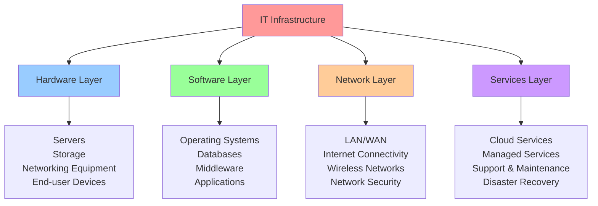

---

## 🖥️ Server Technologies and Computing

### Server Hardware Architecture

#### **Server Types and Use Cases**

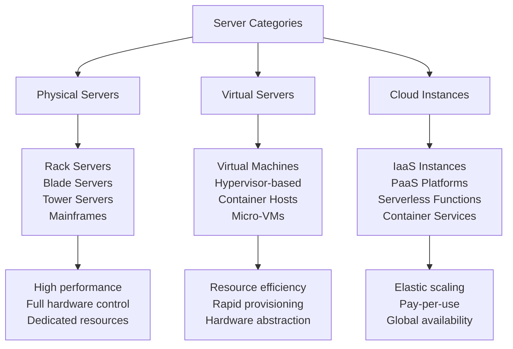

#### **Server Performance Metrics** (VMware 2024)

**CPU Performance Trends**:

```
Server CPU Evolution:
Intel Xeon 2020:     ████████████ 32 cores, 2.5 GHz base
Intel Xeon 2024:     ████████████████████ 64 cores, 3.2 GHz base

AMD EPYC 2020:       ████████████████ 48 cores, 2.8 GHz base  
AMD EPYC 2024:       ████████████████████████ 96 cores, 3.4 GHz base

Performance Improvement: 85% over 4 years
Energy Efficiency: 40% improvement per watt
```

#### **Memory and Storage Performance**

| Component | 2020 Standard | 2024 Standard | Performance Gain |
|-----------|---------------|---------------|------------------|
| **RAM Capacity** | 512 GB | 2 TB | 4x increase |
| **RAM Speed** | DDR4-3200 | DDR5-5600 | 75% faster |
| **SSD Performance** | 3,500 MB/s | 7,000 MB/s | 100% faster |
| **NVMe Latency** | 100 μs | 45 μs | 55% reduction |

### Virtualization Technologies

#### **Virtualization Benefits and Performance**

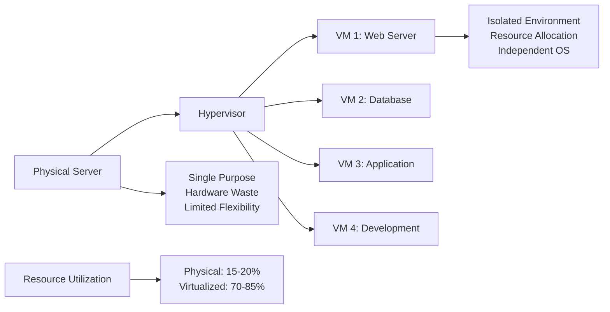

#### **Hypervisor Comparison** (VMware State of Infrastructure 2024)

| Hypervisor | Market Share | Performance | Use Cases | License Model |
|------------|-------------|-------------|-----------|---------------|
| **VMware vSphere** | 47.2% | ⭐⭐⭐⭐⭐ | Enterprise, critical workloads | Commercial |
| **Microsoft Hyper-V** | 28.6% | ⭐⭐⭐⭐☆ | Windows environments | Included with Windows |
| **KVM/QEMU** | 15.3% | ⭐⭐⭐⭐☆ | Linux environments | Open source |
| **Citrix XenServer** | 6.2% | ⭐⭐⭐⭐☆ | VDI, cloud workloads | Commercial/Free tier |
| **Proxmox** | 2.7% | ⭐⭐⭐☆☆ | Small business, labs | Open source |

### Containerization and Modern Workloads

#### **Containers vs. Virtual Machines**

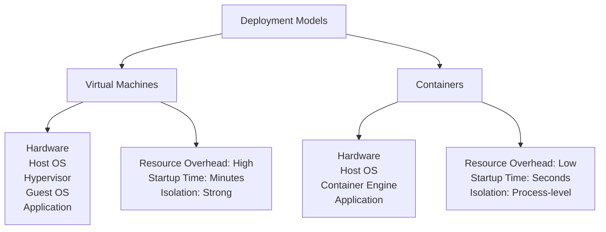

#### **Container Technology Adoption** (Dell Technologies 2024)

**Container Platform Usage**:

```
Container Orchestration Platforms:
Kubernetes     ██████████████████████████████ 87.3%
Docker Swarm   ████████ 23.1%
OpenShift      ██████ 18.7%
Amazon ECS     █████ 15.2%
Other          ███ 9.4%

Business Benefits:
Faster Deployment: 67% improvement
Resource Efficiency: 45% better utilization
Development Velocity: 3x faster iterations
Operational Costs: 35% reduction
```

---

## 🌐 Networking Infrastructure

### Network Fundamentals

#### **OSI Model and TCP/IP Stack**

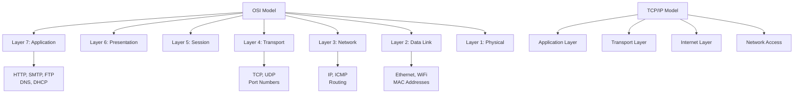

#### **Network Topologies**

**Common Network Designs**:

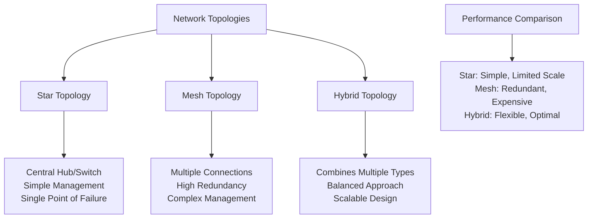

### Network Equipment and Technologies

#### **Essential Network Components**

| Component | Function | Performance Specs | Price Range |
|-----------|----------|------------------|-------------|
| **Enterprise Switch** | Layer 2/3 switching | 48-port GbE, 4x 10GbE uplinks | $2,000-8,000 |
| **Core Router** | Inter-network routing | 100 Gbps throughput | $15,000-50,000 |
| **Firewall** | Security gateway | 10 Gbps throughput, IPS/IDS | $5,000-25,000 |
| **Wireless AP** | WiFi connectivity | WiFi 6E, 2.4/5/6 GHz | $200-800 |
| **Load Balancer** | Traffic distribution | Layer 4/7, SSL offloading | $10,000-40,000 |

#### **Network Performance Metrics** (Cisco Global Trends 2024)

**Bandwidth Requirements by Application**:

```
Application Bandwidth Needs:
Video Conferencing (4K): ████████ 8-25 Mbps per user
Cloud Applications:      ██████ 5-15 Mbps per user  
File Sharing/Backup:     ████████████ 50-200 Mbps burst
Database Replication:    ██████ 10-50 Mbps sustained
VoIP Communications:     ██ 0.1-0.5 Mbps per call

Network Utilization Trends:
2020 Average: 45% utilization
2024 Average: 73% utilization
Peak Growth: +156% during business hours
```

### Network Security Architecture

#### **Security Layers and Controls**

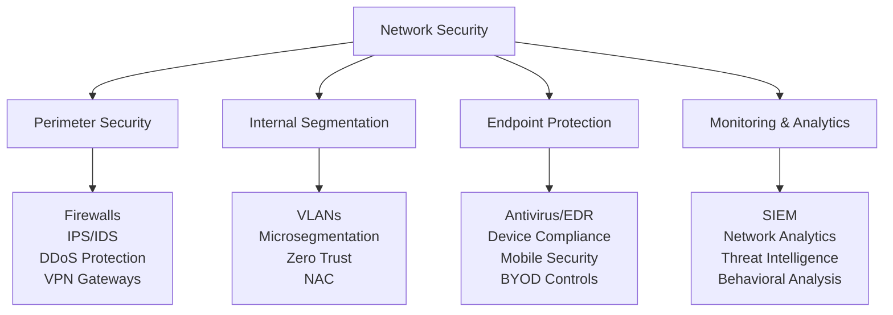

#### **Network Security Threats** (IBM Security Report 2024)

**Top Security Incidents by Vector**:

| Attack Vector | Frequency | Average Cost | Detection Time | Recovery Time |
|---------------|-----------|--------------|----------------|---------------|
| **Phishing** | 34.2% | $4.7M | 287 days | 73 days |
| **Malware** | 28.9% | $4.2M | 245 days | 69 days |
| **Insider Threats** | 18.3% | $5.1M | 308 days | 89 days |
| **DDoS Attacks** | 12.7% | $2.8M | 12 hours | 24 hours |
| **SQL Injection** | 5.9% | $3.9M | 198 days | 55 days |

---

## ☁️ Cloud Infrastructure Models

### Cloud Service Models

#### **IaaS, PaaS, and SaaS Comparison**

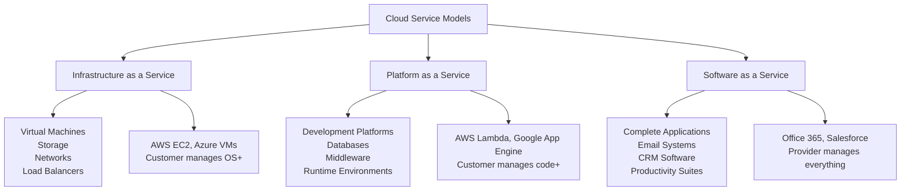

#### **Cloud Market Share** (Gartner 2024)

**Public Cloud Infrastructure Market**:

```
Cloud Provider Market Share:
Amazon Web Services  ████████████████████████████ 32.4%
Microsoft Azure      ██████████████████ 23.1%
Google Cloud         ████████ 10.7%
Alibaba Cloud        ████ 5.8%
IBM Cloud            ███ 3.9%
Other Providers      ████████████ 24.1%

Revenue Growth (YoY):
AWS: +12.3% ($90.8B)
Azure: +27.1% ($64.7B)  
GCP: +35.2% ($30.0B)
```

### Hybrid and Multi-Cloud Strategies

#### **Cloud Adoption Patterns** (VMware 2024)

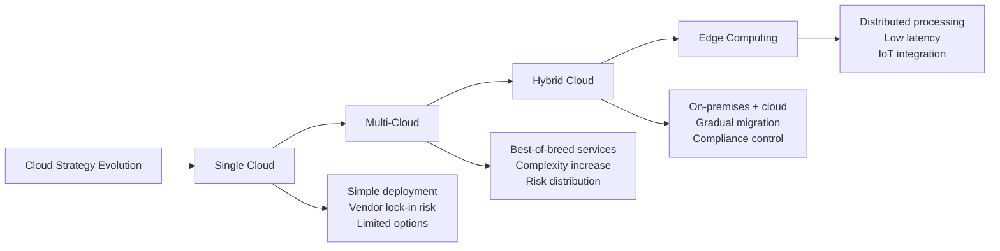

#### **Hybrid Cloud Benefits and Challenges**

**Business Drivers for Hybrid Cloud** (HPE Infrastructure Report 2024):

| Driver | Importance | Implementation Complexity | ROI Timeline |
|--------|------------|---------------------------|--------------|
| **Cost Optimization** | 87% | ⭐⭐⭐☆☆ | 6-12 months |
| **Scalability** | 79% | ⭐⭐☆☆☆ | 3-6 months |
| **Data Sovereignty** | 73% | ⭐⭐⭐⭐☆ | 12-18 months |
| **Disaster Recovery** | 68% | ⭐⭐⭐☆☆ | 6-9 months |
| **Application Modernization** | 61% | ⭐⭐⭐⭐⭐ | 18-24 months |

### Cloud Economics and Cost Management

#### **Cloud Cost Optimization Strategies**

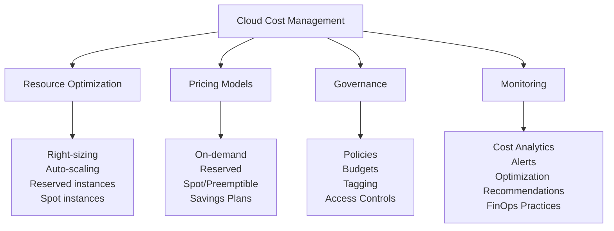

**Cloud Cost Breakdown Analysis** (AWS/Azure Pricing 2024):

```
Typical Cloud Infrastructure Costs:
Compute (EC2/VMs):      ████████████████████ 45%
Storage (S3/Blob):      ████████ 18%
Networking:             ██████ 12%
Database Services:      ██████ 13%
Management/Monitoring:  ███ 7%
Other Services:         ███ 5%

Cost Optimization Potential:
Right-sizing: 20-30% savings
Reserved Instances: 30-60% savings
Auto-scaling: 15-25% savings
Storage Optimization: 40-70% savings
```

---

## 📊 Infrastructure Monitoring and Management

### Monitoring Frameworks

#### **Infrastructure Monitoring Stack**

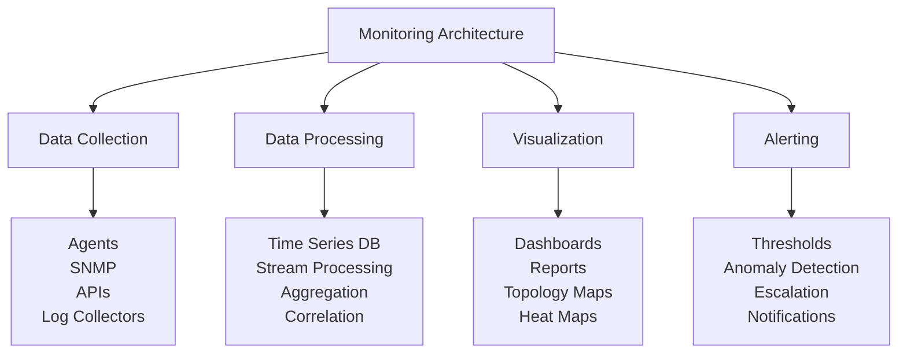

#### **Key Performance Indicators (KPIs)**

**Infrastructure Health Metrics**:

| Metric Category | Key Indicators | Normal Range | Alert Threshold |
|----------------|----------------|--------------|-----------------|
| **CPU Performance** | Utilization, Load Average | <70% | >85% |
| **Memory Usage** | Available RAM, Page Faults | >20% free | <10% free |
| **Storage** | Disk Usage, IOPS | <80% full | >90% full |
| **Network** | Bandwidth, Latency, Errors | <50% util | >80% util |
| **Application** | Response Time, Throughput | <500ms | >2000ms |

### Popular Monitoring Tools

#### **Monitoring Solution Comparison** (Gartner 2024)

| Tool | Type | Strengths | Market Position | Pricing Model |
|------|------|-----------|-----------------|---------------|
| **Prometheus** | Open Source | Kubernetes native, flexible | Rising | Free |
| **Nagios** | Open Source | Mature, extensive plugins | Stable | Free/Commercial |
| **Zabbix** | Open Source | All-in-one solution | Stable | Free |
| **Datadog** | Commercial | Cloud-native, AI/ML | Leader | $15-23/host/month |
| **New Relic** | Commercial | APM focus, analytics | Strong | $25-75/host/month |
| **Splunk** | Commercial | Log analytics, security | Leader | $150-2000/GB/month |

#### **Monitoring Best Practices**

**The Four Golden Signals** (Google SRE):

1. **Latency**: Time to process requests
2. **Traffic**: Demand on the system
3. **Errors**: Rate of failed requests
4. **Saturation**: Resource utilization

**Implementation Example**:

```yaml
# Prometheus monitoring configuration
apiVersion: v1
kind: ConfigMap
metadata:
  name: prometheus-config
data:
  prometheus.yml: |
    global:
      scrape_interval: 30s
      evaluation_interval: 30s
    
    scrape_configs:
      - job_name: 'kubernetes-nodes'
        kubernetes_sd_configs:
          - role: node
        relabel_configs:
          - source_labels: [__address__]
            regex: '(.*):10250'
            target_label: __address__
            replacement: '${1}:9100'
    
    rule_files:
      - "alert_rules.yml"
    
    alerting:
      alertmanagers:
        - static_configs:
            - targets:
              - alertmanager:9093
```

---

## 🏢 Infrastructure Design Patterns

### High Availability Architecture

#### **Redundancy and Failover Strategies**

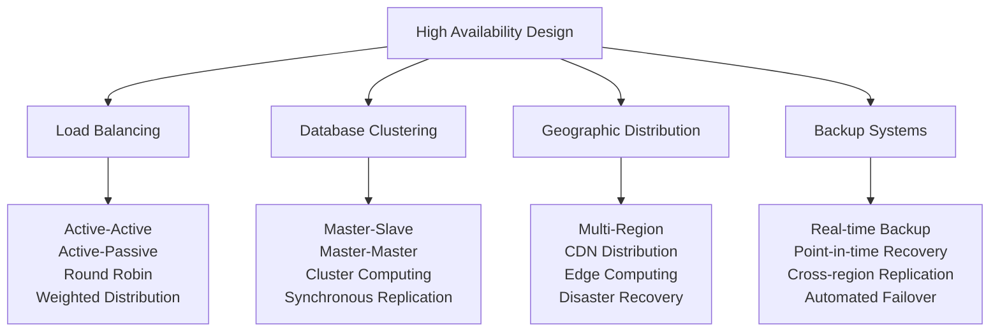

#### **Availability Metrics and SLAs**

**Service Level Agreements** (Industry Standards):

| Availability % | Downtime/Year | Downtime/Month | Use Case |
|----------------|---------------|----------------|----------|
| **99%** | 3.65 days | 7.2 hours | Development/Testing |
| **99.9%** | 8.76 hours | 43.2 minutes | Standard Production |
| **99.95%** | 4.38 hours | 21.6 minutes | Business Critical |
| **99.99%** | 52.56 minutes | 4.32 minutes | Mission Critical |
| **99.999%** | 5.26 minutes | 25.9 seconds | Ultra-Critical |

### Scalability Patterns

#### **Horizontal vs. Vertical Scaling**

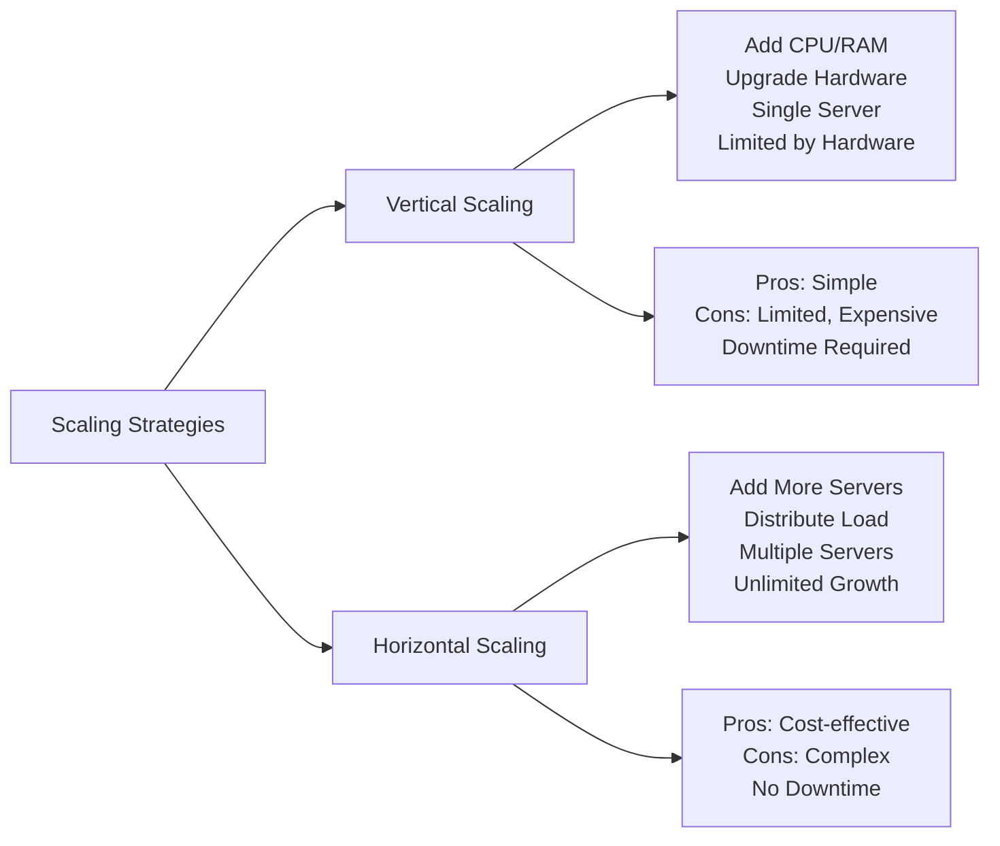

#### **Auto-Scaling Implementation**

**Cloud Auto-Scaling Metrics**:

```
Auto-Scaling Triggers:
CPU Utilization > 70%:    ████████████████████ Scale Out
Memory Usage > 80%:       ████████████████ Scale Out  
Response Time > 500ms:    ████████████ Scale Out
Queue Length > 100:       ██████████ Scale Out

Scale-in Conditions:
CPU Utilization < 30%:    ████████ Scale In
Low Traffic (< 50 req/s): ██████ Scale In
Cost Optimization:        ████ Schedule-based
```

---

## 💻 Hands-On Infrastructure Labs

### **Lab 1: Network Design and Configuration**

**Objective**: Design a small office network infrastructure

**Scenario**: 50-person company needs network design

**Requirements**:
- Internet connectivity for all users
- Secure guest WiFi access
- Server room with isolated network segment
- Remote access capabilities for employees
- Network monitoring and management

**Design Components**:

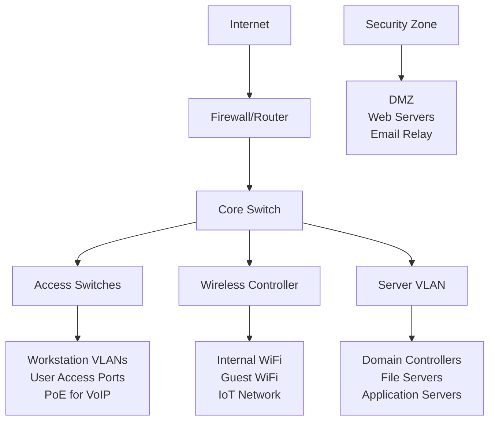

**Implementation Tasks**:

1. **IP Address Planning**
   - Design subnet structure
   - Assign VLAN IDs
   - Plan IP ranges for different segments

2. **Security Implementation**
   - Configure firewall rules
   - Set up access control lists
   - Implement network segmentation

3. **Monitoring Setup**
   - Install SNMP on devices
   - Configure network monitoring
   - Set up alerting thresholds

### **Lab 2: Virtualization Environment Setup**

**Objective**: Build a virtualized infrastructure using VirtualBox/VMware

**Environment Setup**:
- Hypervisor installation and configuration
- Virtual machine creation and management
- Network configuration and virtual switches
- Storage allocation and management

**Virtual Infrastructure Design**:

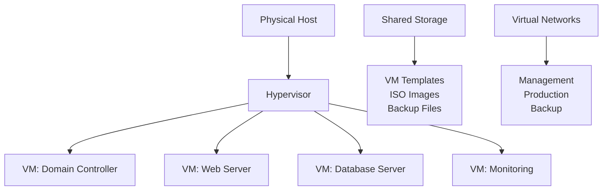

**Lab Tasks**:

1. **Hypervisor Configuration**
   - Install VMware vSphere or VirtualBox
   - Configure resource pools
   - Set up virtual networking

2. **Virtual Machine Deployment**
   - Create Windows Server VM
   - Deploy Linux web server
   - Configure VM networking and storage

3. **Management and Monitoring**
   - Set up VM monitoring
   - Configure backup solutions
   - Test disaster recovery procedures

### **Lab 3: Cloud Infrastructure Deployment**

**Objective**: Deploy infrastructure on AWS/Azure using Infrastructure as Code

**Project Scope**: Web application infrastructure with database backend

**Architecture Components**:

```yaml
# Terraform AWS Infrastructure
provider "aws" {
  region = "us-west-2"
}

# VPC and Networking
resource "aws_vpc" "main" {
  cidr_block           = "10.0.0.0/16"
  enable_dns_hostnames = true
  enable_dns_support   = true
  
  tags = {
    Name = "main-vpc"
  }
}

# Public Subnet
resource "aws_subnet" "public" {
  vpc_id                  = aws_vpc.main.id
  cidr_block              = "10.0.1.0/24"
  availability_zone       = "us-west-2a"
  map_public_ip_on_launch = true
  
  tags = {
    Name = "public-subnet"
  }
}

# Private Subnet
resource "aws_subnet" "private" {
  vpc_id            = aws_vpc.main.id
  cidr_block        = "10.0.2.0/24"
  availability_zone = "us-west-2b"
  
  tags = {
    Name = "private-subnet"
  }
}

# EC2 Instance
resource "aws_instance" "web_server" {
  ami           = "ami-0c55b159cbfafe1d0"
  instance_type = "t2.micro"
  subnet_id     = aws_subnet.public.id
  
  user_data = <<-EOF
              #!/bin/bash
              yum update -y
              yum install -y httpd
              systemctl start httpd
              systemctl enable httpd
              EOF
  
  tags = {
    Name = "web-server"
  }
}
```

---

## 🎯 Challenge Project: Enterprise Infrastructure Design

### **Project Overview: Multi-Tier Application Infrastructure**

**Company Profile**: Growing SaaS company (200 employees)
**Challenge**: Design scalable, secure, and cost-effective infrastructure
**Timeline**: 3-month implementation plan
**Budget**: $150,000 initial setup, $25,000/month operational

### **Requirements Analysis**

#### **Functional Requirements**

**Application Tier**:
- Web application supporting 10,000 concurrent users
- API services for mobile and third-party integrations
- Background job processing for data analytics
- Real-time messaging and notifications

**Data Tier**:
- Primary database cluster with high availability
- Data warehouse for analytics and reporting
- File storage for user uploads and content
- Backup and disaster recovery systems

#### **Non-Functional Requirements**

| Requirement | Target | Measurement |
|-------------|--------|-------------|
| **Availability** | 99.9% uptime | Monthly monitoring |
| **Performance** | <200ms response time | Application monitoring |
| **Scalability** | 10x growth capacity | Load testing |
| **Security** | SOC 2 compliance | Security audit |
| **Recovery** | RTO <4 hours, RPO <1 hour | DR testing |

### **Infrastructure Architecture Design**

#### **High-Level Architecture**

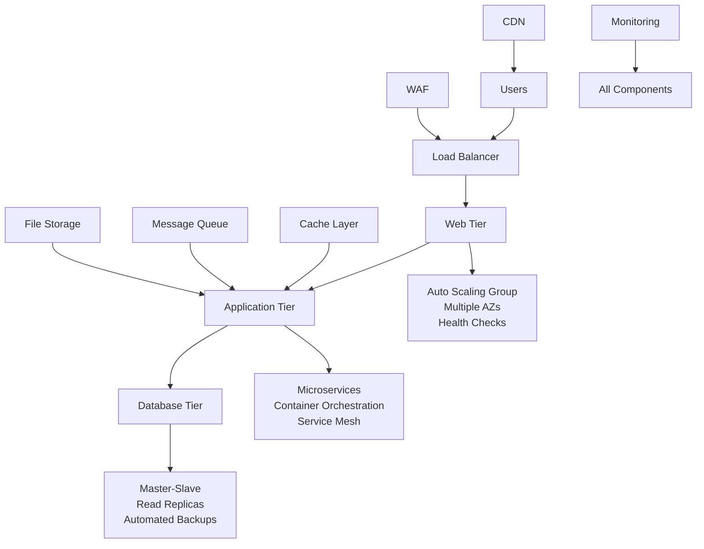

#### **Technology Stack Selection**

**Infrastructure Layer**:

| Component | Technology Choice | Justification | Monthly Cost |
|-----------|------------------|---------------|--------------|
| **Cloud Provider** | AWS/Azure | Enterprise features, compliance | $15,000 |
| **Container Platform** | Kubernetes | Scalability, vendor neutral | $3,000 |
| **Database** | PostgreSQL + Redis | Performance, reliability | $4,000 |
| **Monitoring** | Datadog + ELK Stack | Comprehensive observability | $2,000 |
| **Security** | CloudFlare + Vault | DDoS protection, secrets management | $1,000 |

### **Implementation Phases**

#### **Phase 1: Foundation (Month 1)**

**Week 1-2: Core Infrastructure**
- [ ] Set up VPC and networking
- [ ] Deploy Kubernetes cluster
- [ ] Configure security groups and firewalls
- [ ] Implement basic monitoring

**Week 3-4: Database and Storage**
- [ ] Deploy database cluster
- [ ] Set up backup and replication
- [ ] Configure object storage
- [ ] Test disaster recovery procedures

#### **Phase 2: Application Deployment (Month 2)**

**Week 1-2: Container Orchestration**
- [ ] Set up CI/CD pipelines
- [ ] Deploy application containers
- [ ] Configure service mesh
- [ ] Implement auto-scaling

**Week 3-4: Performance Optimization**
- [ ] Set up caching layers
- [ ] Configure CDN
- [ ] Optimize database queries
- [ ] Load testing and tuning

#### **Phase 3: Production Readiness (Month 3)**

**Week 1-2: Security and Compliance**
- [ ] Security hardening
- [ ] Compliance validation
- [ ] Penetration testing
- [ ] Security audit

**Week 3-4: Operations and Documentation**
- [ ] Operational runbooks
- [ ] Team training
- [ ] Performance baselines
- [ ] Go-live preparation

---

## 📚 Infrastructure Learning Resources

### **Professional Development**

#### **Industry Certifications**

**Cloud Infrastructure Certifications**:

| Certification | Provider | Level | Duration | Average Salary Impact |
|---------------|----------|-------|----------|----------------------|
| **AWS Solutions Architect** | Amazon | Associate/Professional | 3-6 months | +25% |
| **Azure Infrastructure** | Microsoft | Associate/Expert | 3-6 months | +22% |
| **Google Cloud Architect** | Google | Professional | 4-8 months | +20% |
| **CISSP** | (ISC)² | Professional | 6-12 months | +30% |
| **CCNA/CCNP** | Cisco | Associate/Professional | 4-8 months | +18% |

#### **Learning Resources**

**Books and Publications**:
- "Infrastructure as Code" by Kief Morris
- "Site Reliability Engineering" by Google SRE Team
- "Network Warrior" by Gary Donahue
- "The Practice of System and Network Administration" by Limoncelli

**Online Training Platforms**:

| Platform | Strengths | Cost | Best For |
|----------|-----------|------|----------|
| **A Cloud Guru** | Cloud-focused content | $39/month | Cloud certifications |
| **Pluralsight** | Technical depth | $35/month | Skills development |
| **CBT Nuggets** | Engaging instruction | $59/month | Certification prep |
| **Linux Academy** | Hands-on labs | $49/month | Linux/DevOps |

### **Hands-On Learning**

#### **Home Lab Setup Options**

**Budget-Friendly Lab** ($500-1,000):
- Used enterprise server (Dell R710/HP DL380)
- 32-64 GB RAM, multiple CPUs
- Network switch and firewall
- Virtual machine software

**Cloud-Based Lab** ($50-200/month):
- AWS/Azure free tier + paid resources
- Practice real-world scenarios
- No hardware maintenance
- Scalable learning environment

#### **Popular Home Lab Projects**

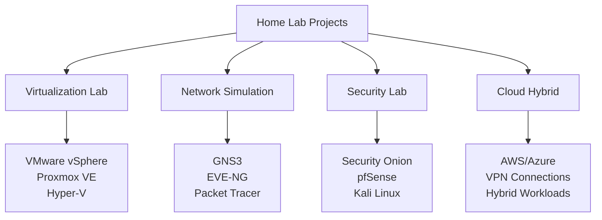

---

## ✅ Skills Assessment and Career Guidance

### **Technical Skills Evaluation**

#### **Infrastructure Competency Matrix**

Rate your current skill level (1-5 scale):

**Networking**:
- [ ] OSI Model and TCP/IP ___/5
- [ ] Routing and Switching ___/5
- [ ] Network Security ___/5
- [ ] Wireless Technologies ___/5
- [ ] Network Monitoring ___/5

**Server Technologies**:
- [ ] Windows Server Administration ___/5
- [ ] Linux System Administration ___/5
- [ ] Virtualization (VMware/Hyper-V) ___/5
- [ ] Container Technologies ___/5
- [ ] Database Administration ___/5

**Cloud Infrastructure**:
- [ ] AWS/Azure/GCP Services ___/5
- [ ] Infrastructure as Code ___/5
- [ ] Container Orchestration ___/5
- [ ] Cloud Security ___/5
- [ ] Cost Optimization ___/5

### **Career Pathway Planning**

#### **Infrastructure Career Tracks**

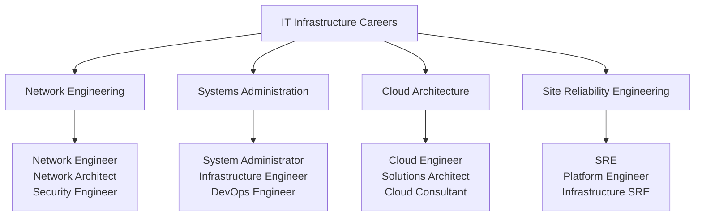

#### **Salary Progression** (2024 Market Data)

| Role | Entry Level | Mid Level | Senior Level | Location Premium |
|------|-------------|-----------|--------------|------------------|
| **Network Engineer** | $55K-70K | $70K-95K | $95K-130K | SF/NYC: +40% |
| **Systems Admin** | $50K-65K | $65K-85K | $85K-115K | Austin: +25% |
| **Cloud Architect** | $85K-110K | $110K-150K | $150K-220K | Remote: -10% |
| **Site Reliability Engineer** | $90K-120K | $120K-160K | $160K-250K | Tech hubs: +50% |

### **Professional Development Plan**

#### **90-Day Infrastructure Learning Sprint**

**Month 1: Fundamentals**
- [ ] Complete networking fundamentals course
- [ ] Set up home lab environment
- [ ] Study for entry-level certification
- [ ] Practice basic system administration

**Month 2: Specialization**
- [ ] Choose focus area (cloud, networking, etc.)
- [ ] Advanced certification preparation
- [ ] Hands-on projects and labs
- [ ] Join professional communities

**Month 3: Application and Experience**
- [ ] Complete certification exam
- [ ] Build portfolio projects
- [ ] Contribute to open source projects
- [ ] Apply for positions or seek promotion

---

## 🚀 Future of IT Infrastructure

### **Emerging Technologies and Trends**

#### **Infrastructure Evolution Roadmap**

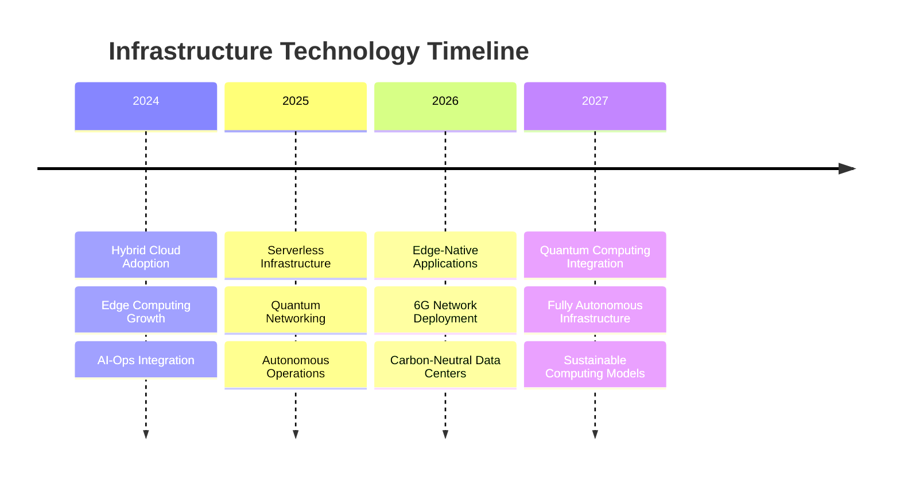

#### **Technology Investment Priorities** (Next 3 Years)

| Technology | Investment Level | Business Impact | Implementation Complexity |
|------------|------------------|-----------------|---------------------------|
| **Edge Computing** | High | Revenue enablement | ⭐⭐⭐⭐☆ |
| **AI/ML Operations** | High | Operational efficiency | ⭐⭐⭐⭐⭐ |
| **Zero Trust Security** | Very High | Risk reduction | ⭐⭐⭐⭐☆ |
| **Sustainable Infrastructure** | Medium | Cost reduction | ⭐⭐⭐☆☆ |
| **Quantum Computing** | Low | Future competitive edge | ⭐⭐⭐⭐⭐ |

---

<div align="center">

## 🏆 **Excellent Progress in Infrastructure Mastery!**

You've gained comprehensive understanding of IT infrastructure fundamentals, from traditional data centers to modern cloud-native architectures. With this foundation, you're equipped to design, implement, and manage robust infrastructure solutions that power modern businesses.

**Ready to specialize?** Continue with advanced topics in networking, cloud architecture, or site reliability engineering to build your expertise.

</div>

---

**Lesson created by UltraCube Infrastructure Team** | [ucubetech.com](https://www.ucubetech.com) | **Copyright © 2025 UltraCube Technology**

> **Sources**: This comprehensive lesson incorporates authoritative insights from Cisco Global Networking Trends, VMware State of Infrastructure, IDC Infrastructure Survey, Gartner I&O Reports, major cloud providers (AWS, Azure, GCP), and leading infrastructure companies to provide current and comprehensive IT infrastructure knowledge.
