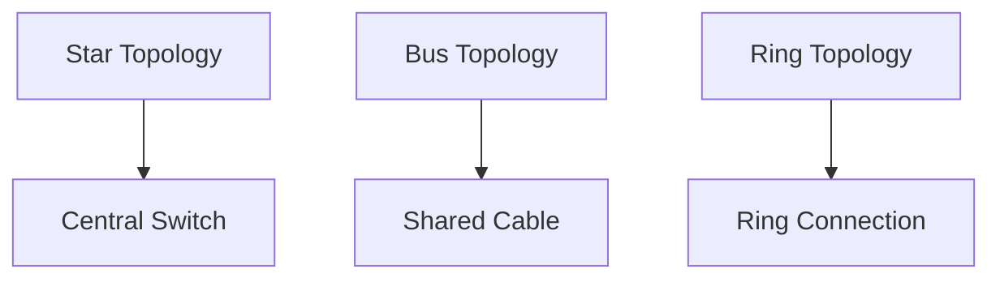

# Lesson 01: Introduction to Networking

## Overview
Networking is the practice of connecting computers and other devices to share resources and information. Understanding networking basics is essential for building, maintaining, and securing modern IT environments.

## Learning Objectives

- Define networking and its importance in IT
- Identify key networking components and devices
- Understand basic network topologies

## Visual: Basic Network Topologies

## Detailed Explanation

### What is Networking?
Networking enables communication and resource sharing between devices using hardware (routers, switches, cables) and protocols (TCP/IP).

### Key Components
- Router
- Switch
- Hub
- Network Interface Card (NIC)
- Cable (Ethernet, Fiber)

### Basic Topologies
- **Star:** All devices connect to a central switch
- **Bus:** All devices share a single communication line
- **Ring:** Devices form a closed loop

## References
- [Cisco Networking Basics](https://www.cisco.com/c/en/us/products/switches/what-is-a-network-switch.html)
- [CompTIA Network+ Guide](https://www.comptia.org/content/guides/what-is-networking)
- [Network Topologies (GeeksforGeeks)](https://www.geeksforgeeks.org/types-of-network-topology/)
