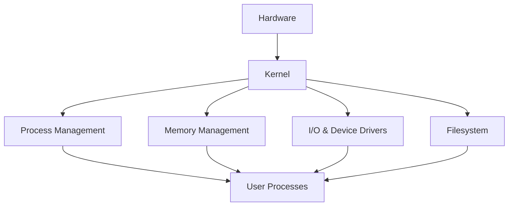

# Lesson 01: Operating Systems Fundamentals

## Overview

An operating system (OS) is system software that manages hardware resources and provides common services for application programs. Understanding OS architecture is critical for infrastructure, security, and performance management.

## Learning Objectives

* Define the role of an operating system
* Identify core OS components (kernel, process manager, memory manager, I/O, filesystem)
* Understand user vs kernel mode and system calls

## Visual: Simplified OS Architecture

## Detailed Explanation

### Core Responsibilities

* Process lifecycle (creation, scheduling, termination)
* Memory allocation and protection
* Device abstraction and driver interaction
* Filesystem organization and access control
* Security context and privilege boundaries

### Kernel vs User Mode

Kernel mode has unrestricted hardware access. User mode restricts direct hardware operations for stability and security. Transitions occur through system calls (e.g., `read`, `write`, `fork`).

### Filesystems

Provide hierarchical organization, metadata, permissions, and access methods. Examples: ext4, NTFS, XFS.

## References

* [Operating System Concepts (Silberschatz et al.)](https://www.os-book.com/)
* [Linux man-pages Project](https://man7.org/linux/man-pages/)
* [Microsoft Docs: Windows Architecture](https://learn.microsoft.com/en-us/windows-hardware/drivers/gettingstarted/windows-architecture-overview)
