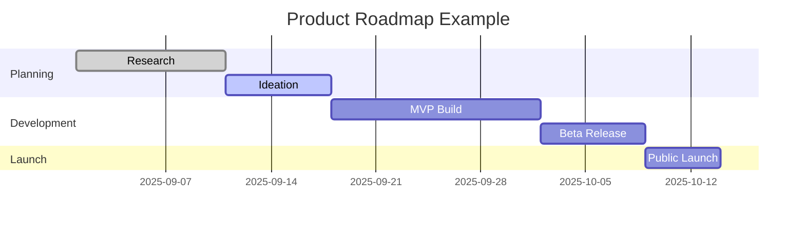

# Lesson 01: Introduction to Product Roadmapping

## Overview
Product roadmapping is the process of defining the vision, direction, priorities, and progress of a product over time. A roadmap communicates the why and what behind the product and helps align stakeholders.

## Learning Objectives

- Define product roadmapping and its purpose
- Identify key components of a product roadmap
- Understand how to create and communicate a roadmap

## Visual: Product Roadmap Example

## Detailed Explanation

### What is Product Roadmapping?
A product roadmap is a high-level visual summary that maps out the vision and direction of your product offering over time. It helps teams plan, prioritize, and communicate work.

### Key Components
- Goals and objectives
- Features and initiatives
- Timeline and milestones
- Stakeholders and responsibilities

### Creating a Roadmap
- Define vision and goals
- Gather input from stakeholders
- Prioritize features and initiatives
- Visualize and communicate the plan

## References
- [Atlassian: Product Roadmaps](https://www.atlassian.com/agile/product-management/product-roadmaps)
- [Aha! Guide to Roadmapping](https://www.aha.io/roadmapping/guide)
- [ProductPlan: What is a Product Roadmap?](https://www.productplan.com/learn/product-roadmap/)
