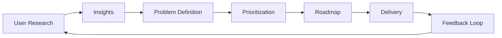

# Lesson 01: Introduction to User Research

## Overview

User research is the systematic study of target users to understand their needs, behaviors, motivations, and pain points. It informs product decisions and reduces risk.

## Learning Objectives

* Define user research and its purpose in product development
* Identify common qualitative and quantitative research methods
* Understand how research insights feed into product roadmaps

## Visual: Research to Product Flow

## Detailed Explanation

### Research Methods

* Qualitative: Interviews, usability tests, field studies
* Quantitative: Surveys, analytics, A/B tests

### Turning Insights into Action

Cluster findings into themes, map to user journeys, and translate validated problems into hypotheses and roadmap items.

### Continuous Discovery

Ongoing research reduces waste and keeps the product aligned with evolving user needs.

## References

* [Nielsen Norman Group: User Research Basics](https://www.nngroup.com/articles/which-ux-research-methods/)
* [Teresa Torres: Continuous Discovery Habits](https://www.producttalk.org/)
* [MeasuringU: Quant vs Qual UX](https://measuringu.com)
