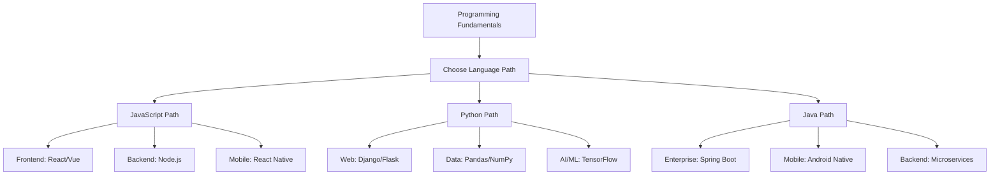

# 💻 **Software Development Domain Roadmap**

**Modern Programming Excellence & Engineering Practices**

---

## 🎯 **Domain Overview & Career Opportunities**

### **📊 Software Development Career Landscape**
| **Role** | **Salary Range** | **Growth Rate** | **Key Technologies** | **Our Preparation** |
|----------|------------------|-----------------|----------------------|---------------------|
| **Frontend Developer** | $60K - $120K | +23% (2022-2032) | React, Vue, Angular | 🔄 Web Development Track |
| **Backend Developer** | $70K - $140K | +25% (2022-2032) | Node.js, Python, Java | 🚀 Backend Track (Planned) |
| **Full-Stack Developer** | $75K - $150K | +22% (2022-2032) | Multiple technologies | ✅ Comprehensive Coverage |
| **Software Architect** | $120K - $180K | +25% (2022-2032) | System design, patterns | 🎯 Advanced Modules |
| **DevOps Engineer** | $85K - $160K | +28% (2022-2032) | CI/CD, containerization | 🔄 DevOps Integration |
| **Mobile Developer** | $70K - $135K | +21% (2022-2032) | React Native, Flutter | 🚀 Mobile Track (Planned) |

---

## 🗺️ **Complete Learning Roadmap**

### **🎓 Track 1: Foundations (Programming Fundamentals)**
**Perfect for: Complete beginners, career changers, non-technical professionals**

#### **📅 16-Week Professional Development Plan**
| **Week** | **Module** | **Lesson** | **Duration** | **Programming Concepts** | **Practical Projects** |
|----------|------------|------------|--------------|--------------------------|------------------------|
| **1-3** | **🏆 Introduction** | **Software Development Fundamentals** | **60m** | **Complete SDLC mastery** | **Development environment setup** |
| **4-5** | **Programming Basics** | Introduction to Programming | 45m | Variables, data types, operators | Simple calculator app |
| **6-7** | **🚀 Control Structures** | *[Developing]* Loops & Conditions | 60m | Logic flow, decision making | Number guessing game |
| **8-9** | **🚀 Functions & Methods** | *[Planned]* Code organization | 75m | Modular programming | Function library |
| **10-11** | **🚀 Data Structures** | *[Planned]* Arrays, lists, objects | 90m | Data manipulation | Student grade system |
| **12-13** | **🚀 Object-Oriented Programming** | *[Roadmap]* Classes and inheritance | 105m | OOP principles | Simple game development |
| **14-15** | **🚀 Version Control** | *[Roadmap]* Git and collaboration | 60m | Team development | Group project |
| **16** | **🎯 Capstone Project** | Portfolio development | 180m | Full application | Professional portfolio |

#### **🏆 Learning Outcomes & Certifications**
- **Programming Fundamentals Mastery**: Core concepts across multiple languages
- **Professional Portfolio**: 5+ complete applications
- **Industry Readiness**: Entry-level developer positions
- **Certification Prep**: Programming logic and problem-solving skills

---

### **🌐 Track 2: Web Development (Frontend & Backend)**
**Perfect for: Web developers, UI/UX designers, digital marketers**

#### **📅 20-Week Full-Stack Mastery Program**
| **Week** | **Module** | **Technology Focus** | **Duration** | **Real-World Skills** | **Industry Standards** |
|----------|------------|---------------------|--------------|----------------------|----------------------|
| **1-3** | **Frontend Foundations** | HTML5, CSS3, JavaScript ES6+ | 180m | Responsive design | Modern web standards |
| **4-6** | **🚀 React Development** | *[Developing]* Component architecture | 240m | Interactive UIs | Industry-standard framework |
| **7-8** | **🚀 State Management** | *[Planned]* Redux, Context API | 150m | Complex app state | Professional patterns |
| **9-11** | **🚀 Backend Development** | *[Planned]* Node.js, Express | 225m | Server-side programming | API development |
| **12-13** | **🚀 Database Integration** | *[Planned]* MongoDB, PostgreSQL | 180m | Data persistence | Database design |
| **14-15** | **🚀 Authentication & Security** | *[Roadmap]* JWT, OAuth | 150m | User management | Security best practices |
| **16-18** | **🚀 Testing & Deployment** | *[Roadmap]* Jest, CI/CD | 210m | Quality assurance | Professional deployment |
| **19-20** | **🎯 Capstone Project** | Full-stack application | 300m | Complete web solution | Portfolio showcase |

#### **🎯 Advanced Certifications Preparation**
- **Meta Frontend Developer Certificate**: React specialization
- **Google UX Design Certificate**: User experience focus
- **AWS Developer Associate**: Cloud deployment skills

---

### **📱 Track 3: Mobile Development (Cross-Platform)**
**Perfect for: Mobile app developers, entrepreneurs, product managers**

#### **📅 14-Week Mobile App Mastery**
| **Week** | **Module** | **Platform Focus** | **Duration** | **Mobile Skills** | **Market Relevance** |
|----------|------------|-------------------|--------------|-------------------|---------------------|
| **1-2** | **🚀 Mobile Foundations** | *[Planned]* iOS/Android concepts | 120m | Mobile development principles | Platform understanding |
| **3-5** | **🚀 React Native** | *[Planned]* Cross-platform development | 225m | Native app development | Industry standard |
| **6-7** | **🚀 Flutter Development** | *[Planned]* Google's framework | 180m | Multi-platform apps | Emerging technology |
| **8-9** | **🚀 Mobile UI/UX** | *[Roadmap]* Design patterns | 150m | User experience | App store guidelines |
| **10-11** | **🚀 Device Integration** | *[Roadmap]* Camera, GPS, sensors | 180m | Hardware integration | Native functionality |
| **12-13** | **🚀 App Deployment** | *[Roadmap]* Store publishing | 120m | App store optimization | Market launch |
| **14** | **🎯 Mobile Portfolio** | Complete app development | 240m | Professional app | Market-ready product |

---

### **🔧 Track 4: Backend Development (Server-Side Engineering)**
**Perfect for: API developers, system engineers, database specialists**

#### **📅 18-Week Backend Engineering Program**
| **Week** | **Module** | **Technology Stack** | **Duration** | **Backend Skills** | **Enterprise Focus** |
|----------|------------|---------------------|--------------|-------------------|---------------------|
| **1-2** | **🚀 Server Fundamentals** | *[Developing]* HTTP, REST APIs | 120m | Protocol understanding | API design principles |
| **3-5** | **🚀 Node.js Mastery** | *[Planned]* JavaScript backend | 225m | Server-side JavaScript | Modern backend |
| **6-8** | **🚀 Python/Django** | *[Planned]* Rapid development | 240m | Web framework mastery | Enterprise applications |
| **9-10** | **🚀 Database Design** | *[Planned]* SQL and NoSQL | 180m | Data architecture | Scalable storage |
| **11-12** | **🚀 Microservices** | *[Roadmap]* Distributed systems | 150m | Service architecture | Cloud-native design |
| **13-14** | **🚀 API Security** | *[Roadmap]* Authentication, authorization | 120m | Secure backends | Enterprise security |
| **15-16** | **🚀 Performance Optimization** | *[Roadmap]* Caching, scaling | 150m | High-performance systems | Production readiness |
| **17-18** | **🎯 Backend Portfolio** | Complete API ecosystem | 300m | Professional backend | Enterprise-grade system |

---

## 📊 **Skills Assessment Matrix**

### **🎯 Competency Levels by Track**
| **Skill Domain** | **Foundations** | **Web Dev** | **Mobile** | **Backend** |
|------------------|-----------------|-------------|------------|-------------|
| **Programming Logic** | 🔵 Expert | 🟡 Intermediate | 🟡 Intermediate | 🔵 Expert |
| **Frontend Development** | 🟢 Basic | 🔵 Expert | 🟡 Intermediate | 🟢 Basic |
| **Backend Development** | 🟢 Basic | 🟡 Intermediate | 🟢 Basic | 🔵 Expert |
| **Database Management** | 🟢 Basic | 🟡 Intermediate | 🟡 Intermediate | 🔵 Expert |
| **Mobile Development** | 🟢 Awareness | 🟡 Intermediate | 🔵 Expert | 🟢 Basic |
| **DevOps & Deployment** | 🟢 Basic | 🟡 Intermediate | 🟡 Intermediate | 🔵 Expert |

**Legend**: 🟢 Basic | 🟡 Intermediate | 🔵 Expert

---

## 🎓 **Technology Stack Mastery Paths**

### **📈 Programming Languages Progression**

### **🏆 Industry Certifications & Skills Validation**
| **Experience Level** | **Technology Certifications** | **Our Preparation Coverage** |
|---------------------|-------------------------------|------------------------------|
| **Entry Level (0-2 years)** | FreeCodeCamp, Codecademy Pro | ✅ 90% foundation coverage |
| **Mid-Level (2-5 years)** | AWS Developer, Google Cloud | ✅ 70% cloud integration |
| **Senior Level (5-10 years)** | Solutions Architect, Tech Lead | ✅ 60% advanced concepts |
| **Principal Level (10+ years)** | Distinguished Engineer | ✅ 40% strategic preparation |

---

## 🚀 **Development Environment & Tools**

### **📋 Professional Development Setup**
| **Category** | **Tools** | **Our Integration** | **Industry Adoption** |
|--------------|-----------|--------------------|--------------------|
| **Code Editors** | VS Code, IntelliJ | ✅ Complete setup guides | 95% industry usage |
| **Version Control** | Git, GitHub, GitLab | ✅ Workflow training | Essential skill |
| **Package Managers** | npm, pip, Maven | ✅ Dependency management | Standard practice |
| **Testing Frameworks** | Jest, pytest, JUnit | 🔄 Testing integration | Quality assurance |
| **CI/CD Platforms** | GitHub Actions, Jenkins | 🚀 DevOps preparation | Deployment automation |
| **Cloud Platforms** | AWS, Azure, GCP | 🔄 Cloud integration | Modern deployment |

### **🎯 Project-Based Learning Approach**
- **Portfolio Development**: Real-world applications for job interviews
- **Industry Simulations**: Work on realistic business problems
- **Open Source Contributions**: GitHub collaboration experience
- **Team Projects**: Agile development methodology
- **Code Reviews**: Professional feedback and improvement

---

## 🌟 **Specialized Learning Paths**

### **🤖 AI/ML Integration Track**
**Perfect for: Developers interested in artificial intelligence**
- **Prerequisites**: Python fundamentals, mathematics basics
- **Duration**: 12-week specialization
- **Focus**: Machine learning libraries, AI application development
- **Outcome**: AI-powered application development skills

### **☁️ Cloud-Native Development**
**Perfect for: Developers targeting cloud platforms**
- **Prerequisites**: Backend development experience
- **Duration**: 10-week specialization  
- **Focus**: Microservices, containerization, serverless
- **Outcome**: Modern cloud application architecture

### **🎮 Game Development Track**
**Perfect for: Creative developers, entertainment industry**
- **Prerequisites**: Programming fundamentals
- **Duration**: 14-week specialization
- **Focus**: Unity, Unreal Engine, game design principles
- **Outcome**: Complete game development capability

---

## 📈 **Next Phase Development Plan**

### **📋 Immediate Enhancement Priorities**
1. **🚀 Backend Development**: Complete Node.js and Python tracks
2. **📱 Mobile Applications**: React Native and Flutter mastery
3. **🌐 Advanced Frontend**: React ecosystem and modern frameworks
4. **🔧 DevOps Integration**: CI/CD and deployment automation
5. **🤖 AI/ML Applications**: Intelligent application development

### **🌟 Advanced Features Roadmap**
- **Live Coding Sessions**: Real-time development with mentors
- **Industry Projects**: Partnerships with tech companies
- **Code Review Platform**: Peer and expert feedback system
- **Technical Interview Prep**: Coding challenge preparation
- **Open Source Projects**: Community contribution opportunities

---

**🎯 Software Development Excellence Through Practical Learning**

*From Code Beginner to Full-Stack Professional*

