# Software Development Fundamentals: Building the Digital Future

> **UltraCube Learn-Library** | Software Development • Foundations • Beginner  
> **Author**: UltraCube Software Engineering Team  
> **Duration**: 60 minutes | **Difficulty**: ⭐⭐☆☆☆

---

## 🎯 Learning Objectives

By the end of this lesson, you will be able to:

- **Understand** the complete software development lifecycle and modern methodologies
- **Explore** different programming paradigms and their applications
- **Apply** fundamental software engineering principles and best practices
- **Navigate** the diverse career landscape in software development
- **Implement** problem-solving approaches for programming challenges
- **Choose** appropriate tools and technologies for different projects

---

## 💻 What is Software Development?

### Comprehensive Definition

**Software Development** is the systematic process of designing, creating, testing, and maintaining applications, frameworks, and software systems that solve real-world problems and enable digital transformation.

> **IEEE Software Engineering Standards (2024)**: "Software development encompasses the entire spectrum of activities involved in creating software systems, from initial concept and requirements analysis through design, implementation, testing, deployment, and maintenance."

### The Modern Development Landscape

#### **Industry Growth Statistics** (Stack Overflow Survey 2024)

```
Global Software Developer Population:
2020: 24.3 million developers
2021: 26.8 million developers    ████████████
2022: 29.2 million developers    █████████████
2023: 31.8 million developers    ███████████████
2024: 34.9 million developers    ██████████████████
2025: 38.4 million developers    ████████████████████████

Annual Growth Rate: 12.4%
```

#### **Most Popular Programming Languages** (TIOBE Index 2024)

| Rank | Language | Market Share | Use Cases | Growth Trend |
|------|----------|--------------|-----------|--------------|
| 1 | **Python** | 15.8% | AI/ML, Web, Data Science | ↗️ +2.1% |
| 2 | **JavaScript** | 12.4% | Web, Mobile, Server | ↗️ +1.3% |
| 3 | **Java** | 11.7% | Enterprise, Mobile | ↘️ -0.8% |
| 4 | **TypeScript** | 8.9% | Large-scale Web Apps | ↗️ +3.2% |
| 5 | **C#** | 7.3% | .NET, Games, Enterprise | ↗️ +0.9% |
| 6 | **C++** | 6.1% | Systems, Games, HPC | ↘️ -0.4% |

### Software Development Ecosystem

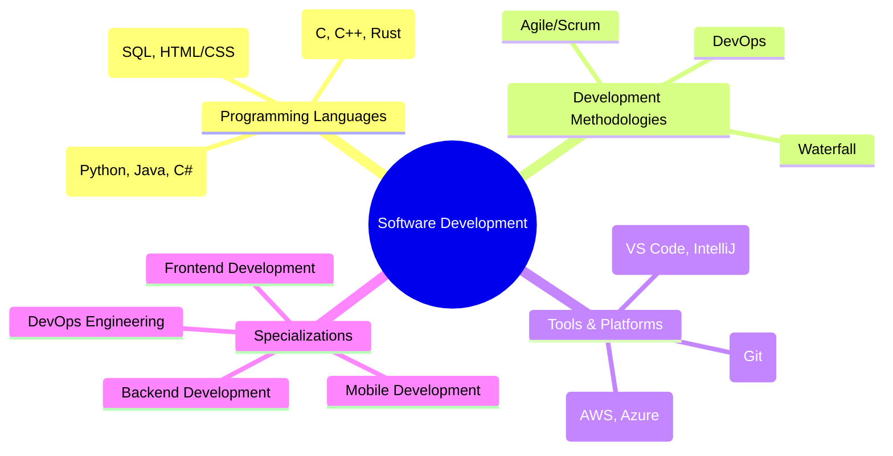
```mermaid
mindmap
  root((Software Development))
    Programming Languages
      High-level (Python, Java, C#)
      Low-level (C, C++, Rust)
      Domain-specific (SQL, HTML/CSS)
    Development Methodologies
      Agile/Scrum
      DevOps
      Waterfall
    Tools & Platforms
      IDEs (VS Code, IntelliJ)
      Version Control (Git)
      Cloud Platforms (AWS, Azure)
    Specializations
      Frontend Development
      Backend Development
      Mobile Development
      DevOps Engineering
```

---

## 🔄 Software Development Lifecycle (SDLC)

### Traditional SDLC Models

#### **1. Waterfall Model**

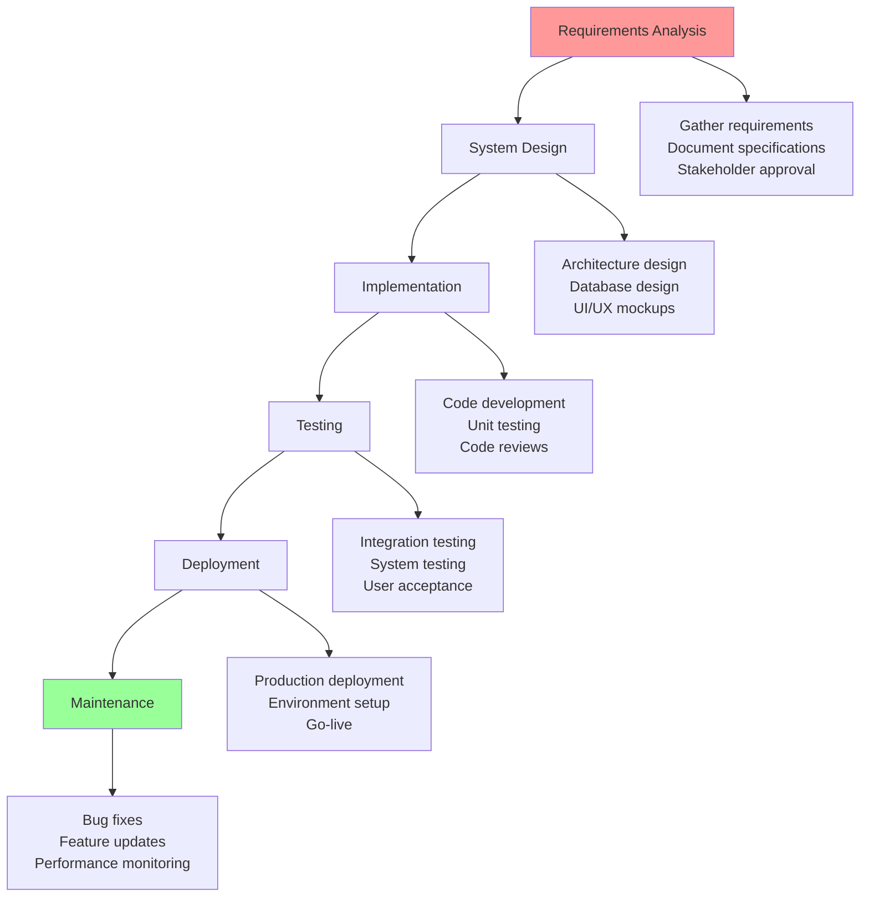
```mermaid
graph TD
    A[Requirements Analysis] --> B[System Design]
    B --> C[Implementation]
    C --> D[Testing]
    D --> E[Deployment]
    E --> F[Maintenance]
    
    A --> A1[Gather requirements<br/>Document specifications<br/>Stakeholder approval]
    B --> B1[Architecture design<br/>Database design<br/>UI/UX mockups]
    C --> C1[Code development<br/>Unit testing<br/>Code reviews]
    D --> D1[Integration testing<br/>System testing<br/>User acceptance]
    E --> E1[Production deployment<br/>Environment setup<br/>Go-live]
    F --> F1[Bug fixes<br/>Feature updates<br/>Performance monitoring]
    
    style A fill:#ff9999
    style F fill:#99ff99
```

**Advantages**:

- Clear phases and deliverables
- Well-suited for projects with stable requirements
- Easy to manage and track progress
- Comprehensive documentation

**Disadvantages**:

- Inflexible to changes
- Late detection of issues
- Long development cycles
- Limited customer feedback

#### **2. Agile Methodology**

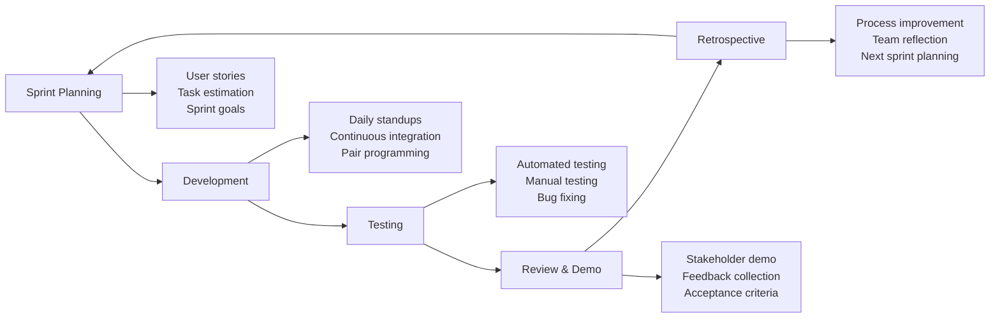
```mermaid
graph LR
    A[Sprint Planning] --> B[Development]
    B --> C[Testing]
    C --> D[Review & Demo]
    D --> E[Retrospective]
    E --> A
    
    A --> A1[User stories<br/>Task estimation<br/>Sprint goals]
    B --> B1[Daily standups<br/>Continuous integration<br/>Pair programming]
    C --> C1[Automated testing<br/>Manual testing<br/>Bug fixing]
    D --> D1[Stakeholder demo<br/>Feedback collection<br/>Acceptance criteria]
    E --> E1[Process improvement<br/>Team reflection<br/>Next sprint planning]
```

**Agile Principles** (Agile Manifesto):

1. **Individuals and interactions** over processes and tools
2. **Working software** over comprehensive documentation
3. **Customer collaboration** over contract negotiation
4. **Responding to change** over following a plan

#### **Agile vs. Waterfall Comparison**

| Aspect | Agile | Waterfall |
|--------|-------|-----------|
| **Flexibility** | High - adapts to changes | Low - follows fixed plan |
| **Customer Involvement** | Continuous feedback | Limited to requirements phase |
| **Delivery** | Incremental releases | Single final release |
| **Risk Management** | Early risk identification | Risk discovered late |
| **Team Structure** | Cross-functional teams | Specialized phase teams |
| **Documentation** | Just enough | Comprehensive |

### Modern Development Approaches

#### **DevOps Integration**

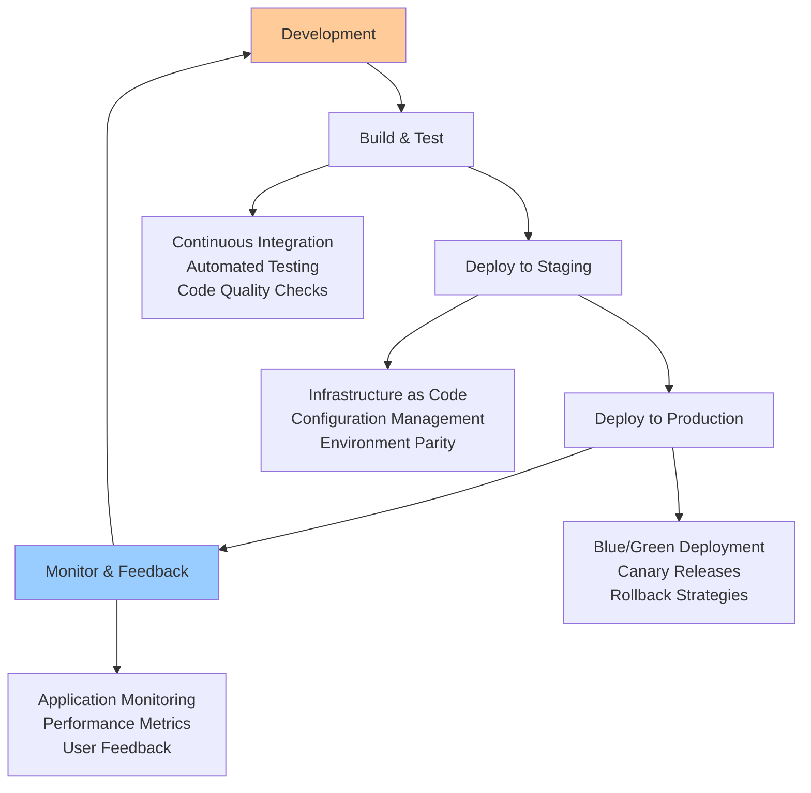
```mermaid
graph TD
    A[Development] --> B[Build & Test]
    B --> C[Deploy to Staging]
    C --> D[Deploy to Production]
    D --> E[Monitor & Feedback]
    E --> A
    
    B --> B1[Continuous Integration<br/>Automated Testing<br/>Code Quality Checks]
    C --> C1[Infrastructure as Code<br/>Configuration Management<br/>Environment Parity]
    D --> D1[Blue/Green Deployment<br/>Canary Releases<br/>Rollback Strategies]
    E --> E1[Application Monitoring<br/>Performance Metrics<br/>User Feedback]
    
    style A fill:#ffcc99
    style E fill:#99ccff
```

**DevOps Benefits** (Google SRE Report 2024):

- **Deployment frequency**: 200x more frequent
- **Lead time**: 2,555x faster recovery from failures
- **Change failure rate**: 3x lower
- **Mean time to recovery**: 24x faster

---

## 🧩 Programming Paradigms

### Object-Oriented Programming (OOP)

#### **Core Principles**

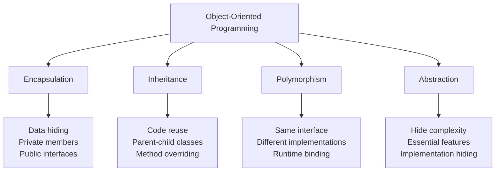
```mermaid
graph TD
    A[Object-Oriented Programming] --> B[Encapsulation]
    A --> C[Inheritance]
    A --> D[Polymorphism]
    A --> E[Abstraction]
    
    B --> B1[Data hiding<br/>Private members<br/>Public interfaces]
    C --> C1[Code reuse<br/>Parent-child classes<br/>Method overriding]
    D --> D1[Same interface<br/>Different implementations<br/>Runtime binding]
    E --> E1[Hide complexity<br/>Essential features<br/>Implementation hiding]
```

**Real-World Example** (E-commerce System):

```python
# Abstraction and Encapsulation
class Product:
    def __init__(self, name, price):
        self._name = name  # Protected attribute
        self._price = price
    
    def get_price(self):  # Public interface
        return self._price
    
    def apply_discount(self, discount):
        # Abstract method to be implemented by subclasses
        raise NotImplementedError

# Inheritance
class Electronics(Product):
    def __init__(self, name, price, warranty_years):
        super().__init__(name, price)
        self.warranty_years = warranty_years
    
    # Polymorphism - different implementation
    def apply_discount(self, discount):
        # Electronics have maximum 10% discount
        max_discount = min(discount, 0.10)
        self._price *= (1 - max_discount)

class Clothing(Product):
    def __init__(self, name, price, size):
        super().__init__(name, price)
        self.size = size
    
    # Polymorphism - different implementation
    def apply_discount(self, discount):
        # Clothing can have up to 50% discount
        max_discount = min(discount, 0.50)
        self._price *= (1 - max_discount)
```

### Functional Programming

#### **Key Concepts**

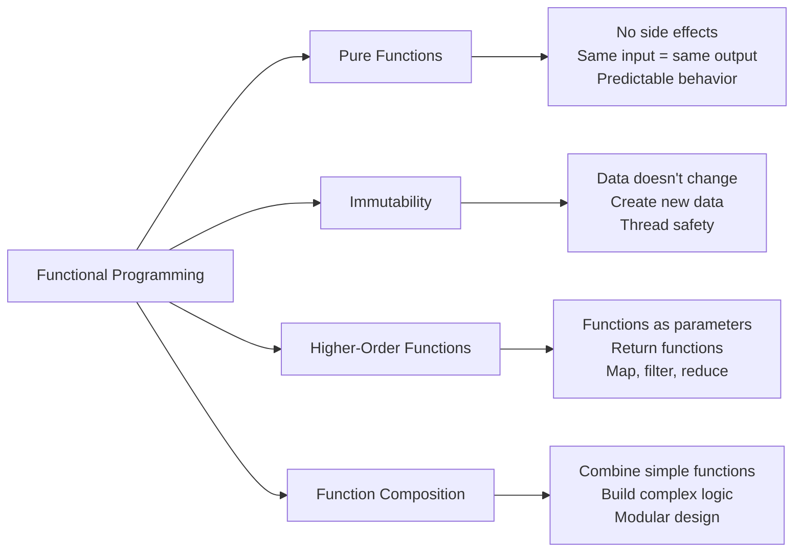
```mermaid
graph LR
    A[Functional Programming] --> B[Pure Functions]
    A --> C[Immutability]
    A --> D[Higher-Order Functions]
    A --> E[Function Composition]
    
    B --> B1[No side effects<br/>Same input = same output<br/>Predictable behavior]
    C --> C1[Data doesn't change<br/>Create new data<br/>Thread safety]
    D --> D1[Functions as parameters<br/>Return functions<br/>Map, filter, reduce]
    E --> E1[Combine simple functions<br/>Build complex logic<br/>Modular design]
```

**Practical Example** (Data Processing Pipeline):

```python
from functools import reduce

# Pure functions
def clean_text(text):
    return text.strip().lower()

def filter_valid_emails(email):
    return '@' in email and '.' in email

def extract_domain(email):
    return email.split('@')[1]

# Functional composition
def process_email_list(emails):
    return list(
        map(extract_domain,
            filter(filter_valid_emails,
                   map(clean_text, emails))))

# Usage
emails = [" John@GMAIL.com ", "invalid-email", " Jane@yahoo.com "]
domains = process_email_list(emails)
# Result: ['gmail.com', 'yahoo.com']
```

### Procedural Programming

**Characteristics**:

- Top-down approach
- Functions and procedures
- Sequential execution
- Data and functions are separate

**Best Use Cases**:

- System programming
- Mathematical computations
- Simple automation scripts
- Legacy system maintenance

---

## 🏗️ Software Engineering Principles

### SOLID Principles

#### **Detailed Breakdown**

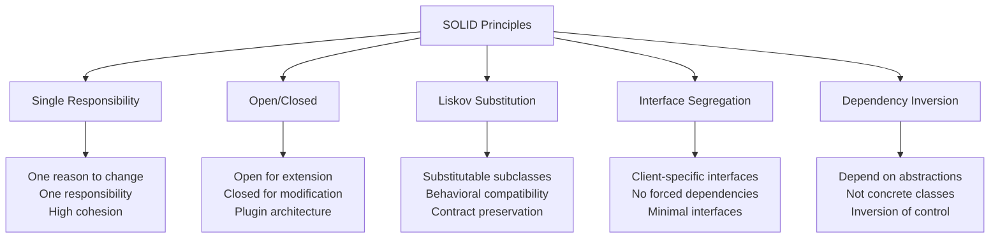
```mermaid
graph TD
    A[SOLID Principles] --> B[Single Responsibility]
    A --> C[Open/Closed]
    A --> D[Liskov Substitution]
    A --> E[Interface Segregation]
    A --> F[Dependency Inversion]
    
    B --> B1["One reason to change<br/>One responsibility<br/>High cohesion"]
    C --> C1["Open for extension<br/>Closed for modification<br/>Plugin architecture"]
    D --> D1["Substitutable subclasses<br/>Behavioral compatibility<br/>Contract preservation"]
    E --> E1["Client-specific interfaces<br/>No forced dependencies<br/>Minimal interfaces"]
    F --> F1["Depend on abstractions<br/>Not concrete classes<br/>Inversion of control"]
```

#### **Code Examples**

**Single Responsibility Principle**:

```python
# Bad: Multiple responsibilities
class User:
    def __init__(self, name, email):
        self.name = name
        self.email = email
    
    def save_to_database(self):
        # Database logic
        pass
    
    def send_email(self):
        # Email logic
        pass
    
    def validate_email(self):
        # Validation logic
        pass

# Good: Single responsibility
class User:
    def __init__(self, name, email):
        self.name = name
        self.email = email

class UserRepository:
    def save(self, user):
        # Database logic
        pass

class EmailService:
    def send(self, user, message):
        # Email logic
        pass

class EmailValidator:
    def validate(self, email):
        # Validation logic
        pass
```

### Design Patterns

#### **Common Design Patterns**

| Pattern | Purpose | Use Case | Complexity |
|---------|---------|----------|------------|
| **Singleton** | One instance only | Configuration, logging | ⭐⭐☆☆☆ |
| **Factory** | Object creation | Dynamic object creation | ⭐⭐⭐☆☆ |
| **Observer** | Event notification | GUI events, pub/sub | ⭐⭐⭐☆☆ |
| **Strategy** | Algorithm selection | Payment processing | ⭐⭐⭐☆☆ |
| **Decorator** | Add behavior | Middleware, caching | ⭐⭐⭐⭐☆ |

#### **Strategy Pattern Example**

```python
from abc import ABC, abstractmethod

# Strategy interface
class PaymentStrategy(ABC):
    @abstractmethod
    def pay(self, amount):
        pass

# Concrete strategies
class CreditCardPayment(PaymentStrategy):
    def __init__(self, card_number):
        self.card_number = card_number
    
    def pay(self, amount):
        return f"Paid ${amount} with credit card {self.card_number[-4:]}"

class PayPalPayment(PaymentStrategy):
    def __init__(self, email):
        self.email = email
    
    def pay(self, amount):
        return f"Paid ${amount} via PayPal ({self.email})"

# Context
class ShoppingCart:
    def __init__(self):
        self.items = []
        self.payment_strategy = None
    
    def set_payment_strategy(self, strategy):
        self.payment_strategy = strategy
    
    def checkout(self):
        total = sum(item.price for item in self.items)
        return self.payment_strategy.pay(total)
```

---

## 🌍 Application Domains

### Web Development

#### **Frontend Technologies**

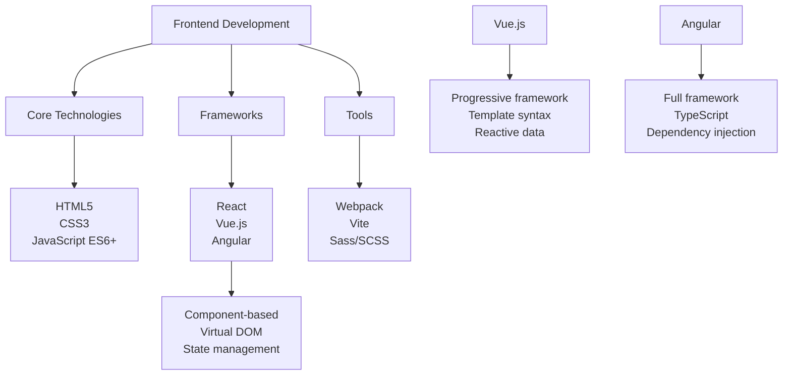
```mermaid
graph TD
    A[Frontend Development] --> B[Core Technologies]
    A --> C[Frameworks]
    A --> D[Tools]
    
    B --> B1[HTML5<br/>CSS3<br/>JavaScript ES6+]
    C --> C1[React<br/>Vue.js<br/>Angular]
    D --> D1[Webpack<br/>Vite<br/>Sass/SCSS]
    
    C1 --> C11[Component-based<br/>Virtual DOM<br/>State management]
    C2[Vue.js] --> C21[Progressive framework<br/>Template syntax<br/>Reactive data]
    C3[Angular] --> C31[Full framework<br/>TypeScript<br/>Dependency injection]
```

**Framework Popularity** (Stack Overflow Survey 2024):

```
Frontend Framework Usage:
React     ████████████████████████ 40.6%
Vue.js    ████████████ 18.8%
Angular   ██████████ 17.4%
Svelte    ████ 6.2%
Other     ███████████████ 17.0%
```

#### **Backend Technologies**

**Language Distribution for Backend** (GitHub 2024):

| Language | Web Frameworks | Strengths | Market Share |
|----------|----------------|-----------|--------------|
| **JavaScript/Node.js** | Express, NestJS, Fastify | Fast development, JSON APIs | 31.2% |
| **Python** | Django, Flask, FastAPI | AI/ML integration, rapid prototyping | 28.7% |
| **Java** | Spring Boot, Quarkus | Enterprise, scalability | 21.3% |
| **C#** | ASP.NET Core, Blazor | Microsoft ecosystem | 12.1% |
| **Go** | Gin, Echo, Fiber | Performance, concurrency | 6.7% |

### Mobile Development

#### **Development Approaches**

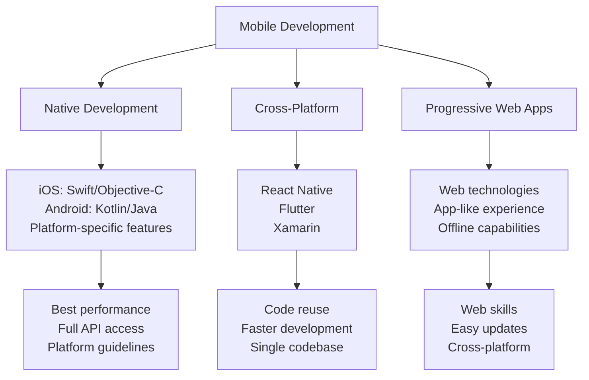
```mermaid
graph TD
    A[Mobile Development] --> B[Native Development]
    A --> C[Cross-Platform]
    A --> D[Progressive Web Apps]
    
    B --> B1[iOS: Swift/Objective-C<br/>Android: Kotlin/Java<br/>Platform-specific features]
    C --> C1[React Native<br/>Flutter<br/>Xamarin]
    D --> D1[Web technologies<br/>App-like experience<br/>Offline capabilities]
    
    B1 --> B11[Best performance<br/>Full API access<br/>Platform guidelines]
    C1 --> C11[Code reuse<br/>Faster development<br/>Single codebase]
    D1 --> D11[Web skills<br/>Easy updates<br/>Cross-platform]
```

**Mobile Framework Comparison** (JetBrains Survey 2024):

| Framework | Adoption | Learning Curve | Performance | Development Speed |
|-----------|----------|----------------|-------------|-------------------|
| **Native (iOS/Android)** | 45% | ⭐⭐⭐⭐☆ | ⭐⭐⭐⭐⭐ | ⭐⭐☆☆☆ |
| **React Native** | 32% | ⭐⭐⭐☆☆ | ⭐⭐⭐⭐☆ | ⭐⭐⭐⭐☆ |
| **Flutter** | 18% | ⭐⭐⭐☆☆ | ⭐⭐⭐⭐⭐ | ⭐⭐⭐⭐☆ |
| **PWA** | 5% | ⭐⭐☆☆☆ | ⭐⭐⭐☆☆ | ⭐⭐⭐⭐⭐ |

---

## 🛠️ Development Tools and Environment

### Integrated Development Environments (IDEs)

#### **IDE Popularity** (Stack Overflow 2024)

```
Most Popular Development Environments:
VS Code        ███████████████████████████████████ 73.7%
IntelliJ IDEA  ████████████ 25.4%
Vim/Neovim     ██████████ 21.3%
Eclipse        ███████ 14.6%
Sublime Text   ██████ 12.8%
Atom           ████ 8.9%
```

#### **VS Code Extensions Ecosystem**

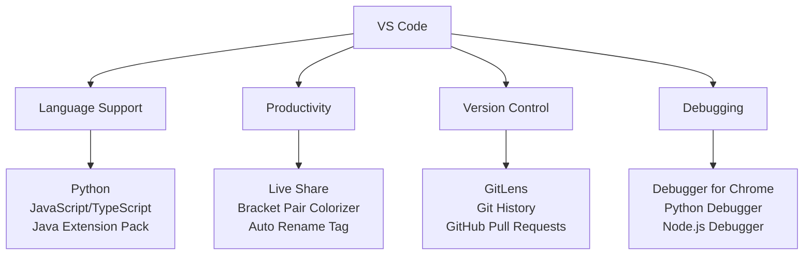
```mermaid
graph TD
    A[VS Code] --> B[Language Support]
    A --> C[Productivity]
    A --> D[Version Control]
    A --> E[Debugging]
    
    B --> B1[Python<br/>JavaScript/TypeScript<br/>Java Extension Pack]
    C --> C1[Live Share<br/>Bracket Pair Colorizer<br/>Auto Rename Tag]
    D --> D1[GitLens<br/>Git History<br/>GitHub Pull Requests]
    E --> E1[Debugger for Chrome<br/>Python Debugger<br/>Node.js Debugger]
```

### Version Control Systems

#### **Git Fundamentals**

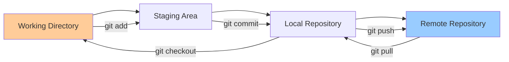
```mermaid
graph LR
    A[Working Directory] --> B[Staging Area]
    B --> C[Local Repository]
    C --> D[Remote Repository]
    
    A -->|git add| B
    B -->|git commit| C
    C -->|git push| D
    D -->|git pull| C
    C -->|git checkout| A
    
    style A fill:#ffcc99
    style D fill:#99ccff
```

**Essential Git Commands**:

```bash
# Repository initialization
git init
git clone <repository-url>

# Basic workflow
git add <file>              # Stage changes
git commit -m "message"     # Commit changes
git push origin main        # Push to remote

# Branching
git branch feature-login    # Create branch
git checkout feature-login  # Switch branch
git merge feature-login     # Merge branch

# Collaboration
git pull origin main        # Get latest changes
git fetch                   # Download objects and refs
git status                  # Check working directory status
```

#### **Git Workflow Strategies**

**GitHub Flow** (Recommended for most teams):

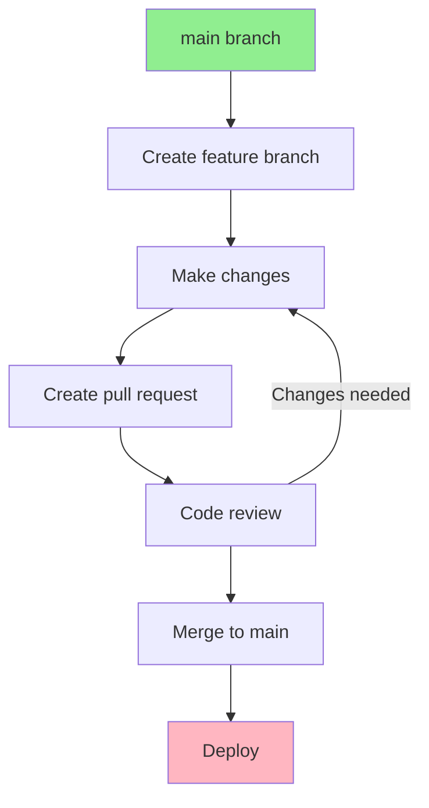
```mermaid
graph TD
    A[main branch] --> B[Create feature branch]
    B --> C[Make changes]
    C --> D[Create pull request]
    D --> E[Code review]
    E --> F[Merge to main]
    F --> G[Deploy]
    
    E -->|Changes needed| C
    
    style A fill:#90EE90
    style G fill:#FFB6C1
```

---

## 💼 Career Paths in Software Development

### Specialized Roles

#### **Frontend Developer**

**Core Skills**:

- HTML5, CSS3, JavaScript ES6+
- Modern frameworks (React, Vue, Angular)
- Responsive design and CSS preprocessors
- Browser developer tools and debugging
- Performance optimization

**Salary Range** (2024 Data):
- **Entry Level**: $65,000 - $85,000
- **Mid Level**: $85,000 - $120,000
- **Senior Level**: $120,000 - $180,000
- **Lead/Principal**: $180,000 - $250,000

#### **Backend Developer**

**Core Skills**:

- Server-side programming languages
- Database design and management
- API development (REST, GraphQL)
- Cloud services and deployment
- Security best practices

**Technology Stacks**:

| Stack | Languages | Databases | Cloud |
|-------|-----------|-----------|-------|
| **MEAN/MERN** | JavaScript/TypeScript | MongoDB | AWS, Azure |
| **Django/Flask** | Python | PostgreSQL, MySQL | GCP, AWS |
| **Spring** | Java | Oracle, PostgreSQL | AWS, Azure |
| **.NET** | C# | SQL Server, PostgreSQL | Azure, AWS |

#### **Full-Stack Developer**

**Skill Requirements**:

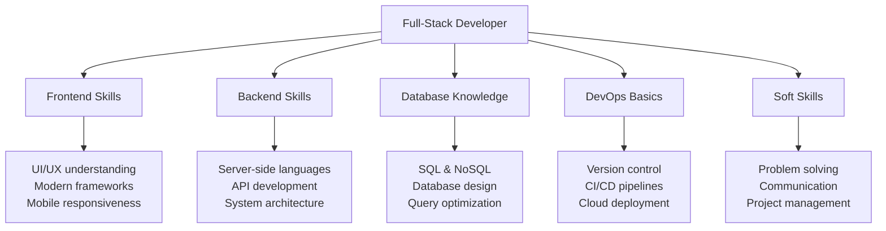
```mermaid
graph TD
    A[Full-Stack Developer] --> B[Frontend Skills]
    A --> C[Backend Skills]
    A --> D[Database Knowledge]
    A --> E[DevOps Basics]
    A --> F[Soft Skills]
    
    B --> B1[UI/UX understanding<br/>Modern frameworks<br/>Mobile responsiveness]
    C --> C1[Server-side languages<br/>API development<br/>System architecture]
    D --> D1[SQL & NoSQL<br/>Database design<br/>Query optimization]
    E --> E1[Version control<br/>CI/CD pipelines<br/>Cloud deployment]
    F --> F1[Problem solving<br/>Communication<br/>Project management]
```

#### **DevOps Engineer**

**Core Responsibilities**:

- Infrastructure automation
- CI/CD pipeline management
- Monitoring and logging
- Security implementation
- Cloud resource management

**Popular Tools**:

| Category | Tools | Market Share |
|----------|-------|--------------|
| **Containers** | Docker, Kubernetes | 87%, 52% |
| **CI/CD** | Jenkins, GitHub Actions, GitLab CI | 31%, 56%, 28% |
| **Cloud** | AWS, Azure, GCP | 64%, 32%, 25% |
| **Monitoring** | Prometheus, Grafana, ELK Stack | 43%, 38%, 29% |

### Career Progression Paths

#### **Technical Track**

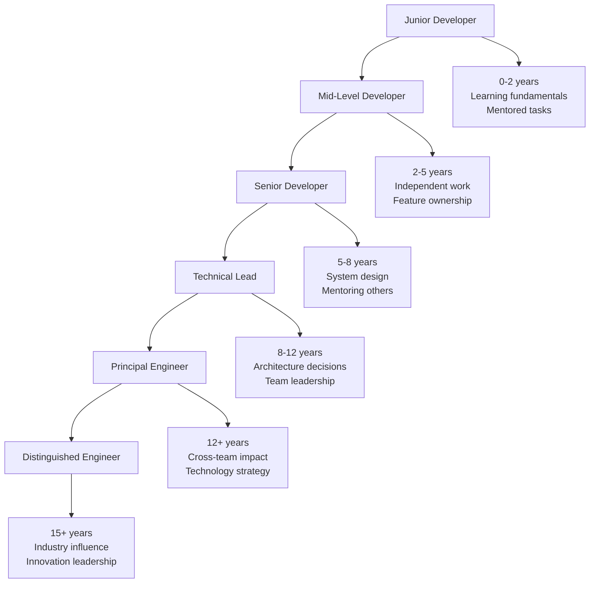
```mermaid
graph TD
    A[Junior Developer] --> B[Mid-Level Developer]
    B --> C[Senior Developer]
    C --> D[Technical Lead]
    D --> E[Principal Engineer]
    E --> F[Distinguished Engineer]
    
    A --> A1[0-2 years<br/>Learning fundamentals<br/>Mentored tasks]
    B --> B1[2-5 years<br/>Independent work<br/>Feature ownership]
    C --> C1[5-8 years<br/>System design<br/>Mentoring others]
    D --> D1[8-12 years<br/>Architecture decisions<br/>Team leadership]
    E --> E1[12+ years<br/>Cross-team impact<br/>Technology strategy]
    F --> F1[15+ years<br/>Industry influence<br/>Innovation leadership]
```

#### **Management Track**

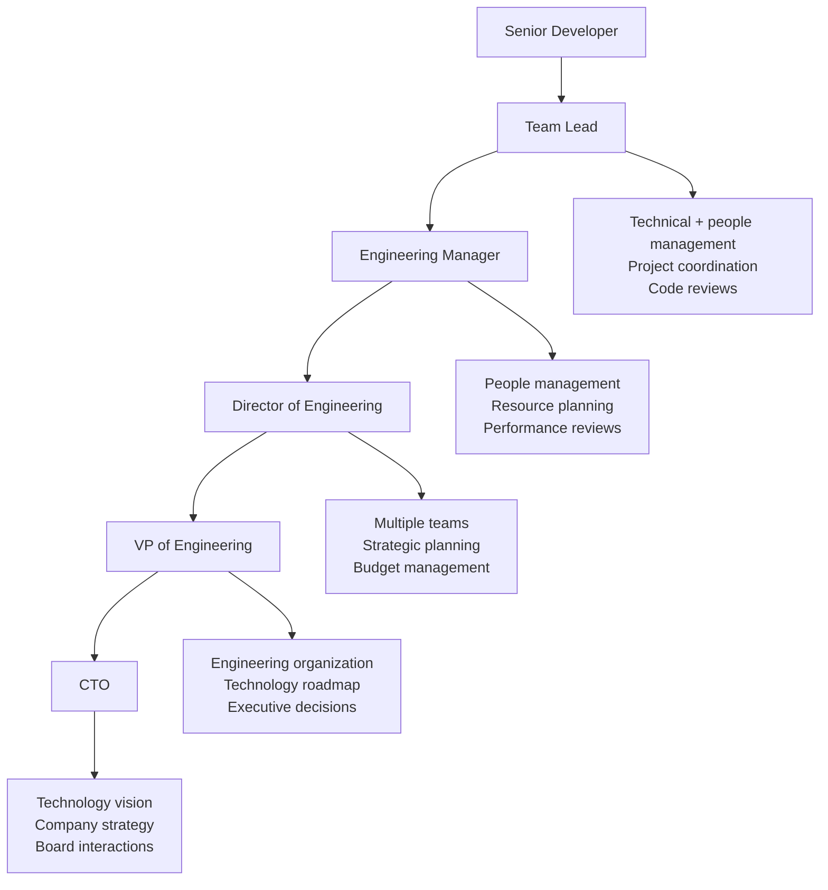
```mermaid
graph TD
    A[Senior Developer] --> B[Team Lead]
    B --> C[Engineering Manager]
    C --> D[Director of Engineering]
    D --> E[VP of Engineering]
    E --> F[CTO]
    
    B --> B1[Technical + people management<br/>Project coordination<br/>Code reviews]
    C --> C1[People management<br/>Resource planning<br/>Performance reviews]
    D --> D1[Multiple teams<br/>Strategic planning<br/>Budget management]
    E --> E1[Engineering organization<br/>Technology roadmap<br/>Executive decisions]
    F --> F1[Technology vision<br/>Company strategy<br/>Board interactions]
```

---

## 🧩 Problem-Solving in Programming

### Computational Thinking

#### **Problem-Solving Framework**

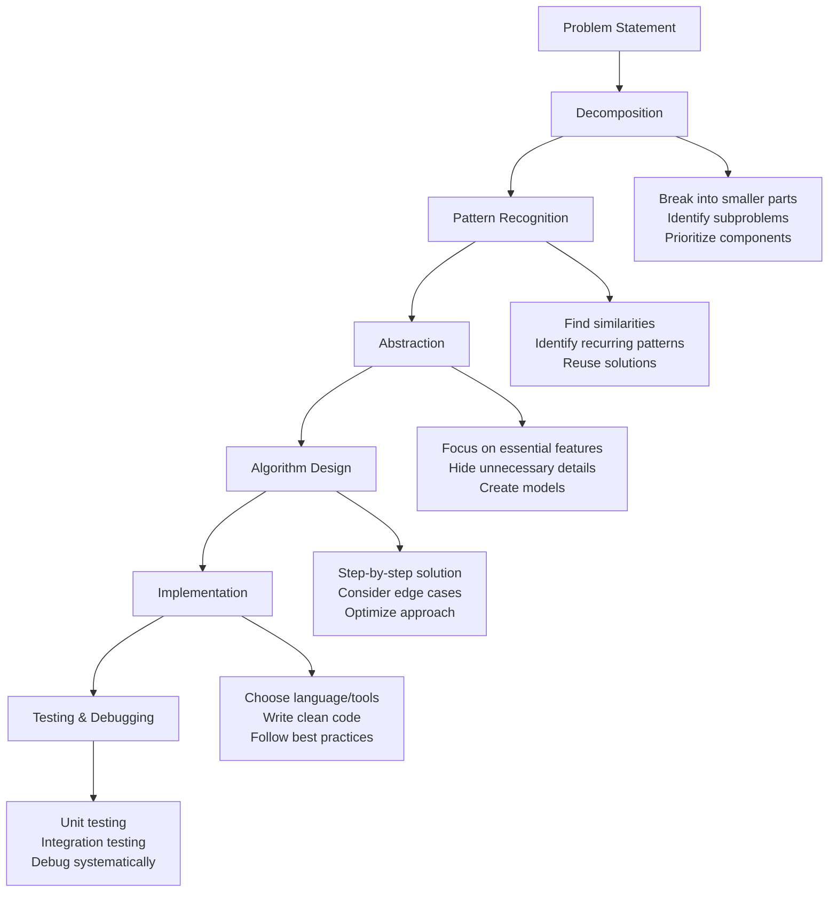
```mermaid
graph TD
    A[Problem Statement] --> B[Decomposition]
    B --> C[Pattern Recognition]
    C --> D[Abstraction]
    D --> E[Algorithm Design]
    E --> F[Implementation]
    F --> G[Testing & Debugging]
    
    B --> B1[Break into smaller parts<br/>Identify subproblems<br/>Prioritize components]
    C --> C1[Find similarities<br/>Identify recurring patterns<br/>Reuse solutions]
    D --> D1[Focus on essential features<br/>Hide unnecessary details<br/>Create models]
    E --> E1[Step-by-step solution<br/>Consider edge cases<br/>Optimize approach]
    F --> F1[Choose language/tools<br/>Write clean code<br/>Follow best practices]
    G --> G1[Unit testing<br/>Integration testing<br/>Debug systematically]
```

### Debugging Strategies

#### **Systematic Debugging Process**

**1. Reproduce the Bug**

```
Steps to Reproduce:
1. Identify exact conditions
2. Create minimal test case
3. Document expected vs actual behavior
4. Note environment details (OS, browser, version)
```

**2. Debugging Techniques**

| Technique | When to Use | Tools | Effectiveness |
|-----------|-------------|-------|---------------|
| **Print Statements** | Quick debugging | console.log, print() | ⭐⭐⭐☆☆ |
| **Debugger** | Complex logic | IDE debuggers, pdb | ⭐⭐⭐⭐⭐ |
| **Logging** | Production issues | Winston, Log4j | ⭐⭐⭐⭐☆ |
| **Unit Tests** | Regression testing | Jest, pytest | ⭐⭐⭐⭐⭐ |

**3. Common Bug Categories**

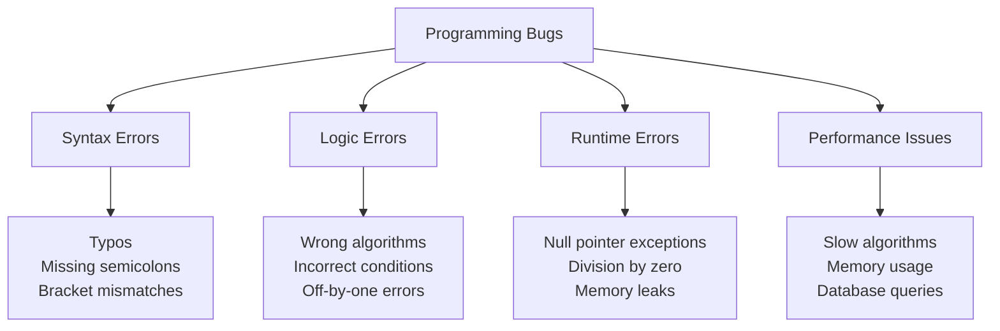
```mermaid
graph TD
    A[Programming Bugs] --> B[Syntax Errors]
    A --> C[Logic Errors]
    A --> D[Runtime Errors]
    A --> E[Performance Issues]
    
    B --> B1[Typos<br/>Missing semicolons<br/>Bracket mismatches]
    C --> C1[Wrong algorithms<br/>Incorrect conditions<br/>Off-by-one errors]
    D --> D1[Null pointer exceptions<br/>Division by zero<br/>Memory leaks]
    E --> E1[Slow algorithms<br/>Memory usage<br/>Database queries]
```

---

## 💻 Hands-On Programming Exercises

### **Exercise 1: Problem Decomposition**

**Challenge**: Build a Simple Calculator

**Requirements**:
- Basic arithmetic operations (+, -, *, /)
- Handle invalid input
- Support decimal numbers
- Command-line interface

**Decomposition Steps**:

1. **Input Handling**
   - Read user input
   - Parse numbers and operators
   - Validate input format

2. **Calculation Logic**
   - Implement arithmetic operations
   - Handle division by zero
   - Return results

3. **User Interface**
   - Display menu options
   - Show results
   - Handle errors gracefully

**Starter Code Template**:

```python
class Calculator:
    def __init__(self):
        self.operations = {
            '+': self.add,
            '-': self.subtract,
            '*': self.multiply,
            '/': self.divide
        }
    
    def add(self, a, b):
        # TODO: Implement addition
        pass
    
    def subtract(self, a, b):
        # TODO: Implement subtraction
        pass
    
    def multiply(self, a, b):
        # TODO: Implement multiplication
        pass
    
    def divide(self, a, b):
        # TODO: Implement division with error handling
        pass
    
    def calculate(self, expression):
        # TODO: Parse expression and perform calculation
        pass
    
    def run(self):
        # TODO: Main program loop
        pass

if __name__ == "__main__":
    calc = Calculator()
    calc.run()
```

### **Exercise 2: Object-Oriented Design**

**Challenge**: Library Management System

**Requirements**:
- Manage books, authors, and borrowers
- Track borrowed books and due dates
- Search functionality
- Generate reports

**Class Design**:

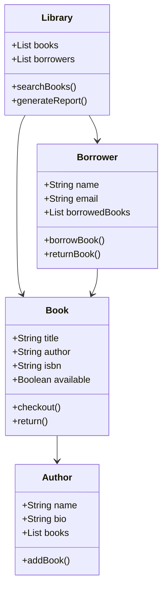
```mermaid
classDiagram
    class Book {
        +String title
        +String author
        +String isbn
        +Boolean available
        +checkout()
        +return()
    }
    
    class Author {
        +String name
        +String bio
        +List books
        +addBook()
    }
    
    class Borrower {
        +String name
        +String email
        +List borrowedBooks
        +borrowBook()
        +returnBook()
    }
    
    class Library {
        +List books
        +List borrowers
        +searchBooks()
        +generateReport()
    }
    
    Library --> Book
    Library --> Borrower
    Book --> Author
    Borrower --> Book
```

### **Exercise 3: Algorithm Implementation**

**Challenge**: Sorting Algorithm Comparison

**Objective**: Implement and compare different sorting algorithms

**Algorithms to Implement**:
1. Bubble Sort
2. Selection Sort
3. Insertion Sort
4. Quick Sort
5. Merge Sort

**Performance Analysis**:

| Algorithm | Best Case | Average Case | Worst Case | Space |
|-----------|-----------|--------------|------------|-------|
| **Bubble Sort** | O(n) | O(n²) | O(n²) | O(1) |
| **Selection Sort** | O(n²) | O(n²) | O(n²) | O(1) |
| **Insertion Sort** | O(n) | O(n²) | O(n²) | O(1) |
| **Quick Sort** | O(n log n) | O(n log n) | O(n²) | O(log n) |
| **Merge Sort** | O(n log n) | O(n log n) | O(n log n) | O(n) |

**Implementation Framework**:

```python
import time
import random

class SortingAlgorithms:
    def bubble_sort(self, arr):
        # TODO: Implement bubble sort
        pass
    
    def quick_sort(self, arr):
        # TODO: Implement quick sort
        pass
    
    def merge_sort(self, arr):
        # TODO: Implement merge sort
        pass
    
    def benchmark(self, sort_function, data):
        start_time = time.time()
        sorted_data = sort_function(data.copy())
        end_time = time.time()
        return end_time - start_time, sorted_data

# Performance testing
def test_sorting_performance():
    sizes = [100, 1000, 5000, 10000]
    algorithms = SortingAlgorithms()
    
    for size in sizes:
        data = [random.randint(1, 1000) for _ in range(size)]
        # Test each algorithm and compare performance
```

---

## 🏆 Challenge Project: Personal Task Manager

### **Project Specifications**

**Overview**: Build a command-line task management application

**Core Features**:
1. **Task CRUD Operations**
   - Create tasks with title, description, priority
   - Read/list tasks with filtering options
   - Update task details and status
   - Delete completed tasks

2. **Task Organization**
   - Categories and tags
   - Due dates and reminders
   - Priority levels (High, Medium, Low)
   - Task status (Todo, In Progress, Done)

3. **Data Persistence**
   - Save tasks to JSON file
   - Load tasks on startup
   - Backup and restore functionality

4. **Advanced Features**
   - Search and filter tasks
   - Generate productivity reports
   - Export tasks to different formats

### **Architecture Design**

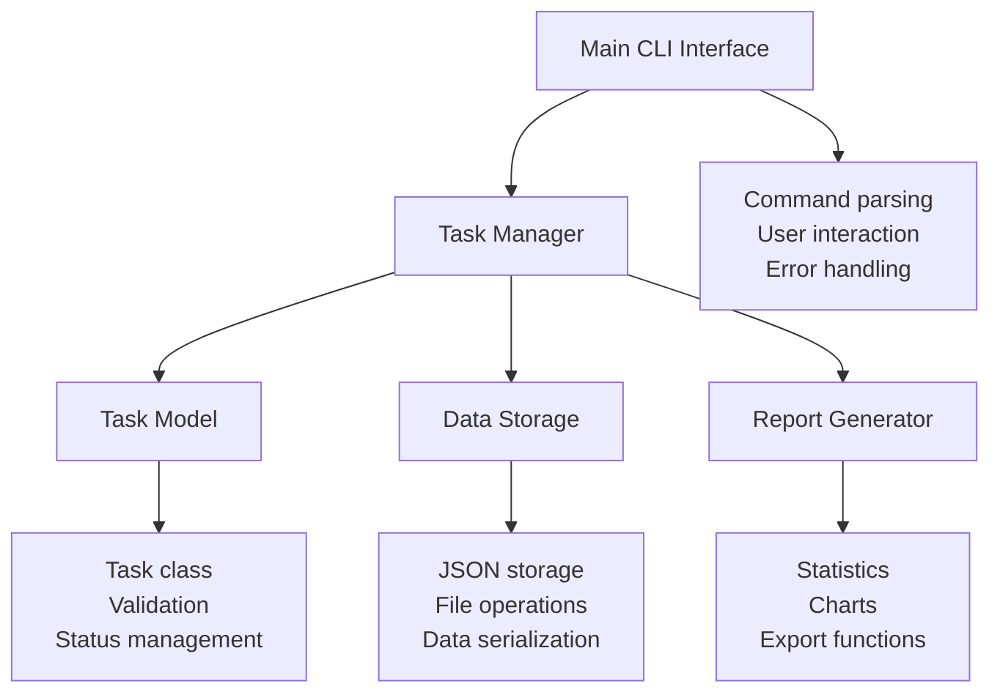
```mermaid
graph TD
    A[Main CLI Interface] --> B[Task Manager]
    B --> C[Task Model]
    B --> D[Data Storage]
    B --> E[Report Generator]
    
    C --> C1[Task class<br/>Validation<br/>Status management]
    D --> D1[JSON storage<br/>File operations<br/>Data serialization]
    E --> E1[Statistics<br/>Charts<br/>Export functions]
    
    A --> A1[Command parsing<br/>User interaction<br/>Error handling]
```

### **Implementation Roadmap**

**Phase 1**: Basic Functionality (Week 1)
- [ ] Task model design
- [ ] CRUD operations
- [ ] Basic CLI interface
- [ ] JSON persistence

**Phase 2**: Enhanced Features (Week 2)
- [ ] Categories and priorities
- [ ] Due date management
- [ ] Search and filtering
- [ ] Input validation

**Phase 3**: Advanced Features (Week 3)
- [ ] Report generation
- [ ] Data export/import
- [ ] Configuration management
- [ ] Error handling and logging

**Phase 4**: Polish and Testing (Week 4)
- [ ] Unit tests
- [ ] Documentation
- [ ] Performance optimization
- [ ] User experience improvements

---

## 📚 Development Resources

### **Essential Learning Resources**

#### **Books for Software Development**

**Programming Fundamentals**:
- "Clean Code" by Robert C. Martin
- "The Pragmatic Programmer" by Andy Hunt & Dave Thomas
- "Code Complete" by Steve McConnell
- "Design Patterns" by Gang of Four

**Software Engineering**:
- "Software Engineering at Google" by Titus Winters
- "Building Microservices" by Sam Newman
- "System Design Interview" by Alex Xu
- "The DevOps Handbook" by Gene Kim

#### **Online Learning Platforms**

| Platform | Strengths | Best For | Cost |
|----------|-----------|----------|------|
| **freeCodeCamp** | Hands-on projects | Web development | Free |
| **Coursera** | University courses | Computer science fundamentals | $39-79/month |
| **Udemy** | Practical skills | Specific technologies | $10-200/course |
| **Pluralsight** | Technology training | Professional development | $35/month |
| **LeetCode** | Coding practice | Interview preparation | Free/Premium |

#### **Development Communities**

**Professional Networks**:
- **Stack Overflow**: Technical Q&A and knowledge sharing
- **GitHub**: Open source collaboration and portfolio building
- **Dev.to**: Developer blog posts and discussions
- **Reddit**: r/programming, language-specific communities

**Local Communities**:
- Meetup groups in your city
- Developer conferences and workshops
- Hackathons and coding competitions
- University computer science clubs

### **Tools and Software**

#### **Free Development Tools**

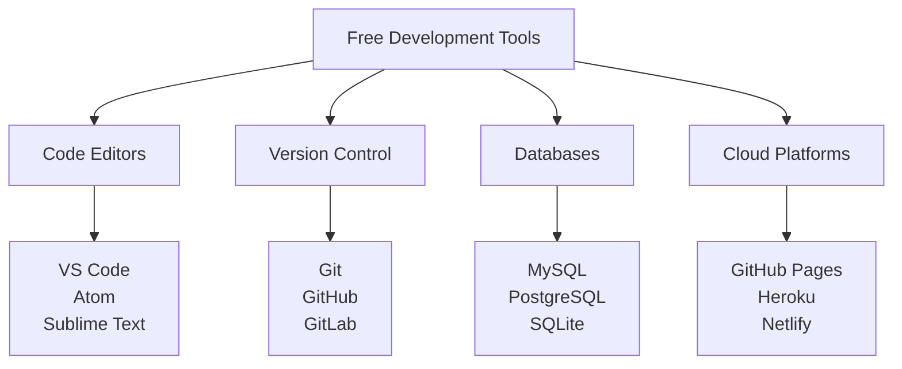
```mermaid
graph TD
    A[Free Development Tools] --> B[Code Editors]
    A --> C[Version Control]
    A --> D[Databases]
    A --> E[Cloud Platforms]
    
    B --> B1[VS Code<br/>Atom<br/>Sublime Text]
    C --> C1[Git<br/>GitHub<br/>GitLab]
    D --> D1[MySQL<br/>PostgreSQL<br/>SQLite]
    E --> E1[GitHub Pages<br/>Heroku<br/>Netlify]
```

#### **Programming Language Resources**

**Python**:
- Official documentation: python.org
- Django framework: djangoproject.com
- Flask framework: flask.palletsprojects.com
- Data science: kaggle.com/learn

**JavaScript**:
- MDN Web Docs: developer.mozilla.org
- React documentation: reactjs.org
- Node.js: nodejs.org
- Vue.js: vuejs.org

**Java**:
- Oracle Java documentation: docs.oracle.com/javase
- Spring framework: spring.io
- Android development: developer.android.com

---

## ✅ Progress Assessment

### **Skill Evaluation Checklist**

#### **Fundamental Concepts**

Rate your understanding (1-5 scale):

- [ ] Software Development Lifecycle (SDLC) ___/5
- [ ] Programming paradigms (OOP, Functional) ___/5
- [ ] SOLID principles ___/5
- [ ] Design patterns ___/5
- [ ] Version control with Git ___/5
- [ ] Debugging techniques ___/5
- [ ] Testing methodologies ___/5

#### **Practical Skills**

Complete these tasks to demonstrate competency:

- [ ] Write a simple program in your chosen language
- [ ] Create a Git repository and make commits
- [ ] Implement a basic class with methods
- [ ] Debug a program with intentional bugs
- [ ] Write unit tests for your code
- [ ] Refactor code to improve readability

#### **Project Portfolio**

Build these projects to strengthen your portfolio:

1. **Personal Website**: HTML, CSS, JavaScript
2. **Calculator App**: Desktop or web-based
3. **Todo List Manager**: With data persistence
4. **API Consumer**: Integrate with external service
5. **Small Game**: Simple logic and user interaction

### **Next Steps Planning**

Based on your assessment, choose your focus area:

**If you scored 3+ in fundamentals**:
- Start specializing in a specific domain (web, mobile, etc.)
- Learn advanced programming concepts
- Begin building substantial projects

**If you scored below 3 in fundamentals**:
- Review core programming concepts
- Practice more coding exercises
- Focus on one programming language deeply

### **90-Day Learning Plan**

**Month 1: Foundation Building**
- Choose primary programming language
- Complete basic syntax and concepts
- Build 3 small projects
- Set up development environment

**Month 2: Skill Development**
- Learn web development or mobile development
- Study software engineering principles
- Practice version control with Git
- Join developer communities

**Month 3: Project Creation**
- Build one substantial project
- Focus on code quality and best practices
- Create GitHub portfolio
- Prepare for job applications or next learning phase

---

## 🚀 Moving Forward

### **Immediate Actions**

1. **Choose Your Path**: Decide on your primary area of interest
2. **Set Up Environment**: Install necessary tools and software
3. **Start Coding**: Begin with simple projects and gradually increase complexity
4. **Join Communities**: Connect with other developers for support and learning

### **Long-term Goals**

- Build a strong portfolio of projects
- Contribute to open source projects
- Stay current with technology trends
- Develop both technical and soft skills
- Consider specialized certifications

### **Next Lessons in This Track**

- **Lesson 02**: Version Control with Git and GitHub
- **Lesson 03**: Programming Language Deep Dive
- **Lesson 04**: Software Testing and Quality Assurance
- **Lesson 05**: Web Development Fundamentals

---

<div align="center">

## 🎉 **Congratulations on Starting Your Development Journey!**

You've taken the first step into the exciting world of software development. With dedication, practice, and continuous learning, you'll build the skills needed to create amazing software solutions that can change the world.

**Keep coding, keep learning, and keep building!**

</div>

---

**Lesson created by UltraCube Software Engineering Team** | [ucubetech.com](https://www.ucubetech.com) | **Copyright © 2025 UltraCube Technology**

> **Sources**: This comprehensive lesson integrates the latest industry insights from Stack Overflow Developer Survey, GitHub State of the Octoverse, IEEE Software Engineering Standards, leading academic institutions, and major technology companies to provide current and authoritative software development knowledge.
