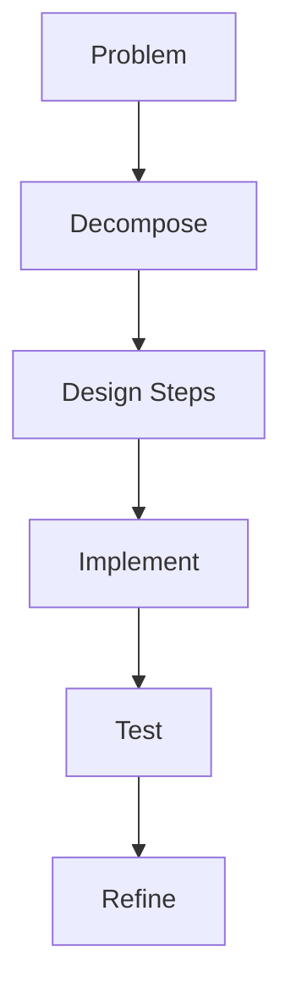

# Module 01: Programming Fundamentals

Core building blocks of programming: syntax, data representation, flow control, and problem decomposition.

## Lessons

- Lesson 01 — Core Concepts & Flow Control

## Learning Objectives

- Define variables, types, and basic data structures
- Apply control structures (sequence, selection, iteration)
- Use simple debugging (print/log inspection) to validate logic
- Break a problem into smaller logical steps

## Visual Overview

## Summary

This module prepares learners for version control and debugging concepts that follow in subsequent modules.

---

Proceed to the lesson to practice core programming thinking.
