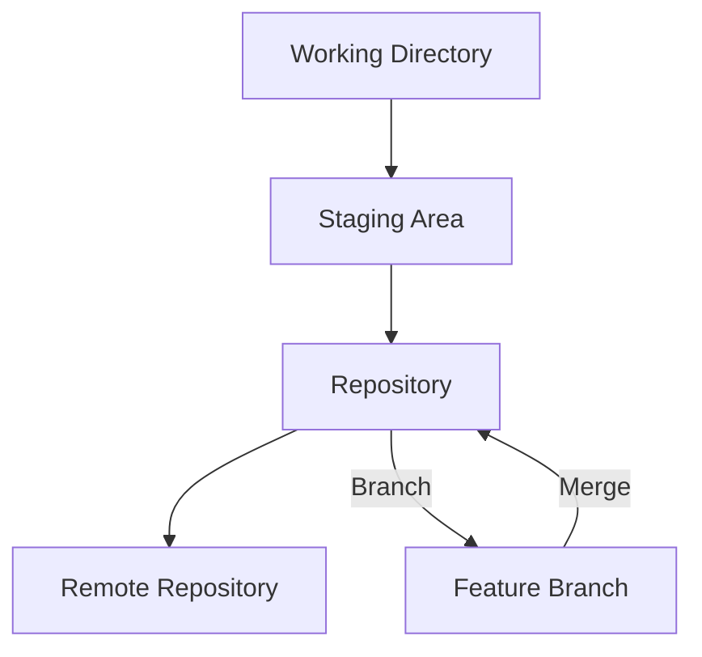

# Lesson 01: Introduction to Version Control

## Overview
Version control is a system that records changes to files over time, enabling collaboration, tracking, and recovery of previous versions. It is a foundational skill for all software developers.

## Learning Objectives

- Define version control and its importance
- Identify key concepts: repository, commit, branch, merge
- Understand the basics of using Git

## Visual: Basic Version Control Workflow

## Detailed Explanation

### What is Version Control?
Version control systems (VCS) help teams manage changes to source code and other files. They allow multiple people to work on a project simultaneously, track history, and revert to previous states if needed.

### Key Concepts
- **Repository:** The database storing all versions of files
- **Commit:** A snapshot of changes
- **Branch:** A parallel line of development
- **Merge:** Combining changes from different branches

### Using Git
Git is the most widely used VCS. Basic commands include:
- `git init` — Initialize a repository
- `git add` — Stage changes
- `git commit` — Save a snapshot
- `git branch` — Create/manage branches
- `git merge` — Combine branches

## References
- [Pro Git Book](https://git-scm.com/book/en/v2)
- [Atlassian Git Tutorials](https://www.atlassian.com/git/tutorials)
- [GitHub Docs](https://docs.github.com/en/get-started/quickstart)
