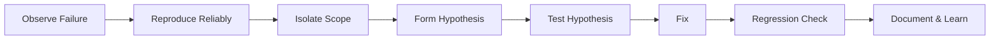

# Lesson 01: Introduction to Debugging

## Overview

Debugging is the systematic process of identifying, isolating, and resolving defects or unexpected behavior in software. Strong debugging skills accelerate development and improve software reliability.

## Learning Objectives

* Define debugging and its role in development
* Apply a structured debugging workflow
* Use core techniques: logging, breakpoints, reproduction, binary search of code paths

## Visual: Debugging Workflow

## Detailed Explanation

### Principles

* Make it fail fast and consistently
* Change one variable at a time
* Automate reproduction when possible
* Validate assumptions early

### Core Techniques

* Breakpoints & stepping
* Strategic logging / tracing
* Input minimization (reduce test case)
* Binary search through commits (git bisect)
* Environment comparison (works here vs there)

### Anti-Patterns

* Random code edits without hypothesis
* Ignoring warnings / failing tests
* Fixing symptoms instead of root cause

## References

* [Debugging Guidelines (Mozilla)](https://developer.mozilla.org/)
* [git bisect Documentation](https://git-scm.com/docs/git-bisect)
* [Software Diagnostics Principles](https://learn.microsoft.com/)
