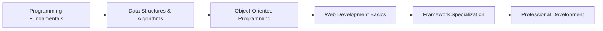

# 🏆 **Programming Fundamentals**
*Master the core concepts of programming logic and problem-solving*

## 📚 **Lesson Overview**
**Duration**: 60 minutes  
**Level**: Beginner  
**Prerequisites**: Basic computer literacy  
**Learning Path**: Software Development → Foundations → Programming Fundamentals

---

## 🎯 **Learning Objectives**
By the end of this lesson, you will be able to:
- ✅ Understand fundamental programming concepts and terminology
- ✅ Write basic programs using variables, data types, and operators
- ✅ Implement control structures (loops, conditionals) effectively
- ✅ Apply problem-solving methodologies to programming challenges
- ✅ Set up a professional development environment

---

## 🌟 **Why This Matters**
Programming fundamentals form the foundation of all software development. According to Stack Overflow's 2024 Developer Survey, **87% of professional developers** consider strong fundamentals essential for career growth. Companies like Google, Microsoft, and Meta emphasize algorithmic thinking and problem-solving skills in their hiring processes.

> *"The most important skill for a programmer is the ability to think logically and break down complex problems into manageable pieces."* - **Linus Torvalds, Creator of Linux**

---

## 📖 **Core Content**

### **1. Programming Fundamentals (15 minutes)**

#### **What is Programming?**
Programming is the process of creating instructions for computers to solve problems and automate tasks. Modern software powers everything from smartphones to spacecraft.

#### **Key Programming Concepts:**

**🔢 Variables & Data Types**
```python
# Variables store data for later use
name = "Alice"           # String (text)
age = 25                 # Integer (whole number)
height = 5.6             # Float (decimal)
is_student = True        # Boolean (True/False)
```

**⚡ Operators**
```python
# Arithmetic operators
result = 10 + 5 * 2      # Result: 20 (follows order of operations)
remainder = 17 % 5       # Modulo: 2 (remainder of division)

# Comparison operators
is_adult = age >= 18     # Boolean result: True or False
```

**🧠 Control Structures**
```python
# Conditional statements
if age >= 18:
    print("You can vote!")
elif age >= 16:
    print("You can drive!")
else:
    print("Enjoy being young!")

# Loops for repetition
for i in range(5):
    print(f"Count: {i}")

# While loops
count = 0
while count < 3:
    print("Hello!")
    count += 1
```

### **2. Problem-Solving Methodology (20 minutes)**

#### **The Programming Problem-Solving Process:**

**🎯 Step 1: Understand the Problem**
- Read the problem statement carefully
- Identify inputs, outputs, and constraints
- Ask clarifying questions

**📝 Step 2: Plan Your Solution**
- Break the problem into smaller sub-problems
- Write pseudocode (plain English steps)
- Consider edge cases and error handling

**💻 Step 3: Implement the Solution**
- Choose appropriate data structures
- Write clean, readable code
- Test with sample inputs

**🔍 Step 4: Test and Debug**
- Test with various inputs (normal, edge, invalid)
- Debug systematically using print statements or debuggers
- Optimize for performance and readability

#### **Example: Calculate Grade Average**
```python
# Problem: Calculate the average of student grades
# Input: List of grades
# Output: Average grade and letter grade

def calculate_grade_average(grades):
    """Calculate average grade and return letter grade."""
    if not grades:  # Handle empty list
        return 0, "No grades"
    
    average = sum(grades) / len(grades)
    
    # Determine letter grade
    if average >= 90:
        letter = "A"
    elif average >= 80:
        letter = "B"
    elif average >= 70:
        letter = "C"
    elif average >= 60:
        letter = "D"
    else:
        letter = "F"
    
    return average, letter

# Test the function
student_grades = [85, 92, 78, 96, 88]
avg, grade = calculate_grade_average(student_grades)
print(f"Average: {avg:.1f}, Grade: {grade}")
```

### **3. Development Environment Setup (15 minutes)**

#### **Essential Tools for Programming:**

**📝 Code Editors & IDEs**
- **VS Code**: Free, extensible, industry standard
- **PyCharm**: Python-specific with advanced features
- **Sublime Text**: Lightweight and fast

**🔧 Version Control**
```bash
# Git basics for code management
git init                    # Initialize repository
git add filename.py         # Stage changes
git commit -m "Add feature" # Save changes
git push origin main        # Upload to GitHub
```

**🐍 Python Environment Setup**
```bash
# Install Python and pip
python --version            # Check Python installation
pip install package_name    # Install libraries

# Virtual environments (best practice)
python -m venv myproject    # Create virtual environment
source myproject/bin/activate  # Activate (Linux/Mac)
myproject\Scripts\activate    # Activate (Windows)
```

### **4. Best Practices & Code Quality (10 minutes)**

#### **Writing Clean, Maintainable Code:**

**📋 Naming Conventions**
```python
# Good: Descriptive variable names
student_count = 25
max_temperature = 98.6
is_valid_email = True

# Bad: Unclear names
n = 25
temp = 98.6
flag = True
```

**💬 Comments and Documentation**
```python
def fibonacci(n):
    """
    Generate the nth Fibonacci number.
    
    Args:
        n (int): Position in Fibonacci sequence (0-indexed)
    
    Returns:
        int: The nth Fibonacci number
    
    Example:
        >>> fibonacci(5)
        5
    """
    if n <= 1:
        return n
    return fibonacci(n-1) + fibonacci(n-2)
```

**🔧 Error Handling**
```python
def divide_numbers(a, b):
    """Safely divide two numbers."""
    try:
        result = a / b
        return result
    except ZeroDivisionError:
        print("Error: Cannot divide by zero!")
        return None
    except TypeError:
        print("Error: Please provide numeric values!")
        return None
```

---

## 🛠️ **Hands-On Lab: Build a Simple Calculator**

### **Lab Objective**
Create a calculator program that demonstrates all fundamental programming concepts.

### **Requirements**
1. ✅ Accept two numbers from user input
2. ✅ Perform basic operations (+, -, *, /)
3. ✅ Handle division by zero errors
4. ✅ Use functions for each operation
5. ✅ Implement a menu system with loops

### **Starter Code**
```python
def add(x, y):
    """Add two numbers."""
    return x + y

def subtract(x, y):
    """Subtract second number from first."""
    return x - y

def multiply(x, y):
    """Multiply two numbers."""
    return x * y

def divide(x, y):
    """Divide first number by second."""
    if y == 0:
        return "Error: Division by zero!"
    return x / y

def calculator():
    """Main calculator function."""
    print("🧮 Simple Calculator")
    print("Operations: +, -, *, /")
    
    while True:
        # Get user input
        try:
            num1 = float(input("Enter first number: "))
            operation = input("Enter operation (+, -, *, /) or 'quit': ")
            
            if operation.lower() == 'quit':
                print("Thanks for using the calculator!")
                break
            
            num2 = float(input("Enter second number: "))
            
            # Perform calculation
            if operation == '+':
                result = add(num1, num2)
            elif operation == '-':
                result = subtract(num1, num2)
            elif operation == '*':
                result = multiply(num1, num2)
            elif operation == '/':
                result = divide(num1, num2)
            else:
                print("Invalid operation!")
                continue
            
            print(f"Result: {num1} {operation} {num2} = {result}")
            print("-" * 30)
            
        except ValueError:
            print("Please enter valid numbers!")

# Run the calculator
if __name__ == "__main__":
    calculator()
```

### **Enhancement Challenges**
1. **Level 1**: Add modulo (%) and exponentiation (**)
2. **Level 2**: Implement memory functions (store, recall, clear)
3. **Level 3**: Add scientific calculator functions (sin, cos, sqrt)
4. **Level 4**: Create a GUI version using tkinter

---

## 📊 **Knowledge Check**

### **Quick Quiz**
1. **What is the difference between `=` and `==` in programming?**
   - `=` assigns a value, `==` compares values

2. **What will this code output?**
   ```python
   for i in range(3):
       print(i * 2)
   ```
   - Output: 0, 2, 4

3. **Which data type would you use to store a person's age?**
   - Integer (int)

### **Coding Challenge**
Write a function that takes a list of numbers and returns the largest even number, or -1 if no even numbers exist.

```python
def largest_even(numbers):
    """Find the largest even number in a list."""
    even_numbers = [num for num in numbers if num % 2 == 0]
    return max(even_numbers) if even_numbers else -1

# Test cases
print(largest_even([1, 3, 2, 8, 5]))  # Should return 8
print(largest_even([1, 3, 5]))        # Should return -1
```

---

## 🎯 **Next Steps & Career Path**

### **Immediate Next Actions**
1. **Practice Daily**: Solve one programming problem daily on platforms like:
   - **LeetCode**: Algorithm practice
   - **HackerRank**: Skill development
   - **Codewars**: Community challenges

2. **Build Projects**: Create simple applications:
   - **Week 1**: Calculator and basic games
   - **Week 2**: File management tools
   - **Week 3**: Web scraper or data analyzer

3. **Learn Version Control**: Master Git and GitHub for collaboration

### **Learning Path Progression**


### **Career Opportunities**
| **Role** | **Salary Range** | **Required Skills** |
|----------|------------------|-------------------|
| **Junior Developer** | $60K - $80K | Programming fundamentals, Git, basic frameworks |
| **Software Engineer** | $80K - $120K | Advanced programming, system design, testing |
| **Senior Developer** | $120K - $160K | Architecture, mentoring, multiple languages |
| **Tech Lead** | $160K - $200K+ | Leadership, project management, technical strategy |

---

## 📚 **Additional Resources**

### **Industry Sources**
- **IEEE Computer Society**: Programming standards and best practices
- **ACM Digital Library**: Latest research in software engineering
- **Stack Overflow Developer Survey 2024**: Industry trends and technologies
- **GitHub State of the Octoverse**: Open source development insights

### **Recommended Books**
- **"Clean Code" by Robert Martin**: Professional coding standards
- **"Automate the Boring Stuff with Python"**: Practical programming applications
- **"Introduction to Algorithms" by CLRS**: Computer science fundamentals

### **Online Platforms**
- **freeCodeCamp**: Free interactive programming courses
- **Coursera**: University-level computer science courses
- **Udemy**: Practical programming bootcamps
- **YouTube - Programming with Mosh**: High-quality tutorials

### **Community & Support**
- **Stack Overflow**: Get help with coding problems
- **Reddit r/programming**: Industry discussions and news
- **Discord Programming Communities**: Real-time chat and support
- **Local Meetups**: Network with developers in your area

---

## ✅ **Lesson Complete!**

**🎉 Congratulations!** You've completed the Programming Fundamentals lesson. You now have the essential building blocks to start your software development journey.

**📈 Progress Tracking:**
- ✅ Understanding of variables, data types, and operators
- ✅ Knowledge of control structures and problem-solving
- ✅ Hands-on experience with a calculator project
- ✅ Development environment setup and best practices

**🚀 Ready for Next Lesson**: [Data Structures & Algorithms](../intermediate/data-structures-algorithms.md)

---

*This lesson is part of the **Learn-Library Professional Technology Education Platform**. For support, join our community at [GitHub Discussions](https://github.com/Ultra-Cube/Learn-Library/discussions).*
