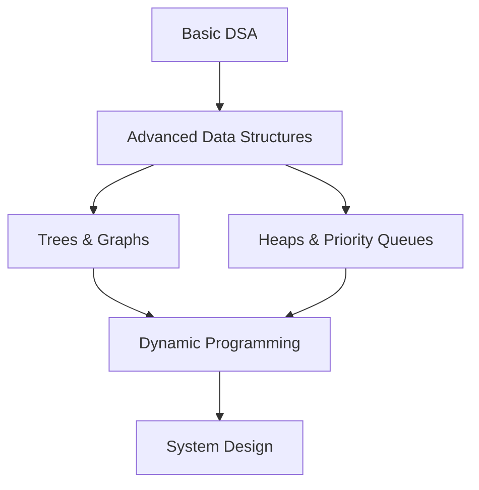

# 🏆 **Data Structures & Algorithms**

*Master efficient data organization and problem-solving techniques*

## 📚 **Lesson Overview**

**Duration**: 75 minutes  
**Level**: Intermediate  
**Prerequisites**: Programming Fundamentals, Basic Python/JavaScript  
**Learning Path**: Software Development → Foundations → Data Structures & Algorithms

---

## 🎯 **Learning Objectives**

By the end of this lesson, you will be able to:

- ✅ Understand and implement fundamental data structures (arrays, lists, stacks, queues)
- ✅ Analyze algorithm complexity using Big O notation
- ✅ Apply sorting and searching algorithms effectively
- ✅ Choose appropriate data structures for specific problems
- ✅ Optimize code performance through algorithmic thinking

---

## 🌟 **Why This Matters**

Data structures and algorithms form the backbone of computer science and software engineering. **95% of tech companies** including Google, Facebook, Amazon, and Microsoft test DSA knowledge in their interviews. According to GitHub's 2024 State of the Octoverse, developers with strong algorithmic skills earn **30% higher salaries** on average.

> *"Algorithms + Data Structures = Programs"* - **Niklaus Wirth, Creator of Pascal**

---

## 📖 **Core Content**

### **1. Essential Data Structures (25 minutes)**

#### **🔢 Arrays and Lists**

Arrays are the most fundamental data structure, storing elements in contiguous memory locations.

```python
# Array/List operations in Python
numbers = [1, 2, 3, 4, 5]

# Access by index - O(1)
first_element = numbers[0]  # 1

# Insertion - O(n) for beginning, O(1) for end
numbers.append(6)           # Add to end: [1, 2, 3, 4, 5, 6]
numbers.insert(0, 0)        # Add to beginning: [0, 1, 2, 3, 4, 5, 6]

# Deletion - O(n) for beginning, O(1) for end
numbers.pop()               # Remove from end
numbers.pop(0)              # Remove from beginning

# Search - O(n)
index = numbers.index(3)    # Find index of element 3
```

#### **📚 Stacks (LIFO - Last In, First Out)**

Stacks are used for function calls, undo operations, and expression evaluation.

```python
class Stack:
    def __init__(self):
        self.items = []
    
    def push(self, item):
        """Add item to top of stack - O(1)"""
        self.items.append(item)
    
    def pop(self):
        """Remove and return top item - O(1)"""
        if not self.is_empty():
            return self.items.pop()
        return None
    
    def peek(self):
        """View top item without removing - O(1)"""
        if not self.is_empty():
            return self.items[-1]
        return None
    
    def is_empty(self):
        """Check if stack is empty - O(1)"""
        return len(self.items) == 0
    
    def size(self):
        """Get number of items - O(1)"""
        return len(self.items)

# Example: Balanced parentheses checker
def is_balanced(expression):
    """Check if parentheses are balanced using a stack."""
    stack = Stack()
    opening = "([{"
    closing = ")]}"
    pairs = {"(": ")", "[": "]", "{": "}"}
    
    for char in expression:
        if char in opening:
            stack.push(char)
        elif char in closing:
            if stack.is_empty():
                return False
            if pairs[stack.pop()] != char:
                return False
    
    return stack.is_empty()

# Test the function
print(is_balanced("({[]})"))  # True
print(is_balanced("([)]"))    # False
```

#### **🚶 Queues (FIFO - First In, First Out)**

Queues are used for task scheduling, breadth-first search, and handling requests.

```python
from collections import deque

class Queue:
    def __init__(self):
        self.items = deque()
    
    def enqueue(self, item):
        """Add item to rear of queue - O(1)"""
        self.items.append(item)
    
    def dequeue(self):
        """Remove and return front item - O(1)"""
        if not self.is_empty():
            return self.items.popleft()
        return None
    
    def front(self):
        """View front item without removing - O(1)"""
        if not self.is_empty():
            return self.items[0]
        return None
    
    def is_empty(self):
        """Check if queue is empty - O(1)"""
        return len(self.items) == 0
    
    def size(self):
        """Get number of items - O(1)"""
        return len(self.items)

# Example: Print queue simulator
def simulate_print_queue():
    """Simulate a printer queue system."""
    print_queue = Queue()
    
    # Add print jobs
    jobs = ["Document1.pdf", "Photo.jpg", "Report.docx", "Presentation.pptx"]
    
    print("Adding jobs to print queue:")
    for job in jobs:
        print_queue.enqueue(job)
        print(f"Queued: {job}")
    
    print("\nProcessing print jobs:")
    while not print_queue.is_empty():
        current_job = print_queue.dequeue()
        print(f"Printing: {current_job}")

simulate_print_queue()
```

### **2. Algorithm Complexity Analysis (20 minutes)**

#### **📊 Big O Notation**

Big O notation describes how algorithm performance scales with input size.

```python
# O(1) - Constant Time
def get_first_element(arr):
    """Always takes same time regardless of array size."""
    return arr[0] if arr else None

# O(n) - Linear Time
def find_max(arr):
    """Time increases linearly with array size."""
    if not arr:
        return None
    
    max_val = arr[0]
    for num in arr:  # n iterations
        if num > max_val:
            max_val = num
    return max_val

# O(n²) - Quadratic Time
def bubble_sort(arr):
    """Nested loops = quadratic complexity."""
    n = len(arr)
    for i in range(n):        # n iterations
        for j in range(0, n-i-1):  # n iterations
            if arr[j] > arr[j+1]:
                arr[j], arr[j+1] = arr[j+1], arr[j]
    return arr

# O(log n) - Logarithmic Time
def binary_search(arr, target):
    """Divides search space in half each iteration."""
    left, right = 0, len(arr) - 1
    
    while left <= right:
        mid = (left + right) // 2
        if arr[mid] == target:
            return mid
        elif arr[mid] < target:
            left = mid + 1
        else:
            right = mid - 1
    
    return -1  # Not found
```

#### **⚡ Performance Comparison**

| **Complexity** | **10 items** | **100 items** | **1,000 items** | **Example** |
|----------------|--------------|---------------|-----------------|-------------|
| **O(1)** | 1 | 1 | 1 | Array access |
| **O(log n)** | 3 | 7 | 10 | Binary search |
| **O(n)** | 10 | 100 | 1,000 | Linear search |
| **O(n log n)** | 33 | 664 | 9,966 | Merge sort |
| **O(n²)** | 100 | 10,000 | 1,000,000 | Bubble sort |

### **3. Sorting Algorithms (15 minutes)**

#### **🔄 Bubble Sort (O(n²))**

Simple but inefficient for large datasets.

```python
def bubble_sort(arr):
    """Sort array using bubble sort algorithm."""
    n = len(arr)
    comparisons = 0
    swaps = 0
    
    for i in range(n):
        for j in range(0, n-i-1):
            comparisons += 1
            if arr[j] > arr[j+1]:
                arr[j], arr[j+1] = arr[j+1], arr[j]
                swaps += 1
    
    print(f"Bubble Sort: {comparisons} comparisons, {swaps} swaps")
    return arr
```

#### **⚡ Merge Sort (O(n log n))**

Efficient divide-and-conquer algorithm.

```python
def merge_sort(arr):
    """Sort array using merge sort algorithm."""
    if len(arr) <= 1:
        return arr
    
    # Divide
    mid = len(arr) // 2
    left = merge_sort(arr[:mid])
    right = merge_sort(arr[mid:])
    
    # Conquer (merge)
    return merge(left, right)

def merge(left, right):
    """Merge two sorted arrays."""
    result = []
    i = j = 0
    
    while i < len(left) and j < len(right):
        if left[i] <= right[j]:
            result.append(left[i])
            i += 1
        else:
            result.append(right[j])
            j += 1
    
    # Add remaining elements
    result.extend(left[i:])
    result.extend(right[j:])
    
    return result

# Performance test
import random
import time

def compare_sorting_algorithms():
    """Compare performance of different sorting algorithms."""
    sizes = [100, 1000, 5000]
    
    for size in sizes:
        # Generate random data
        data = [random.randint(1, 1000) for _ in range(size)]
        
        print(f"\nTesting with {size} elements:")
        
        # Test Bubble Sort (only for smaller datasets)
        if size <= 1000:
            bubble_data = data.copy()
            start = time.time()
            bubble_sort(bubble_data)
            bubble_time = time.time() - start
            print(f"Bubble Sort: {bubble_time:.4f} seconds")
        
        # Test Merge Sort
        merge_data = data.copy()
        start = time.time()
        merge_sort(merge_data)
        merge_time = time.time() - start
        print(f"Merge Sort: {merge_time:.4f} seconds")
        
        # Test Python's built-in sort (Timsort - O(n log n))
        python_data = data.copy()
        start = time.time()
        python_data.sort()
        python_time = time.time() - start
        print(f"Python Sort: {python_time:.4f} seconds")

compare_sorting_algorithms()
```

### **4. Searching Algorithms (15 minutes)**

#### **🔍 Linear Search (O(n))**

```python
def linear_search(arr, target):
    """Search for target in unsorted array."""
    comparisons = 0
    
    for i, element in enumerate(arr):
        comparisons += 1
        if element == target:
            print(f"Linear Search: Found at index {i} after {comparisons} comparisons")
            return i
    
    print(f"Linear Search: Not found after {comparisons} comparisons")
    return -1
```

#### **🎯 Binary Search (O(log n))**

```python
def binary_search_detailed(arr, target):
    """Search for target in sorted array with detailed logging."""
    left, right = 0, len(arr) - 1
    comparisons = 0
    
    print(f"Searching for {target} in sorted array...")
    
    while left <= right:
        comparisons += 1
        mid = (left + right) // 2
        mid_value = arr[mid]
        
        print(f"Step {comparisons}: Checking index {mid} (value: {mid_value})")
        
        if mid_value == target:
            print(f"Binary Search: Found at index {mid} after {comparisons} comparisons")
            return mid
        elif mid_value < target:
            print(f"  Target > {mid_value}, searching right half")
            left = mid + 1
        else:
            print(f"  Target < {mid_value}, searching left half")
            right = mid - 1
    
    print(f"Binary Search: Not found after {comparisons} comparisons")
    return -1

# Example usage
sorted_numbers = [1, 3, 5, 7, 9, 11, 13, 15, 17, 19]
binary_search_detailed(sorted_numbers, 13)
```

---

## 🛠️ **Hands-On Lab: Social Media Feed Analyzer**

### **Lab Objective**

Build a social media feed analyzer that demonstrates various data structures and algorithms.

### **Requirements**

1. ✅ Store posts using appropriate data structures
2. ✅ Implement search functionality for hashtags and users
3. ✅ Sort posts by engagement (likes, comments)
4. ✅ Track trending hashtags using frequency analysis
5. ✅ Implement a "recent posts" feature using a queue

### **Implementation**

```python
from collections import defaultdict, deque
import heapq
from datetime import datetime, timedelta

class SocialMediaPost:
    def __init__(self, user, content, hashtags, likes=0, comments=0):
        self.user = user
        self.content = content
        self.hashtags = hashtags
        self.likes = likes
        self.comments = comments
        self.timestamp = datetime.now()
        self.engagement_score = likes + (comments * 2)  # Comments worth more
    
    def __str__(self):
        return f"@{self.user}: {self.content[:50]}... ({self.likes} likes, {self.comments} comments)"

class SocialMediaFeed:
    def __init__(self):
        self.posts = []  # All posts
        self.hashtag_index = defaultdict(list)  # Hash table for hashtag lookup
        self.user_index = defaultdict(list)     # Hash table for user lookup
        self.recent_posts = deque(maxlen=10)    # Queue for recent posts
        self.hashtag_frequency = defaultdict(int)  # Frequency counter
    
    def add_post(self, post):
        """Add a new post to the feed - O(1) average"""
        self.posts.append(post)
        self.recent_posts.append(post)
        
        # Update indexes
        self.user_index[post.user].append(post)
        
        for hashtag in post.hashtags:
            self.hashtag_index[hashtag].append(post)
            self.hashtag_frequency[hashtag] += 1
        
        print(f"Added post by @{post.user}")
    
    def search_by_hashtag(self, hashtag):
        """Search posts by hashtag - O(1) average lookup"""
        posts = self.hashtag_index.get(hashtag, [])
        print(f"Found {len(posts)} posts with #{hashtag}")
        return posts
    
    def search_by_user(self, username):
        """Search posts by user - O(1) average lookup"""
        posts = self.user_index.get(username, [])
        print(f"Found {len(posts)} posts by @{username}")
        return posts
    
    def get_top_posts_by_engagement(self, n=5):
        """Get top N posts by engagement using heap - O(n log k)"""
        if len(self.posts) <= n:
            return sorted(self.posts, key=lambda p: p.engagement_score, reverse=True)
        
        # Use heap for efficient top-N selection
        top_posts = heapq.nlargest(n, self.posts, key=lambda p: p.engagement_score)
        return top_posts
    
    def get_trending_hashtags(self, n=5):
        """Get top N trending hashtags - O(k log k) where k is unique hashtags"""
        if not self.hashtag_frequency:
            return []
        
        trending = heapq.nlargest(n, self.hashtag_frequency.items(), key=lambda x: x[1])
        return trending
    
    def get_recent_posts(self):
        """Get recent posts from queue - O(1)"""
        return list(self.recent_posts)
    
    def analyze_user_activity(self, username):
        """Analyze a user's posting patterns"""
        user_posts = self.user_index.get(username, [])
        
        if not user_posts:
            print(f"No posts found for @{username}")
            return
        
        # Calculate statistics
        total_likes = sum(post.likes for post in user_posts)
        total_comments = sum(post.comments for post in user_posts)
        avg_engagement = sum(post.engagement_score for post in user_posts) / len(user_posts)
        
        # Find most used hashtags
        user_hashtags = defaultdict(int)
        for post in user_posts:
            for hashtag in post.hashtags:
                user_hashtags[hashtag] += 1
        
        top_hashtags = heapq.nlargest(3, user_hashtags.items(), key=lambda x: x[1])
        
        print(f"\n📊 Analysis for @{username}:")
        print(f"Total Posts: {len(user_posts)}")
        print(f"Total Likes: {total_likes}")
        print(f"Total Comments: {total_comments}")
        print(f"Average Engagement: {avg_engagement:.1f}")
        print(f"Top Hashtags: {[f'#{tag}' for tag, count in top_hashtags]}")

# Demo the social media feed
def demo_social_media_feed():
    feed = SocialMediaFeed()
    
    # Sample posts
    posts_data = [
        ("alice", "Just finished my morning workout! #fitness #health", ["fitness", "health"], 25, 5),
        ("bob", "Beautiful sunset today #photography #nature", ["photography", "nature"], 42, 8),
        ("charlie", "Learning Python is so much fun! #coding #python", ["coding", "python"], 18, 12),
        ("alice", "Healthy smoothie recipe #health #nutrition", ["health", "nutrition"], 31, 7),
        ("david", "New hiking trail discovered #nature #adventure", ["nature", "adventure"], 55, 15),
        ("bob", "Camera settings for night photography #photography #tips", ["photography", "tips"], 67, 20),
        ("eve", "First day at my new job! #career #excited", ["career", "excited"], 89, 25),
        ("charlie", "Built my first web app! #coding #javascript", ["coding", "javascript"], 43, 18),
    ]
    
    # Add posts to feed
    print("📱 Adding posts to social media feed:\n")
    for user, content, hashtags, likes, comments in posts_data:
        post = SocialMediaPost(user, content, hashtags, likes, comments)
        feed.add_post(post)
    
    # Search functionality
    print("\n🔍 Search Results:")
    coding_posts = feed.search_by_hashtag("coding")
    alice_posts = feed.search_by_user("alice")
    
    # Top posts by engagement
    print("\n🏆 Top Posts by Engagement:")
    top_posts = feed.get_top_posts_by_engagement(3)
    for i, post in enumerate(top_posts, 1):
        print(f"{i}. {post}")
    
    # Trending hashtags
    print("\n📈 Trending Hashtags:")
    trending = feed.get_trending_hashtags(5)
    for hashtag, count in trending:
        print(f"#{hashtag}: {count} posts")
    
    # Recent posts
    print("\n⏰ Recent Posts:")
    recent = feed.get_recent_posts()
    for post in recent[-3:]:  # Show last 3
        print(f"  {post}")
    
    # User analysis
    feed.analyze_user_activity("alice")
    feed.analyze_user_activity("bob")

# Run the demo
demo_social_media_feed()
```

---

## 📊 **Performance Analysis & Optimization**

### **Algorithm Comparison Table**

| **Operation** | **Array** | **Stack** | **Queue** | **Hash Table** |
|---------------|-----------|-----------|-----------|----------------|
| **Access** | O(1) | O(n) | O(n) | O(1) average |
| **Search** | O(n) | O(n) | O(n) | O(1) average |
| **Insertion** | O(n) | O(1) | O(1) | O(1) average |
| **Deletion** | O(n) | O(1) | O(1) | O(1) average |

### **When to Use Each Data Structure**

```python
# Use Arrays/Lists when:
# - Need indexed access
# - Sequential processing
# - Simple iteration
user_scores = [95, 87, 92, 78, 84]

# Use Stacks when:
# - Undo operations
# - Function call management
# - Expression evaluation
browser_history = Stack()

# Use Queues when:
# - Task scheduling
# - Breadth-first search
# - Print job management
print_queue = Queue()

# Use Hash Tables when:
# - Fast lookups
# - Counting frequencies
# - Caching results
user_profiles = {"alice": {...}, "bob": {...}}
```

---

## 🎯 **Next Steps & Career Development**

### **Immediate Practice Goals**

1. **Daily Coding Practice**: Solve 1-2 problems daily on:
   - **LeetCode**: Focus on easy to medium problems
   - **HackerRank**: Data structure challenges
   - **CodeSignal**: Algorithm practice

2. **Project Implementation**: Build applications using learned concepts:
   - **Task Manager**: Using stacks and queues
   - **Social Network**: Using graphs and hash tables
   - **Search Engine**: Using advanced data structures

### **Advanced Topics to Explore**



### **Interview Preparation Roadmap**

| **Week** | **Focus Area** | **Practice Problems** | **Concepts** |
|----------|----------------|----------------------|--------------|
| **1-2** | Arrays & Strings | Two Sum, Valid Anagram | Hash tables, sliding window |
| **3-4** | Linked Lists | Reverse List, Merge Lists | Pointers, two-pointer technique |
| **5-6** | Stacks & Queues | Valid Parentheses, Level Order | LIFO/FIFO, BFS basics |
| **7-8** | Trees & Graphs | Binary Tree Traversal | DFS, BFS, recursion |

---

## 📚 **Additional Resources**

### **Industry Standards & Best Practices**

- **Google Style Guides**: Code organization and documentation
- **IEEE Software Engineering Standards**: Algorithm documentation
- **ACM Computing Classification**: Algorithm categorization
- **MIT OpenCourseWare**: Advanced algorithms and analysis

### **Recommended Reading**

- **"Introduction to Algorithms" (CLRS)**: Comprehensive algorithmic reference
- **"Cracking the Coding Interview"**: Interview preparation and practice
- **"Algorithm Design Manual"**: Practical algorithm implementation
- **"Elements of Programming Interviews"**: Problem-solving strategies

### **Online Platforms & Communities**

- **LeetCode**: Premium interview preparation
- **GeeksforGeeks**: Tutorials and practice problems
- **Coursera Algorithm Specialization**: University-level courses
- **YouTube - Abdul Bari**: Clear algorithm explanations

---

## ✅ **Lesson Complete!**

**🎉 Congratulations!** You've mastered fundamental data structures and algorithms. You now have the tools to solve complex problems efficiently and are well-prepared for technical interviews.

**📈 Progress Tracking:**

- ✅ Understanding of arrays, stacks, queues, and hash tables
- ✅ Big O notation and complexity analysis
- ✅ Sorting and searching algorithm implementation
- ✅ Real-world application through social media feed project
- ✅ Performance optimization techniques

**🚀 Ready for Next Lesson**: [Object-Oriented Programming](../intermediate/object-oriented-programming.md)

---

*This lesson is part of the **Learn-Library Professional Technology Education Platform**. For support and community discussions, visit [GitHub Discussions](https://github.com/Ultra-Cube/Learn-Library/discussions).*
