# 🛠️ UltraCube Tools Reference Center

> **UltraCube Learn-Library** | Complete Tool Installation & Setup Guide  
> **Author**: UltraCube Engineering Teams  
> **Version**: 1.0 | **Last Updated**: 2025-01-12


---

## 🎯 **Welcome to the Tool Hub**

This comprehensive reference center provides detailed installation guides, configuration examples, and best practices for all tools used throughout the **UltraCube Learn-Library** curriculum. Whether you're just starting your technology journey or advancing your expertise, you'll find everything needed to set up your development environment.

---

## 📚 **Tool Categories Overview**

### 🔒 **Cybersecurity Tools**
**Focus**: Security testing, penetration testing, forensics, and ethical hacking
- **Target Audience**: Security professionals, ethical hackers, SOC analysts
- **Key Tools**: Kali Linux, Metasploit, Wireshark, Burp Suite, Nmap, OWASP ZAP
- **Difficulty Level**: ⭐⭐⭐☆☆

➡️ **[View Cybersecurity Tools Guide](cybersecurity-tools.md)**

### 💻 **Software Development Tools**
**Focus**: Programming environments, frameworks, and development utilities
- **Target Audience**: Developers, software engineers, programming students
- **Key Tools**: VS Code, Node.js, Python, Git, Docker, React, Angular
- **Difficulty Level**: ⭐⭐☆☆☆

➡️ **[View Development Tools Guide](development-tools.md)**

### ☁️ **Cloud Computing Tools**
**Focus**: Cloud platforms, infrastructure management, and deployment
- **Target Audience**: Cloud engineers, DevOps professionals, system architects
- **Key Tools**: AWS CLI, Azure CLI, Google Cloud SDK, Terraform, Kubernetes
- **Difficulty Level**: ⭐⭐⭐☆☆

➡️ **[View Cloud Tools Guide](cloud-tools.md)**

### 📊 **Data Science Tools**
**Focus**: Data analysis, machine learning, and statistical computing
- **Target Audience**: Data scientists, analysts, ML engineers, researchers
- **Key Tools**: Python/Anaconda, Jupyter, TensorFlow, PyTorch, R, Tableau
- **Difficulty Level**: ⭐⭐⭐☆☆

➡️ **[View Data Science Tools Guide](data-science-tools.md)**

### 🚀 **DevOps Tools**
**Focus**: Automation, CI/CD, infrastructure as code, and monitoring
- **Target Audience**: DevOps engineers, site reliability engineers, automation specialists
- **Key Tools**: Jenkins, GitHub Actions, Docker, Kubernetes, Ansible, Prometheus
- **Difficulty Level**: ⭐⭐⭐⭐☆

➡️ **[View DevOps Tools Guide](devops-tools.md)**

---

## 🎯 **Getting Started Guide**

### **1. Choose Your Learning Path**

Select the tool category that aligns with your learning goals:

```mermaid
graph TD
    A[Choose Your Focus] --> B[🔒 Cybersecurity]
    A --> C[💻 Software Development]
    A --> D[☁️ Cloud Computing]
    A --> E[📊 Data Science]
    A --> F[🚀 DevOps]
    
    B --> G[Security Testing & Analysis]
    C --> H[Application Development]
    D --> I[Cloud Infrastructure]
    E --> J[Data Analysis & ML]
    F --> K[Automation & Deployment]
```



### **2. Preparation Checklist**

Before starting any tool installation:

- [ ] **System Requirements**: Ensure your OS meets minimum requirements
- [ ] **Administrative Access**: Confirm you have admin/sudo privileges
- [ ] **Network Connection**: Stable internet for downloads
- [ ] **Backup Important Data**: Safeguard existing work
- [ ] **Disk Space**: Verify adequate storage (varies by toolset)

### **3. Universal Prerequisites**

**Essential tools needed across all domains:**

| Tool | Purpose | Installation Priority |
|------|---------|---------------------|
| **Git** | Version control | 🔥 Critical |
| **VS Code** | Code editor | 🔥 Critical |
| **Package Manager** | Software installation | 🔥 Critical |
| **Terminal/Shell** | Command line interface | ✅ Built-in |
| **Web Browser** | Documentation/testing | ✅ Built-in |

---

## 🛠️ **Platform-Specific Setup**

### **Windows Users**

**Recommended Package Managers:**
- **Chocolatey**: [chocolatey.org](https://chocolatey.org/install)
- **Scoop**: [scoop.sh](https://scoop.sh/)
- **Winget**: Built into Windows 10/11

**Initial Setup:**
```powershell
# Install Chocolatey (Run as Administrator)
Set-ExecutionPolicy Bypass -Scope Process -Force
[System.Net.ServicePointManager]::SecurityProtocol = [System.Net.ServicePointManager]::SecurityProtocol -bor 3072
iex ((New-Object System.Net.WebClient).DownloadString('https://community.chocolatey.org/install.ps1'))

# Essential tools
choco install git vscode googlechrome
```

### **macOS Users**

**Recommended Package Manager:**
- **Homebrew**: [brew.sh](https://brew.sh/)

**Initial Setup:**
```bash
# Install Homebrew
/bin/bash -c "$(curl -fsSL https://raw.githubusercontent.com/Homebrew/install/HEAD/install.sh)"

# Essential tools
brew install git
brew install --cask visual-studio-code
brew install --cask google-chrome
```

### **Linux Users**

**Package Managers by Distribution:**
- **Ubuntu/Debian**: `apt`
- **CentOS/RHEL/Fedora**: `yum`/`dnf`
- **Arch**: `pacman`

**Initial Setup (Ubuntu/Debian):**
```bash
# Update system
sudo apt update && sudo apt upgrade -y

# Essential tools
sudo apt install git curl wget
sudo snap install code --classic
```

---

## 📖 **Tool Reference Quick Access**

### **Popular Tool Categories**

#### **🔧 Development Essentials**
- **Git**: Version control system → [Development Guide](development-tools.md#git)
- **VS Code**: Extensible code editor → [Development Guide](development-tools.md#visual-studio-code)
- **Docker**: Containerization platform → [DevOps Guide](devops-tools.md#docker)
- **Node.js**: JavaScript runtime → [Development Guide](development-tools.md#nodejs)

#### **☁️ Cloud Platform CLIs**
- **AWS CLI**: Amazon Web Services → [Cloud Guide](cloud-tools.md#aws-cli)
- **Azure CLI**: Microsoft Azure → [Cloud Guide](cloud-tools.md#azure-cli)
- **gcloud**: Google Cloud Platform → [Cloud Guide](cloud-tools.md#google-cloud-sdk)

#### **🔒 Security Testing**
- **Kali Linux**: Security testing distribution → [Security Guide](cybersecurity-tools.md#kali-linux)
- **Metasploit**: Penetration testing framework → [Security Guide](cybersecurity-tools.md#metasploit)
- **Wireshark**: Network protocol analyzer → [Security Guide](cybersecurity-tools.md#wireshark)

#### **📊 Data Science Stack**
- **Python/Anaconda**: Data science environment → [Data Science Guide](data-science-tools.md#anaconda)
- **Jupyter**: Interactive notebooks → [Data Science Guide](data-science-tools.md#jupyter)
- **TensorFlow**: Machine learning framework → [Data Science Guide](data-science-tools.md#tensorflow)

#### **🚀 DevOps Automation**
- **Kubernetes**: Container orchestration → [DevOps Guide](devops-tools.md#kubernetes)
- **Terraform**: Infrastructure as code → [DevOps Guide](devops-tools.md#terraform)
- **Jenkins**: CI/CD automation → [DevOps Guide](devops-tools.md#jenkins)

---

## 🔍 **Tool Selection Matrix**

### **By Experience Level**

| Level | Recommended Tools | Focus Areas |
|-------|------------------|-------------|
| **Beginner** | Git, VS Code, Basic CLI tools | Fundamentals, basic workflows |
| **Intermediate** | Docker, cloud CLIs, testing frameworks | Integration, automation basics |
| **Advanced** | Kubernetes, Terraform, monitoring stacks | Orchestration, infrastructure |
| **Expert** | Custom toolchains, enterprise solutions | Optimization, scaling |

### **By Project Type**

| Project Type | Essential Tools | Optional Tools |
|--------------|----------------|----------------|
| **Web Development** | Git, VS Code, Node.js, Docker | React/Angular, cloud deployment |
| **Mobile Development** | Git, IDE, platform SDKs | CI/CD, testing frameworks |
| **Data Analysis** | Python/R, Jupyter, databases | ML frameworks, visualization |
| **Security Assessment** | Kali Linux, scanning tools | Forensics, compliance tools |
| **Cloud Infrastructure** | Cloud CLIs, Terraform, monitoring | Multi-cloud, security tools |

---

## 🚨 **Universal Troubleshooting**

### **Common Installation Issues**

#### **Permission Problems**
```bash
# Linux/macOS: Use sudo for system-wide installations
sudo apt install package-name

# Windows: Run PowerShell/CMD as Administrator
# Right-click → "Run as administrator"
```

#### **Network/Download Issues**
```bash
# Check internet connectivity
ping google.com

# Use alternative download mirrors
# Check official tool documentation for mirrors

# Verify file integrity (when checksums provided)
sha256sum downloaded-file.zip
```

#### **Path/Environment Issues**
```bash
# Check if tool is in PATH
which tool-name
echo $PATH

# Add to PATH (Linux/macOS)
echo 'export PATH="/path/to/tool:$PATH"' >> ~/.bashrc
source ~/.bashrc

# Windows: Use Environment Variables settings
```

#### **Version Conflicts**
```bash
# Check installed versions
tool-name --version

# Use version managers when available
# Node.js: nvm, Python: pyenv, Ruby: rbenv
```

---

## 📋 **Maintenance & Updates**

### **Regular Maintenance Tasks**

#### **Weekly**
- [ ] Update package managers (brew, apt, chocolatey)
- [ ] Check for critical security updates
- [ ] Update development dependencies

#### **Monthly**
- [ ] Major tool updates (IDEs, frameworks)
- [ ] Clean package caches
- [ ] Review and update documentation

#### **Quarterly**
- [ ] Major version upgrades
- [ ] Tool chain review and optimization
- [ ] Backup configurations and scripts

### **Update Commands by Platform**

#### **Windows (Chocolatey)**
```powershell
# Update all packages
choco upgrade all

# Update specific package
choco upgrade package-name
```

#### **macOS (Homebrew)**
```bash
# Update Homebrew and packages
brew update && brew upgrade

# Update specific package
brew upgrade package-name
```

#### **Linux (Ubuntu/Debian)**
```bash
# Update system packages
sudo apt update && sudo apt upgrade

# Update snap packages
sudo snap refresh
```

---

## 🎓 **Learning Path Recommendations**

### **🚀 Quick Start (1-2 weeks)**
1. **Essential Tools**: Git, VS Code, package manager
2. **Choose Primary Domain**: Pick one focus area
3. **Core Tools**: Install 3-5 essential tools for your domain
4. **Practice Project**: Simple hands-on exercise

### **🔧 Intermediate Setup (1 month)**
1. **Expand Toolkit**: Add complementary tools
2. **Automation**: Basic scripts and workflows
3. **Integration**: Connect tools in workflows
4. **Best Practices**: Configuration and optimization

### **⚙️ Advanced Mastery (3+ months)**
1. **Cross-Domain Tools**: Tools spanning multiple areas
2. **Custom Workflows**: Tailored automation
3. **Advanced Features**: Expert-level capabilities
4. **Teaching Others**: Share knowledge and help community

---

## 🤝 **Community & Support**

### **Getting Help**

#### **Official Channels**
- **UltraCube Discord**: Real-time community support
- **GitHub Discussions**: Structured Q&A format
- **Email Support**: education@ucubetech.com

#### **Self-Help Resources**
- **Tool Documentation**: Always check official docs first
- **Stack Overflow**: Technical problem solving
- **GitHub Issues**: Tool-specific bug reports
- **YouTube**: Video tutorials and walkthroughs

### **Contributing Back**

#### **Help the Community**
- **Share Configurations**: Upload your tool configs
- **Write Tutorials**: Document your learning journey
- **Answer Questions**: Help newcomers in forums
- **Report Issues**: Improve tool documentation

#### **Update Tool Guides**
- **New Tools**: Suggest additions to our guides
- **Updated Instructions**: Keep installation steps current
- **Platform Coverage**: Add support for new operating systems
- **Best Practices**: Share optimization tips

---

## 📊 **Tool Compatibility Matrix**

### **Cross-Platform Support**

| Tool Category | Windows | macOS | Linux | Browser-Based |
|---------------|---------|-------|-------|---------------|
| **Development** | ✅ Excellent | ✅ Excellent | ✅ Excellent | ⚠️ Limited |
| **Security** | ⚠️ Limited | ✅ Good | ✅ Excellent | ❌ Not Applicable |
| **Cloud** | ✅ Excellent | ✅ Excellent | ✅ Excellent | ✅ Good |
| **Data Science** | ✅ Good | ✅ Excellent | ✅ Excellent | ✅ Limited |
| **DevOps** | ⚠️ Limited | ✅ Good | ✅ Excellent | ⚠️ Limited |

### **Resource Requirements**

| Tool Category | RAM Minimum | Storage | CPU Requirements |
|---------------|-------------|---------|------------------|
| **Development** | 4GB | 10-20GB | Any modern CPU |
| **Security** | 8GB | 50-100GB | Intel/AMD x64 |
| **Cloud** | 4GB | 5-10GB | Any modern CPU |
| **Data Science** | 8GB+ | 20-50GB | Multi-core recommended |
| **DevOps** | 8GB+ | 50GB+ | Multi-core required |

---

<div align="center">

## 🎓 **Ready to Build Something Amazing?**

Your complete tool reference center is ready! Choose your domain, install the essentials, and start building. The UltraCube Learn-Library provides step-by-step guidance for every tool and every skill level.


### **Quick Links**
[🔒 Security Tools](cybersecurity-tools.md) • [💻 Development Tools](development-tools.md) • [☁️ Cloud Tools](cloud-tools.md) • [📊 Data Science Tools](data-science-tools.md) • [🚀 DevOps Tools](devops-tools.md)

**Need help getting started?** [Contact our education team](mailto:education@ucubetech.com) or join our [community Discord](https://discord.gg/ucubetech)!

</div>

---

**Created by UltraCube Engineering Teams** | [ucubetech.com](https://www.ucubetech.com) | **Copyright © 2025 UltraCube Technology**

> *Empowering the next generation of technology professionals through comprehensive, hands-on education.*
